# 使用 Python 进行机器学习和数据科学的数据可视化；

> 原文：<https://towardsdatascience.com/data-visualization-for-machine-learning-and-data-science-a45178970be7?source=collection_archive---------2----------------------->


**大家好，**

> 我是**萨纳特**，目前在 IBM 工作，我基本上是一名数据科学家，喜欢亲自动手处理大量数据。让我在这里缩短我无聊的介绍:P，转到今天的主题**“数据可视化”。**

*注意:写这篇博客时要记住，读者只知道数据可视化的基础知识，有些主题可能太天真。所以请跳过你已经知道的话题，享受剩下的。我欢迎你对博客的所有评论。*


众所周知，人们对术语**数据**议论纷纷，比如大数据、数据科学、数据分析师、数据仓库、数据挖掘等等。其中强调，在当今时代，数据在影响人类的日常活动中起着重要作用。每天我们都会产生超过 2.5 万亿(10 ⁸)字节的数据([链接](https://www.forbes.com/sites/bernardmarr/2018/05/21/how-much-data-do-we-create-every-day-the-mind-blowing-stats-everyone-should-read/#2532316560ba))，从我们的短信、图像、电子邮件，到来自自动驾驶汽车、物联网设备等的数据。手头有如此大量的数据可用，利用这些数据中的有用信息可以帮助每个组织清楚地了解几个领域，如什么可以提高组织的收入，哪个领域需要更多的关注，如何寻求更多的客户关注等。机器学习(ML)、数据科学是人工智能(AI)的一些相关领域，最近这些天从数据中学习的任务在很大程度上已经完成。

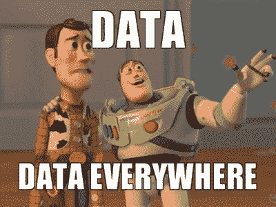

通过以上介绍，现在您可能对术语“**数据**”很感兴趣，并将计划更有效地利用这些可用数据，以获得尽可能多的有用信息。你觉得解读这些收集到的数据很容易吗？**可能是没有:(**)。*数据将是原始格式，需要执行几个步骤才能将原始数据转换为有用的信息，就像金匠如何通过对原始黄金进行几个预处理步骤来准备装饰品*。这就是数据科学家派上用场的地方，你扔给他/她一份原始数据，他们可以从中为你讲述一个伟大的故事，这对于拥有相同数据的其他人来说并不容易。当这些数据科学家撰写他们的故事(我的意思是使用数据:P)时，将会有几个阶段，如数据获取、数据清洗、数据可视化、建立可用于预测未来信息的模型等。其中一个关键阶段是**数据可视化**。这是第一步，也是最重要的一步，在这一步中，他们将获得关于数据状况的高级统计概述。以及它的一些属性，如底层分布、异常值的存在以及一些更有用的特性。

> “数据是新的石油吗？不，数据是新的土壤。”—大卫·麦坎德斯

# 为什么要可视化？

你认为在一个表格/数据库文件中给你 100 万个点的数据，并要求你仅仅通过查看表格上的数据来提供你的推论是可行的吗？除非你是一个超人，否则这是不可能的。这就是我们利用数据可视化的时候，其中所有的数据都将被转换成某种形式的图表，并进一步分析。作为一个人，我们比其他人更习惯于从图示中获取大量信息。

> 孩子们应该从很小的时候就开始学习如何阅读和创建图形。大多数孩子是天生的艺术家，因为我们人类是视觉物种。我们应该利用这一点，因为图形和插图可以成为理解和交流的强大武器——****阿尔贝托·开罗****

**好吧！所以既然说要把枯燥的表格里的数据转换成散点图或者柱状图这样有趣的图示形式，你可能会想，我怎么做呢？我需要为此编写自己的代码吗？**没有！实际上，我们可以利用一些流行的编程语言的非常好的包，这些包很容易获得，并且只需要一行代码就可以使工作变得非常简单。这就是现代编程的力量，:D！****

**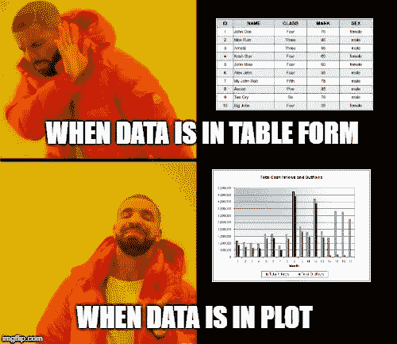**

**Meme created using imgflip.com**

**作为一个人，我们可以想象任何二维或三维的东西。但是相信我，你在现实世界中获得的数据绝大多数不会是这样的。作为一名机器学习工程师，处理超过 1000 维的数据是非常常见的。那么在这种数据不止 3D 的情况下，我们能做些什么呢？*有一些* ***降维(DR)*** *技术，如* [*PCA*](https://en.wikipedia.org/wiki/Principal_component_analysis) *，*[*TSNE*](https://en.wikipedia.org/wiki/T-distributed_stochastic_neighbor_embedding)*，*[*LDA*](https://en.wikipedia.org/wiki/Linear_discriminant_analysis)*等，帮助你将高维数据转换成 2D 或 3D 数据，以便可视化。*每种 DR 技术可能会丢失一些信息，但只有它们才能帮助我们在 2d 图上可视化非常高维的数据。TSNE 是用于高维数据可视化的最新 DR 技术之一。**

**从构建模型的角度来看，通过可视化数据，我们可以发现隐藏的模式，探索数据中是否有任何聚类，我们可以发现它们是否是线性可分的/重叠太多等等。从这个初始分析中，我们可以很容易地排除不适合这种数据的模型，我们将只实现适合的模型，而不会浪费我们宝贵的时间和计算资源。**

**数据可视化的这一部分是数据科学/ML 领域最初的**探索性数据分析(EDA)** 的主要部分。**

# **我可以使用哪种语言？**

****

**Meme created using imgflip.com**

**我们可以使用多种语言来执行数据可视化，但在数据科学领域使用最广泛的是 Python & R。因此，您的下一个问题可能是， ***应该学习哪种语言，哪种语言的范围更广？。答案很简单！纯属你的选择* *不过我会推荐 Python*；)**。r '是一种更具统计性的语言，有几个用于数据科学应用程序的优秀包，而另一方面，Python 被广泛用于通用编程以及数据科学和 ML 相关的应用程序。我对 python 很熟悉，所以我会继续用 python 代码写博客的其余部分，它也有几个很好的包，像 Scikit，Matplotlib，seaborn 等等，对我们帮助很大。特别感谢那些让我们的工作变得简单的开发人员。**

# **使用 Python 绘制数据:**

**如上所述，Python 有几个很好的包来绘制数据，其中 **Matplotlib** 是最突出的一个。 **Seaborn** 也是一个很棒的包，它提供了很多更吸引人的情节，甚至它使用 matplotlib 作为它的基础层。当整个数据存储在 pandas 数据框架中时，Pandas 中也有许多相似类型的绘图，我们也有一个名为 plotly 等的库。在这篇博客中，我们将讨论在开头提到的 2 个包中的不同类型的情节，并让我们详细地探索它们。**

# **Matplotlib 架构:**

**matplotlib 的体系结构总共有 3 个不同的层，如下所示。**

1.  **)后端层。**
2.  **)艺人层。**
3.  **)脚本层。**

*   ****后端层:****

**这是图形的最底层，包含绘图所需的几个功能的实现。后端层 **FigureCanvas** (将在其上绘制图形的层/表面) **Renderer** (负责在表面上绘图的类)和 **Event** (处理鼠标和键盘事件)中有 3 个主要的类。与对应层相比，我们在后端层上做得不多。**

*   ****艺术家图层:****

**这是架构中的第二层/最中间层。它主要负责绘制各种函数，比如协调如何在图形画布上使用渲染器的 axis。 ***简单来说，让我们把纸当做图形画布，把素描笔当做渲染器。那么画师的手就是有一定功能的艺术家图层*** ，知道如何素描得到确切的图形。艺术家层有几个可用的类，几个重要的是图形，轴和轴。**

**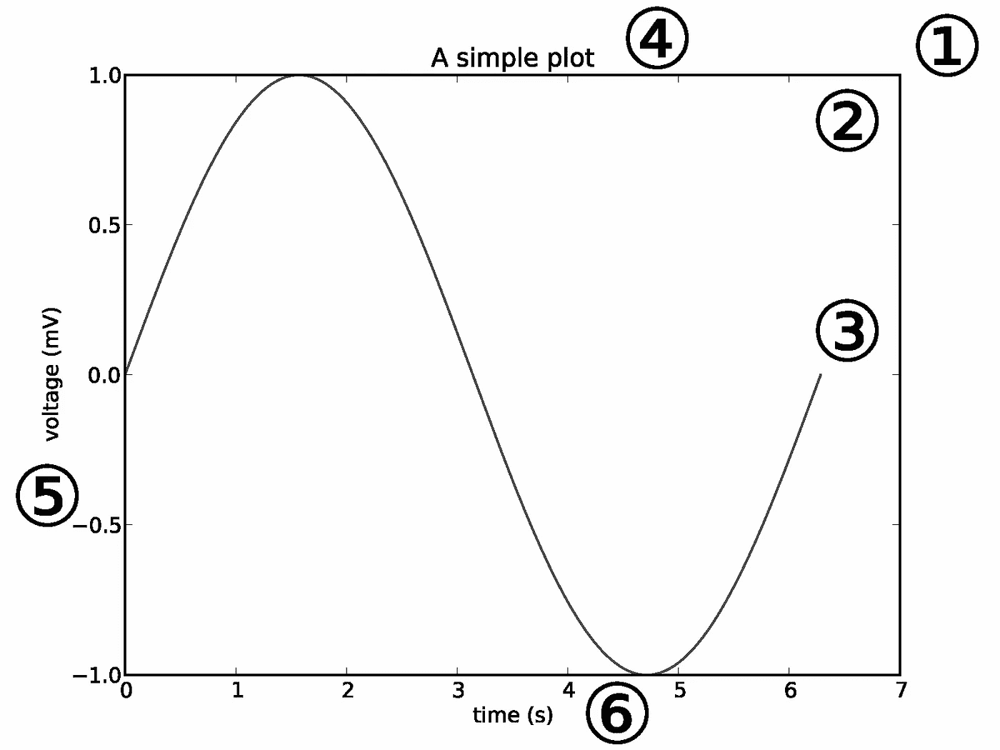**

**Machine learning/Data Science**

**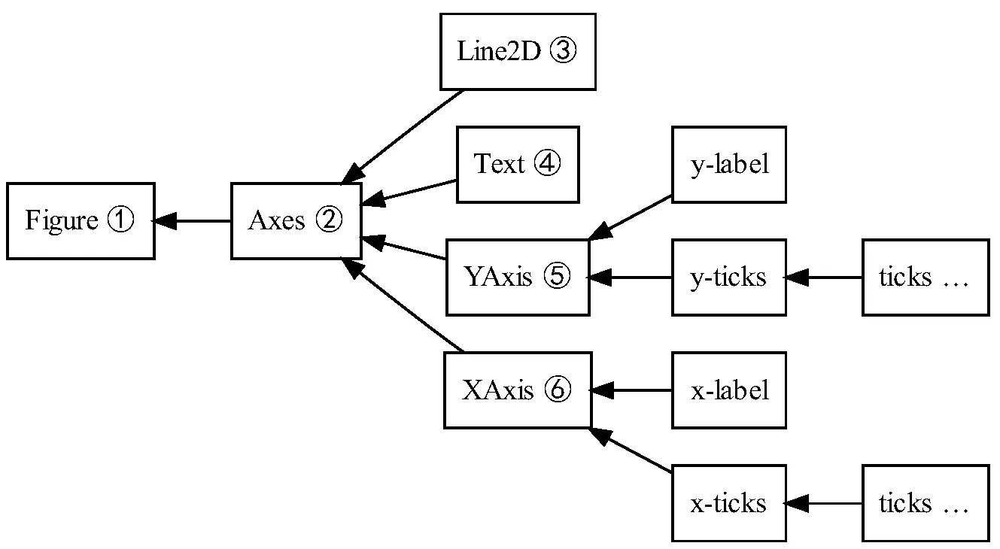**

**上面的两张图片解释了艺术家层中不同类之间的层次结构。图形是最上面的一个，一个图形可以包含多个轴，在这些轴上绘图。继续，在每个轴下，我们可以添加多个图。这提供了更多的额外功能来改善地块，这是大多数重型起重工程发生的地方。**

*   ****脚本层:****

**这是最上面的一层，我们的大部分代码都将在这一层上运行。对于日常的探索性工作，我们几乎依赖于 matplotlib 的这个脚本层。Pyplot 是脚本层，它提供了与 python 中的 Matlab 几乎相似的功能。脚本层中的方法几乎自动处理其他层，我们需要关心的只是当前状态(图&子图)。因此也被称为 ***有状态接口*** 。**

**请访问[链接](https://www.aosabook.org/en/matplotlib.html)进行参考。**

# **Matplotlib 术语:**

**在这里，让我们看一下使用 Matplotlib 进行数据可视化时的一些常用术语。**

> **页（page 的缩写）学生:无论在哪里。(某函数)被使用，表示我在程序中导入 matplotlib.pyplot 作为 plt 而 sns 表示我导入 seaborn 只是为了方便编码。**

```
**import matplotlib.pyplot as plt
import seaborn as sns**
```

**如果您的系统中还没有安装这些软件包。请安装 Python 3 并在命令提示符下使用下面的代码。**

```
****pip3 install matplotlib
pip3 install seaborn****
```

****斧头:****

**轴是图中单一地块的整个区域。这个类包含了绘制一个图所需要的几个属性，比如添加标题，给标签，为每个轴上不同类型的图选择 bin 值等等。**

**我们可以在一个图中有多个轴，这样我们就可以将多个图组合成一个图形。例如:如果我们希望 PDF 和 CDF 曲线在同一个图形中，我们可以创建 2 个轴，并在不同的轴上绘制它们。然后我们可以把它们组合成一个单一的图形。**

**[链接](https://matplotlib.org/api/axes_api.html)**

****网格:****

**当在绘图中启用网格时，将在绘图的背景层添加一组水平线和垂直线。这可以使用 plt.grid()来实现。这对于粗略估计特定坐标的值非常有用，只需查看图即可。**

**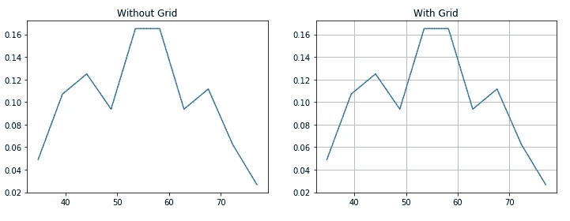**

**Ref: [链接](https://matplotlib.org/api/_as_gen/matplotlib.pyplot.grid.html)**

****图例:****

**图例只不过是图形中可用的不同图的标记表示。例如，当单个图像中有多个图时(例如:[虹膜数据集](https://en.wikipedia.org/wiki/Iris_flower_data_set#Data_set))，图例将帮助我们识别单个图中不同颜色图的正确名称。**

**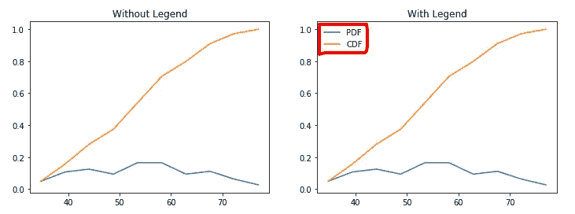**

**参考:[链接](https://matplotlib.org/api/_as_gen/matplotlib.pyplot.legend.html)**

****支线剧情:****

**当我们希望在一个图像中有两个或更多的绘图时，我们可以使用 Matplotlib，plt.subplot (xyz)中的 Subplot。xyz 是一个 3 位数整数，其中 x-行数，y =列数，z=该图的索引号。当我们需要比较两个或更多的图而不是将它们放在不同的图像中时，这是最有用的功能之一。**

```
**plt.figure(1,figsize=(30,8))plt.subplot(131)
 #Code for fig1.plt.subplot(132)
#code for fig2plt.subplot(133)
#code for fig3.plt.show()**
```

**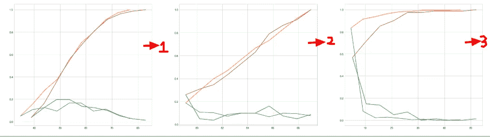**

**Subplots**

**除了支线剧情之外，尝试使用 [gridspec](https://matplotlib.org/api/_as_gen/matplotlib.gridspec.GridSpec.html) ，这可以帮助我们更有效、更容易地拆分支线剧情中的情节。**

**参考:[链接](https://matplotlib.org/api/_as_gen/matplotlib.pyplot.subplot.html)**

****标题:****

**我们可以使用 plt.title()为一个图设置一个标题**

****xlabel:****

**plt.xlabel()是设置 x 轴标签的命令**

****ylabel:****

**plt.ylabel()是设置 y 轴标签的命令**

**下图很好地解释了将数据可视化为图形的每个部分。**

****

# **不同类型的分析:**

**有不同类型的分析，如下所述。**

1.  ****单变量**:在单变量分析中，我们将使用单个特征来分析它的几乎所有属性。**
2.  ****双变量**:当我们比较两个特征之间的数据时，这叫做双变量分析。**
3.  ****多变量**:比较两个以上的变量称为多变量分析。**

**在下面的博客中，对于每个图，我将它们标记为(U)、(B)和(M)，分别表示为单变量、双变量和多变量图。**

# **讨论的情节:**

**以下是我将在后续主题中解释的情节列表。**

**I)散点图(B)**

**ii)配对图(M)**

**三)箱线图(U)**

**iv)小提琴情节(U)**

**v)分布图(U)**

**六)联合地块(U)和(B)**

**七)条形图(B)**

**八)线形图(B)**

# **一、散点图:**

**就机器学习/数据科学而言，简单数据可视化最常用的图之一是散点图。该图显示了整个数据集中的每个点相对于任何 2/3 特征(列)的位置。散点图有 2D 版和 3D 版。2D 散点图是重要的/常见的，在这里我们将主要找到数据的模式/聚类和可分性。使用散点图的代码片段如下所示。**

```
**plt.scatter(x,y)**
```

**当我们直接使用 Matplotlib 中的散点图时，我们将得到一个类似于下图的图。我使用[虹膜数据集](https://en.wikipedia.org/wiki/Iris_flower_data_set#Data_set)来解释简单的散点图。**

```
**plt.scatter(iris['sepal_length'],iris['sepal_width'])
plt.xlabel('Sepal length')
plt.ylabel('Sepal width')
plt.title('Scatter plot on Iris dataset')**
```

**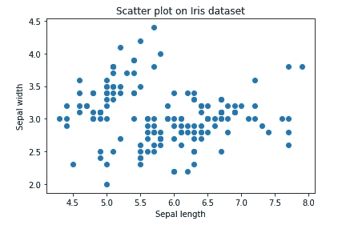**

**在这里，我们可以看到所有的点都标记在它们相应的位置上，分别对应于它们的 x 和 y 值。让我们调整一下，看看我们是否可以得到不同颜色的点。**

```
**plt.scatter(iris['sepal_length'],iris['sepal_width'],color=['r','b','g'])
plt.xlabel('Sepal length')
plt.ylabel('Sepal width')
plt.title('Scatter plot on Iris dataset')**
```

**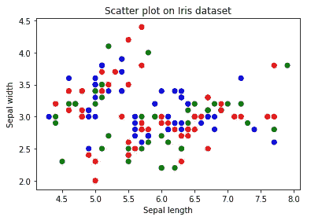**

**这个看起来不错！但是颜色是根据它们在数据集中的呈现方式分配给点的。现在，如果我们能根据它们的分类标签给这些点上色，那该有多好。这里的分类标签是 Setosa、Virginica 和 Veriscolor。这就是 Seaborn 出现的地方，它有有效的可视化工具。**

```
**sns.set_style("whitegrid")
sns.FacetGrid(iris, hue="species", size=4) \
   .map(plt.scatter, "sepal_length", "sepal_width") \
   .add_legend()
plt.show()**
```

**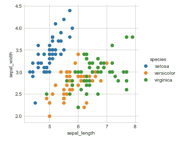**

**万岁！！这个情节现在看起来很酷，只是简单地通过视觉化它，我们可以得出这样的结论，像 setosa 花与其他两个类很好地分开，并且在 virginica 和 versicolor 之间也有一些重叠。facetGrid 中的参数 **hue** 决定了每个数据点的颜色。这里，我们在色调中使用了物种列(相关要素/类),因此我们以这种方式对该图进行了着色。**

**这使得 seaborn 在可视化方面比 Matplotlib 更胜一筹。但是不要忘记，我们仍然在 seaborn 的地图函数上使用 Matplotlib 中的 plt.scatter。所以 seaborn 只是让视觉更吸引人。对于 3d 散点图，我们可以使用 plot.ly 来实现。但是有一种方法我们可以尝试，比如在两个变量之间绘制点，并根据第三个变量设置点的大小，我们分析了三个特征。**

**[scatter plo](https://matplotlib.org/api/_as_gen/matplotlib.pyplot.scatter.html)t 的文档链接**

**使用的数据集:[虹膜数据集](https://en.wikipedia.org/wiki/Iris_flower_data_set#Data_set)**

# **二。配对图:**

**我们可以用 Matplotlib 为 2d 使用散点图，甚至为 3D，我们可以从 [plot.ly](https://plot.ly/pandas/3d-scatter-plots/) 中使用它。当我们拥有 4d 或更多时，该怎么办？这是当从 seaborn 包的配对情节开始发挥作用。**

**假设我们在一个数据中有 n 个特征，配对图将为我们创建一个(n x n)图，其中对角线图将是对应于该行的特征的直方图，其余的图是 y 轴中每行的特征和 x 轴中每列的特征的组合。**

**下面提供了为 Iris 数据集实现的 pair plot 的代码片段。**

```
**sns.set_style("whitegrid");
sns.pairplot(iris, hue="species", size=3);
plt.show()**
```

****

**通过从 pair plot 获得图的高级概述，我们可以看到哪两个特征可以很好地解释/分离数据，然后我们可以使用这两个特征之间的散点图来进一步探索。从上面的图中，我们可以得出这样的结论，花瓣长度和花瓣宽度是可以很好地分离数据的两个特征。**

**因为我们将得到 n 个特征的 n×n 图，当我们有更多的特征时，比如 10 个左右，pairplot 可能变得复杂。因此，在这种情况下，最好的办法是使用降维技术将数据映射到 2d 平面，并使用 2d 散点图将其可视化。**

**[pair plots](https://seaborn.pydata.org/generated/seaborn.pairplot.html)的文档链接。**

**使用的数据集:[虹膜数据集](https://en.wikipedia.org/wiki/Iris_flower_data_set#Data_set)**

# **三。箱线图:**

**这是一种可用于获取更多数据统计细节的绘图类型。最大值和最小值处的直线也被称为**须**。胡须外的点将被推断为异常值。箱形图给出了第 25、50、75 个四分位数的代表。从箱线图中，我们还可以看到[四分位间距(IQR)](https://en.wikipedia.org/wiki/Interquartile_range) ，在这里将呈现数据的最大细节。它还让我们清楚地了解数据中的异常点。**

****

**Image taken from [link](https://pro.arcgis.com/en/pro-app/help/analysis/geoprocessing/charts/box-plot.htm)**

**箱线图可在 seaborn 图书馆获得。让我们跳到代码部分。这里 x 是要预测的变量，y 是独立特征。这些**箱线图属于单变量分析**，这意味着我们仅使用一个变量探索数据，也就是说，我们只是检查特征 axil_nodes 对类生存状态的影响，而不是任何两个独立特征之间的影响。**

```
**sns.boxplot(x='SurvStat',y='axil_nodes',data=hb)**
```

**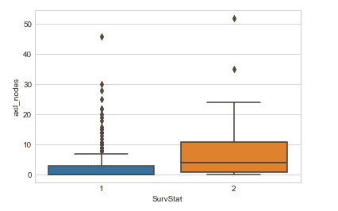**

**使用箱线图，如上所述，我们可以看到有多少数据出现在第一个四分位数，有多少点是异常值等。从上述第 1 类的图中，我们可以看到中位数和第 1 个四分位数之间的数据很少/没有。特征 **axil_nodes** 中的**类 1** 也有更多数量的异常点。关于离群值等的这些细节将帮助我们在将数据发送到模型之前做好准备，因为离群值会影响很多机器学习模型。**

**[箱线图的文档链接](https://seaborn.pydata.org/generated/seaborn.boxplot.html)。**

**使用的数据集:[哈伯曼数据集](https://www.kaggle.com/gilsousa/habermans-survival-data-set)。**

# **四。小提琴情节:**

**violin 图可以推断为中间的箱线图和数据两侧的分布图(核密度估计)的组合。这可以给我们分布的细节，如分布是否是多模态的，偏斜度等。它也给了我们有用的信息，如 95%的置信区间。下图帮助我们从小提琴的情节中抓住一些重要的部分。**

**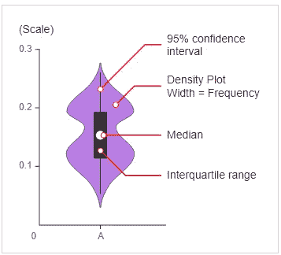**

**Image taken from [Link](https://datavizcatalogue.com/methods/violin_plot.html)**

**小提琴剧情也是来自 seaborn 包。代码很简单，如下所示。**

```
**sns.violinplot(x='SurvStat',y='op_yr',data=hb,size=6)**
```

**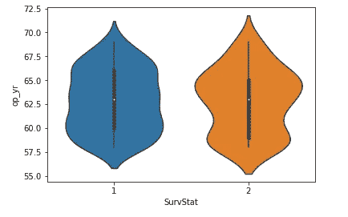**

**从上面的 violin 图中，我们可以推断出两个等级的中位数都在 63 左右，等级 2 的最大人数 op_yr 值为 65，而等级 1 的最大人数 op _ yr 值为 60 左右。第三个四分位数到中位数的点数比第一个四分位数的中位数少，依此类推。**

**[小提琴情节的文档链接](https://seaborn.pydata.org/generated/seaborn.violinplot.html)。**

**使用的数据集:[哈伯曼数据集](https://www.kaggle.com/gilsousa/habermans-survival-data-set)。**

# **动词 （verb 的缩写）分布图:**

**这是了解数据分布的最佳单变量图之一。在分析单个特征(输入)对因变量(输出)的影响时，我们会大量使用分布图。它也很容易在 seaborn 包中获得。这个图在一个图中给出了 pdf 和直方图的组合。**

```
**sns.FacetGrid(hb,hue='SurvStat',size=5).map(sns.distplot,'age').add_legend()**
```

**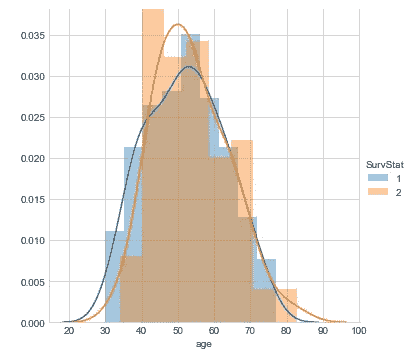**

**从上面的图中，我们可以看到，我们在特征“年龄”(输入特征)上创建了一个分布图，我们使用不同的颜色来表示生存状态(因变量/输出)，因为它是要预测的类，我们可以看到它们的 pdf 之间有很大的重叠。尖锐的块状结构是直方图，平滑的曲线称为概率密度函数(PDF)。曲线的 pdf 可以帮助我们识别该特征的基本分布，这是数据可视化/EDA 的一个主要特点。**

**[dist plot](https://seaborn.pydata.org/generated/seaborn.distplot.html)的文档链接。**

**使用的数据集:[哈伯曼数据集](https://www.kaggle.com/gilsousa/habermans-survival-data-set)。**

# **不及物动词联合地块:**

**这是我的最爱之一，联合图的伟大之处在于，在一个图中，我们可以进行单变量和双变量分析。主图将为我们提供双变量分析，而在顶部和右侧，我们将获得所考虑的两个变量的单变量图。有多种选项可供选择，可以使用 seaborn joint plot 函数中的**种类**参数进行调整。下面显示的是 KDE(核密度估计)的类型，它在等高线图中表示，具有相同边界的所有点将具有相同的值，并且一个点的颜色取决于数据点的数量，即当很少的点具有该值时，它将是浅色的，随着点的增加，它将变得更暗。这就是为什么在这个数据集的中心会更暗，而在两端会更浅/更亮。**

**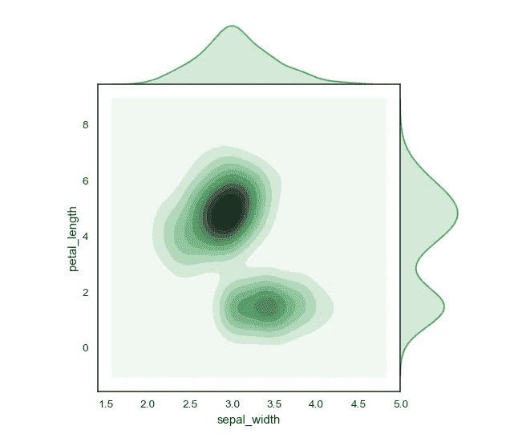**

**我们使用的两个最重要的图是双变量散点图和单变量分布图，因为我们在一个图中得到这两个图，如下所示，这将使我们的工作容易得多。**

**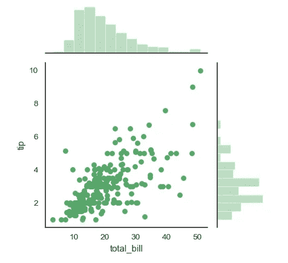**

**[文档链接](https://seaborn.pydata.org/generated/seaborn.jointplot.html)**

**使用的数据集:[虹膜数据集](https://en.wikipedia.org/wiki/Iris_flower_data_set#Data_set)**

# **七。条形图:**

**这是一个广泛使用的图，我们不仅在数据分析中，而且在许多领域的趋势分析中都会多次看到。虽然看起来很简单，但它在分析数据方面很强大，比如每周的销售额、产品收入、一周中每天的网站访问量等等。**

**代码非常简单，我们将使用 Matplotlib 中的 bar 函数来实现它。下面的代码将给出一个条形图，其中条形的位置用 x 值表示，条形的长度/高度用 y 值表示。**

```
**plt.bar(x,y)**
```

**我将向您展示我在当前工作中创建的一个图表，作为向我的管理层提供回顾性详细信息的主要成员，我需要详细说明之前用简单的表格数据完成的警报趋势分析。然后，通过使用相同的条形图，我的观众会更容易理解。**

```
**a=np.arange(6)
w=0.15fig,ax=plt.subplots(figsize=(12,7),edgecolor='k')
p1=ax.bar(a,d,w,color='b')
p2=ax.bar(a-w,c,w,color='g')
p3=ax.bar(a+w,e,w,color='y')
ax.set_xticks(a)
ax.set_xticklabels(('Apr','May','June','July','Aug','Sep'))
ax.set_title('Alert trend')
ax.legend((p1[0],p2[0],p3[0]),('A','B','C'))
plt.xlabel('Month')
plt.ylabel('No of alerts received')#plt.grid()plt.show()**
```

**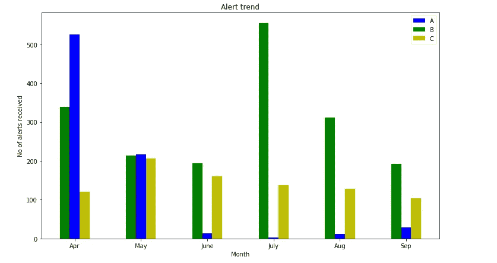**

**这样，我们可以在一个很酷的图表中查看数据，并可以直接向他人传达细节。该图可能简单明了，但在数据科学应用中并不常用。我将在下面提供柱状图的文档，请使用几个参数来得到你想要的图。**

**[柱状图的文档链接](https://matplotlib.org/api/_as_gen/matplotlib.pyplot.bar.html)。**

# **八。线形图:**

**这是你能在两个变量之间的任何分析的角落里看到的图。线图只是一系列数据点上的值用直线连接起来。这个情节可能看起来非常简单，但它不仅在机器学习中有更多的应用，而且在许多其他领域中也有更多的应用。**

**代码非常简单，matplotlib 中的绘图函数很好地完成了线图的任务。**

```
**plt.plot(x,y)**
```

**我们称之为在一个图形内绘制多条线，如下所示，其中您需要添加多个 plt.plot()命令，每条线代表一个不同的颜色参数。**

**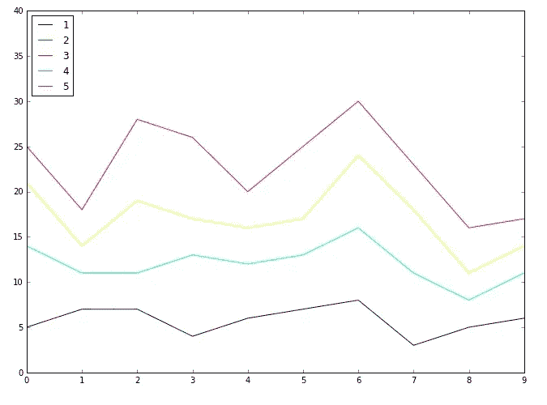**

**从使用 QQplots 进行分布比较，到使用 elbow 方法进行 CV 调整，以及使用 AUC 曲线分析模型性能，都可以使用折线图。**

**[文档链接](https://matplotlib.org/api/_as_gen/matplotlib.lines.Line2D.html#matplotlib.lines.Line2D.set_color)**

*****到目前为止，我们看到了一些广泛使用的方法，用于从数据中提取有用的信息/洞察力。*****

*****我们还可以使用一些可视化工具，将我们最终的信息/推论以剧情的形式传达给观众。让我们看看其中几个常用的。*****

# **热图:**

**热图是一种很好的可视化技术，用于比较任意两个变量/特征的值。seaborn library 的热图将创建一个类似网格的图，并带有一个可选的颜色条。我们为热图的每个元素提供了一个具有特定值的 2D 输入矩阵，它以与输入矩阵相同的形状精确地再现了输出图，并且每个图块根据矩阵的每个元素中提供给其对应图块的值进行着色。**

**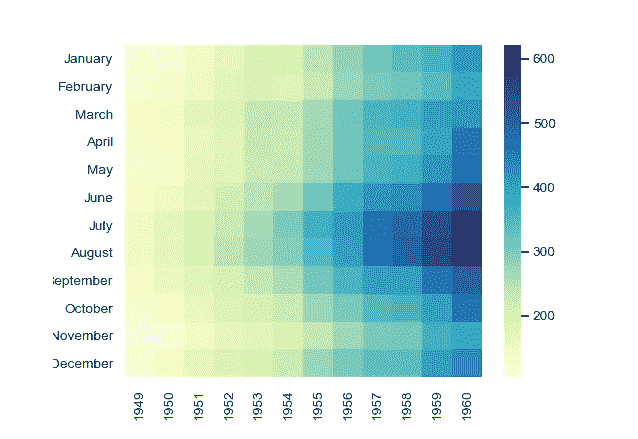**

**这在矩阵较大的情况下非常有用，我们希望通过简单地查看使用的不同色调来确定哪个值更高、更低等等。不同公司的每周业绩图表可以用热图来绘制**

**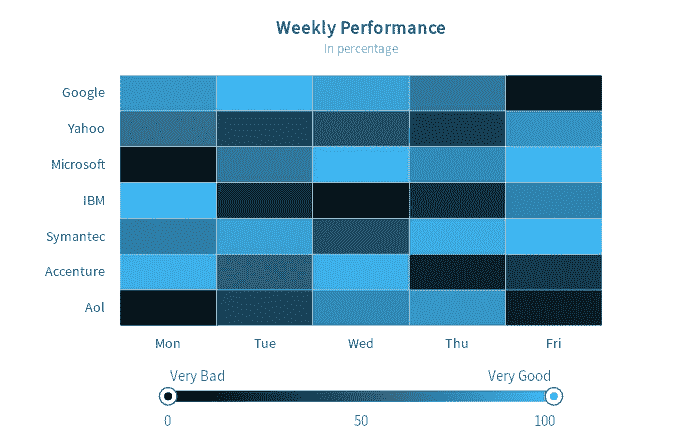**

**在机器学习应用中，它可以用于表示模型的混淆矩阵，用于超参数调整以绘制 2 个不同超参数之间的误差值等。**

**[seaborn 文档链接](https://seaborn.pydata.org/generated/seaborn.heatmap.html)**

# **Wordcloud:**

**Wordcloud 只不过是创建一个图像，其中包含一段/一串中不同大小的所有单词，根据该段中出现的频率而定。如果这个单词在给定的文章中出现的次数更多，它会显得更大更粗。**

**在你的命令提示符下输入下面一行来安装 wordcloud。**

```
**pip3 install wordcloud**
```

**这是最近在很多地方使用的，通过看到单词 cloud，我们可以像在一个段落中讨论的那样得出结论，而不用读太多。重复次数最多的单词将会比最少出现的单词显得更粗更大。**

**它可以与文本数据分析一起使用，例如，在执行情感分析和 SEO 优化时，在集群中找到共同的主题等。**

****

**[文档链接](https://amueller.github.io/word_cloud/generated/wordcloud.WordCloud.html)**

# **Graphviz:**

**决策树算法是流行的非线性模型之一。它构建了一个树，其中每个分裂的条件/特征将基于信息增益或基尼不纯值来选择。**

**如果你想查看像线性回归这样的线性模型，你可以简单地使用 matplotlib/seaborn，而要可视化树，我们使用一个叫做 [Graphviz](http://www.graphviz.org/) 的特殊工具。你可以使用下面的命令来安装它，就像我们安装其他 python 包一样。**

```
**pip3 install graphviz**
```

**Sklearn 很好地实现了一个名为 [export_graphviz](https://scikit-learn.org/stable/modules/generated/sklearn.tree.export_graphviz.html#sklearn.tree.export_graphviz) 的函数，它可以帮助我们将决策树模型转换为点格式，这是 graphviz 工具所支持的。**

**参考: [Sklearn 链接](https://scikit-learn.org/stable/modules/tree.html)**

**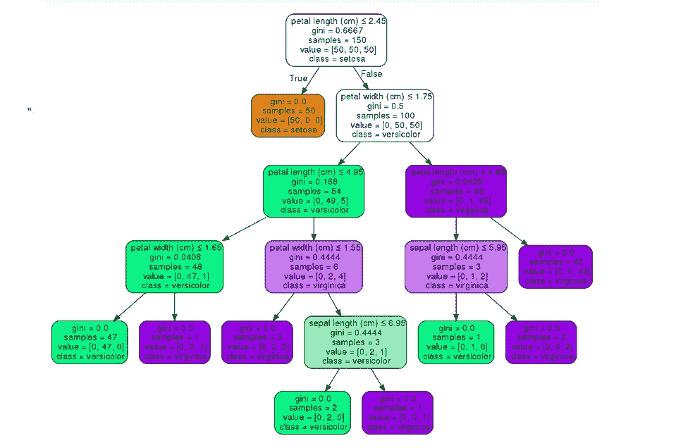**

**Image taken from [Sklearn](https://scikit-learn.org/stable/modules/tree.html)**

# **树形图:**

**这是在使用分层聚类技术(如凝聚聚类)时用来可视化所形成的聚类的方法。**

**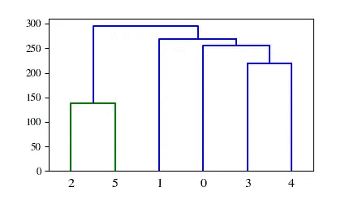**

**这里点之间的每个链/链接，意味着它们属于同一个集群。当数据点的数量很大时，树状结构可能太复杂。**

**参考:[链接到绘制树形图的程序](https://joernhees.de/blog/2015/08/26/scipy-hierarchical-clustering-and-dendrogram-tutorial/)**

**我认为这对于这篇博客来说已经足够了，这里讨论了各种可视化方法。如果我觉得缺少了什么，如果有必要，我会试着编辑或创建第二部分..**

***非常感谢你阅读我的博客直到这个结论，如果我占用了你的宝贵时间，我真的很抱歉！！。* ***发现有用就鼓掌示爱*** *。如果您还有 2 分钟时间，请给我留下反馈，我可以用它在接下来的日子里提高自己。这是我在互联网上的第一篇博客，如前所述，非常欢迎你的建设性反馈。***

> **“我认为有一个反馈环非常重要，在这个反馈环中，你会不断思考你已经做了什么，以及如何才能做得更好。”
> **–埃隆马斯克(我的灵感；))****

*****过得愉快，编码快乐:)！！！*****

> **- **萨纳特****
> 
> **电子邮件 ID:smartersanat@gmail.com**
> 
> **联系方式:[www.linkedin.com/in/sanatmpa](http://www.linkedin.com/in/sanatmpa)**

> **编辑:非常感谢应用人工智能团队从提交的 118 个博客中选择我的博客作为前 20 个特别提到的博客之一。[链接](https://youtu.be/xcrHxCsFaAM?t=460)**

# **参考资料:**

**下面这些对我的博客帮助很大，我想通过提供参考来表达我的敬意。**

**1.)[https://dev.to/skotaro/artist-in-matplotlib——某个我想知道的人——花了大量时间在谷歌上搜索“如何做”的问题](https://dev.to/skotaro/artist-in-matplotlib---something-i-wanted-to-know-before-spending-tremendous-hours-on-googling-how-tos--31oo)**

**2.)[https://www.aosabook.org/en/matplotlib.html](https://www.aosabook.org/en/matplotlib.html)**

**3.)[https://www . fusioncharts . com/resources/chart-primers/heat-map-chart](https://www.fusioncharts.com/resources/chart-primers/heat-map-chart)**

**4.)Sklearn 库。**

**5.)应用课程。**

**6.)维基百科。**

**7.)Imgflip.com 创造了迷因形象。**