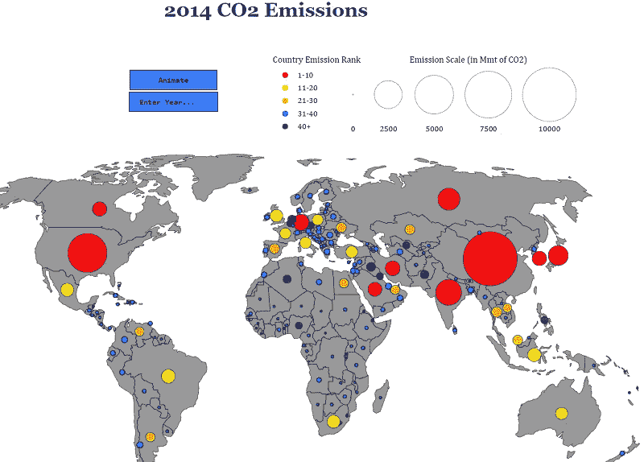
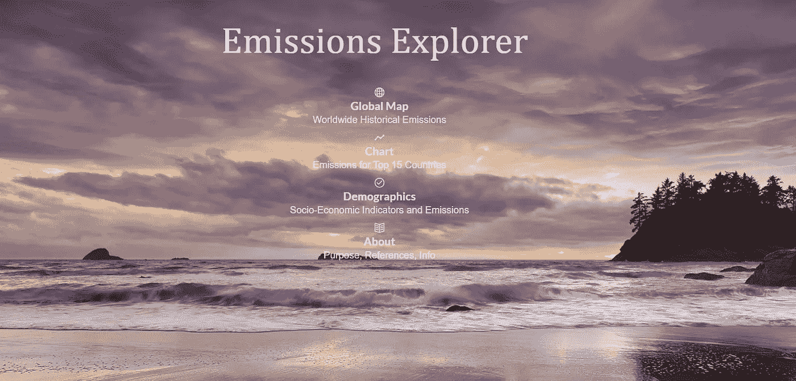
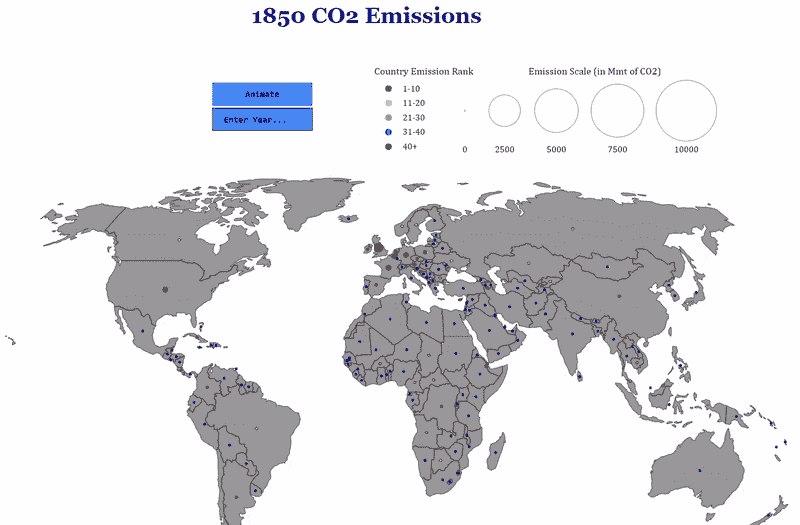
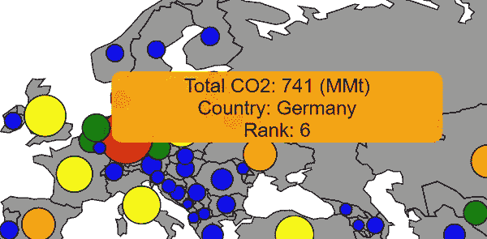
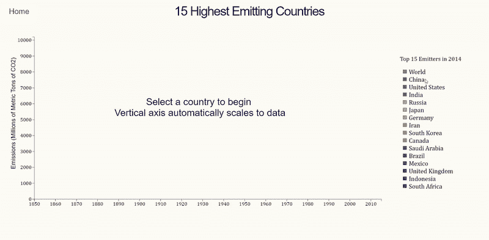
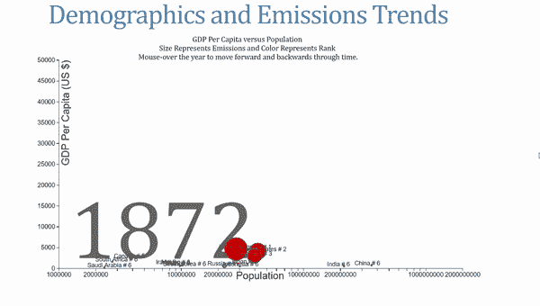

# 数据可视化黑客马拉松风格

> 原文：<https://towardsdatascience.com/data-visualization-hackathon-style-c6dcaabbf626?source=collection_archive---------5----------------------->

**我努力将数据从电子表格中解放出来**

每个人——公司、政府、个人——都有数据，但很少有人知道如何有效地使用它。数据可以告诉我们如何做出更好的决策，但这些知识往往隐藏在数字中。一个问题是大多数数据看起来像这样:

虽然这里的信息，全球二氧化碳排放量，是“开放数据”，任何人都可以公开下载，但它也可以被锁在电子表格中，这对任何人都有好处。数据科学的核心是将这些毫无意义的数字转化为有用的知识。揭示数字内部洞察力的最有效方式之一是通过数据可视化。

Data from a spreadsheet turned into knowledge

对于在凯斯西储大学举办的黑客马拉松 [HackCWRU 2018](http://hack.cwru.edu/) ，我想探索公开的二氧化碳数据，并让普通观众可以访问。对于那些没有经验的人来说，一个[黑客马拉松](https://mlh.io/seasons/na-2018/events)是一群充满激情的开发者——程序员、艺术家、硬件专家，偶尔还有数据科学家——在周末聚在一起，连续 24 或 36 个小时为项目工作。有时会有特定的问题需要解决，但在其他情况下，比如使用 HackCWRU，您可以自由选择您的团队和项目。在有限的时间内完成你的目标，睡觉通常是不鼓励的！

HackCWRU 做了各种各样的项目:手机应用、虚拟现实游戏、动作捕捉程序，而我选择做我最喜欢的事情:数据可视化。我单干了，项目名为排放浏览器，坚持在我的所有项目中添加浏览器的习惯(见[股票浏览器](/stock-analysis-in-python-a0054e2c1a4c)和[重量浏览器](https://github.com/WillKoehrsen/weighter))。我周末的目标是展示数据可视化如何通过构建一个交互式数据探索网站，将数百万个数字转化为有意义的知识。

整个网站[在线](http://emissions.online.s3-website.us-east-2.amazonaws.com/)可用，代码也可以在 GitHub 上免费[获得，供任何人使用或改进。(这个网站在桌面上运行得最好，因为我没有时间让它适应移动设备。这对任何人来说都是一个很好的解决方案！).](https://github.com/WillKoehrsen/emissions-explorer)

在我的过程中，我会在下面展示大部分的结果，但是我强烈推荐任何人访问这个网站来获得完整的体验。

# 显色法

在我们开始制作视觉效果的有趣部分之前，我们必须找到并清理一些数据。在一个正常的数据科学工作流程中，这要花费一个项目 90%的时间。然而，在有限的时间内工作，我需要干净的数据和快速。我从三个来源收集数据: [GapMinder](https://www.gapminder.org/) ( [由汤姆·卡登](https://github.com/RandomEtc/mind-gapper-js)策划)[气候数据在线工具](http://cait.wri.org/)和[世界银行](https://data.worldbank.org/)，所有这些都是熟悉的 csv 文件格式。

数据状况良好，但有一些不一致之处，主要与国名有关。我花了很长时间才弄明白，韩国的代码是“Korea，Rep .”而朝鲜的代码是“Korea，Dem”。所有的数据格式化都是用 Python 完成的(在 Jupyter 笔记本中)，使用了 Pandas 和 Numpy。数据的最终版本被保存为 json ( [Javascript 对象符号](https://www.json.org/))，一种机器可读的数据交换格式。

虽然我通常使用 Python 和 R 进行分析和可视化，但数据科学的一部分是了解用于这项工作的正确工具，交互式绘图的最佳选择之一是 D3 . js。D3，数据驱动文档是一个 JavaScript 库，允许您通过一次构建一个元素来控制图表的每个方面。它的学习曲线非常陡峭，但最终结果是值得的！

对于我的第一个图表，我想用地图做些事情，因为我喜欢在地理环境中看到国家之间的比较。我的想法是创建一个世界地图，并在国家上画出与它们排放的二氧化碳量成比例的圆圈。圆圈的颜色将反映该国在排放量方面的排名。由于二氧化碳排放量变化很大，尤其是在过去的几十年里，我加入了一个时间维度，可以选择可视化数据的整个历史(1850 年至 2014 年)和一个选择框，以便用户可以选择特定的年份。最终结果显示在下面的动画中:

You can’t make this in Excel

作为点睛之笔，我添加了工具提示，当你把鼠标放在一个国家上时，它会显示每个国家的确切排放量和该国在给定年份的排名。我喜欢专业制作的图表中像这样的小细节，所以我试着自己做一点！

完成地图后，我想做一个更好的方法来比较随着时间的推移排名靠前的国家。地图动画中隐藏了很多细节，对于可视化随时间变化的轨迹来说不是很好。显示时间序列最常见的方式是简单的线图，我认为没有理由发明不同的解决方案。同样，我在图表中保留了一个交互元素，允许用户选择特定的国家。

制作这个图表最困难的部分是 y 轴上的自动缩放。幸运的是，d3 允许您控制图表的每个方面，所以我能够指定轴的刻度应该更新以匹配排放量最大的国家。我认为这种视觉效果比地图更适合比较排名前 15 位的国家，摆弄它可以揭示出许多真知灼见。例如，中国在 2005 年超过了美国(这不是一个你想成为第一的领域)，尽管英国最初是最大的排放国，但到了 2014 年，他们的排放量与工业化国家相比相形见绌。

对我影响最大的数据可视化灵感之一是已故的 GapMinder 创始人汉斯·罗斯林。特别是，在我第一次观看他的演讲后，他展示各国人口统计数据随时间变化的演讲让我记忆犹新，这是任何电子表格都无法做到的。

对于最终的视觉效果，我想尝试重新创建 GapMinder 风格的图表，并在此过程中使用一些额外的社会经济数据。我大量借鉴了迈克·博斯托克的《国家财富与健康图表》( T1 ),制作了自己的动画互动视觉效果。在同一张图上有四个不同的变量，我把它分成如下几个部分

*   x 轴显示的是一个国家的对数人口
*   y 轴显示人均 GDP，衡量一个国家的富裕程度
*   圆圈的面积与二氧化碳排放量成正比
*   圆圈的颜色代表国家的等级

最终版本需要一些时间来吸收，因为它提供了相当多的信息！

该图表还允许用户通过将鼠标悬停在标签上来更改年份。当我展示这个的时候，我让很多人将它与汉斯·罗斯林的工作进行比较，这可能是我得到的最高的数据可视化补充！

一旦我把所有的图表放在一起，我就通过复制和粘贴现有的 html/css 模板把一个快速主页和 about page 放在一起。然后，我托管了我的文件，并在亚马逊 S3(一种云存储服务)上创建了一个静态网站。(他的指导很有帮助)。我接受的正规机械工程/数据科学教育并不包括任何网页设计方面的指导，所以整体美感显然还需要一些努力。尽管如此，这三个图表实现了我设定的目标:将这些有价值的公共数据从对任何人都没有好处的电子表格中解放出来！

# 结论

我确保在所有图表中包含的一个元素是交互性。当我看图表时，我喜欢自己摆弄数据，改变参数以发现所有的细微差别。由于这是一个探索性数据分析(EDA)项目，我想让用户自己得出一些结论。虽然总的信息是二氧化碳的排放量无疑随着时间的推移一直在增加，但人们可以在图表中找到其他有趣的信息。我们认为数据包含客观真理，但即使是数字，不同的个人也会带来自己的解释，影响他们从数据中获得的知识。当然，有些时候我们想用数据来证明一个观点，比如医学试验，但在这种公共数据的情况下，我想让人们更容易使用他们认为合适的数据。

尽管我最终赢得了两个奖项——公民赛道奖和亚马逊网络服务最佳使用奖——但这些奖品并没有从事一个很酷的项目重要。此外，黑客马拉松挑战我学习另一项技能 d3.js，我可以将它添加到我用于数据科学的工具箱中。成功的数据科学家总是愿意学习，不存在你已经掌握一切的阶段。D3.js 可能不值得陡峭的学习曲线——[plot . ly 可以在 Python 中使用，并基于 d3](https://plot.ly/python/) 构建，Tableau 允许您非常快速地从干净的数据中制作专业的图表——但我仍然喜欢这个项目。黑客马拉松是获得大量实际问题经验的好方法，我向任何喜欢解决问题/创建独特项目的人推荐它们。虽然我选择采用数据科学的方法，但黑客马拉松欢迎来自各种背景的人，我鼓励任何人尝试一下！

如果有人想改进我的网站，或者有任何其他反馈和建设性的批评，可以通过 Twitter [@koehrsen_will](https://twitter.com/koehrsen_will) 联系我。