# Python 中的数据可视化，如 R 的 ggplot2

> 原文：<https://towardsdatascience.com/data-visualization-in-python-like-in-rs-ggplot2-bc62f8debbf5?source=collection_archive---------5----------------------->

## 教程 PYTHON 数据可视化

## 一步一步的教程如何创建一个基本的图表到一个出版就绪的 dataviz 图表


Photo by [faaiq ackmerd](https://www.pexels.com/@faaiq-ackmerd-383634?utm_content=attributionCopyText&utm_medium=referral&utm_source=pexels) from [Pexels](https://www.pexels.com/photo/photo-of-night-sky-1025469/?utm_content=attributionCopyText&utm_medium=referral&utm_source=pexels)

如果你喜欢用 R 的 [**ggplot2**](http://ggplot2.tidyverse.org/) 来绘制数据，但是你必须使用 Python，那么 [**plotnine**](http://plotnine.readthedocs.io/en/stable/) 包作为 [**matplotlib**](https://matplotlib.org/) 的替代包是值得研究的。在这篇文章中，我将向你展示如何开始使用 plotnine 进行高效的输出。

如果你想继续，请在 GitHub 上找到完整的脚本:

 [## scheithauer/python-plotnine

### python 中的数据可视化，就像 R 的 ggplot2 一样

github.com](https://github.com/scheithauer/python-plotnine) 

## ggplot2

> ggplot2 是一个基于[图形](http://amzn.to/2ef1eWp)语法的声明式创建图形的系统。您提供数据，告诉 ggplot2 如何将变量映射到美学，使用什么图形原语，它负责处理细节。资料来源:http://ggplot2.tidyverse.org/

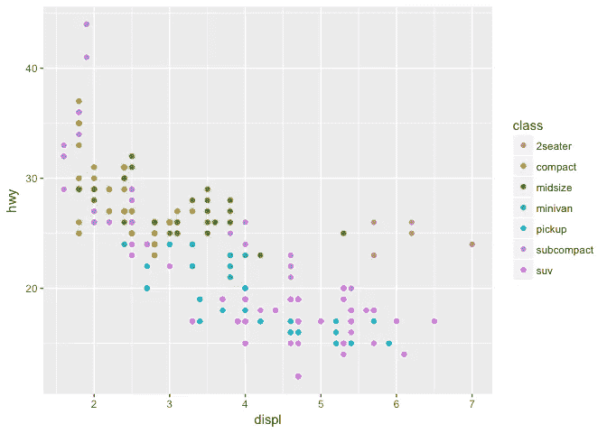

ggplot output; [http://ggplot2.tidyverse.org/reference/figures/README-example-1.png](http://ggplot2.tidyverse.org/reference/figures/README-example-1.png)

## plotnine 作为 python 的 matplotlib 的替代

根据我的经验，ggplot2 的优势是实现了图形的*语法*。

[plotnine](http://plotnine.readthedocs.io/en/stable/) 是由[哈桑·基比瑞吉](https://github.com/has2k1)为 python 编写的图形语法，它给 Python 带来了同样的优势:更少的编码和更容易理解(声明性范例)。

## 安装绘图仪

```
# Using pip
$ pip install plotnine         # 1\. should be sufficient for most
$ pip install 'plotnine[all]'  # 2\. includes extra/optional packages

# Or using conda
$ conda install -c conda-forge plotnine
```

## 可视化数据

我用的**[**craft-beers-dataset**](https://github.com/nickhould/craft-beers-dataset)**出自 [Jean-Nicholas Hould](https://medium.com/u/cd11ab450571?source=post_page-----bc62f8debbf5--------------------------------) 。它包含了 2410 种美国精酿啤酒的信息。这些信息包括:****

*   ******abv**——酒精的体积含量，0 表示无酒精，1 表示纯酒精****
*   ****国际苦味单位，描述一种饮料有多苦。****
*   ******名称** —啤酒的名称。****
*   ******风格** —啤酒风格(lager、ale、IPA 等。)****
*   ******brewery_id** —生产该啤酒的啤酒厂的唯一标识符****
*   ******盎司** —啤酒的盎司数。****

****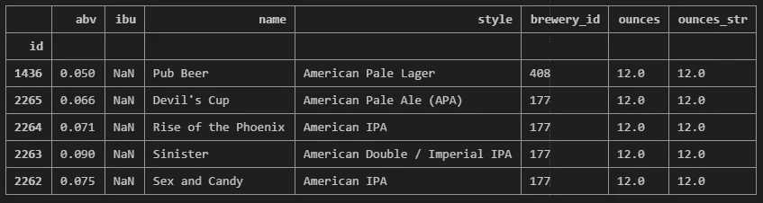****

****Data set example entries****

******安装必要的库******

```
**import pandas as pd
import numpy as np
from plotnine import ***
```

******定义有用的常数******

```
**c_remote_data ='[https://raw.githubusercontent.com/nickhould/craft-beers-dataset/master/data/processed/beers.csv'](https://raw.githubusercontent.com/nickhould/craft-beers-dataset/master/data/processed/beers.csv')
c_col = ["#2f4858", "#f6ae2d", "#f26419",
         "#33658a", "#55dde0", "#2f4858",
         "#2f4858", "#f6ae2d", "#f26419",
         "#33658a", "#55dde0", "#2f4858"]**
```

******有用的功能******

```
**def labels(from_, to_, step_):
    return pd.Series(np.arange(from_, to_ + step_, step_)).apply(lambda x: '{:,}'.format(x)).tolist()def breaks(from_, to_, step_):
    return pd.Series(np.arange(from_, to_ + step_, step_)).tolist()**
```

******读取数据并设置索引******

```
**data = pd.read_csv(c_remote_data)data = (
    data.filter([
        'abv',
        'ibu',
        'id',
        'name',
        'style',
        'brewery_id',
        'ounces'
    ]).
    set_index('id')
)**
```

# ****柱状图****

## ****最初的****

```
**fig = (
    ggplot(data.dropna(subset = ['abv'])) +
    geom_histogram(aes(x = 'abv'))
)**
```

****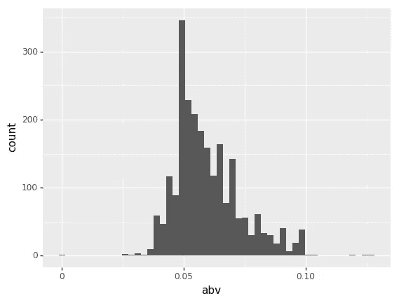****

## ****添加颜色****

```
**fig = (
    ggplot(data.dropna(subset = ['abv'])) +
    geom_histogram(
        aes(x = 'abv'),
        **fill = c_col[0], color = 'black'**
    )
)**
```

****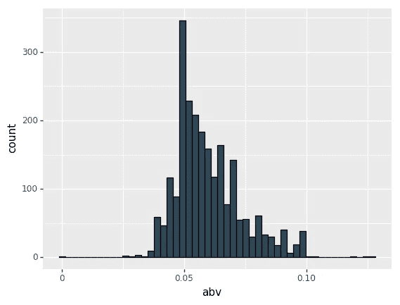****

## ****添加标签****

```
**fig = (
    ggplot(data.dropna(subset = ['abv'])) +
    geom_histogram(
        aes(x = 'abv'),
        fill = c_col[0], color = 'black'
    ) **+
    labs(
        title ='Distribution of The alcoholic content by volume (abv)',
        x = 'abv - The alcoholic content by volume',
        y = 'Count',
    )**
)**
```

****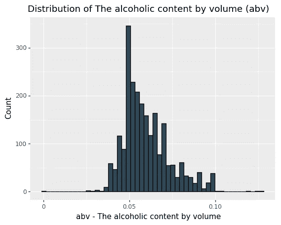****

## ****设置轴缩放比例****

```
**fig = (
    ggplot(data.dropna(subset = ['abv'])) +
    geom_histogram(
        aes(x = 'abv'),
        fill = c_col[0], color = 'black'
    ) +
    labs(
        title ='Distribution of The alcoholic content by volume (abv)',
        x = 'abv - The alcoholic content by volume',
        y = 'Count',
    ) **+
    scale_x_continuous(
        limits = (0, 0.14),
        labels = labels(0, 0.14, 0.02),
        breaks = breaks(0, 0.14, 0.02)
    ) +
    scale_y_continuous(
        limits = (0, 350),
        labels = labels(0, 350, 50),
        breaks = breaks(0, 350, 50)
    )**
)**
```

****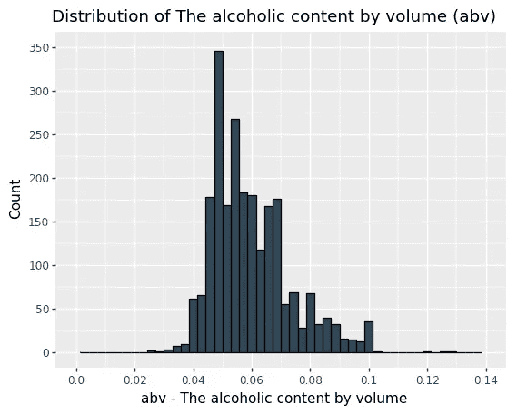****

## ****应用一个可用的主题****

```
****theme_set(
    theme_538()
)** # one time call**
```

****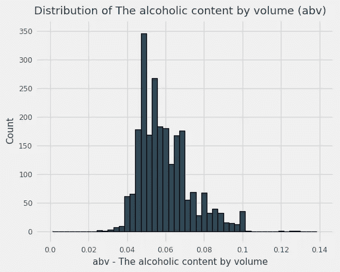****

## ****更改一些主题功能****

```
**theme_set(
    theme_538() **+
    theme(
        figure_size = (8, 4),
        text = element_text(
            size = 8,
            color = 'black',
            family = 'Arial'
        ),
        plot_title = element_text(
            color = 'black',
            family = 'Arial',
            weight = 'bold',
            size = 12
        ),
        axis_title = element_text(
            color = 'black',
            family = 'Arial',
            weight = 'bold',
            size = 6
        ),
    )**
)**
```

********

## ****添加一些统计数据****

```
**fig = (
    ggplot(data.dropna(subset = ['abv'])) +
    geom_histogram(
        aes(x = 'abv'),
        fill = c_col[0], color = 'black'
    ) +
    labs(
        title ='Distribution of The alcoholic content by volume (abv)',
        x = 'abv - The alcoholic content by volume (**median = dashed line; mean = solid line)**',
        y = 'Count',
    ) +
    scale_x_continuous(
        limits = (0, 0.14),
        labels = labels(0, 0.14, 0.02),
        breaks = breaks(0, 0.14, 0.02)
    ) +
    scale_y_continuous(
        limits = (0, 350),
        labels = labels(0, 350, 50),
        breaks = breaks(0, 350, 50)
    ) **+
    geom_vline(aes(xintercept = data.abv.mean()), color = 'gray') +
    geom_vline(aes(xintercept = data.abv.median()), linetype = 'dashed', color = 'gray')**
)**
```

****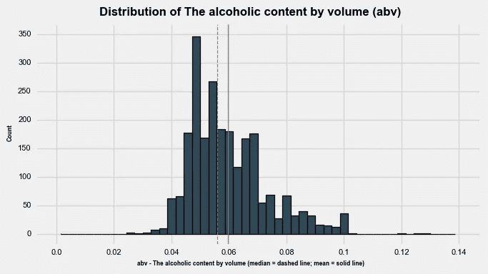****

## ****刻面****

```
**fig = (
    ggplot(data.dropna(subset = ['abv', 'style'])[data['style'].dropna().str.contains('American')]) +
    geom_histogram(
        aes(x = 'abv'),
        fill = c_col[0], color = 'black'
    ) +
    labs(
        title ='Distribution of The alcoholic content by volume (abv)',
        x = 'abv - The alcoholic content by volume',
        y = 'Count',
    ) +
    scale_x_continuous(
        limits = (0, 0.14),
        labels = labels(0, 0.14, 0.07),
        breaks = breaks(0, 0.14, 0.07)
    ) +
    scale_y_continuous(
        limits = (0, 300),
        labels = labels(0, 300, 100),
        breaks = breaks(0, 300, 100)
    ) **+
    theme(figure_size = (8, 12)) +
    facet_wrap('~style', ncol = 4)**
)**
```

********

# ****散点图****

## ****最初的****

```
**fig = (
    ggplot(data.dropna(subset = ['abv'])) +
    geom_point(
        aes(x = 'abv',
            y = 'ibu'),
        fill = c_col[0], color = 'black'
    ) +
    labs(
        title ='Relationship between alcoholic content (abv) and int. bittering untis (ibu)',
        x = 'abv - The alcoholic content by volume',
        y = 'ibu - International bittering units',
    ) +
    scale_x_continuous(
        limits = (0, 0.14),
        labels = labels(0, 0.14, 0.02),
        breaks = breaks(0, 0.14, 0.02)
    )  +
    scale_y_continuous(
        limits = (0, 150),
        labels = labels(0, 150, 30),
        breaks = breaks(0, 150, 30)
    )
)**
```

****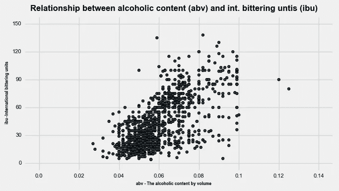****

## ****将磅值更改为变量****

```
**fig = (
    ggplot(data.dropna(subset = ['abv'])) +
    geom_point(
        aes(x = 'abv',
            y = 'ibu',
            **size = 'ounces'**),
        fill = c_col[0], color = 'black'
    ) +
    labs(
        title ='Relationship between alcoholic content (abv) and int. bittering untis (ibu)',
        x = 'abv - The alcoholic content by volume',
        y = 'ibu - International bittering units',
    ) +
    scale_x_continuous(
        limits = (0, 0.14),
        labels = labels(0, 0.14, 0.02),
        breaks = breaks(0, 0.14, 0.02)
    )  +
    scale_y_continuous(
        limits = (0, 150),
        labels = labels(0, 150, 30),
        breaks = breaks(0, 150, 30)
    )
)**
```

****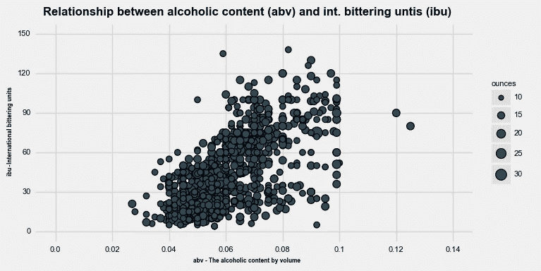****

## ****将点颜色更改为变量****

```
****data['ounces_str'] = data['ounces']
data['ounces_str'] = data['ounces_str'].apply(str)**fig = (
    ggplot(data.dropna(subset = ['abv'])) +
    geom_point(
        aes(x = 'abv',
            y = 'ibu',
            **fill = 'ounces_str'**),
        **alpha = 0.5**,
        color = 'black'
    ) +
    labs(
        title ='Relationship between alcoholic content (abv) and int. bittering untis (ibu)',
        x = 'abv - The alcoholic content by volume',
        y = 'ibu - International bittering units',
    ) +
    scale_fill_manual(
        name = 'Ounces',
        values = c_col) +
    scale_x_continuous(
        limits = (0, 0.14),
        labels = labels(0, 0.14, 0.02),
        breaks = breaks(0, 0.14, 0.02)
    )  +
    scale_y_continuous(
        limits = (0, 150),
        labels = labels(0, 150, 30),
        breaks = breaks(0, 150, 30)
    )
)**
```

****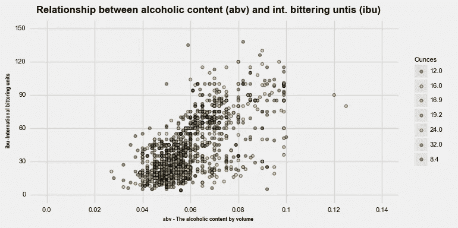****

## ****添加线性回归线****

```
**fig = (
    ggplot(data.dropna(subset = ['abv'])) +
    geom_point(
        aes(x = 'abv',
            y = 'ibu',
            fill = 'ounces_str'),
        alpha = 0.5,
        color = 'black'
    ) **+
    geom_smooth(
        aes(x = 'abv',
            y = 'ibu')
    )** +
    labs(
        title ='Relationship between alcoholic content (abv) and int. bittering untis (ibu)',
        x = 'abv - The alcoholic content by volume',
        y = 'ibu - International bittering units',
    ) +
    scale_fill_manual(
        name = 'Ounces',
        values = c_col) +
    scale_x_continuous(
        limits = (0, 0.14),
        labels = labels(0, 0.14, 0.02),
        breaks = breaks(0, 0.14, 0.02)
    )  +
    scale_y_continuous(
        limits = (0, 150),
        labels = labels(0, 150, 30),
        breaks = breaks(0, 150, 30)
    )
)**
```

****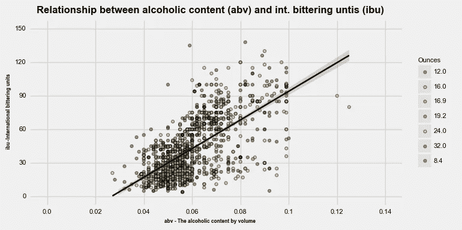****

## ****刻面****

```
**fig = (
    ggplot(data.dropna(subset = ['abv'])) +
    geom_jitter(
        aes(x = 'abv',
            y = 'ibu',
            fill = 'ounces_str'),
        width = 0.0051,
        height = 5,
        color = 'black'
    ) +
    labs(
        title ='Relationship between alcoholic content (abv) and int. bittering untis (ibu)',
        x = 'abv - The alcoholic content by volume',
        y = 'ibu - International bittering units',
    ) +
    scale_fill_manual(
        guide = False,
        name = 'Ounces',
        values = c_col) +
    scale_x_continuous(
        limits = (0, 0.14),
        labels = labels(0, 0.14, 0.02),
        breaks = breaks(0, 0.14, 0.02)
    )  +
    scale_y_continuous(
        limits = (0, 150),
        labels = labels(0, 150, 30),
        breaks = breaks(0, 150, 30)
    ) **+
    facet_wrap('ounces_str')**
)**
```

****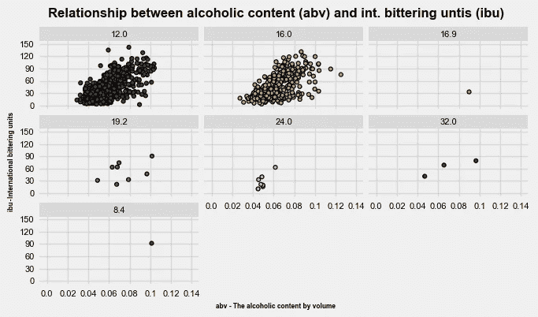****

# ****热图****

```
**fig = (
    ggplot(data.dropna(subset = ['abv'])) +
    **geom_bin2d**(
        aes(x = 'abv',
            y = 'ibu')
    ) +
    labs(
        title ='Relationship between alcoholic content (abv) and int. bittering untis (ibu)',
        x = 'abv - The alcoholic content by volume',
        y = 'ibu - International bittering units',
    ) +
    scale_x_continuous(
        limits = (0, 0.14),
        labels = labels(0, 0.14, 0.02),
        breaks = breaks(0, 0.14, 0.02)
    )  +
    scale_y_continuous(
        limits = (0, 150),
        labels = labels(0, 150, 30),
        breaks = breaks(0, 150, 30)
    ) **+
    theme(figure_size = (8, 8))**
)**
```

****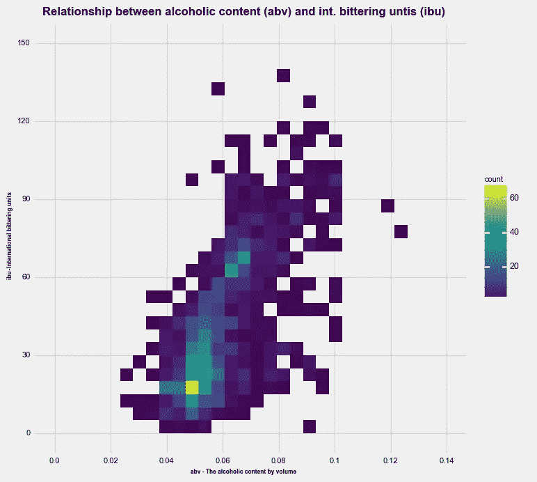****

# ****箱线图****

## ****通用箱线图****

```
**fig = (
    ggplot(data.dropna(subset = ['abv'])) +
    **geom_boxplot**(
        aes(x = 'ounces_str',
            y = 'abv')
    ) +
    labs(
        title ='Distribution of alcoholic content (abv) by size',
        x = 'size in ounces',
        y = 'abv - The alcoholic content by volume',
    ) +
    scale_y_continuous(
        limits = (0, 0.14),
        labels = labels(0, 0.14, 0.02),
        breaks = breaks(0, 0.14, 0.02)
    )
)**
```

****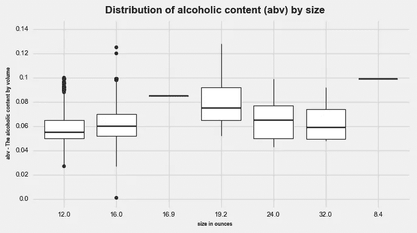****

## ****小提琴盒图****

```
**fig = (
    ggplot(data.dropna(subset = ['abv'])) +
    **geom_violin**(
        aes(x = 'ounces_str',
            y = 'abv'),
        fill = c_col[0]
    ) +
    labs(
        title ='Distribution of alcoholic content (abv) by size',
        x = 'size in ounces',
        y = 'abv - The alcoholic content by volume',
    ) +
    scale_y_continuous(
        limits = (0, 0.14),
        labels = labels(0, 0.14, 0.02),
        breaks = breaks(0, 0.14, 0.02)
    )
)**
```

****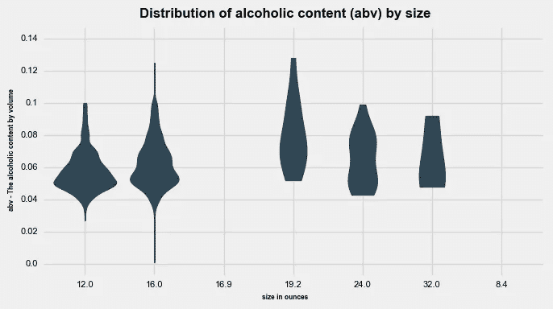****

# ****结论****

****plotnine 提供了各种不同的可视化，很容易适应定制的输出。如果你有在 R 中使用 ggplot 的经验，那么切换到 plotnine 是毫不费力的。****

******点击此处查看更多我的文章**:****

1.  ****[了解我如何为媒体设计文章](https://medium.com/technical-excellence/article-pipeline-management-with-notion-app-template-13e83635ed1)****
2.  ****[了解如何使用链接(或管道)在 Python 中编写干净的代码](https://medium.com/technical-excellence/article-pipeline-management-with-notion-app-template-13e83635ed1)****
3.  ****[学习如何使用 R 分析你的 LinkedIn 数据](/nine-years-on-linkedin-in-data-b34047c77223)****
4.  ****[学习如何使用图形语法在 Python 中以描述性的方式创建图表](/data-visualization-in-python-like-in-rs-ggplot2-bc62f8debbf5)****
5.  ****[了解如何在两分钟内用 python 数据科学代码设置日志](/how-to-setup-logging-for-your-python-notebooks-in-under-2-minutes-2a7ac88d723d)****

****Gregor Scheithauer 是一名顾问、数据科学家和研究员。他专门研究流程挖掘、业务流程管理和分析。你可以在[**LinkedIn**](https://www.linkedin.com/in/gscheithauer/)[**Twitter**](https://twitter.com/gscheithauer)上和他联系，或者在 [**中**](https://gscheithauer.medium.com/) 上这里。谢谢大家！****