# 数据可视化:来自最具创新力的美国城市的 Kickstarter 项目

> 原文：<https://towardsdatascience.com/data-visualization-kickstarter-projects-from-the-most-innovative-us-cities-5da870dcd9b5?source=collection_archive---------0----------------------->

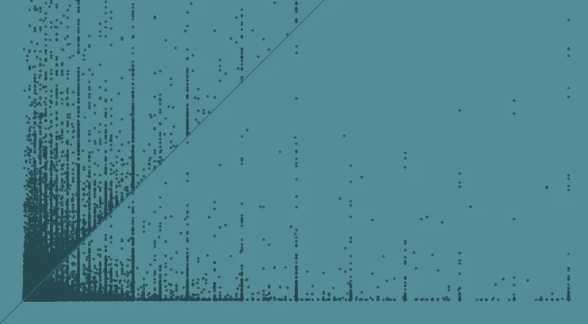

一种结合自然语言处理、t-SNE 和主成分分析的方法

> 背景

据福布斯报道，2015 年最具创新力的美国城市是:

加利福尼亚州圣何塞
第 1 位；科罗拉多州博尔德
第 2 位；加利福尼亚州旧金山
第 3 位；科瓦利斯
第 4 位；华盛顿州西雅图
第 5 位；科罗拉多州科林斯堡
第 7 位；犹他州普罗沃
第 8 位；德克萨斯州奥斯汀
第 9 位；佛蒙特州伯灵顿
第 10 位；马萨诸塞州波士顿

受到一个精心组织的关于[测谎仪](http://polygraph.cool/kickstarter/)的可视化项目的启发，我们很想知道来自上述最具创新性的美国城市的成功 Kickstarter 项目之间是否有任何差异。[数据集](https://webrobots.io/kickstarter-datasets/)是 2016 年 11 月在 Kickstarter 上报废所有可用项目得到的。

让我们先来看看上述城市与美国其他城市相比表现如何。

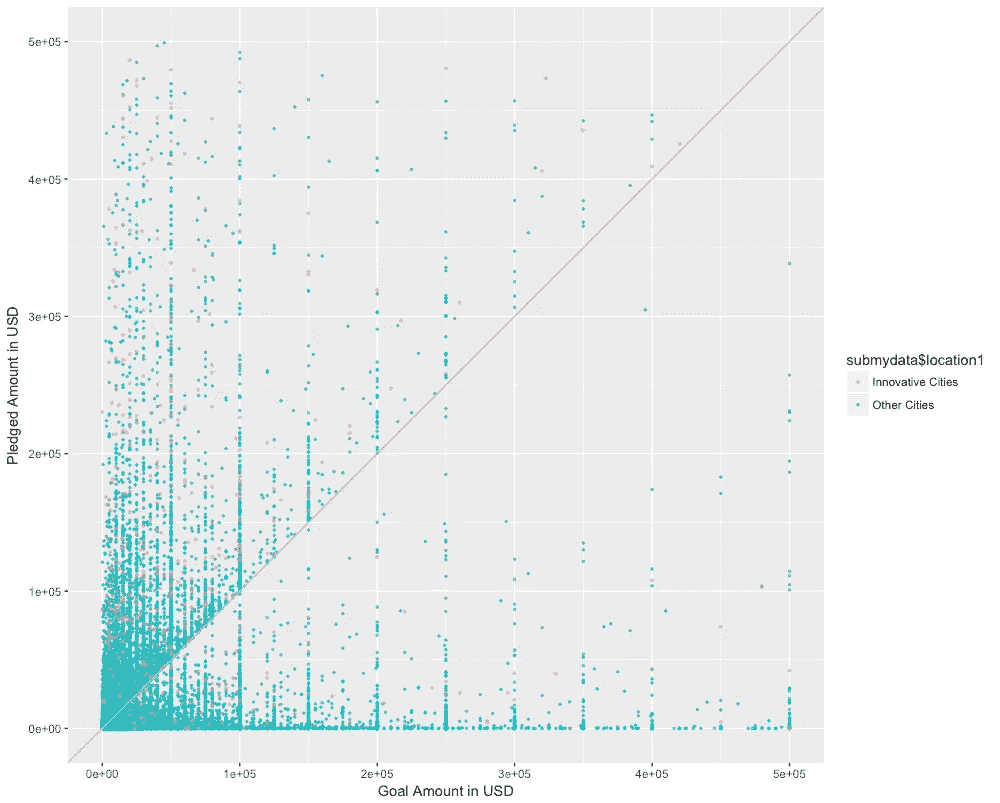

Screenshot of goal amount vs. pledged amount between innovative cities and other cities

事实上，我们可以观察到，来自创新型城市的项目似乎比他们最初的目标承诺了更多的金额，因为可以在灰色线(斜率=1)以上找到更多的项目。

> 目标

由于[测谎仪](http://polygraph.cool/kickstarter/)的帮助，我们已经知道每个城市的哪些类别更受欢迎，我们很想知道创新城市的成功项目名称是否有任何差异。

> 方法

我们将使用 Google 开发的一种流行的自然语言处理(NLP)算法 *word2vec* 来执行文本挖掘任务。由于之前我们已经简单的谈过[方法论](https://medium.com/@jameschen_78678/social-behavior-analytics-201-523199badba0#.i2s8pqee7)，所以这次我们将重点讨论 word2vec 的实现。但是，建议在继续下一步之前先回顾一下这些概念。

1…将文本语料库作为输入

2…构建一个词汇表

3…学习单词的矢量表示法

4…生成单词向量作为输出

5…将单词向量应用于项目标题

6…创建平均项目标题向量

7…使用 t-SNE 将项目标题矢量转换为 2D 矢量表示

8…可视化美国顶级创新城市的结果

> 数据准备

1…修复放错位置的数据
由于数据来自于网络剪报，有些行可能放错了位置，需要做一些调整。

2…仅包括创新的美国城市
我们只想从想要的城市中选择项目，因此我们将删除其他城市。

3…清理项目名称
由于项目名称将是我们将要处理的主要变量，我们需要先做一些清理工作，比如去掉标点符号。

> 模特培训

我们将使用 R 中的 *rword2vec* 包来演示模型。

1…产生单词向量

虽然大多数分析会删除[停用词](https://en.wikipedia.org/wiki/Stop_words)，因为它们的高频率会在分析中产生噪声，但出于比较目的，我们将保留它们。

```
library(rword2vec)#Prepare the dataset
train=text$name
train=gsub("[[:punct:]]", "", train)
write(train,"text_data.txt")#Convert phrases to words
word2phrase(train_file = "text_data.txt",output_file = "vec.txt")#Input words to model
model=word2vec(train_file = "vec.txt",output_file = "vec.bin",binary=1)#Convert binary to text format
bin_to_txt("vec.bin","model1text.txt")#Convert .txt to .cvs
model1 <- read.table("model1text.txt",fill=TRUE)
write.csv(model1,"model1.csv")
m1 <- read.csv("model1.csv")
```

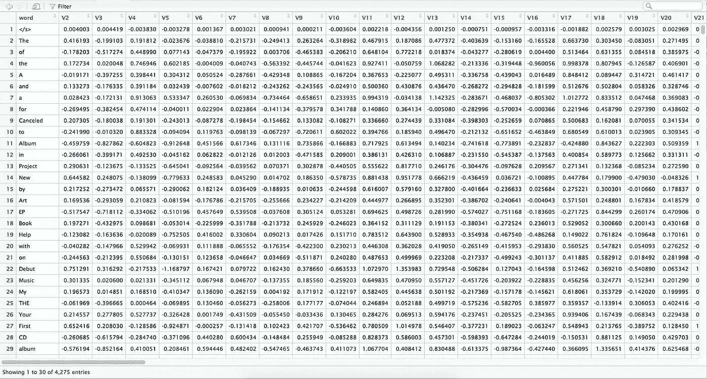

Screenshot of the word vectors produced

我们还可以找到与搜索单词最接近的单词。

```
distance("vec.bin","new",num=15)
distance("vec.bin","album",num=15)
```

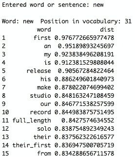

Screenshot of the top 15 closest words to “new”

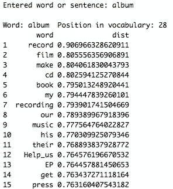

Screenshot of the top 15 closest words to “album”

2…将单词向量应用于项目标题(所有单词向量的平均值)

```
s <- strsplit(data$name, split = " ")
new <- data.frame(V1 = rep(data$id, sapply(s, length)), V2 = unlist(s))colnames(new) <- c("id","word")
colnames(m1)[1] <- "word"
new <- merge(new,m1,by="word")new2 <- aggregate(V2 ~ id, new, mean)
for (i in 4:102){
new3 <- aggregate(new[,i] ~ id, new, mean)
new2 <- merge (new2,new3,by="id")
}colnames(new2)[1] <- "id"
colnames(new2)[2:101] <- paste("V", 1:100, sep="")
new2$id <- as.factor(new2$id)
write.csv(new,"data.csv")
```

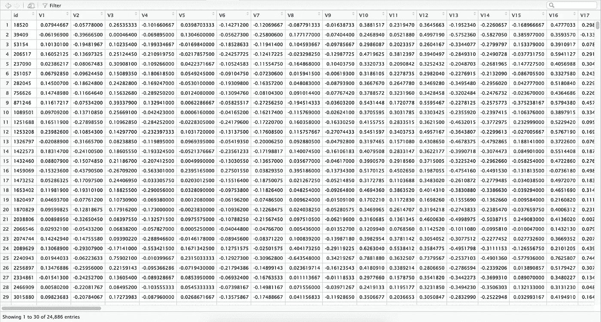

Screenshot of the project title vectors created

3…使用 t-SNE 将项目标题向量转换为 2D(该过程耗时 1 小时)

```
library(Rtsne)set.seed(1)
tsne <- Rtsne(new2, dims = 2, perplexity=100, verbose=TRUE, max_iter = 500)t = as.data.frame(tsne$Y)
id <- subset(new2,select="id")
t <- merge(id,t,by=0)city <- submydata1[,c(3,28)]final <- merge(city,t,by="id")final$Row.names <- NULL
```

4…根据城市的 t-SNE 向量绘制 2D 项目标题

```
library(ggplot2)p <- ggplot(final,
aes(V1, V2, color = final$location1))+
geom_point(alpha=0.7,size=2)
p
```

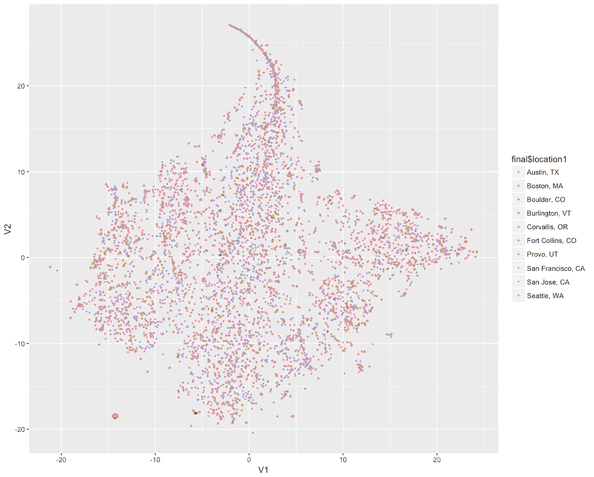

Screenshot of the project title vectors with t-SNE

5…使用 PCA 将项目标题向量转换为 2D

```
pcadata <- new2
pcadata$id <- NULLpr.out=prcomp(pcadata, scale=TRUE)
pr.out$sdev
pr.var=pr.out$sdev ^2
pve=pr.var/sum(pr.var)
pve
plot(pve, xlab="Principal Component", ylab="Proportion of Variance Explained ", ylim=c(0,1),type="b")
plot(cumsum(pve), xlab="Principal Component ", ylab=" Cumulative Proportion of Variance Explained ", ylim=c(0,1), type="b")
pcadata2 <- scale(pcadata, pr.out$center, pr.out$scale) %*% pr.out$rotationid <- subset(new2,select="id")
p <- merge(id,pcadata2,by=0)city <- submydata1[,c(3,28)]pfinal <- merge(city,p,by="id")
```

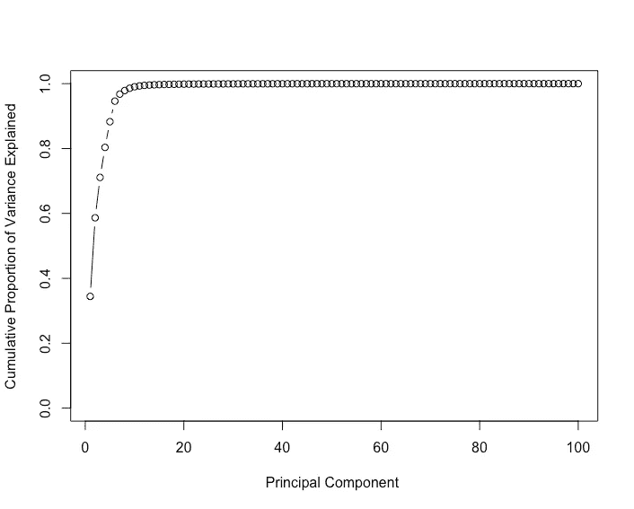

Screenshot of the performance of the PCA based on variance explained

6…根据城市的 PCA 向量绘制 2D 项目标题

```
plot <- ggplot(pfinal,aes(PC1, PC2, color = pfinal$location1))+
geom_point(alpha=0.7,size=0.5)
plot
```

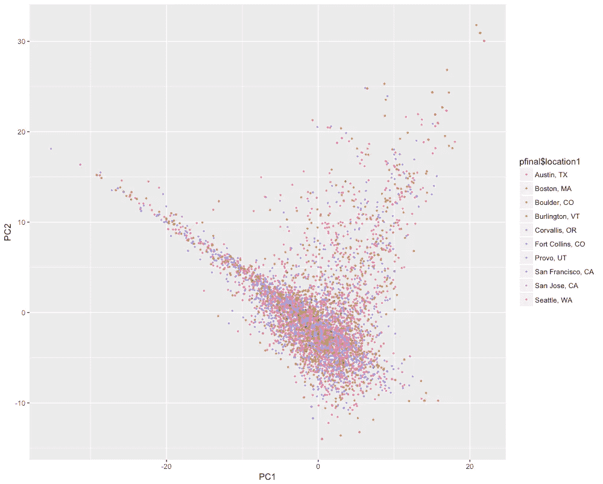

Screenshot of the project title vectors with PCA

不幸的是，这两种可视化方法都没有对我们最初的理论产生有意义的结果，即在创新的美国城市中，项目名称存在差异。然而，我们从 PCA 中注意到，这些创新城市可能有类似的项目名称，给出了中间的集群。

接下来，我们将检查某些项目标题是否更有可能成功。但是，由于数据量大，我们将取 20%作为样本。

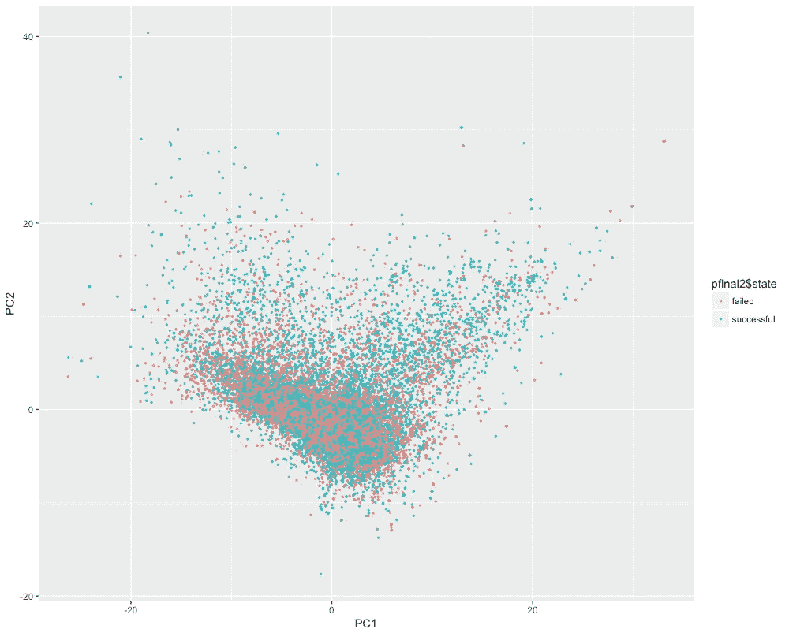

Screenshot of the project titles with PCA by successful and failed status (20% data points as sample)

让我们看看按照创新城市和其他城市来划分项目名称是否会有所帮助。

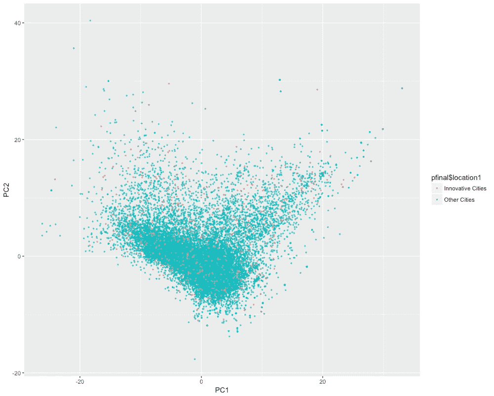

Screenshot of the project titles with PCA by innovative cities and other cities

最后，无论是失败与成功，还是创新与其他城市，在项目名称上似乎都没有任何有趣的发现。

我们还能做什么？

1…删除停止词以查看性能是否提高
2…我们可以查看项目描述，而不是项目标题

有什么问题、意见或顾虑吗？
jchen6912@gmail.com