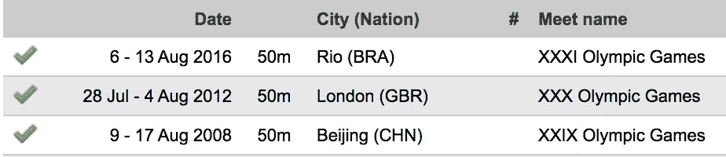
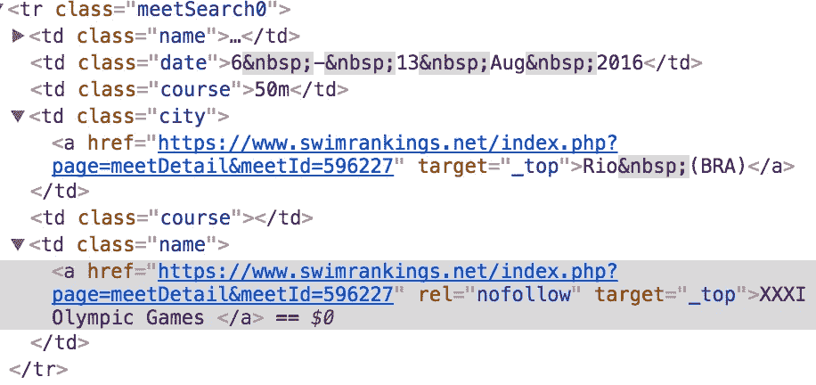
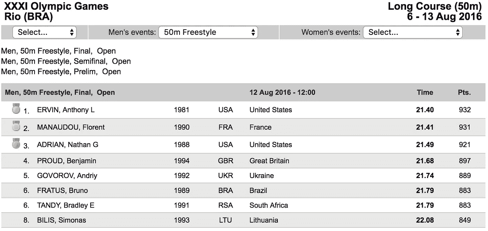
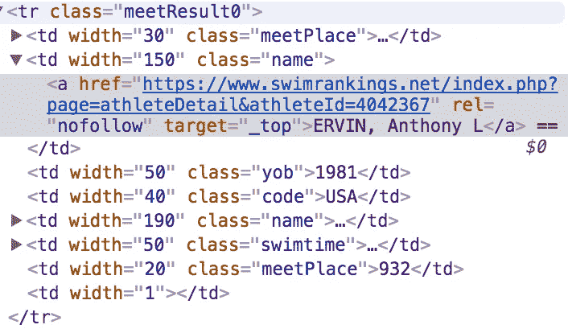
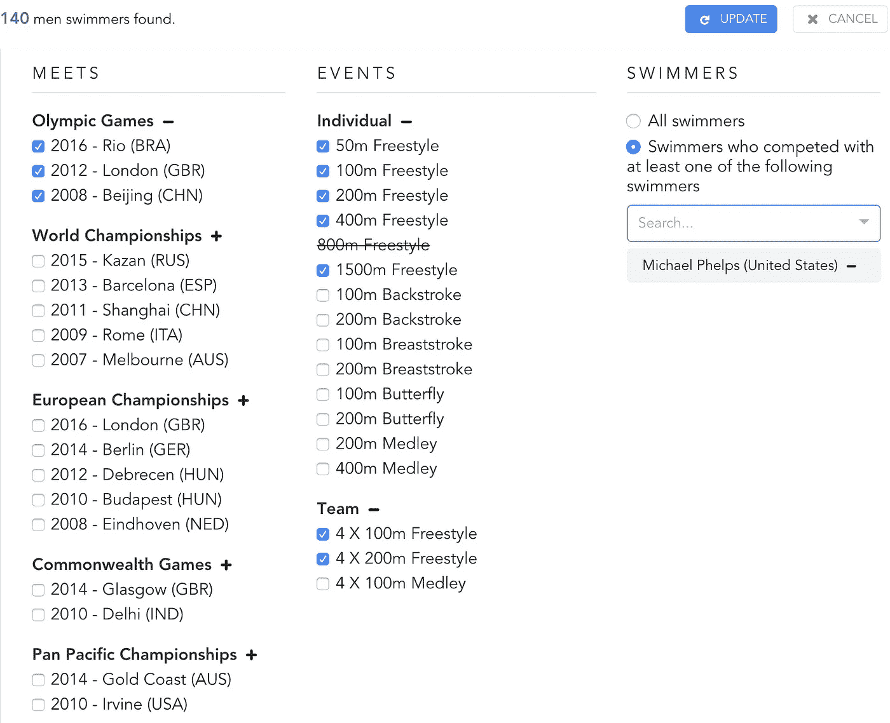

# 优秀游泳运动员比赛成绩的数据可视化(第一部分——数据集)

> 原文：<https://towardsdatascience.com/data-visualization-of-elite-swimmers-competition-results-part-1-datasets-bd09b68154c2?source=collection_archive---------2----------------------->

这篇文章是数据可视化项目《游泳者的历史》制作笔记的第一部分。

[](http://tany.kim/swimmers-history) [## 游泳运动员的历史

### 大型游泳比赛中优秀游泳运动员比赛成绩的数据可视化。探索+1500 游泳者的历史…

tany.kim](http://tany.kim/swimmers-history) 

游泳是我长期以来的兴趣，我一直想让数据可视化。最近(阅读:一年前:-)，我发现[一个伟大的网站](https://www.swimrankings.net/)提供了无数游泳比赛的结果，我试图利用网站上的信息。在这篇文章中，我将讨论我是如何**废弃安全的 HTML 页面(用 R)** ，提取有用的数据点，最后**生成可视化的最佳数据集(用 Python)** 。有了数据集，我设计了允许用户选择游泳比赛/事件的可视化，并按游泳者过滤比赛。因此，我在前端包含了用于**数据过滤(重新生成数据子集)的 UI 组件设计。为了更好地理解收集到的数据集，我还谈了一下游泳世界。**

# 感兴趣的游泳数据

在 SwimRankings.net 的众多网页中，我关注的是精英游泳运动员渴望参加的国际比赛。目前，自 2007 年以来主要比赛的全部结果都在网站上公开。

## 五大游泳比赛

从 2007 年到 2016 年，总共报道了 17 场会议。

*   奥运会:每四年一次——2008 年、2012 年、2016 年
*   [世界锦标赛](https://en.wikipedia.org/wiki/FINA_World_Aquatics_Championships):每隔奇数年——2007、2009、2011、2013、2015
*   [欧洲锦标赛](https://en.wikipedia.org/wiki/LEN_European_Aquatics_Championships):每偶数年——2008、2010、2012、2014、2016 年
*   [英联邦运动会](https://en.wikipedia.org/wiki/Swimming_at_the_Commonwealth_Games):每四年一届非奥运会——2010 年、2014 年
*   [泛太平洋锦标赛](https://en.wikipedia.org/wiki/Pan_Pacific_Swimming_Championships):每非奥运四年一届——2010 年、2014 年

## 奥运项目

游泳项目大体上分为个人和团体两种。在这个项目中，我包括了引入奥运会的项目。例如，较短距离(50 米)仰泳和蛙泳比赛在世界锦标赛中进行，但在奥运会中没有。男女种族之间，没有完美的对称；男子最长自由泳是 1500 米，而女子是 800 米。

该数据集只包括决赛，这使得**总共有 544 场比赛(16 场比赛 X 2 个性别 X 17 场比赛)**。下面是我使用的数据集中的事件列表。

*   个人自由泳:50 米、100 米、200 米、400 米、800 米(仅限女子)、1500 米(仅限男子)
*   个人仰泳:100 米，200 米
*   个人蛙泳:100 米、200 米
*   个人蝶泳:100 米，200 米
*   个人混合泳:200 米，400 米
*   团体自由泳:4x 100 米、4x 200 米
*   团体混合泳:4x 100 米

# 用 R 废弃安全的 HTML 页面

在源网站上，每个事件都在一个单独的页面中提供，该页面在相同的 URL 基础上用参数标识，这些参数包括会议 ID、性别和风格(事件)ID。比如 2016 里约奥运会的(遇见)男子(性别)，50 米自由泳项目(风格)页面网址是这样的:

```
page=meetDetail&meetId=596227&gender=1&styleId=16
```

为了获得 17 场比赛的 ID，我解析了每场比赛的 meta info 页面(例如，[奥运会页面](https://www.swimrankings.net/index.php?page=meetSelect&selectPage=BYTYPE&nationId=0&meetType=1))，因为这些页面有到上面 URL 的超链接。**获得正确索引值的保证方法是检查源代码。**在奥运页面，我关注的部分在这里:



A part that I inspected of the Olympics info page.



A link to a specific meet has the meet ID

代码检查显示每届奥运会的比赛 ID。此外，我从这个来源追踪了主办国和主办城市的名称。


Dropdown menu of styles shows style IDs.

现在我们有了所有的会议 id。样式 ID 是从 meet 页面中的<select>标签的代码检查中手工收集的。</select>

提取所有 544 场比赛的 R 脚本在这里[可用](https://github.com/tanykim/swimmers-history/blob/master/R/swimmers.R)。有了这些脚本，我只想用**将整个网页删除并保存为文件**，然后用 Python 做更多的数据烹饪。为什么不用 R 或 Python 做所有的事情？我更喜欢 Python 语法的简单性。我尝试用 Python 解析网页，但是用 Python 解析安全页面(https)很棘手。如果你知道一个方法，请让我知道！

# 用 Python 烹饪数据

下一步是从废弃的网页中只解析有用的部分。



The exact part of resource that I targeted in a webpage

## 数据解析

与我对 R 所做的类似，我检查了 HTML 标签，并跟踪了比赛信息，包括比赛日期和决赛的结果(例如，[里约奥运会 50 米男子自由泳](https://www.swimrankings.net/index.php?page=meetDetail&meetId=596227&gender=1&styleId=1))。



The hyperlink to a swimmer’s info has theathlete ID.

对于每个游泳者，我追踪他们的名字、国家、游泳时间和分数。此外，**通过检查源代码，我能够找到每个游泳者的唯一 ID** ，它也用作前端上数据过滤/处理的标识符**。最后，我得出了总共 869 名男子和 779 名女子游泳运动员的比赛结果。**

**没有完美的干净数据**可以立即满足您的需求。特别是当你想设计独特的和定制的数据可视化，**在前端使用数据集之前，优化数据集以满足你的需求是至关重要的。**这是因为在客户端使用 Javascript 处理大型数据集需要一些时间，这可能会导致大量的加载时间，并最终导致用户受挫。

## 格式化用于演示的数据

我想在前端以特定的顺序显示比赛和事件，所以我给每个比赛和比赛名称添加了单个字母。

```
meet_year_letter = {    
    '2016': 'a',    
    '2015': 'b',
    ...
    '2007': 'j'
}events_name = {    
    '1': ['50m Freestyle', 'a50Fr', '0IND'],    
    '2': ['100m Freestyle', 'b100Fr', '0IND'], 
    ...
    '19': ['400m Medley', 'n400IM', '0IND'],    
    ...
    '40': ['4 X 100m Medley', 'q4X100M', '1TEAM']
}
```

我分析了所有游泳者的信息。游泳者的信息结构如下:我将记录信息存储为数组。

```
{
    "id": "4038916",
    "name":"Michael Phelps",
    "country": "United States",
    "records":[
        {
            "place":"2",
            "point":924,
            "race_id":"0OG-a2016--0IND-k100Fly",
            "swimtime":"51.14"
        },
        ....
    ]
}
```

正如我将在下一篇文章中更详细描述的，我想展示游泳者的网络。使用 Python，我创建了包含任何一对在同一场比赛中一起参赛的游泳运动员的关系信息的数据集。

```
{
    "source":"4042367",
    "target":"4081509",
    "value":[
        "0OG-a2016--0IND-a50Fr",
        "0OG-e2012--0IND-a50Fr",
        "1WC-d2013--0IND-a50Fr",
        "1WC-d2013--1TEAM-o4X100Fr"
    ]
}
```

在 Python 脚本的最后，我将它保存为前端的一个 JSON 文件**。看 Python 代码[这里](https://github.com/tanykim/swimmers-history/blob/master/python/parsing.py)。**

# 前端的数据过滤

考虑到这个项目的真实用例，一次呈现所有游泳者的数据并不是最有用的。人们会有特定的需求，比如“我想看迈克尔·菲尔普斯在奥运会上的所有游泳比赛。”为了支持这一点，我设计了 UI 组件，允许用户选择比赛和事件，并按名称指定游泳者。我假设人们想要比较不同会议上的同一事件或同一会议上的多个事件。这样设计:一旦用户选择会议和事件，所选会议和事件的所有组合都包括在内。此外，她还可以选择游泳运动员，以进一步排除所选游泳运动员没有参加的比赛。



Options for filtering races (Among total 17 meets and 16 events)

例如，选择三届奥运会(2008、2012、2016)和男子所有七项自由泳赛事(50 米、100 米、200 米、400 米、800/1500 米、4 X 100 米接力和 4 X 200 米接力)将返回 21 场比赛(3 X 7)和 166 名游泳运动员。然后，如果通过姓名过滤选项选择了迈克尔·菲尔普斯，则游泳运动员的总数将减少到 140 名。

**当该选项面板中的选择被更新时，一个新的数据子集被生成，可视化也被重新创建。React-Redux 很好地管理了这种基于前端的数据处理，我在这里不再进一步讨论。如果你感兴趣，去检查我的 [GitHub repo](https://github.com/tanykim/swimmers-history/tree/master/react-app/src/reducers) 上的代码。**

请继续阅读下一篇关于[可视化设计](https://medium.com/@tanykim/data-visualization-of-elite-swimmers-competition-results-part-2-design-dc86d77946b8)和同一项目构思的帖子。也别忘了查看[见解](https://medium.com/@tanykim/data-visualization-of-elite-swimmers-competition-results-part-3-insights-7ec5862f48a7)上的帖子。