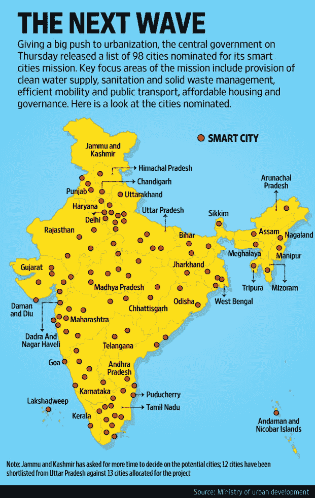
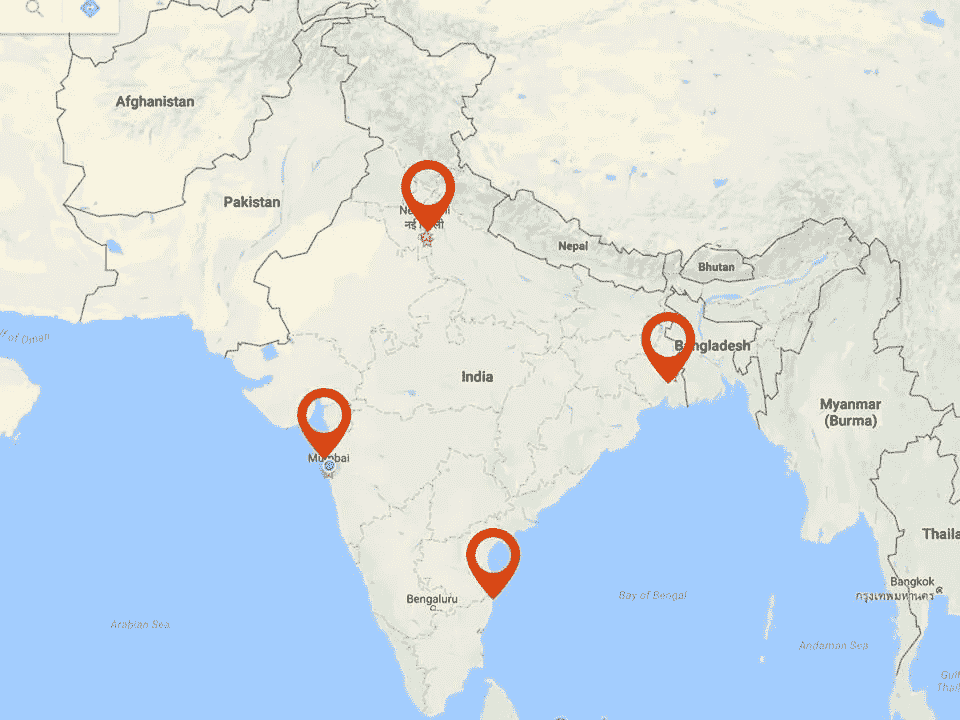
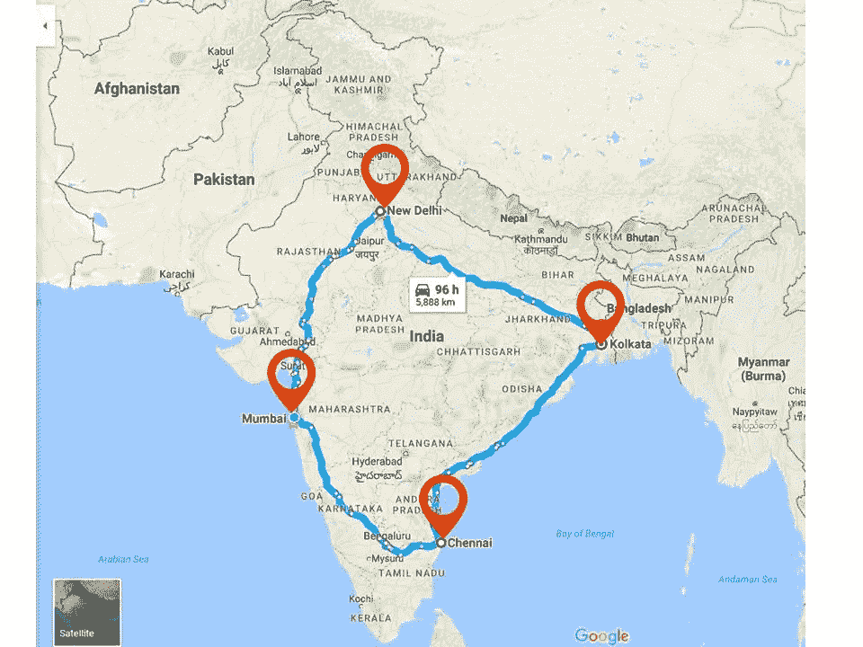
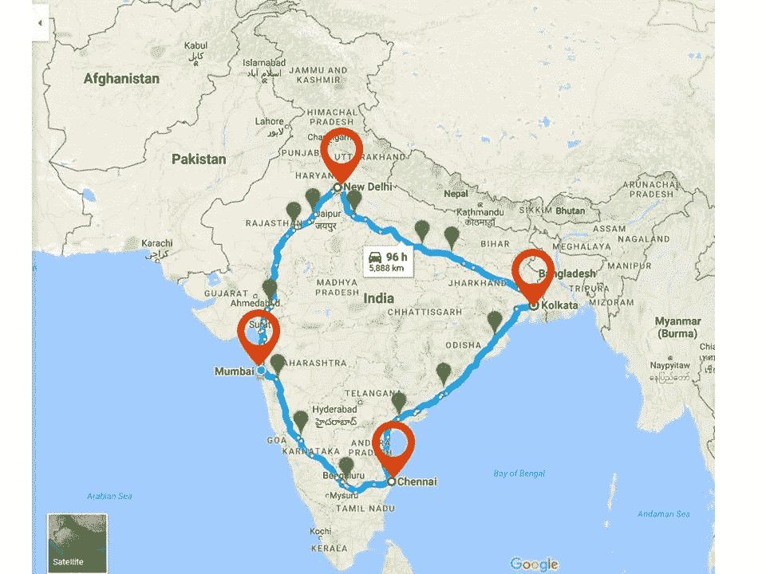
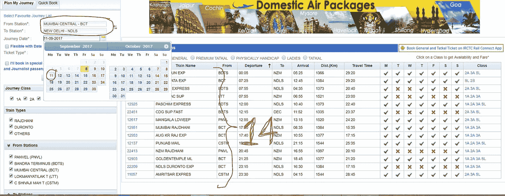
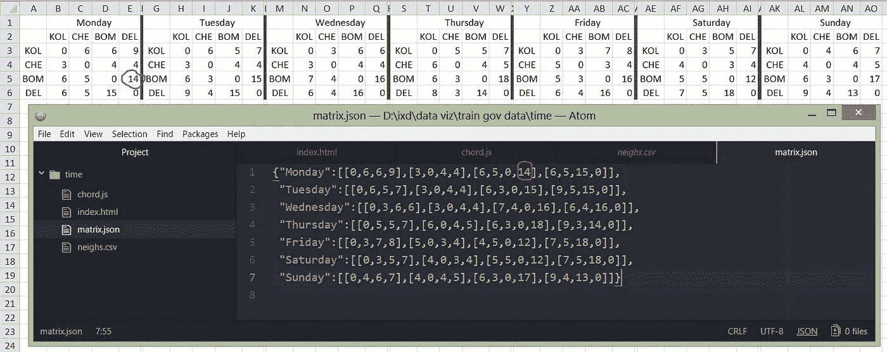
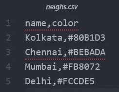

# 连接印度特大城市的列车数据可视化

> 原文：<https://towardsdatascience.com/data-visualization-of-trains-connecting-megacities-of-india-9af691684318?source=collection_archive---------14----------------------->

在过去的十年里，印度经历了前所未有的城市化发展。其中大部分是作为“智能城市任务”的一部分完成的，在该任务中，预计有 98 个城镇具有巨大的潜力，将被转化为智能城市。这些智能城市将配备最新的技术和创新解决方案，帮助市民引领未来。

当我们概述印度的地理环境时，我们看到了这个国家的纵向和横向延伸。这个国家有四个州府大城市。

Plotting megacities of India

这些特大城市位于该国的四个角落，形成一个四边形。

Connecting of the megacities

交通部门连接这些大城市的计划。最近，埃隆·马斯克(Elon Musk)的公司 Hyperloop 计划在全印度建立最快的公共交通网络。详情请查看他们的网站——https://hyperloopindia.in/

这是一个未来的项目，但截至 2017 年，印度公民只依赖印度铁路，因为它是长途运输中最便宜的方式。

Plotting the new upcoming smartcities dotting the paths connecting the megacities

这些特大城市将与散布在连接走廊上的小型智能城市连接在一起。

Abstracting the quadilateral into a circular visual mapping

从图表中我们可以看到，一个圆可以是一个很好的抽象形式，来形象化这些大小城市的地理位置。

Concept : Plotting according to the relative positions

我们需要将所有的点推出圆圈，但仍然基于它们的实际地理位置保持它们在圆圈上的相对位置。

Concept : Chord chart showing the flow from one megacity to the another

我们可以用多种方式来可视化数据流。但是在这种情况下，弦图似乎是最好的方法，因为它直观地告诉你不同站点之间的流量，以及每个站点的总体统计数据。

对于这个项目，我只对大城市进行了研究，而忽略了较小的智能城市。但是在未来，我想把他们也包括在这个可视化中。所以，我们去了加尔各答、钦奈、孟买和新德里，想象了来往的火车数量。

Finding the number of trains departing from megacities to megacities in all days of week

我首先将 irctc.co.in 中的数据手工制表到 excel 表格中(以便于制表)。你可以自由使用任何电子表格。在“irctc”中输入来源和目的地，然后逐一选择一周中的所有日子，并将其列表在电子表格中。在始发地和目的地相同的单元中，列车数量为零，因为我们看到的不是市内列车，而是城际列车

Converting the data from spreadsheet to a matrix format for vizualization

Assign colors to cities for vizualization

**和弦图可视化**

**点击下面的链接，看上面图表的互动版**

 [## 弦图

### 编辑描述

www.arkadesignstudio.in](http://www.arkadesignstudio.in/railway/index.html) 

**理解编码部分**

在一个文件夹中，您需要创建以下四个文件:

**chord . js**——处理可视化(画圆、圆弧等)、排版(CSS)、交互(工具提示信息、鼠标悬停动作等)

**index.html**—在 html 网页中嵌入不同的部分

**matrix.json** —包含以矩阵格式可视化的数据库

**neighs.csv** —包含分配给城市的颜色代码

为了便于设置，你可以将我的项目克隆/分支/下载到你的驱动器上，并上传到网络服务器上(D3 在离线模式下不工作)。

**项目链接如下图**
[https://github.com/arkamajhi/arkamajhi.github.io](https://github.com/arkamajhi/arkamajhi.github.io)

请随时**回复这篇博文**或直接给我回复关于这个研究项目的**建议**或关于任何**有趣项目的**信息**。**

读者好
我是 Arka Majhi，IIT 孟买 IDC 设计学科的硕士研究生。作为学术工作的一部分，我做了一个关于数据可视化的练习。这个故事是关于可视化的火车流穿过印度的大城市。

也可以看看我的作品集和资料库

**设计作品集**:[https://www.behance.net/arkamajhi4d63](https://www.behance.net/arkamajhi4d63)

**建筑作品集**:[http://spadelhi.org/arkamajhi/](http://spadelhi.org/arkamajhi/)

**工作室网站**:[http://arkadesignstudio.in/](http://arkadesignstudio.in/)

通过喜欢和张贴你对我的项目的建设性意见来支持我。提前感谢。将等待您的回复。