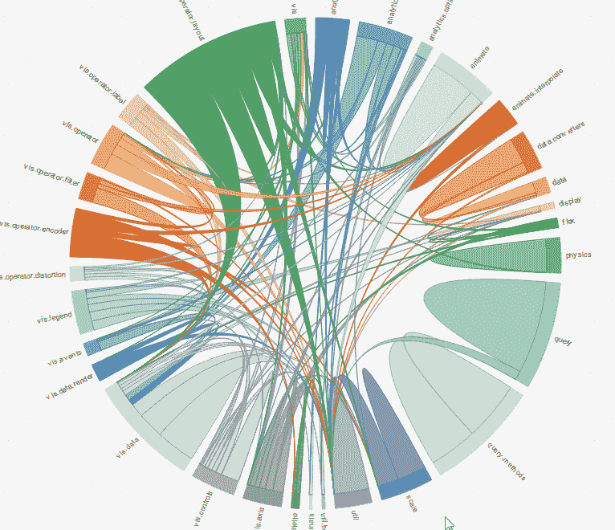

# 数据可视化状态 2019

> 原文：<https://towardsdatascience.com/data-visualization-state-2018-9cd9adb287e4?source=collection_archive---------11----------------------->

Photo by [Lukas Blazek](https://unsplash.com/@goumbik?utm_source=medium&utm_medium=referral) on [Unsplash](https://unsplash.com?utm_source=medium&utm_medium=referral)

作为 Sisense 的前端工程师，我需要使用数据可视化库构建多个组件。可视化库的存在是为了帮助我们理解复杂的想法。有大量的库选项可以在网上进行可视化。每一种都有自己的优点和缺点。在我看来，这里有五个最好的可视化库。

首先，我假设您已经知道 React 是什么。如果你对它不熟悉，简短的回答是 React 是一个用于构建用户界面的 JavaScript 库。如果你想要更长的答案，你可以在这里查看更多的。React 由脸书支持，是当今构建 UI 最流行的 Javascript 库。

# D3

d3 是一个基于数据操作文档的 javascript 库，这个库使用 web 标准并且是框架不可知的，这意味着 d 3 不关心你是否使用 React、 [Vue](https://vuejs.org/) 或任何其他 javascript 框架，D3 将在任何地方工作，为了证明我所说的，我用不同的库(React、Vue、 [Polymer](https://www.polymer-project.org/) )构建了 3 个应用程序，D3 在所有这些应用程序上都工作得完美无缺。

 [## d3React

### 用 D3 和 React 做的 App。

github.com](https://github.com/leofle/d3app2)  [## d3Vue

### 带有 D3 图形的 Vue 应用程序。

github.com](https://github.com/leofle/d3vue)  [## D3 聚合物

### 聚合物 3.0 应用程序与 D3 图。

github.com](https://github.com/leofle/d3polymer) 

D3 使用类似 jQuery 的选择器(对于像我这样的老开发者来说😉)来选择 DOM 元素，通常是 SVG，也可以是 canvas。D3 对 DOM 元素应用操作和事件。

D3 可以操作 DOM 元素，但是因为我们使用 React，React 由于其虚拟 DOM 而在呈现 DOM 方面表现出色，所以我们希望使用 React 来执行该任务。我们将只在计算中使用 D3。

D3 就像所有可视化库之母，不是因为它是最古老的，而是因为许多其他库都是基于 D3 的。这个库继续存在于所有的框架和库中，因为总会有人使用 D3 作为基础创建一个新的库。

D3 graph example

> 数据可视化的存在是为了帮助我们理解复杂的想法…

# 对…做出反应

React-vis 是由优步创建的 React 可视化库。有了它你可以轻松地创建常用图表，如****[**区域**](https://uber.github.io/react-vis/documentation/series-reference/area-series)**[**条形图**](https://uber.github.io/react-vis/documentation/series-reference/bar-series)[**饼形图**](https://uber.github.io/react-vis/documentation/other-charts/radial-chart)[**树形图**](https://uber.github.io/react-vis/documentation/other-charts/treemap)**[等等](https://uber.github.io/react-vis/documentation/series-reference/arc-series)。********

******React-vis example******

## ******GitHub stars:5520******

## ******为什么是这个图书馆？******

******React-vis 库非常容易安装和使用，它有很好的文档，并且由优步支持。事实上，优步是支持数据可视化库的最大公司，这是令人放心的，也是很好的了解。******

## ******还有什么可以更好的？******

******虽然这个库有一个丰富的 API，但是当我们想要添加特定的东西或者扩展它的时候有点困难。(当然可以送个先生！😉).******

************

******Photo by [Isaac Smith](https://unsplash.com/@isaacmsmith?utm_source=medium&utm_medium=referral) on [Unsplash](https://unsplash.com?utm_source=medium&utm_medium=referral)******

# ******Chart.js******

******很棒的库，更好的文档，轻量级，完全响应的图表。7 种图表，包括:条形图、气泡图、圆环图、折线图、极区图、雷达图、散点图。******

## ******GitHub stars:43182******

## ******为什么是这个图书馆？******

******尺寸！这个图书馆太小了！！只有 11kb 的 gzipped，在 web 开发规模如此重要的今天，没有比小型库更好的了。******

******使用原生 API，因此学习曲线很小甚至没有。******

## ******还有什么可以更好的？******

******如果有更多的图表和 svg 选项，这个库会更好。******

******Chart.js example******

# ******[VX](https://github.com/hshoff/vx)******

******这是一个很棒的库，展示了 React 和 D3 的强大功能，快速且轻量级。******

## ******GitHub stars:5965******

## ******为什么是这个图书馆？******

******伟大的 API，非常容易制作复杂的图形，vx 在很大程度上是不固执己见的，它提供的开箱即用的图形类型的数量令人难以置信。******

******VX example******

# ******重新 chart******

******基于 React 组件构建的可组合图表库，包含大量实例的优秀文档。******

## ********GitHub stars**:11482******

## ******为什么是这个图书馆？******

******小型库，也是可组合的，这意味着您可以在其上构建，并用新组件“组合”不同的图表。******

******Rechart example******

## ******那现在怎么办？******

******最后，我不得不说，所有这些库都很棒，它们之间的差异很小。它可以是库的大小，或者 API 的不同用法，当然，还有 GitHub 的受欢迎程度。但是最终，在开源世界中，我们知道最受欢迎的库将会更频繁地更新，并且会有一个很棒的社区来添加许多特性。******

******然而，我也鼓励你们所有人走出去，找到自己的梦想——甚至建造一个！D3 非常强大，允许你用自己的 JS 库包装它。然而，理想的情况是让 D3 进行计算，并让 JS 框架，无论你选择使用哪一个，来进行渲染。这样你就可以制作出令人难以置信的交互式图表。******