# 使用 Matplotlib 实现数据可视化

> 原文：<https://towardsdatascience.com/data-visualization-using-matplotlib-16f1aae5ce70?source=collection_archive---------1----------------------->

数据可视化是商业活动的一个重要部分，因为现在的组织收集了大量的数据。世界各地的传感器都在收集气候数据、用户点击数据、预测方向盘的汽车数据等。所有这些收集到的数据都包含了对企业的关键见解，可视化使这些见解易于解释。

> 数据只有呈现出来才是好的。

为什么可视化很重要？

可视化是分析和吸收信息最简单的方法。视觉有助于轻松理解复杂的问题。它们有助于识别数据中的模式、关系和异常值。它有助于更好、更快地理解业务问题。它有助于建立一个引人注目的视觉故事。从图像中收集的见解有助于制定企业战略。它也是探索性数据分析(EDA)和机器学习(ML)的许多高级数据分析的先驱。

> 人类是视觉动物。无数的研究表明，我们的大脑是如何适应视觉的，当它通过眼睛时，处理任何事情都更快。

> “即使您的角色不直接涉及数据科学的具体细节，了解数据可视化可以做什么以及它在现实世界中是如何实现的也是很有用的。”
> 
> -苎麻雅各布森

python 中的数据可视化可以通过许多包来完成。我们将讨论 matplotlib 包。它可以用于 Python 脚本、Jupyter notebook 和 web 应用服务器。

## Matplotlib

Matplotlib 是一个二维绘图库，有助于可视化图形。Matplotlib 模拟 Matlab 的图形和可视化。Matlab 不是免费的，难以扩展，并且作为一种编程语言是乏味的。因此，使用 Python 中的 matplotlib，因为它是一个用于数据可视化的健壮、免费和简单的库。

## Matplotlib 图形剖析

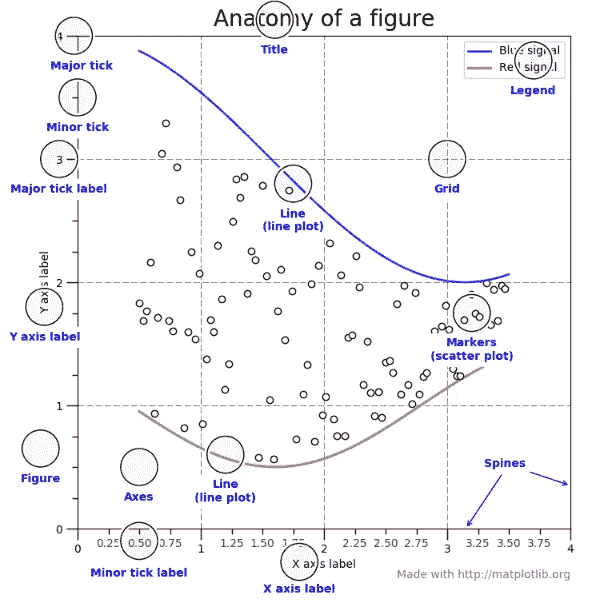

[Anatomy of Matpotlib](https://matplotlib.org/gallery/showcase/anatomy.html)

该图包含发生绘图的整个窗口，包含在该图中的是绘制实际图形的位置。每个轴都有一个 x 轴和 y 轴用于绘图。并且包含在轴内的是与每个轴相关联的标题、记号、标签。matplotlib 的一个重要特点是，我们可以在一个图形中包含多个轴，这有助于构建多个图，如下所示。在 matplotlib 中，pyplot 用于创建图形和改变图形的特征。

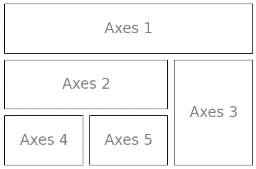

## 安装 Matplotlib

在 Jupyter 笔记本中键入`!pip install matplotlib`，或者如果在 cmd 中不起作用，则键入`conda install -c conda-forge matplotlib`。这在大多数情况下应该是可行的。

## 要遵循的东西

Matplotlib 的绘图相当容易。通常，在绘图时，他们在每个绘图中遵循相同的步骤。Matplotlib 有一个名为 pyplot 的模块，可以帮助绘制图形。Jupyter 笔记本用于运行图。我们`import matplotlib.pyplot as plt`称它为包模块。

*   使用 Pandas `pd.read_csv()`导入所需的库和数据集进行绘图
*   利用熊猫数据帧上的条件提取地块的重要部分。
*   `plt.plot()`对于绘制折线图，类似地，使用其他功能代替绘图。所有绘图函数都需要数据，数据通过参数在函数中提供。
*   `plot.xlabel , plt.ylabel`用于分别标注 x 轴和 y 轴。
*   `plt.xticks`、`plt.yticks`分别用于标注 x 轴和 y 轴观察刻度点。
*   `plt.legend()`用于表示观察变量。
*   `plt.title()`用于设置情节的标题。
*   `plot.show()`用于显示绘图。

## 柱状图

直方图接受一系列数据，并将这些数据划分为多个条块。然后，它绘制每个箱中的频率数据点(即点的间隔)。这有助于理解数据范围的计数。

**何时使用:**当我们需要一个图中变量的计数时，应该使用直方图。

商店里出售的特定游戏的数量。

从上面我们可以看到大峡谷游客的直方图。`plt.hist()`将第一个参数作为水平轴上的数字数据，即 GrandCanyon visitor.bins=10 用于在 GrandCanyon 的游客值之间创建 10 个箱。

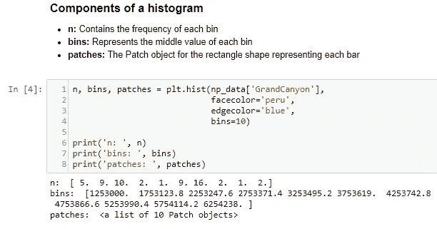

从上图中，我们可以看到构成直方图的分量，n 是直方图每个区间中的最大值，即 5、9 等等。

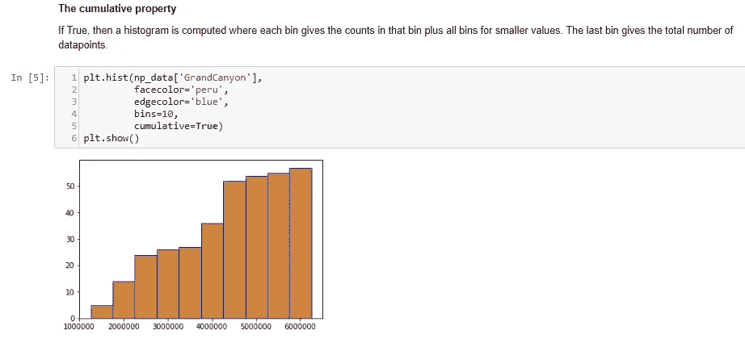

累积属性为我们提供了最终附加值，并帮助我们了解每个仓位的增值。

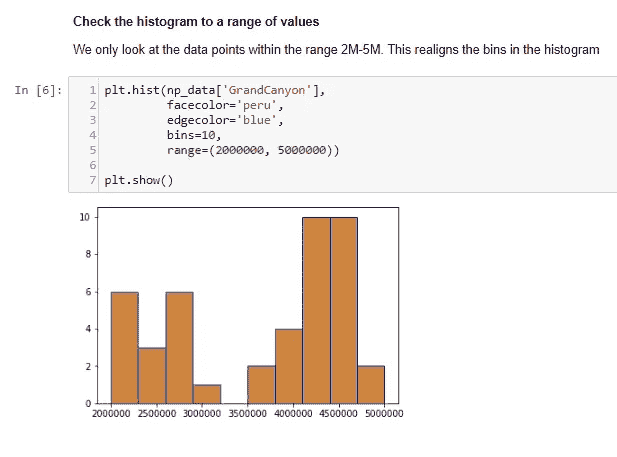

范围有助于我们理解指定值之间的值分布。

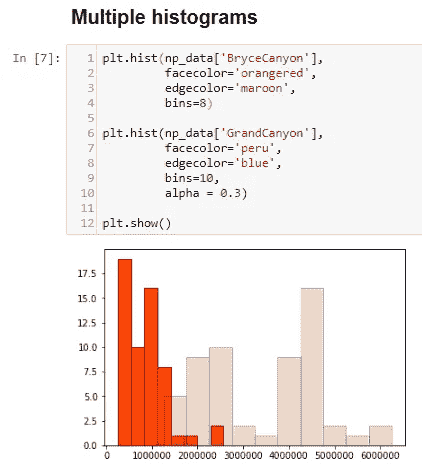

多个直方图有助于理解两个实体变量之间的分布。我们可以看到大峡谷比布莱斯峡谷有更多的游客。

**实现** : [直方图](https://nbviewer.jupyter.org/github/BadreeshShetty/Data-Visualization-using-Matplotlib/blob/master/%281%29Histograms.ipynb)

## 圆形分格统计图表

这是一个圆形图，它被分成几个部分来说明数字比例。饼图的切片是为了显示部分占整体的比例。

**何时使用:**饼图应该使用很少使用，因为很难比较图表的各个部分。使用柱状图代替，因为比较截面很容易。

电影的市场份额。

注意:[饼图不是一个很好的图表来说明信息](https://www.data-to-viz.com/caveat/pie.html)。

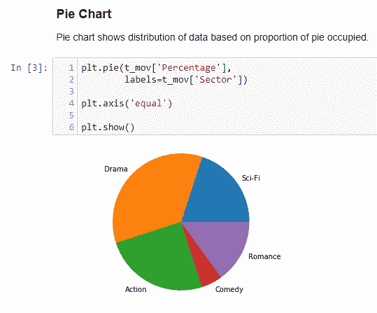

上面，`plt.pie()`将数字数据作为第一个参数，即百分比，将标签显示为第二个参数，即扇区。最终，它显示了数据在饼图中的比例分布。

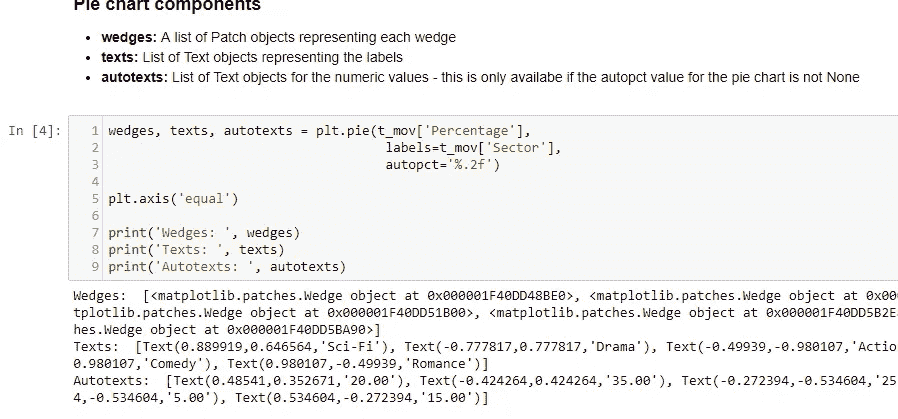

从上面我们可以看到构成饼图的组件，它返回楔形对象、标签中的文本等等。

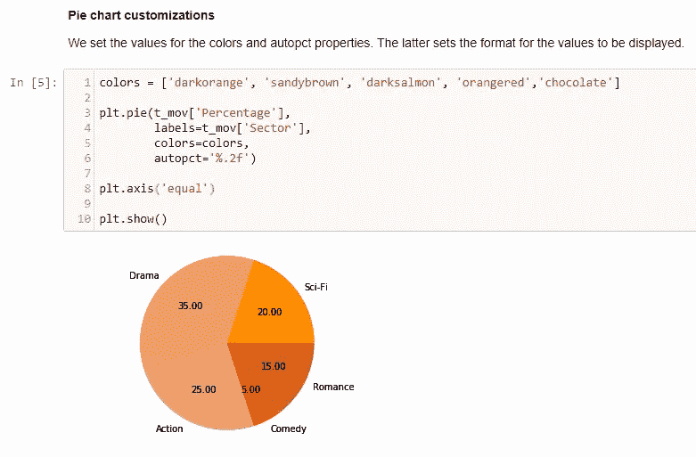

饼图可以很容易地定制，并从上面的颜色和标签值格式化。

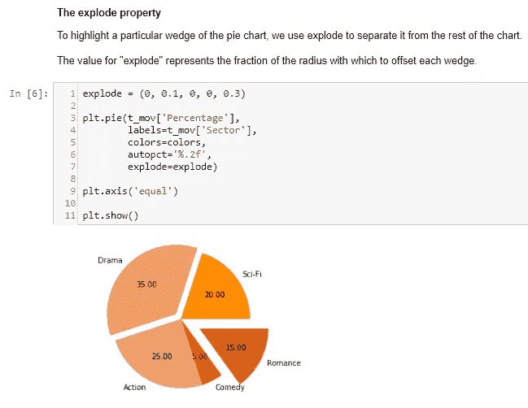

从上方分解用于从饼图中分离出点。就像切披萨一样。

**实现** : [饼状图](https://nbviewer.jupyter.org/github/BadreeshShetty/Data-Visualization-using-Matplotlib/blob/master/%282%29PieChart.ipynb)

## 时间序列线图

[时间序列](https://en.wikipedia.org/wiki/Time_series)是一个线形图，它基本上是用一条直线连接数据点。这有助于理解长期趋势。可以用趋势来解释点与点之间的相关性。上升趋势意味着正相关，下降趋势意味着负相关。它主要用于预测、监控模型。

**何时使用:**当要绘制单个或多个变量随时间的变化时，应使用时间序列。

公司的股票市场分析，天气预报。

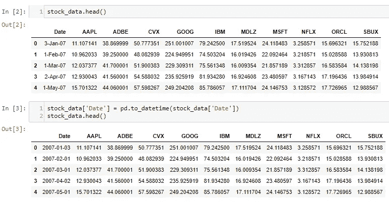

首先，将日期转换为 pandas DateTime，以便于绘制数据。

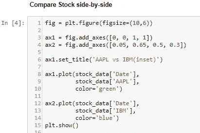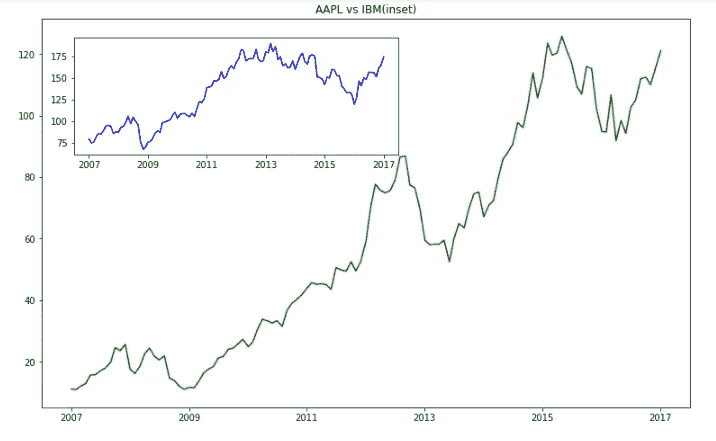

从上面看，`fig.add_axes`用于绘制画布。检查这个[add _ axes 和 add_subplot 有什么区别？](https://stackoverflow.com/questions/43326680/what-are-the-differences-between-add-axes-and-add-subplot)了解轴线和支线剧情。`plt.plot()`将第一个参数作为数字数据，即日期，第二个参数是数字股票数据。AAPL 股票被认为是 ax1，这是外部数字，而在 ax2 上，IBM 股票被认为是用于绘图，这是插图。

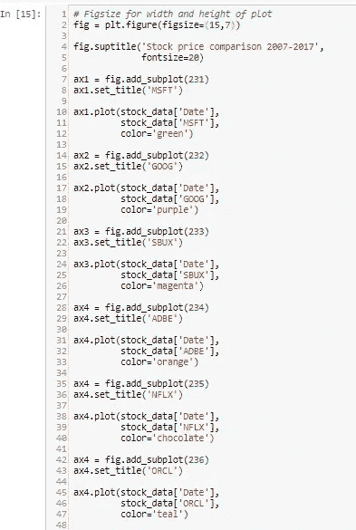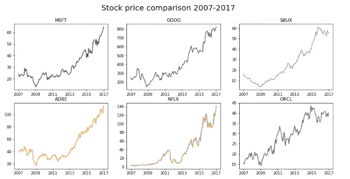

在前面的图中，add_axes 用于将轴添加到图形中，而从上面的 add_subplot 将多个 subplot 添加到图形中。无法完成，因为只有 6 个可能的支线剧情。

我们可以看到，科技公司的股票呈上升趋势，显示出交易员投资股票的积极结果。

**实施** : [时间序列](https://nbviewer.jupyter.org/github/BadreeshShetty/Data-Visualization-using-Matplotlib/blob/master/%283%29Time%20series.ipynb)

## 箱线图和紫线图

## 箱线图

箱线图很好地总结了这些数据。这有助于更好地理解我们的分布。

**何时使用:**当我们需要使用关于数据分布的整体统计信息时应该使用。它可用于检测数据中的异常值。

例如:客户的信用评分。我们可以获得关于标记的最大值、最小值和更多信息。

## 理解箱线图

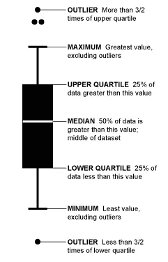

Source: [How to Read and Use a Box-and-Whisker Plot](https://flowingdata.com/2008/02/15/how-to-read-and-use-a-box-and-whisker-plot/)

在上图中，将方框分成两部分的线代表数据的中位数。方框的末端表示上四分位数(75%)，方框的起点表示下四分位数(25%)。上四分位数也称为第三四分位数，同样，下四分位数也称为第一四分位数。下四分位数和上四分位数之间的区域称为四分位数间范围(IQR ),用于估计中间数据的 50%分布(75–25 = 50%)。最大值是数据中的最高值，同样最小值是数据中的最低值，也称为上限。方框外以及最大值和最大值之间的点称为触须，它们显示数据中的值的范围。极值点是数据的异常值。一个常用的规则是，如果一个值小于下四分位数-1.5 * IQR 或大于上四分位数+ 1.5* IQR，则该值为异常值。

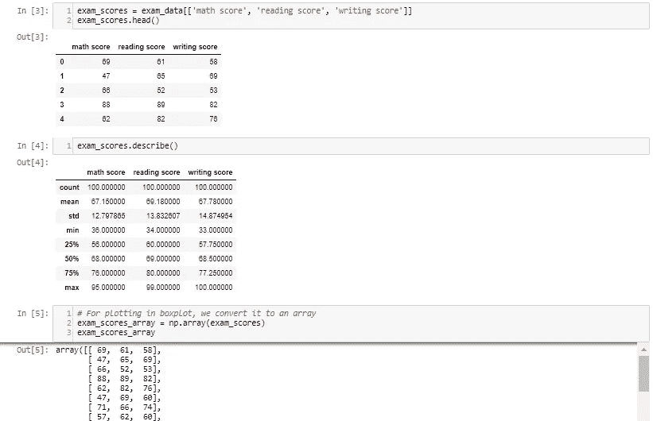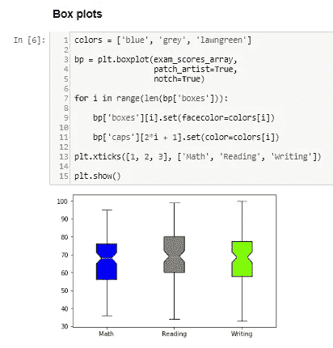

bp 包含盒状图组件，如盒、须、中线、帽。Seaborn 是另一个绘图库，它比 matplotlib 更容易构建自定义绘图。`patch_artist`使定制成为可能。`notch`让中间看起来更突出。

使用 boxplot 的一个注意事项是观测值中的唯一值没有定义，Seaborn 中的 Jitter Plot 可以克服这个注意事项，或者 Violinplot 也是有用的

## 小提琴情节

Violin plot 是比 boxplot 更好的图表，因为它对分布有更广泛的理解。它类似于一把小提琴，密集的区域表示更多的数据分布，否则会被箱线图所隐藏

**何时使用:**它是 boxplot 的扩展。当我们需要更直观地理解数据时，应该使用它。

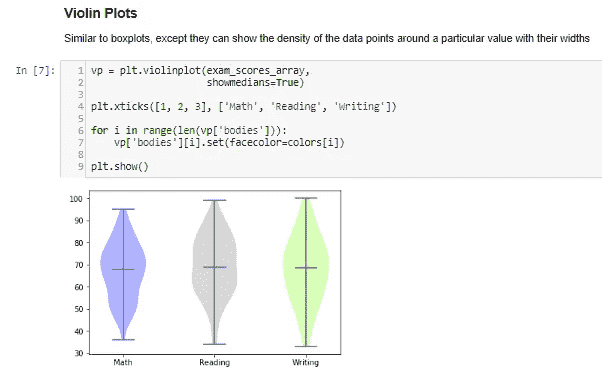

中间的分数密度似乎更大，因为学生在大多数科目上的得分都接近平均水平。

**实现**:[box plot&violin plot](https://nbviewer.jupyter.org/github/BadreeshShetty/Data-Visualization-using-Matplotlib/blob/master/%284%29Boxplot_Violinplot.ipynb)

## 双轴

双轴有助于可视化绘制相对于 y 轴和同一 x 轴的两个图。

**何时使用:**当我们需要两个图或同一方向的分组数据时使用。

例:人口，GDP 数据在同一个 x 轴(日期)。

## 在 y 轴和相同的 x 轴上绘制 2 个图

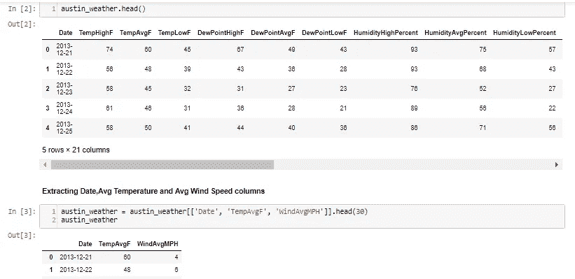

提取重要细节，即 x 轴的日期、TempAvgF 和不同 y 轴的 WindAvgMPH。

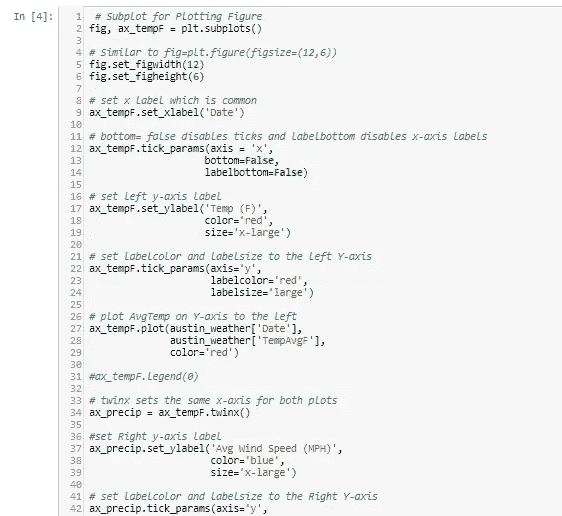

正如我们所知，只有一个轴，`twinx()`用于缠绕 x 轴，左边的 y 轴用于温度，右边的 y 轴用于风速。

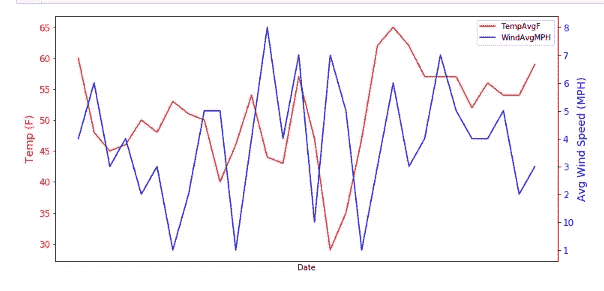

## 用不同的单位和相同的 x 轴绘制相同的数据

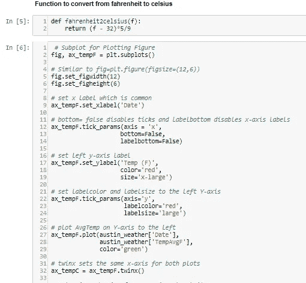

该函数定义为计算不同的数据单位，即从华氏温度转换为摄氏温度。

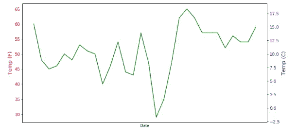

我们可以看到，左边的 y 轴标绘了华氏温度，右边的 x 轴标绘了摄氏温度。

**实现** : [双轴](https://nbviewer.jupyter.org/github/BadreeshShetty/Data-Visualization-using-Matplotlib/blob/master/%285%29TwinAxis.ipynb)

## 堆积图和茎图

## 堆叠图

堆栈图可视化堆栈中的数据，并显示数据随时间的分布。

**何时使用:**用于检查单个地块中的多个可变面积地块。

这有助于理解多个变量在一段时间内的分布变化。

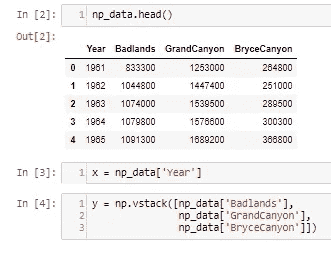

由于堆叠图需要堆叠，所以使用`np.vstack()`完成

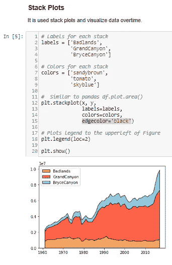

`plt.stackplot`接受第一个参数数字数据，即年份，第二个参数垂直堆叠数据，即国家公园。

## 百分比堆积图

类似于堆栈图，但每个数据都被转换为其所占分布的百分比。

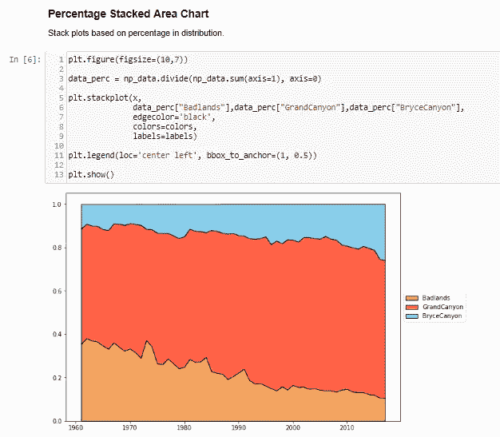

`data_prec`用于将总体百分比划分为单独的百分比分布。s= `np_data.sum(axis=1)`沿列计算总和，`np_data.divide(s,axis=0)`沿行划分数据。

## 茎图

Stemplot 甚至采用负值，因此差异是从数据中提取的，并随时间绘制。

**何时使用:**它类似于堆栈图，但区别有助于比较数据点。

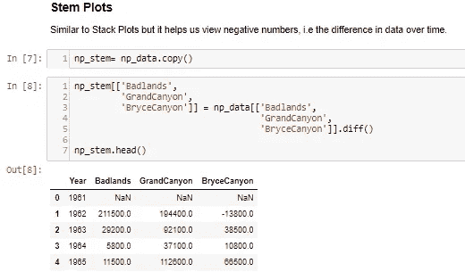

`diff()`用于查找以前的数据和存储在另一个副本中的数据之间的差异。第一个数据点是 NaN(不是数字),因为它不包含任何用于计算差值的先前数据。

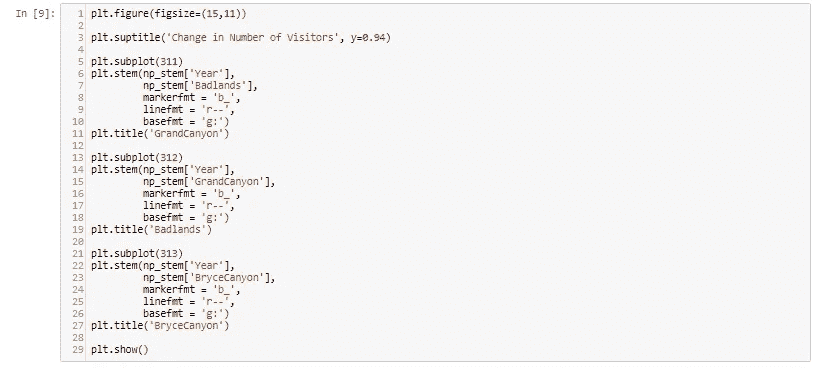

(31n)个子情节被创建以容纳图中的 3 行 1 列子情节。`plt.stem()`将第一个参数作为数字数据，即年份，将第二个参数作为国家公园游客的数字数据。

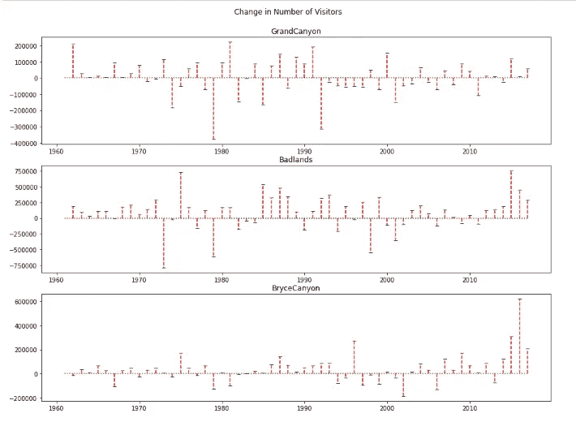

**实现:** [栈图&茎图](https://nbviewer.jupyter.org/github/BadreeshShetty/Data-Visualization-using-Matplotlib/blob/master/%286%29Stackplot_Stemplot.ipynb)

## 条形图

条形图显示了数据在几个组中的分布。它通常与直方图相混淆，直方图只采用数字数据进行绘制。它有助于比较多个数值。

**何时用**:用于多组比较时。

学生在考试中的分数。

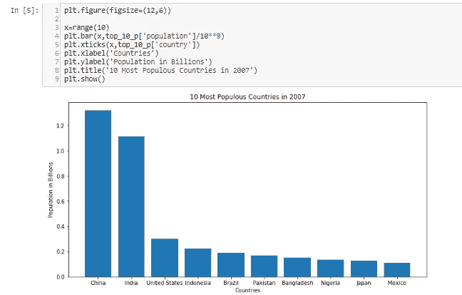

`plt.bar()`将第一个参数作为数字格式的标签，将第二个参数作为它所代表的值的标签。

**实现:** [柱状图](https://nbviewer.jupyter.org/github/BadreeshShetty/Data-Visualization-using-Matplotlib/blob/master/%287%29Barplot.ipynb)

## 散点图

散点图有助于可视化 2 个数字变量。它有助于确定数据与每个变量的关系，即相关性或趋势模式。它还有助于检测图中的异常值。

**何时使用**:用在回归之类的机器学习概念中，其中 x 和 y 是连续变量。它还用于聚类分散点或离群点检测。

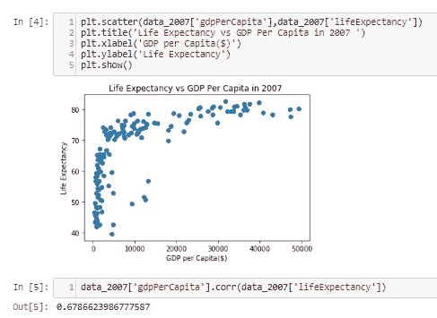

`plt.scatter()`采用 2 个数值参数来分散图中的数据点。它类似于线图，只是没有相连的直线。我们所说的相关性是指 GDP 与预期寿命的相关性，正如我们所看到的，这是正相关的，这意味着随着一个国家 GDP 的增加，预期寿命也会增加。

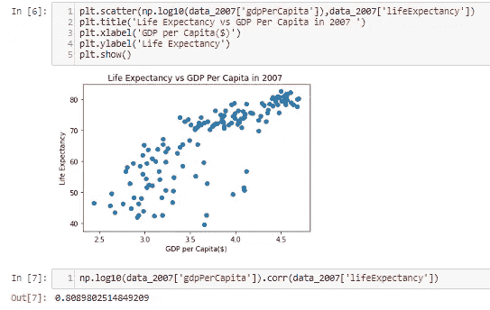

通过采用 GDP 的对数，我们可以有更好的相关性，因为我们可以更好地拟合点，它将 GDP 转换为对数标度，即 log(1000 美元)=3。

## 三维散点图

3D 散点图有助于在三维图中显示 3 个数值变量。

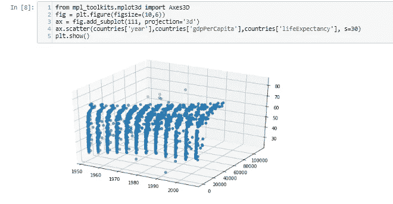

它类似于散点图，只是这次我们添加了 3 个数字变量。通过观察该图，我们可以推断，随着年份和 GDP 的增加，预期寿命也会增加。

**实现** : [散点图](https://nbviewer.jupyter.org/github/BadreeshShetty/Data-Visualization-using-Matplotlib/blob/master/%288%29Scatterplot.ipynb)

**在这个**[**Github Repo**](https://github.com/BadreeshShetty/Data-Visualization-using-Matplotlib)**中找到上面的代码。**

## 结论

总之，我们学习了如何使用一个数字变量和多个变量构建数据可视化图。我们现在可以很容易地构建图表，通过可视化直观地理解我们的数据。