# 使用 Seaborn 的数据可视化

> 原文：<https://towardsdatascience.com/data-visualization-using-seaborn-fc24db95a850?source=collection_archive---------3----------------------->


“turned on flat screen monitor” by [Chris Liverani](https://unsplash.com/@chrisliverani?utm_source=medium&utm_medium=referral) on [Unsplash](https://unsplash.com?utm_source=medium&utm_medium=referral)

我回来了，带着 seaborn 教程。上次我们学习了使用 Matplotlib 的[数据可视化。](http://www.themenyouwanttobe.com/data-visualization-using-matplotlib/)

Seaborn 是一个基于 matplotlib 的 Python 数据可视化库。它提供了一个高层次的界面来绘制有吸引力的和信息丰富的统计图形。

## 关键特征

*   Seaborn 是一个统计绘图库
*   它有漂亮的默认风格
*   它还被设计成能很好地处理熊猫数据帧对象。

## 安装和入门

要安装 seaborn 的最新版本，可以使用 pip:

**pip 安装 seaborn**

也可以使用 conda 安装发布版本:

**康达安装海博**

或者，您可以使用 pip 直接从 github 安装开发版本:

**pip 安装 git+https://github . com/mwaskom/seaborn . git**

另一个选择是克隆 github 库并从您的本地副本安装:

pip 安装。依赖 Python 2.7 或 3.5 以上版本

# 强制依赖项

numpy(> = 1 . 9 . 3)
scipy(>= 0 . 14 . 0)
matplotlib(>= 1 . 4 . 3)
熊猫(> = 0.15.2)

# 推荐的依赖项

统计模型(> = 0.5.0)

# 可选阅读

> **Testing**Testing
> 要测试 seaborn，在源码发布的根目录下运行 make test。这将运行单元测试套件(使用 pytest，但是许多旧的测试使用 nose asserts)。它还运行函数 docstrings 中的示例代码，对更广泛、更真实的示例用法进行冒烟测试。
> 全套测试需要一个互联网连接来下载示例数据集(如果它们之前没有被缓存)，但是单元测试应该可以离线运行。
> 
> **bug**
> 
> 请通过 github 问题跟踪器报告您遇到的任何错误。在一个示例数据集(通过 load_dataset()访问)中包含一个可重复的示例将会非常有帮助。如果不知道你正在使用的 seaborn 和 matplotlib 的版本，以及你正在使用什么样的 matplotlib 后端来绘制图形，很难调试任何问题，所以请在你的错误报告中包括这些内容。

**注意:本文假设您熟悉 python basic 和数据可视化。尽管如此，面对任何问题，评论或电子邮件给我你的问题。**

参考我们的— [使用 Matplotlib 进行数据可视化](http://www.themenyouwanttobe.com/data-visualization-using-matplotlib/)

[](https://www.amazon.in/Redmi-Pro-Gold-32GB-Storage/dp/B07DJHV6S7/ref=as_li_ss_tl?_encoding=UTF8&smid=A23AODI1X2CEAE&pf_rd_m=A1VBAL9TL5WCBF&pf_rd_s=&pf_rd_r=50K466P7CMTN9W8Q780N&pf_rd_t=36701&pf_rd_p=e1fc9d07-6588-4865-b544-7a2a6ae17329&pf_rd_i=desktop&linkCode=ll1&tag=themenyouwant-21&linkId=e7387d6c0ffdd6bd50b46b5d1358036b&language=en_IN) [## 红米 6 Pro(金色，3GB 内存，32GB 存储)

### Redmi 6 Pro(金色，3GB 内存，32GB 存储空间):亚马逊

www .亚马逊. in](https://www.amazon.in/Redmi-Pro-Gold-32GB-Storage/dp/B07DJHV6S7/ref=as_li_ss_tl?_encoding=UTF8&smid=A23AODI1X2CEAE&pf_rd_m=A1VBAL9TL5WCBF&pf_rd_s=&pf_rd_r=50K466P7CMTN9W8Q780N&pf_rd_t=36701&pf_rd_p=e1fc9d07-6588-4865-b544-7a2a6ae17329&pf_rd_i=desktop&linkCode=ll1&tag=themenyouwant-21&linkId=e7387d6c0ffdd6bd50b46b5d1358036b&language=en_IN) [](https://www.amazon.in/gp/product/9352135210/ref=as_li_ss_tl?ie=UTF8&pd_rd_i=9352135210&pd_rd_r=78c1d00c-dee3-11e8-b353-add13b1583b7&pd_rd_w=1ioa9&pd_rd_wg=ctqpm&pf_rd_m=A1VBAL9TL5WCBF&pf_rd_s=&pf_rd_r=50K466P7CMTN9W8Q780N&pf_rd_t=36701&pf_rd_p=6d72b06e-660a-431b-b792-d8ca3a121c2b&pf_rd_i=desktop&linkCode=ll1&tag=themenyouwant-21&linkId=7f475732e6079a0f7c3455271a79dc17&language=en_IN) [## 实践机器学习与 Scikit-Learn 和张量流:概念，工具和技术…

### 用 Scikit-Learn 和张量流实践机器学习:概念、工具和技术来建立…

www .亚马逊. in](https://www.amazon.in/gp/product/9352135210/ref=as_li_ss_tl?ie=UTF8&pd_rd_i=9352135210&pd_rd_r=78c1d00c-dee3-11e8-b353-add13b1583b7&pd_rd_w=1ioa9&pd_rd_wg=ctqpm&pf_rd_m=A1VBAL9TL5WCBF&pf_rd_s=&pf_rd_r=50K466P7CMTN9W8Q780N&pf_rd_t=36701&pf_rd_p=6d72b06e-660a-431b-b792-d8ca3a121c2b&pf_rd_i=desktop&linkCode=ll1&tag=themenyouwant-21&linkId=7f475732e6079a0f7c3455271a79dc17&language=en_IN) 

在[1]中:

```
import numpy as np
import pandas as pd
import seaborn as sns
import matplotlib.pyplot as plt
%matplotlib inline
```

在[2]中:

```
census_data = pd.read_csv('census_data.csv')
census_data.describe()
```

Out[2]:

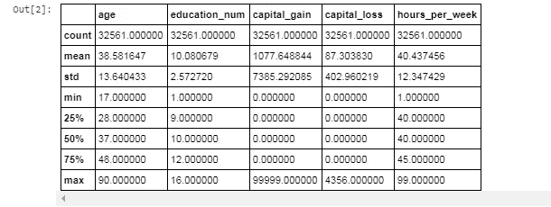

Figure 1

在[3]中:

```
census_data.head()
```

Out[3]:

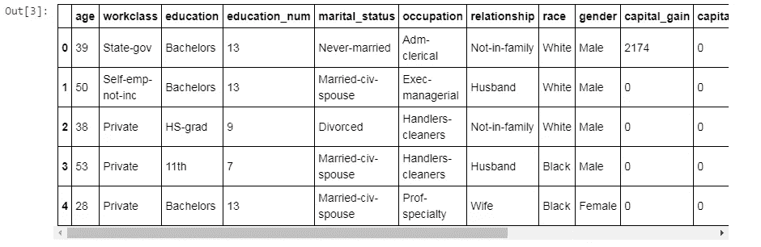

Figure 2

在[4]中:

```
census_data.info()
```

Out[4]:

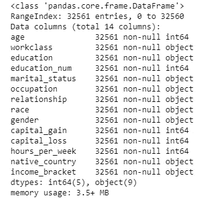

Figure 3

# 可视化统计关系

统计分析是一个了解数据集中的变量如何相互关联以及这些关系如何依赖于其他变量的过程。可视化可以是这一过程的核心组成部分，因为当数据被适当地可视化时，人类视觉系统可以看到指示关系的趋势和模式。

我们今天将讨论大多数的 seaborn 函数-

## 散点图

散点图是统计可视化的支柱。它使用点云来描述两个变量的联合分布，其中每个点代表数据集中的一个观察值。这种描绘允许眼睛推断关于它们之间是否有任何有意义的关系的大量信息。

在 seaborn 中绘制散点图有几种方法。当两个变量都是数字时，应该使用的最基本的函数是 scatterplot()函数。

在[5]中:

```
sns.scatterplot(x='capital_loss',y='capital_gain',data=census_data)
```

Out[5]:

```
<matplotlib.axes._subplots.AxesSubplot at 0xaafb2b0>
```

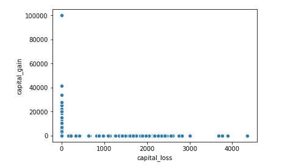

Figure 4

在[6]中:

```
sns.set(style="darkgrid")
tips = sns.load_dataset("tips")              *#tips is inbuild dataset in seaborn*
sns.relplot(x="total_bill", y="tip", data=tips);
```

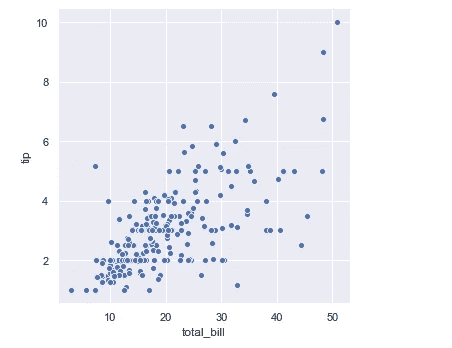

Figure 5

注意:散点图()是 relplot()中的默认种类(也可以通过设置 kind="scatter "来强制):

在[7]中:

```
*# adding some additional parameters*
sns.scatterplot(x='capital_loss',y='capital_gain',hue='marital_status',data=census_data)*# hue:  Can be either categorical or numeric, although color mapping will*
*#          behave differently in latter case.*
```

Out[7]:

```
<matplotlib.axes._subplots.AxesSubplot at 0xac406a0>
```

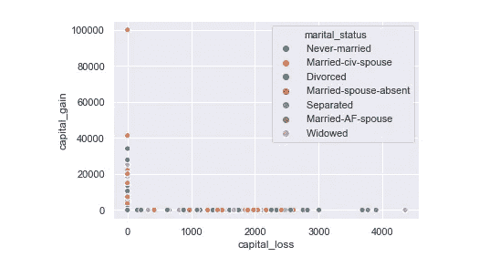

Figure 6

在[8]中:

```
sns.scatterplot(x='capital_loss',y='capital_gain',hue='marital_status',size='age',data=census_data)
```

Out[8]:

```
<matplotlib.axes._subplots.AxesSubplot at 0xadc95c0>
```

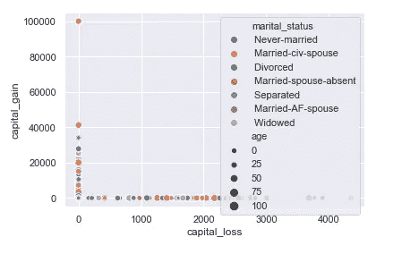

Figure 7

在[9]中:

```
*# As I said above the scatterplot() is the default kind in relplot() (it can also be forced by setting kind="scatter"):*
*# see difference*
sns.relplot(x='capital_loss',y='capital_gain',hue='marital_status',size='age',data=census_data)
```

Out[9]:

```
<seaborn.axisgrid.FacetGrid at 0xacdeb70>
```

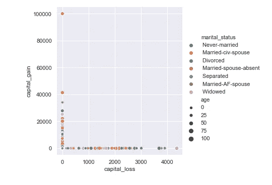

Figure 8

## 线形图

散点图非常有效，但是没有普遍最佳的可视化类型。相反，可视化表示应适应数据集的具体情况以及您试图通过绘图回答的问题。

对于某些数据集，您可能希望了解某个变量随时间的变化，或者类似的连续变量。在这种情况下，一个好的选择是画一个线图。在 Seaborn 中，这可以通过 lineplot()函数直接完成，或者通过设置 kind=" line ":

在[10]中:

```
df = pd.DataFrame(dict(time=np.arange(500),
                       value=np.random.randn(500).cumsum()))
g = sns.relplot(x="time", y="value", kind="line", data=df)
g.fig.autofmt_xdate()*"""*
*Figure-level interface for drawing relational plots onto a FacetGrid.**This function provides access to several different axes-level functions*
*that show the relationship between two variables with semantic mappings*
*of subsets. The ``kind`` parameter selects the underlying axes-level*
*function to use:**- :func:`scatterplot` (with ``kind="scatter"``; the default)*
*- :func:`lineplot` (with ``kind="line"``)*
*"""*
```

Out[10]:

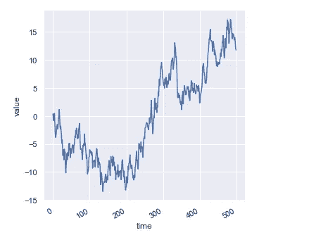

Figure 9

在[11]中:

```
age_vs_hours_per_week = sns.relplot(x="age", y="hours_per_week", kind="line", data=census_data
```

Out[11]:

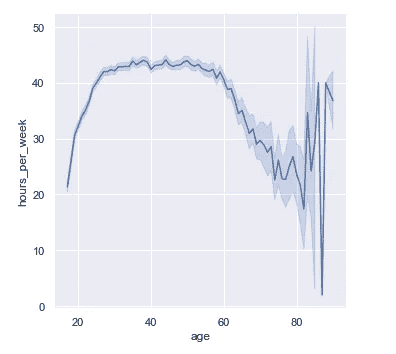

Figure 10

在[12]中:

```
age_vs_hours_per_week = sns.relplot(x="age", y="hours_per_week", kind="line",sort=**False**, data=census_data)
```

Out[12]:

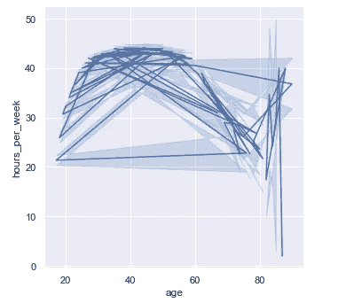

Figure 11

Lineplot()假设您经常尝试将 y 绘制为 x 的函数，默认行为是在绘制之前按 x 值对数据进行排序。但是，这可以禁用:

## 显示与方面的多重关系

我们在本教程中强调，虽然这些函数可以一次显示几个语义变量，但这样做并不总是有效。但是当你想了解两个变量之间的关系是如何依赖于一个以上的其他变量的时候呢？

最好的方法可能是制作一个以上的情节。因为 relplot()基于 FacetGrid，所以这很容易做到。要显示附加变量的影响，不要将其分配给图中的语义角色之一，而是使用它来“分面”可视化。这意味着您需要制作多个轴，并在每个轴上绘制数据子集:

在[13]中:

```
sns.relplot(x='capital_loss',y='capital_gain',hue='marital_status',size='age',col='gender',data=census_data)
```

Out[13]:

```
<seaborn.axisgrid.FacetGrid at 0xc8a1240>
```

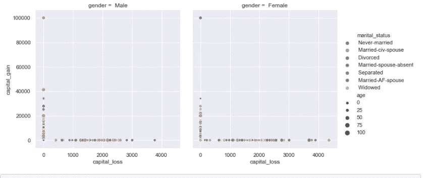

Figure 12

在[14]中:

```
sns.relplot(x='capital_loss',y='capital_gain',hue='marital_status',size='age',col='income_bracket',data=census_data)
```

Out[14]:

```
<seaborn.axisgrid.FacetGrid at 0xcdc25c0>
```

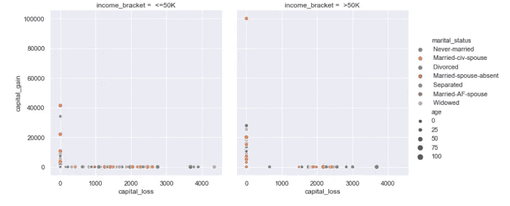

Figure 13

您也可以这样显示影响两个变量:一个通过列上的分面，一个通过行上的分面。当您开始向网格中添加更多变量时，您可能希望减小图形大小。请记住，FacetGrid 的大小由每个面的高度和纵横比来参数化:

在[15]中:

```
sns.relplot(x='capital_loss',y='capital_gain',hue='marital_status',size='age',col='income_bracket',row='race',height=5,data=census_data)
```

Out[15]:

```
<seaborn.axisgrid.FacetGrid at 0xcdc2320>
```

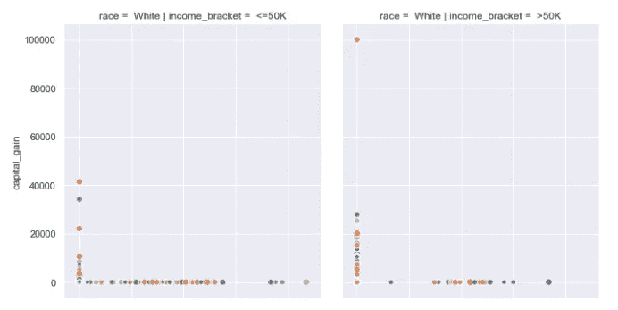

Figure 14

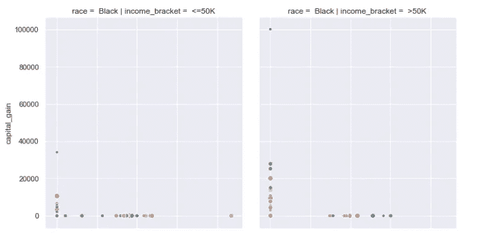

Figure 15

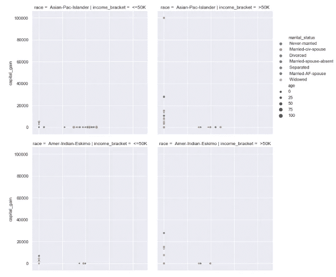

Figure 16

# 用分类数据绘图

在关系图教程中，我们看到了如何使用不同的可视化表示来显示数据集中多个变量之间的关系。在示例中，我们关注的是两个数值变量之间的主要关系。如果其中一个主要变量是“分类的”(被分成离散的组)，那么使用一种更专业的可视化方法可能会有所帮助。

在 seaborn 中，有几种不同的方法来可视化涉及分类数据的关系。类似于 relplot()与散点图()或线图()之间的关系，有两种方法可以制作这些图。有许多轴级别的函数可以以不同的方式绘制分类数据，还有一个图形级别的接口 catplot()，可以对它们进行统一的高级访问。

将不同的分类图种类看作属于三个不同的家族是有帮助的，我们将在下面详细讨论。它们是:

**分类散点图:**

> strip lot()(with kind = " strip "；
> 默认)【swarm plot】(with kind = " swarm ")

**分类分布图:**

> box plot()(with kind = " box ")
> violin plot()(with kind = " violin ")
> boxen plot()(with kind = " boxen ")

**分类估计图:**

> point plot()(with kind = " point ")
> bar plot()(with kind = " bar ")
> count plot()(with kind = " count ")

这些系列使用不同的粒度级别来表示数据。

catplot()中数据的默认表示使用散点图。在 seaborn 实际上有两个不同的分类散点图。他们采用不同的方法来解决用散点图表示分类数据的主要挑战，即属于一个类别的所有点将落在与分类变量对应的轴上的相同位置。stripplot()使用的方法(catplot()中的默认“种类”)是通过少量随机“抖动”来调整分类轴上的点的位置:

在[16]中:

```
sns.catplot(x="age",y="marital_status",data=census_data)
```

Out[16]:

```
<seaborn.axisgrid.FacetGrid at 0xdb18470>
```

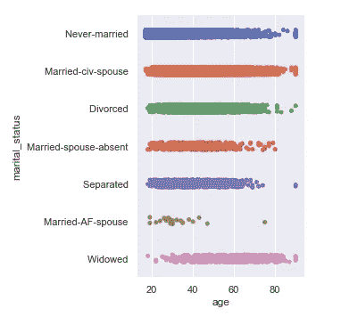

Figure 17

第二种方法使用防止点重叠的算法沿分类轴调整点。它可以更好地表示观察值的分布，尽管它只适用于相对较小的数据集。这种绘图有时称为“蜂群”，由 swarmplot()在 seaborn 中绘制，它是通过在 catplot()中设置 kind="swarm "来激活的:

在[27]中:

```
*#sns.catplot(x="age",y="relationship",kind='swarm',data=census_data)*
*#  or*
*#sns.swarmplot(x="relationship",y="age",data=census_data)*
sns.catplot(x="day", y="total_bill", kind="swarm", data=tips);
```

Out[27]:

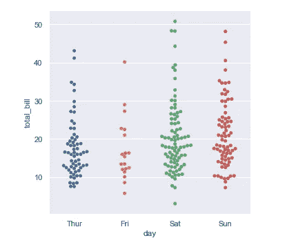

Figure 18

与关系图类似，可以通过使用色调语义向分类图添加另一个维度。(分类图目前不支持大小或样式语义)。每个不同的分类绘图函数以不同的方式处理色调语义。对于散点图，只需改变点的颜色:

在[29]中:

```
sns.catplot(x="day", y="total_bill", hue="sex", kind="swarm", data=tips);
```

Out[29]:

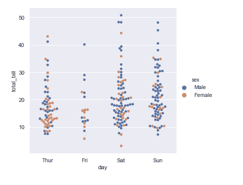

Figure 19

## 箱形图

首先是大家熟悉的 boxplot()。这种图显示了分布的三个四分位值以及极值。“触须”延伸到位于上下四分位数 1.5 IQRs 内的点，然后独立显示超出该范围的观察值。这意味着箱线图中的每个值对应于数据中的一个实际观察值。

在[32]中:

```
sns.catplot(x="age",y="marital_status",kind='box',data=census_data)
```

Out[32]:

```
<seaborn.axisgrid.FacetGrid at 0xd411860>
```

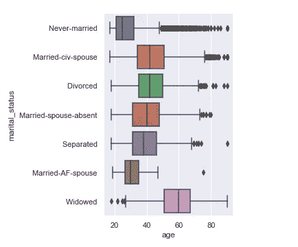

Figure 20

添加色调语义时，语义变量的每个级别的框将沿分类轴移动，这样它们就不会重叠:

在[37]中:

```
sns.catplot(x="age",y="marital_status",kind='box',hue='gender',data=census_data)
```

Out[37]:

```
<seaborn.axisgrid.FacetGrid at 0xde8a8d0>
```

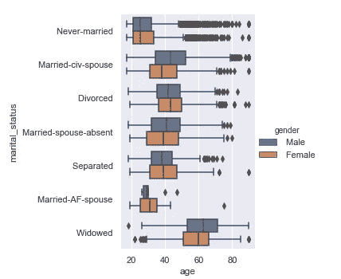

Figure 21

## 小提琴情节

另一种方法是 violinplot()，它将箱线图与分布教程中描述的核密度估计过程结合起来:

在[38]中:

```
sns.catplot(x="age",y="marital_status",kind='violin',data=census_data)
```

Out[38]:

```
<seaborn.axisgrid.FacetGrid at 0x184c4080>
```

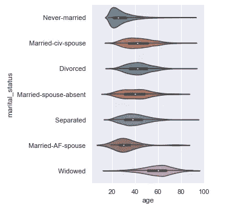

Figure 22

这种方法使用核密度估计来提供对值分布的更丰富的描述。此外，箱线图中的四分位数和 whikser 值显示在 violin 内部。缺点是，因为 violinplot 使用了 KDE，所以有一些其他参数可能需要调整，相对于简单的箱线图增加了一些复杂性:

在[41]中:

```
sns.catplot(x="age",y="marital_status",kind='violin',bw=.15, cut=0,data=census_data)
```

Out[41]:

```
<seaborn.axisgrid.FacetGrid at 0xfdea320>
```

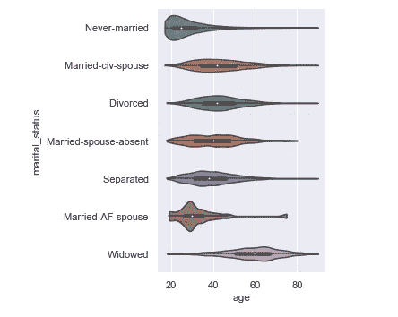

Figure 23

# 类别内的统计估计

对于其他应用程序，您可能希望显示值的集中趋势的估计值，而不是显示每个类别中的分布。Seaborn 有两种主要方式来显示这些信息。重要的是，这些函数的基本 API 与上面讨论的 API 是相同的。

## 条形图

实现这一目标的常见绘图样式是条形图。在 seaborn 中，barplot()函数对完整数据集进行操作，并应用一个函数来获得估计值(默认情况下取平均值)。当每个类别中有多个观察值时，它还使用 bootstrapping 来计算估计值周围的置信区间，并使用误差线绘制:

在[46]中:

```
sns.catplot(x="income_bracket",y="age",kind='bar',data=census_data)
```

Out[46]:

```
<seaborn.axisgrid.FacetGrid at 0x160588d0>
```

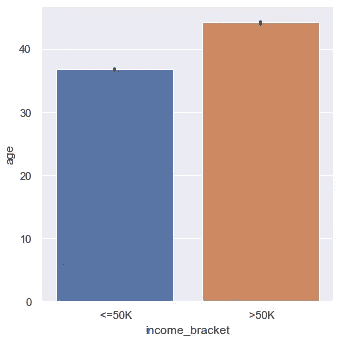

Figure 24

在[47]中:

```
sns.catplot(x="income_bracket",y="age",kind='bar',hue='gender',data=census_data)
```

Out[47]:

```
<seaborn.axisgrid.FacetGrid at 0xdf262e8>
```

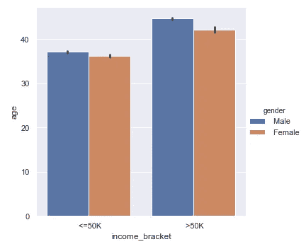

Figure 25

条形图的一个特殊情况是，您希望显示每个类别中的观察值数量，而不是计算第二个变量的统计值。这类似于分类变量而非定量变量的直方图。在 seaborn 中，使用 countplot()函数很容易做到这一点:

在[61]:

```
ax = sns.catplot(x='marital_status',kind='count',data=census_data,orient="h")
ax.fig.autofmt_xdate()
```

Out[61]:

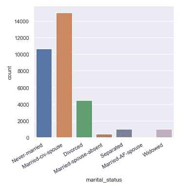

Figure 26

## 点图

pointplot()函数提供了可视化相同信息的另一种方式。该函数也用另一个轴上的高度对估计值进行编码，但它不是显示一个完整的条形图，而是绘制点估计值和置信区间。此外，pointplot()连接来自同一色调类别的点。这样就很容易看出主要关系是如何随着色调语义的变化而变化的，因为你的眼睛非常善于捕捉斜率的差异:

在[67]:

```
ax = sns.catplot(x='marital_status',y='age',hue='relationship',kind='point',data=census_data)
ax.fig.autofmt_xdate()
```

Out[67]:

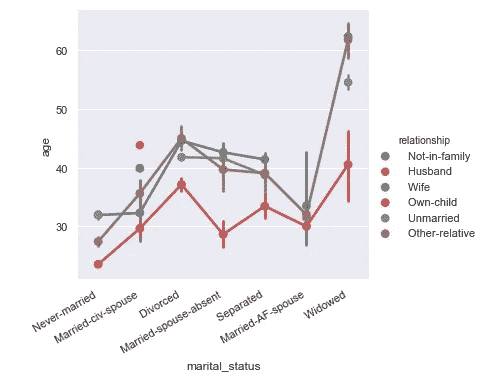

Figure 27

# 显示与方面的多重关系

就像 relplot()一样，catplot()建立在 FacetGrid 上的事实意味着很容易添加分面变量来可视化更高维的关系:

在[78]:

```
sns.catplot(x="age", y="marital_status", hue="income_bracket",
            col="gender", aspect=.6,
            kind="box", data=census_data);
```

out[78]:

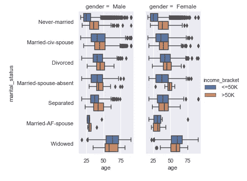

Figure 28

[](https://www.amazon.in/gp/product/8193245202/ref=as_li_ss_tl?ie=UTF8&pd_rd_i=8193245202&pd_rd_r=78c1d00c-dee3-11e8-b353-add13b1583b7&pd_rd_w=1ioa9&pd_rd_wg=ctqpm&pf_rd_m=A1VBAL9TL5WCBF&pf_rd_s=&pf_rd_r=50K466P7CMTN9W8Q780N&pf_rd_t=36701&pf_rd_p=6d72b06e-660a-431b-b792-d8ca3a121c2b&pf_rd_i=desktop&linkCode=ll1&tag=themenyouwant-21&linkId=830d111966f700de39f4da335646e83e&language=en_IN) [## 编写面试问题

### 在亚马逊上以最优惠的价格在线预定编码面试问题

www .亚马逊. in](https://www.amazon.in/gp/product/8193245202/ref=as_li_ss_tl?ie=UTF8&pd_rd_i=8193245202&pd_rd_r=78c1d00c-dee3-11e8-b353-add13b1583b7&pd_rd_w=1ioa9&pd_rd_wg=ctqpm&pf_rd_m=A1VBAL9TL5WCBF&pf_rd_s=&pf_rd_r=50K466P7CMTN9W8Q780N&pf_rd_t=36701&pf_rd_p=6d72b06e-660a-431b-b792-d8ca3a121c2b&pf_rd_i=desktop&linkCode=ll1&tag=themenyouwant-21&linkId=830d111966f700de39f4da335646e83e&language=en_IN) [](https://www.amazon.in/gp/product/9351107280/ref=as_li_ss_tl?ie=UTF8&pd_rd_i=9351107280&pd_rd_r=78c1d00c-dee3-11e8-b353-add13b1583b7&pd_rd_w=1ioa9&pd_rd_wg=ctqpm&pf_rd_m=A1VBAL9TL5WCBF&pf_rd_s=&pf_rd_r=50K466P7CMTN9W8Q780N&pf_rd_t=36701&pf_rd_p=6d72b06e-660a-431b-b792-d8ca3a121c2b&pf_rd_i=desktop&linkCode=ll1&tag=themenyouwant-21&linkId=ea6045b0df68ca9a7c6c6176c53817a8&language=en_IN) [## 用 R 动手编程:编写你自己的函数和模拟

### Amazon.in - Buy 与 R 一起动手编程:以最优惠的价格在网上编写自己的函数和模拟书籍…

www .亚马逊. in](https://www.amazon.in/gp/product/9351107280/ref=as_li_ss_tl?ie=UTF8&pd_rd_i=9351107280&pd_rd_r=78c1d00c-dee3-11e8-b353-add13b1583b7&pd_rd_w=1ioa9&pd_rd_wg=ctqpm&pf_rd_m=A1VBAL9TL5WCBF&pf_rd_s=&pf_rd_r=50K466P7CMTN9W8Q780N&pf_rd_t=36701&pf_rd_p=6d72b06e-660a-431b-b792-d8ca3a121c2b&pf_rd_i=desktop&linkCode=ll1&tag=themenyouwant-21&linkId=ea6045b0df68ca9a7c6c6176c53817a8&language=en_IN) [](https://www.amazon.in/gp/product/9332552363/ref=as_li_ss_tl?ie=UTF8&pd_rd_i=9332552363&pd_rd_r=78c1d00c-dee3-11e8-b353-add13b1583b7&pd_rd_w=1ioa9&pd_rd_wg=ctqpm&pf_rd_m=A1VBAL9TL5WCBF&pf_rd_s=&pf_rd_r=50K466P7CMTN9W8Q780N&pf_rd_t=36701&pf_rd_p=6d72b06e-660a-431b-b792-d8ca3a121c2b&pf_rd_i=desktop&linkCode=ll1&tag=themenyouwant-21&linkId=bd492e127284082b0be2349a6405e710&language=en_IN) [## 有效的 Python 1: 59 编写更好的 Python 的具体方法

### Amazon.in - Buy 有效的 Python 1: 59 在印度以最优惠的价格编写更好的 Python 书籍的具体方法

www .亚马逊. in](https://www.amazon.in/gp/product/9332552363/ref=as_li_ss_tl?ie=UTF8&pd_rd_i=9332552363&pd_rd_r=78c1d00c-dee3-11e8-b353-add13b1583b7&pd_rd_w=1ioa9&pd_rd_wg=ctqpm&pf_rd_m=A1VBAL9TL5WCBF&pf_rd_s=&pf_rd_r=50K466P7CMTN9W8Q780N&pf_rd_t=36701&pf_rd_p=6d72b06e-660a-431b-b792-d8ca3a121c2b&pf_rd_i=desktop&linkCode=ll1&tag=themenyouwant-21&linkId=bd492e127284082b0be2349a6405e710&language=en_IN) 

# **全文上** [**下**](http://www.themenyouwanttobe.com/data-visualization-using-seaborn/) **…**

> 要分叉，这个笔记本去 [GitHub](https://github.com/themenyouwanttobe/Data-Visualization/blob/master/Seaborn/Data%20Visualization%20with%20Seaborn.ipynb) 。

如果你喜欢这篇文章，请与他人分享。

谢谢~