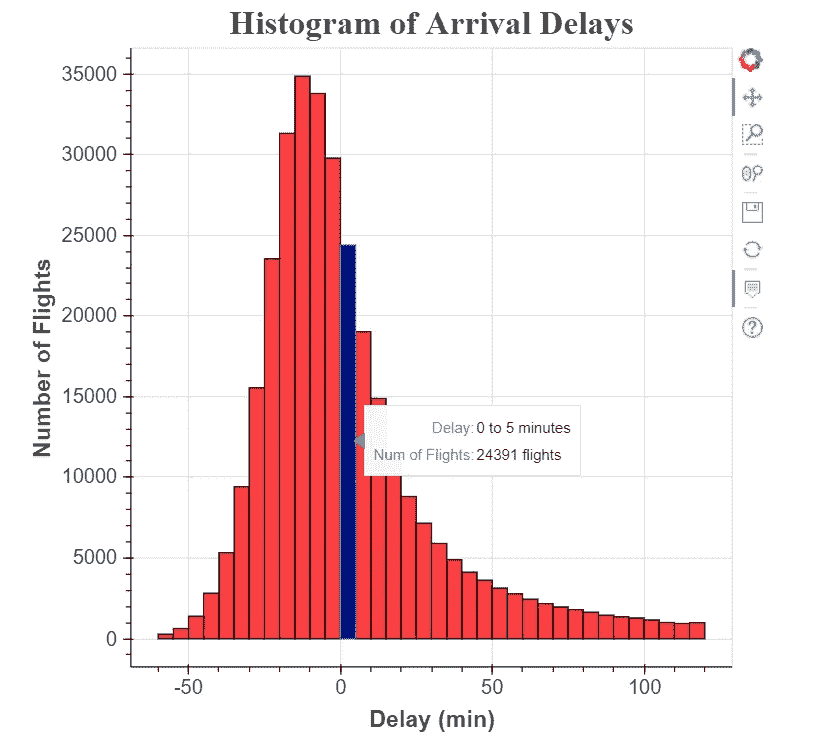
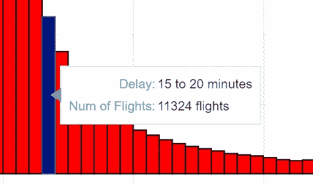
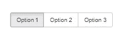
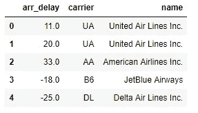
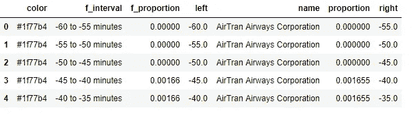
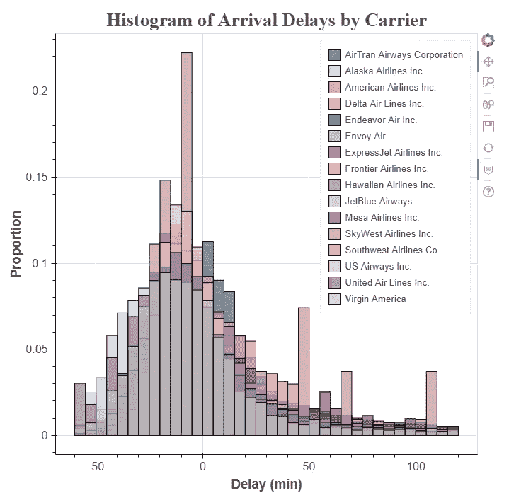
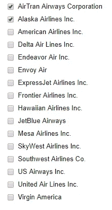
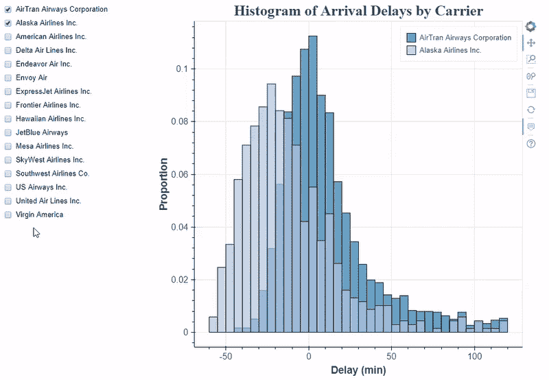
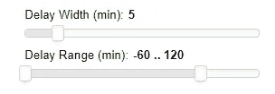

# 使用 Python 中的散景进行数据可视化，第二部分:交互

> 原文：<https://towardsdatascience.com/data-visualization-with-bokeh-in-python-part-ii-interactions-a4cf994e2512?source=collection_archive---------0----------------------->


**超越静态图**

在本系列的[第一部分](/data-visualization-with-bokeh-in-python-part-one-getting-started-a11655a467d4)中，我们在[散景](https://bokeh.pydata.org/en/latest/)中创建了一个基本的直方图，这是一个强大的 Python 可视化库。最终结果显示了 2013 年从纽约市出发的航班的到达延迟分布，如下所示(带有漂亮的工具提示！):



这张图表完成了工作，但它并不是很吸引人！观众可以看到航班延误的分布几乎是正常的(有轻微的正偏差)，但他们没有理由花超过几秒钟的时间看这个数字。

如果我们想创建更引人入胜的可视化，我们可以允许用户通过交互自己探索数据。例如，在这个直方图中，一个有价值的特性是能够选择特定的航空公司进行比较，或者可以选择改变条块的宽度，以便更详细地检查数据。幸运的是，这两个功能我们都可以使用散景添加到现有的绘图之上。直方图的最初发展可能看起来涉及到一个简单的绘图，但现在我们看到了使用像散景这样强大的库的好处！

这个系列的所有代码[都可以在 GitHub](https://github.com/WillKoehrsen/Bokeh-Python-Visualization/tree/master/interactive) 上获得。我鼓励任何人查看它的所有数据清理细节(数据科学中令人乏味但必要的部分),并对代码进行实验！(对于交互式散景图，我们仍然可以使用 Jupyter 笔记本来显示结果，或者我们可以编写 Python 脚本并运行散景服务器。对于开发，我通常在 Jupyter 笔记本上工作，因为它更容易快速迭代和改变情节，而不必重启服务器。然后我移动到一个服务器来显示最终结果。你可以在 GitHub 上看到独立的脚本和完整的笔记本。)

# 积极互动

在散景中有两类交互:被动和主动。第一部分介绍的被动交互也被称为检查器，因为它们允许用户更详细地检查图形，但不改变显示的信息。一个例子是当用户将鼠标悬停在数据点上时出现的工具提示:



Tooltip, a passive interactor

第二类交互称为主动交互，因为它改变了图上显示的实际数据。这可以是从选择数据的子集(例如特定的航空公司)到改变多项式回归拟合的程度的任何事情。在 Bokeh 中有多种类型的[主动交互，但这里我们将重点放在所谓的“小部件”上，这些部件可以点击，并让用户控制情节的某些方面。](https://bokeh.pydata.org/en/latest/docs/user_guide/interaction.html)



Example of Widgets (dropdown button and radio button group)

当我查看图表时，我喜欢玩主动交互([比如 FlowingData](http://flowingdata.com/2018/01/23/the-demographics-of-others/) 上的那些)，因为它们允许我自己探索数据。我发现自己从数据中发现结论(在设计师的指导下)比从完全静态的图表中发现结论更有洞察力。此外，给用户一些自由，允许他们带着稍微不同的解释离开，这可以产生关于数据集的有益讨论。

# 互动大纲

一旦我们开始添加主动交互，我们需要超越单行代码，进入封装特定动作的功能。对于散景小部件交互，有三个主要功能需要实现:

*   `make_dataset()`格式化要显示的具体数据
*   `make_plot()`用指定的数据绘制图形
*   `update()` 根据用户选择更新情节

## 格式化数据

在绘制图表之前，我们需要规划出将要显示的数据。对于我们的交互式直方图，我们将为用户提供三个可控参数:

1.  显示的航空公司(代码中称为承运人)
2.  图上的延迟范围，例如:-60 到+120 分钟
3.  直方图框的宽度，默认为 5 分钟

对于为绘图生成数据集的函数，我们需要允许指定这些参数中的每一个。为了通知我们将如何在我们的`make_dataset`函数中转换数据，让我们加载所有相关的数据并进行检查。



Data for histogram

在这个数据集中，每一行都是一个单独的航班。`arr_delay`栏是以分钟为单位的航班到达延迟(负数表示航班提前)。在第一部分中，我们做了一些数据探索，知道有 327，236 个航班的最小延迟为-86 分钟，最大延迟为+1272 分钟。在`make_dataset`功能中，我们希望根据数据框中的`name`列选择航空公司，并通过`arr_delay`列限制航班。

为了生成直方图的数据，我们使用 numpy 函数`histogram`,它计算每个面元中数据点的数量。在我们的例子中，这是每个指定的延误间隔中的航班数量。对于第一部分，我们为所有航班制作了一个直方图，但现在我们将按每个承运人制作。由于每个承运人的航班数量差异很大，我们可以按比例而不是原始数量显示延误。也就是说，图上的高度对应于特定航空公司的所有航班在相应仓中有延迟的部分。为了从数量到比例，我们将数量除以航空公司的总数量。

下面是创建数据集的完整代码。该函数接收我们想要包含的载波列表、要绘制的最小和最大延迟以及以分钟为单位的指定 bin 宽度。

(我知道这是一个关于散景的帖子，但是没有格式化的数据是无法做出图形的，所以我附上了演示我的方法的代码！)

对所有载体运行该功能的结果如下:



提醒一下，我们使用散景`quad`字形来制作直方图，所以我们需要提供字形的左、右和顶部(底部固定为 0)。这些分别在`left`、`right`和`proportion`栏中。颜色列为每个载体提供了独特的颜色，而`f_`列为工具提示提供了格式化的文本。

下一个要实现的功能是`make_plot`。该函数应接受一个 column data source[(Bokeh 中用于绘图的特定类型的对象)](https://bokeh.pydata.org/en/latest/docs/reference/models/sources.html)，并返回绘图对象:

如果我们传入一个包含所有航空公司的源，该代码会给出以下图表:



这个直方图非常混乱，因为在同一张图上有 16 家航空公司！如果我们想比较航空公司，由于信息重叠，这几乎是不可能的。幸运的是，我们可以添加一些小部件来使情节更加清晰，并实现快速比较。

## 创建小部件交互

一旦我们在散景中创建了一个基本图形，通过小部件添加交互就相对简单了。我们想要的第一个小部件是一个选择框，允许查看者选择要显示的航空公司。这个控件将是一个复选框，允许尽可能多的选择，在 Bokeh 中称为`CheckboxGroup.`来制作选择工具，我们导入`CheckboxGroup`类并创建一个带有两个参数的实例，`labels`:我们希望显示在每个框旁边的值和`active`:被选中的初始框。下面是为所有运营商创建一个`CheckboxGroup`的代码。

```
from bokeh.models.widgets import CheckboxGroup# Create the checkbox selection element, available carriers is a  
# list of all airlines in the data
carrier_selection = CheckboxGroup(labels=available_carriers, 
                                  active = [0, 1])
```



CheckboxGroup widget

散景复选框中的标签必须是字符串，而有效值是整数。这意味着在图像中,“穿越航空公司”映射到活动值 0，而“阿拉斯加航空公司”映射到活动值 1。当我们想要将选中的复选框与航空公司匹配时，我们需要确保找到与选中的*整数*有效值相关联的*字符串*名称。我们可以使用小部件的`.labels`和`.active` 属性来做到这一点:

```
# Select the airlines names from the selection values
[carrier_selection.labels[i] for i in carrier_selection.active]**['AirTran Airways Corporation', 'Alaska Airlines Inc.']**
```

在制作了选择小部件之后，我们现在需要将选中的航空公司复选框链接到图表上显示的信息。这是使用 CheckboxGroup 的`.on_change`方法和我们定义的`update`函数来完成的。更新函数总是采用三个参数:`attr, old, new`并根据选择控件更新绘图。我们改变图表上显示的数据的方法是改变我们传递给`make_plot`函数中的字形的数据源。这听起来可能有点抽象，所以这里有一个`update`函数的例子，它改变直方图以显示所选的航空公司:

```
# Update function takes three default parameters
def update(attr, old, new):
    # Get the list of carriers for the graph
    carriers_to_plot = [carrier_selection.labels[i] for i in 
                        carrier_selection.active] # Make a new dataset based on the selected carriers and the 
    # make_dataset function defined earlier
    new_src = make_dataset(carriers_to_plot,
                           range_start = -60,
                           range_end = 120,
                           bin_width = 5) # Update the source used in the quad glpyhs
    src.data.update(new_src.data)
```

这里，我们根据从 CheckboxGroup 中选择的航空公司检索要显示的航空公司列表。这个列表被传递给`make_dataset`函数，该函数返回一个新的列数据源。我们通过调用`src.data.update`并传递来自新源的数据来更新字形中使用的源的数据。最后，为了将`carrier_selection`小部件中的更改链接到`update`函数，我们必须使用`.on_change` 方法(称为[事件处理程序](https://bokeh.pydata.org/en/latest/docs/user_guide/interaction/widgets.html))。

```
# Link a change in selected buttons to the update function
carrier_selection.on_change('active', update)
```

每当选择或取消选择一个不同的航线时，这个函数就调用 update 函数。最终结果是，直方图上只绘制了与所选航空公司相对应的图示符，如下所示:



## 更多控件

现在我们知道了创建控件的基本工作流程，我们可以添加更多的元素。每次，我们创建一个小部件，编写一个更新函数来改变绘图上显示的数据，并用一个事件处理程序将更新函数链接到小部件。我们甚至可以对多个元素使用相同的更新函数，方法是重写该函数，从小部件中提取我们需要的值。为了练习，我们将添加两个额外的控件:一个滑块，用于选择直方图的框宽度；一个 RangeSlider，用于设置要显示的最小和最大延迟。下面是制作这两个小部件和新的更新功能的代码:

标准滑块和范围滑块如下所示:



如果需要，除了使用更新功能显示的数据之外，我们还可以更改绘图的其他方面。例如，要更改标题文本以匹配框的宽度，我们可以:

```
# Change plot title to match selection
bin_width = binwidth_select.value
p.title.text = 'Delays with %d Minute Bin Width' % bin_width
```

在散景中还有许多其他类型的交互，但是现在，我们的三个控件允许用户在图表上尽情“玩”！

# 把所有的放在一起

我们互动剧情的所有元素都已就位。我们有三个必要的函数:`make_dataset`、`make_plot`和`update`来根据控件和小部件本身改变情节。我们通过定义布局将所有这些元素连接到一个页面上。

```
from bokeh.layouts import column, row, WidgetBox
from bokeh.models import Panel
from bokeh.models.widgets import Tabs# Put controls in a single element
controls = WidgetBox(carrier_selection, binwidth_select, range_select)

# Create a row layout
layout = row(controls, p)

# Make a tab with the layout 
tab = Panel(child=layout, title = 'Delay Histogram')
tabs = Tabs(tabs=[tab])
```

我将整个布局放在一个选项卡上，当我们制作一个完整的应用程序时，我们可以将每个图放在一个单独的选项卡上。所有这些工作的最终结果如下:


你可以在 [GitHub](https://github.com/WillKoehrsen/Bokeh-Python-Visualization/tree/master/interactive/exploration) 上随意查看代码和情节。

# 下一步措施和结论

本系列的下一部分将着眼于我们如何制作一个包含多个情节的完整应用程序。我们将能够在服务器上显示我们的工作，并在浏览器中访问它，创建一个完整的仪表板来探索数据集。

我们可以看到最后的互动剧情比原著有用多了！现在，我们可以比较航空公司之间的延迟，并改变箱的宽度/范围，以查看分布是如何受到影响的。增加交互性提高了绘图的价值，因为它增加了与数据的接触，并允许用户通过自己的探索得出结论。尽管设置初始情节很复杂，但我们看到了如何轻松地向现有图形添加元素和控制小部件。与 matplotlib 等快速简单的工具相比，使用 Bokeh 等较重的绘图库的好处是绘图和交互的可定制性。不同的可视化库有不同的优势和用例，但是当我们想要增加额外的交互维度时，散景是一个很好的选择。希望在这一点上，你有足够的信心开始开发自己的可视化，并请分享你创造的任何东西！

我欢迎反馈和建设性的批评，可以通过 Twitter [@koehrsen_will](https://twitter.com/koehrsen_will) 联系到我。