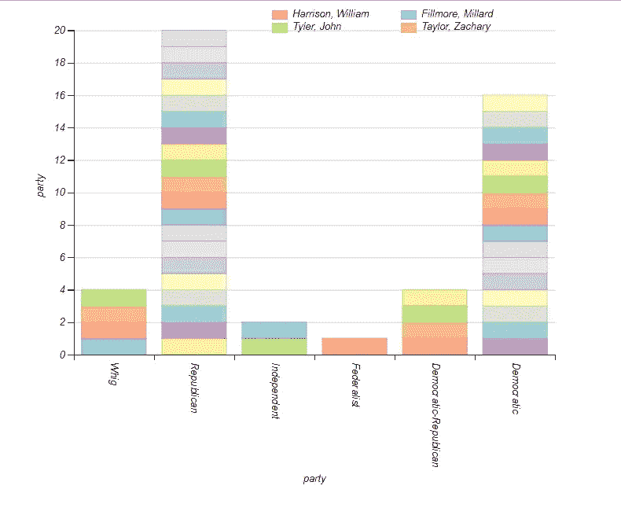
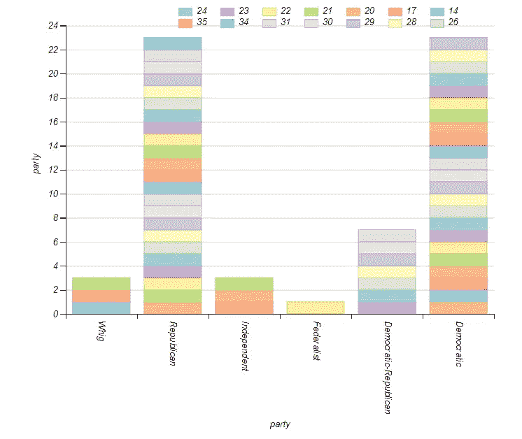
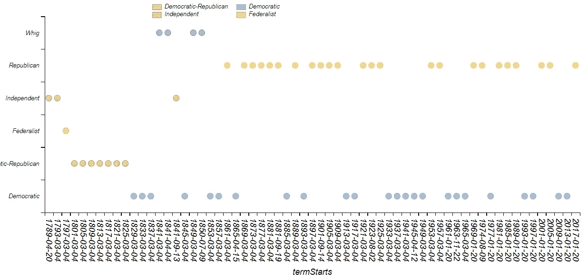

# 用 D3.js 和 Dimple 实现数据可视化

> 原文：<https://towardsdatascience.com/data-visualization-with-d3-js-dimple-be001bca3499?source=collection_archive---------7----------------------->

## 周五开源培训:第 9 卷

这个星期，我决定我需要可以在浏览器上看到的高质量的图表。我还想用最少的代码来完成这一切，我想强迫自己开始挖掘用 D3 呈现浏览器端数据的能力。

这些图表需要满足很多要求。但我最想要的是能够快速部署。学习的时间结束了，现在是交付的时候了。

由于我是一名 [D3.js](https://d3js.org/) 新手，我需要一种方法在短短几天内制作出一些一流的图形。之前用过 [C3.js](http://c3js.org/) ，很喜欢。但是我想要看起来和感觉上有点不同的东西。我从不满足于让事情变得简单。

## 嘿酒窝！😏

我发现这个整洁的图书馆叫做[酒窝](http://dimplejs.org/)。在使用它之前，我就爱上了它。医生很棒，而且马上就觉得很有趣。它还兼容最新版本的 D3，这很好，因为我想使用不会被废弃的库*。*

关于 Dimple 的理念，我最喜欢的部分是，它是为了利用 D3 而构建的，而不是在最终用户和底层框架之间创建某种“保护层”。

**例如，**在写这篇文章之前，我不知道 D3 有自己的 HTTP 请求工具。如果你碰巧运行着一个*代理服务器*(阅读[这篇文章](https://medium.com/@adwilson0286/access-control-allow-origin-fury-7053938f929a)了解你应该运行的原因)，这可以完美地工作，D3 可以为你获取各种各样的好东西，而不需要任何其他库的帮助。

## 潜入水中🏊

我在 Reddit 上找到了一个很酷的美国总统数据集。我将会用它来制作一些非常有用的图表。我从来没有真正考虑过“总统”的位子。这个名字最初是为了让担任这个职位的人看起来没有首相或国王这样的头衔重要。这个想法似乎最终没有按计划实现，因为它让这项工作看起来不那么宏伟。这些小项目的副作用是收集有时有用，有时不那么有用的琐事知识。

# 代码挑战！

*使用上面列出的美国总统数据集，创建显示以下项目的图表:*

*   哪一个政党拥有最多的独特总统？
*   哪个政党担任总统的任期最长？
*   哪个政党的连续选举次数最多
*   哪个政党的连续选举频率最高？

**查看我的解套码**，查看[这个回购](https://github.com/aptlyundecided/learn_d3/tree/master/challenges/9)。

## **先做什么？1️⃣**

我想看看哪个政党有最多的候选人赢得总统选举的柱状图。不是谁任期最多，而是哪个政党有最独特的总统。

Y axis plotted by ‘Title’ which is last name, first name.

有意思！与民主党总统相比，我们多了四位共和党总统。*注意:*有四位“民主-共和”总统，但我忽略了那个字段，因为我不知道它意味着什么！因为它包含了两个名字，让我们考虑 a 类清洗。

Organized By Term (presidents chronological number)

尽管共和党拥有最独特的头衔持有人，但民主党拥有相同数量的任期！我不会猜到的。但是这里又出现了奇怪的民主-共和分类。在 2017 年，这个概念似乎很陌生。

我快速查了一下维基百科。原来民主共和党(由杰斐逊创建)出现在民主党、共和党甚至辉格党之前！奇怪！

## 让我们检查一下连续术语

Party victory organized by start of term

民主党和共和党以 7 个连续任期保持了最高的连续胜利数！这是一个单一政党的 28 年。现在我想知道，在如此长的时间里，他们的平均立法是有效还是无效。但是我从这个图表中可以得出的另一个结论是，共和党人连续当选的频率最高。

## 结论

酒窝很牛逼。尽管它非常简单，但我需要多加练习。最近我喜欢上了 [Seaborn](https://seaborn.pydata.org/) 和 [Bokeh](https://bokeh.pydata.org/en/latest/) 。但是对于我现在正在做的一个项目来说，我需要一个不需要 Django 框架就可以在浏览器中做任何事情的东西。

看来我不能离开你。😍