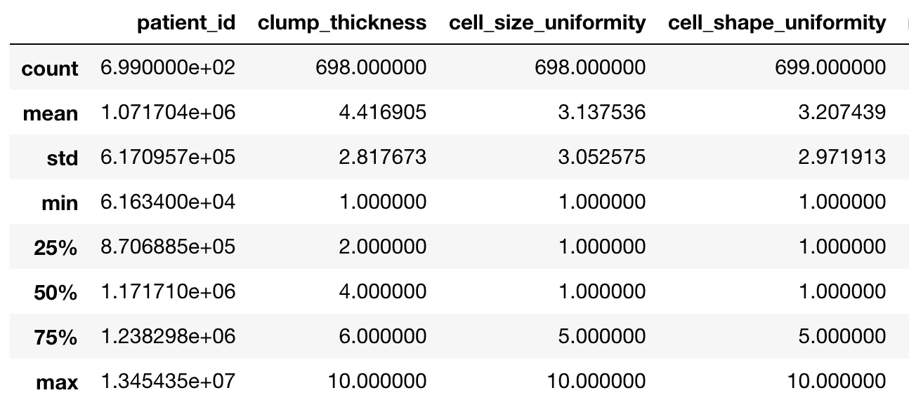
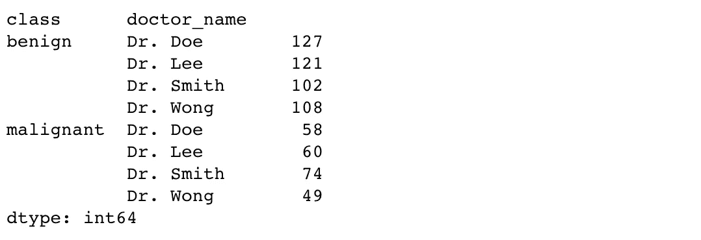
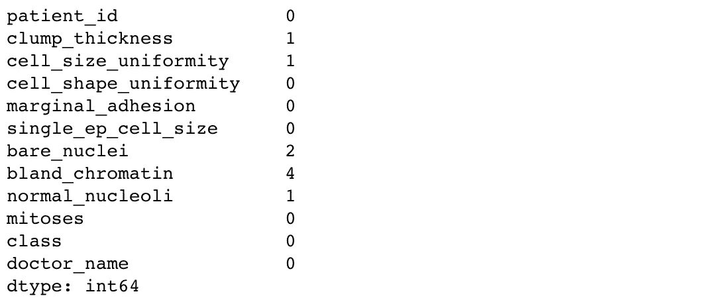
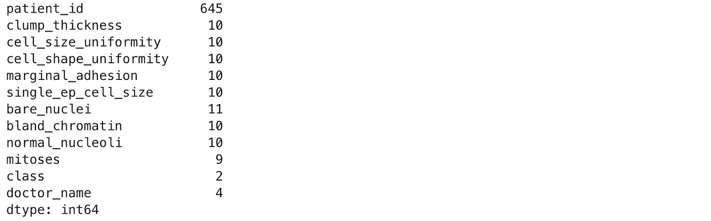
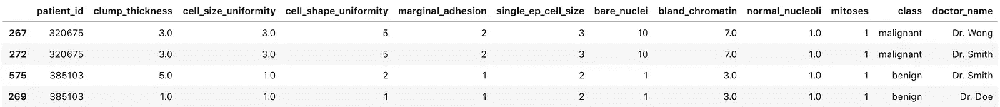
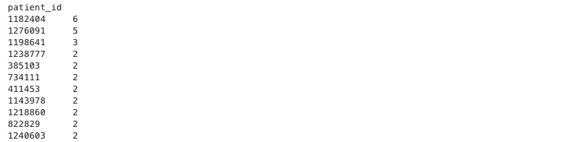
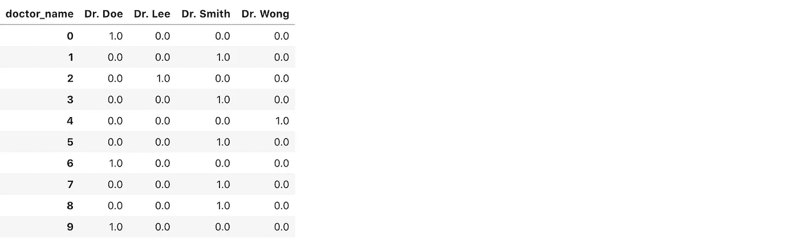
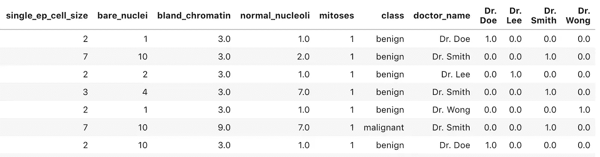

# 与熊猫的数据争论

> 原文：<https://towardsdatascience.com/data-wrangling-with-pandas-5b0be151df4e?source=collection_archive---------3----------------------->


“panda eating bamboo” by [Jay Wennington](https://unsplash.com/@jaywennington?utm_source=medium&utm_medium=referral) on [Unsplash](https://unsplash.com?utm_source=medium&utm_medium=referral)

互联网的巨大资源使我进入数据科学的旅程成为可能。《T2 数据科学杂志》将它定义为几乎所有与数据有关的事物。在工作中，这意味着使用数据通过增加价值对组织产生影响。最常见的是使用和应用数据来解决复杂的业务问题。数据科学工作中最常见的步骤之一是数据争论。以下是如何使用[熊猫](https://pandas.pydata.org/pandas-docs/stable/)库在 python 中探索、操作和重塑数据的简明指南。

我们将探索一个乳腺癌数据集(鸣谢: [UCI](https://archive.ics.uci.edu/ml/datasets/breast+cancer+wisconsin+(original)) )，并使用熊猫来清理、重塑、按摩并给我们一个干净的数据集，所有这些都将有助于大幅提高我们数据的质量。**注:**数据质量是机器学习算法实现最佳性能的**关键**。

> 如果你想继续下去，看看 [GitHub](https://github.com/moeraza/pandas_data_wrangling) repo 页面，尝试使用[数据集](https://github.com/moeraza/pandas_data_wrangling/blob/master/data/breast_cancer_data.csv)和 [python 代码](https://github.com/moeraza/pandas_data_wrangling/blob/master/dataWranglingWithPandas.ipynb)进行实验。

将涵盖以下熊猫功能:

1.  **数据浏览** —列、列中的唯一值、描述、重复
2.  **处理缺失值** —量化每列缺失值，填充&丢弃缺失值
3.  **重塑数据** —一次热编码、数据透视表、连接、分组和聚合
4.  **过滤数据**
5.  **其他**——制作描述性列，基于元素的条件运算

## **数据探索**

让我们首先将数据集(csv 文件)读入 pandas，并显示列名及其数据类型。还需要花点时间来查看整个数据集。

```
import pandas as pdfilename = 'data/breast_cancer_data.csv'
df = pd.read_csv(filename)
df.dtypespatient_id                 int64
clump_thickness          float64
cell_size_uniformity     float64
cell_shape_uniformity      int64
marginal_adhesion          int64
single_ep_cell_size        int64
bare_nuclei               object
bland_chromatin          float64
normal_nucleoli          float64
mitoses                    int64
class                     object
doctor_name               object
dtype: object
```

在数据中，我们有以下由[源](https://archive.ics.uci.edu/ml/datasets/breast+cancer+wisconsin+(original))描述的列—患者 ID: *id 号*，团块厚度:*1–10*，细胞大小均匀度:*1–10*，细胞形状均匀度:*1–10*，边缘粘附:*1–10*，单个上皮细胞大小:*1–10*，裸细胞核:

*基于此，我们可以假设`patient_id`是一个唯一的标识符，`class`将告诉我们肿瘤是恶性的(癌变的)还是良性的(非癌变的)。除了作为分类特征的`doctor_name`之外，其余列是肿瘤的数字医学描述。*

> *要记住的事情——如果我们的目标是根据剩余的特征来预测肿瘤是否是癌性的，我们将不得不对分类数据进行编码，并清理数字数据。*

*从我们的第一个输出中，我们看到`bare_nuclei`被读取为`object`数据类型，尽管描述是数字的。因此，我们需要改变这一点。*

*为了验证我们的数据与源匹配，我们可以使用 pandas 中的描述选项:*

```
*df.describe()*
```

**

*这简洁地总结了所有数字列的一些统计数据。似乎所有的。对于分类数据，我们可以通过[将](https://pandas.pydata.org/pandas-docs/stable/generated/pandas.DataFrame.groupby.html)的值组合在一起:*

```
*df.groupby(by =[‘class’, ‘doctor_name’]).size()*
```

**

## ***处理缺失值***

*对于每个数据集，评估缺失值至关重要。有多少？是错误吗？缺少的值太多了吗？缺失的值相对于其上下文有意义吗？*

*我们可以使用以下公式来合计总缺失值:*

```
*df.isna().sum()*
```

**

*既然我们已经确定了我们缺少的价值，我们有几个选择。我们可以用某个值(零、平均值/最大值/按列中值、字符串)填充它们，或者按行删除它们。由于几乎没有丢失的值，我们可以[删除](https://pandas.pydata.org/pandas-docs/stable/generated/pandas.DataFrame.dropna.html)这些行，以避免在进一步的分析中扭曲数据。*

```
*df = df.dropna(axis = 0, how = 'any')*
```

*这允许我们删除**行**和**行中的任何**缺失值。*

## ***检查副本***

*要查看重复行，我们可以从查看每列中唯一值的数量开始。*

```
*df.nunique()*
```

**

*我们在这里看到，虽然有 699 行，但只有 645 个唯一的 patient_id。这可能意味着一些患者在数据集中出现不止一次。为了隔离这些患者并查看他们的数据，我们使用后面的[:](https://pandas.pydata.org/pandas-docs/stable/generated/pandas.DataFrame.duplicated.html)*

```
*df[df.duplicated(subset = 'patient_id', keep =False)].sort_values('patient_id')*
```

**

*该行按顺序显示所有重复的患者编号。还可以查看患者在数据集中出现的次数。*

```
*repeat_patients = df.groupby(by = 'patient_id').size().sort_values(ascending =False)*
```

**

*这表明一个患者在数据中出现了 6 次！*

## *过滤数据*

*如果我们想删除在数据集中出现 2 次以上的患者。*

```
*filtered_patients = repeat_patients[repeat_patients > 2].to_frame().reset_index()filtered_df = df[~df.patient_id.isin(filtered_patients.patient_id)]*
```

*如果我们没有波浪号(“~”)，我们将得到重复两次以上的所有个体。通过添加波浪符，熊猫布尔序列被反转，因此得到的数据帧是那些不重复超过两次的数据帧。*

## *重塑数据*

*数据集在“doctor_name”列中有分类数据的元素。为了将这些数据输入到机器学习管道中，我们需要将其转换为一个 hot 编码列。这可以通过一个[科学工具包学习包](https://scikit-learn.org/stable/modules/generated/sklearn.preprocessing.OneHotEncoder.html)来完成，但是我们将在熊猫身上做，以演示[旋转](https://pandas.pydata.org/pandas-docs/stable/generated/pandas.pivot_table.html)和[合并](https://pandas.pydata.org/pandas-docs/stable/generated/pandas.DataFrame.merge.html)功能。首先用分类数据创建一个新的数据框架。*

```
*categorical_df = df[['patient_id','doctor_name']]
categorical_df['doctor_count'] = 1* 
```

*我们增加了一列，一个额外的列，用来识别病人与哪个医生联系。旋转该表，使单元格中只有数值，列成为医生的姓名。然后[用 0 填充空单元格中的](https://pandas.pydata.org/pandas-docs/stable/generated/pandas.DataFrame.fillna.html)。*

```
*doctors_one_hot_encoded = pd.pivot_table( categorical_df,
                                  index = categorical_df.index, 
                                  columns = ['doctor_name'], 
                                   values = ['doctor_count'] )doctors_one_hot_encoded = doctors_one_hot_encoded.fillna(0)*
```

*然后删除多索引列:*

```
*doctors_one_hot_encoded.columns = doctors_one_hot_encoded.columns.droplevel()*
```

*“doctors_one_hot_encoded”数据帧如下所示。*

**

*我们现在可以将它重新加入我们的主牌桌。熊猫的左连接通常是这样的:*

```
*leftJoin_df = pd.merge(df1, df2, on ='col_name', how='left')*
```

*但是我们是在索引上连接，所以我们传递“left_index”和“right_index”选项来指定连接键是两个表的索引*

```
*combined_df = pd.merge(df, one_hot_encoded, left_index = True,right_index =True, how =’left’)*
```

*生成的左连接如下所示。*

**

*我们可以通过下面的方法[删除](https://pandas.pydata.org/pandas-docs/version/0.21/generated/pandas.DataFrame.drop.html)不再需要的列*

```
*combined_df = combined_df.drop(columns=['doctor_name']*
```

## *逐行操作*

*数据争论的另一个关键部分是能够进行行或列操作。这方面的例子有:根据列的值重命名列中的元素，并创建一个新列，该列根据行中的多个属性生成特定的值。*

*在本例中，我们创建一个新列，根据属性将患者单元分类为正常或异常。我们首先定义我们的功能以及它将执行的操作。*

```
*def celltypelabel(x): if ((x['cell_size_uniformity'] > 5) &      (x['cell_shape_uniformity'] > 5)):

        return('normal') else:
        return('abnormal')*
```

*然后，我们使用 pandas [apply](https://pandas.pydata.org/pandas-docs/stable/generated/pandas.DataFrame.apply.html) 函数在数据帧上运行 celltypelabel(x)函数。*

```
*combined_df['cell_type_label'] = combined_df.apply(lambda x: celltypelabel(x), axis=1)*
```

## *结论*

*虽然其中一些数据操作步骤可以在 SAS 和 excel 中完成。用 python 来做不仅可以让你将数据连接到计算机视觉、机器和深度学习中的大量开源资源，还可以用于 ETL 自动化目的等等。*

*感谢您的阅读。*

*穆罕默德·拉扎*

*邮箱:raza@datalchemy.ai*