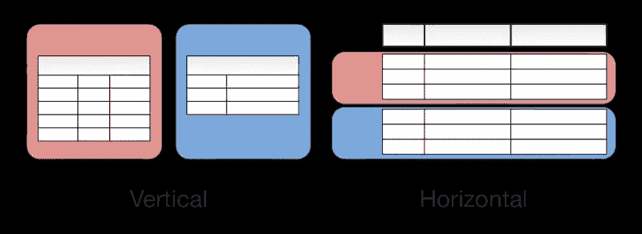

# 数据库术语:分区

> 原文：<https://towardsdatascience.com/database-terminologies-partitioning-f91683901716?source=collection_archive---------10----------------------->

您的老板告诉您学习分区主题来扩展您的数据库或了解您公司的数据库设计。你搜索互联网，然后你来到这里。*欢迎*！下面是对数据库表分区关键点的简要介绍:

# 数据库表分区:

vertical vs horizontal partitioning

首先，我们需要了解数据库(db)通常是如何设计的。数据库由表组成，表有列和行——每个表可以有多个或几个。**分区**一个数据库(为了方便起见，假设我们的数据库只包含一个大表)是将非常大的表*分成多个小表的地方。这样，查询只访问数据的一部分，因此可以运行得更快，因为需要搜索的数据更少。分区的任务是帮助维护大型表，并减少为 SQL 函数读取和加载数据的总体响应时间。*

**垂直分区与水平分区**

*垂直分区*将表&/或列存储在单独的数据库或表中。

*水平分区(* ***分片*** *)* 将一个表的行存储在多个数据库簇中。

*分片*使我们的数据更容易一般化，并允许集群计算(分布式计算)。如果数据集太大，无法存储在一个数据库中，就需要进行分片。最重要的是，分片允许数据库根据数据增长来扩展 T21。它还减小了表的大小(更确切地说是索引的大小),从而提高了搜索性能。

分片(水平分区)的通用规则/指南:

1.  每个数据库服务器在结构上必须相同。
2.  数据记录在分片数据库中被合理地划分。
3.  每个数据记录只存在于一个碎片中(审计表/备份除外)

分区优势:可伸缩性，提高大型数据库的速度

缺点:使编程和操作更加复杂

# 对数据库进行分区的 SQL 示例

Add Filegroups to partition by month SQL example

Create a Partition function for each month’s records

Create a Partition Scheme to map the partitions of a partitioned table to filegroups

Create the table using the PartitionBymonth partition scheme, and fill it with data

接下来，我们将谈论我们的下一个数据库关键术语:*索引*。