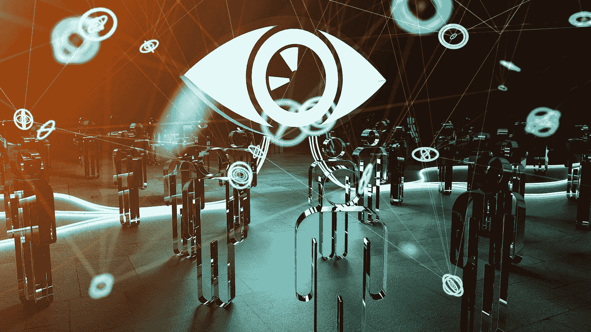
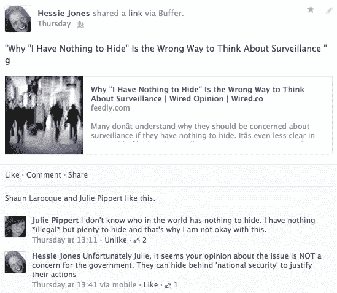
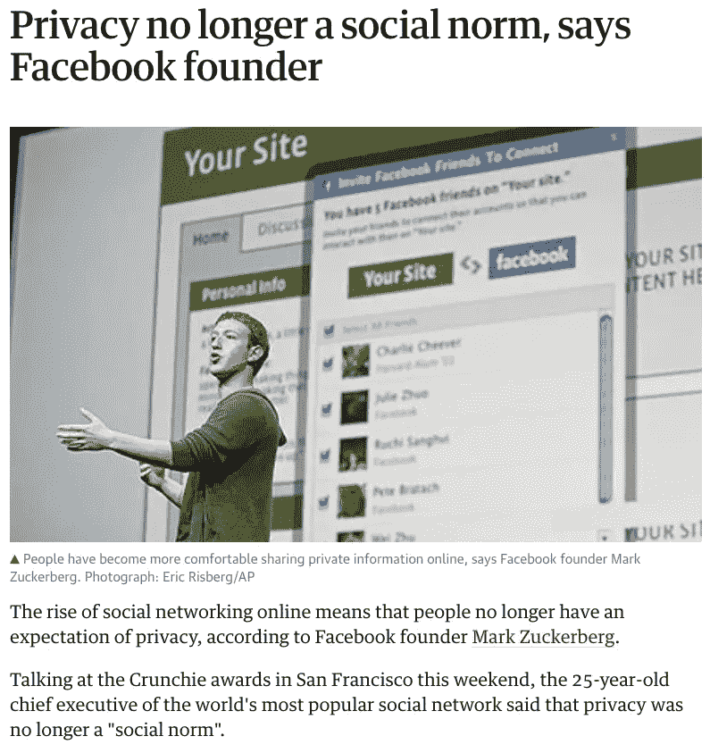

# 数据不可否认的流通性:增加数据隐私会阻碍社会进步吗？

> 原文：<https://towardsdatascience.com/datas-undeniable-currency-will-increased-data-privacy-stall-society-s-progress-c81add9f995f?source=collection_archive---------10----------------------->

*这是我之前的文章* [*AI，透明度及其与隐私的拉锯战*](/ai-transparency-and-its-tug-of-war-with-privacy-5b94c1d262ad) *的后续，在文章发表的时候，我收到了关于矛盾领域的反馈。这篇文章的目的是展示不同的观点:从业务的角度，业务总是可以访问数据，并使用这些信息来获得越来越多的客户洞察力；从消费者的角度来看，世卫组织在很大程度上对收集的数据及其使用情况一无所知。在这篇文章发表期间，剑桥分析公司和脸书之间的数据泄露事件以及用户数据的滥用成为了焦点(今天仍然如此)。消费者比以往任何时候都更加充分地意识到他们在多大程度上被监视、被影响或被操纵。这篇文章讨论了日益增长的按需市场以及数据是如何实现这一点的。它还对企业与其客户之间的关系提出了挑战，并引入了一个更加平衡的数据控制时代，以及不可避免的隐私和安全法规，这些法规将推动符合道德标准的数据使用向前发展。*

还记得#Prism2013 吗？爱德华·斯诺登和美国国家安全局的丑闻出现在电视上，就像今天脸书/剑桥分析公司的丑闻一样。正是这种监视行为将讨论从侵犯隐私转移到了人身侵犯，在这一点上，没有留下任何蛛丝马迹。我和我的朋友朱莉当时在 FB 上有过这样的讨论。这件事让我质疑这个行业的诚信以及我在其中扮演的角色。

# 数据一直是推动洞察力和收入的引擎

大数据的过去十年是一个新时代的开端:由技术、增强的连通性、计算能力和高级数据功能驱动的数据爆炸。这极大地增加了我们对事物和人的理解。现在，环境就是一切，而我们，作为人类，现在是焦点的中心。

对于企业来说，信息是驱动利润的动力。这是所有公司的首要任务。毫无疑问，股东价值取代了客户价值。确定消费者消费的动机、地点、时间和原因是营销人员几十年来试图回答的问题。显而易见，我们对驱动行为的触发因素了解得越多，我们就能卖出越多的产品。无论是 A . C Neilson 还是 Gartner，公司都在消费者研究上投入了数百万美元，不仅是为了了解市场趋势，也是为了了解这种趋势如何转化为个人的欲望和动机。

大约 4 年前，我写了这篇文章:[交换:品牌和消费者之间的终极舞蹈](http://arcompany.co/quid-pro-quo-the-ultimate-dance-between-the-brand-and-consumer/)。大数据的出现也催生了一场新的社会参与运动。突然之间，这些丰富的数据为企业提供了他们所需的信息，以通过社会背景来增加交易信息，从而定义内容、对话、评论等方面的影响，从而进一步完善对消费者的理解。

在过去 5 年中，情绪和个性(如五大)指标引起了人们的关注，以真正深入研究这些指标如何、何时以及在多大程度上影响购买行为。广告网络已经增加了他们的足迹，将更多的网站纳入他们的覆盖范围，以创建一些关于客户在哪里以及以什么顺序浏览他/她的在线路径来推断消费者倾向的理解的表象。大约在 2006 年，当时我在雅虎！我向亨特·麦德森(Hunter Madsen)汇报，这位大师在行为定向成为“事物”之前就引领了它。了解用户在我们的网络中消费了什么内容，他们搜索了什么，他们如何在我们的平台上互动，并利用位置和人口统计等邻近因素，有助于开发精确的目标配置文件。自然语言处理(NLP)在检测社交帖子中的购买意愿方面也取得了很大进展。技术已经变得如此复杂，以至于今天能够使用过去的行为/提及作为消费者结果的预测器。

凯茜·奥尼尔在她的书《数学毁灭的武器》中写道，

> 数学家和统计学家正在研究我们的欲望、行为和消费能力。他们预测我们的可信度，计算我们作为学生、工人、恋人和罪犯的潜力……这就是大数据经济，它承诺了惊人的收益。一个计算机程序可以在一两秒钟内快速浏览成千上万份简历或贷款申请，并把它们整理成整齐的列表，最有希望的候选人排在最上面。这不仅节省了时间，而且被宣传为客观公正。

所有这一切的目标是向消费者提供最相关的沟通，这将符合他/她购买该项目的倾向:正确的信息，正确的时间。很简单，对吧？不是这样的，但我们已经越来越接近实现这一点。

> 如今，来自社交网络和第三方网站的个人数据的可用性增加，这使得个人层面的情境化增加，接近实时。

到 2010 年，Cathy O'Neill 声称数学正以前所未有的方式进入“人类事务，公众很大程度上欢迎它”… *直到现在*。

# 数据在很大程度上是社会的救星

在贫困、灾难恢复、医疗保健、教育等领域做出关键决策时，效率和进步的例子数不胜数。

还记得那场让新西兰克赖斯特彻奇成为一片废墟的地震吗？在接下来的几年里，这座城市使用实时信息来帮助重建工作:从摄像头，交通系统，公用事业，水质。随着城市的重建，这些数据点将被分析以衡量经济发展，并指导城市如何重建以最大限度地减少未来的地震影响。

公用事业公司也在使用数据向客户提供更多关于能源消耗的信息，通常会降低成本，并将做出更好的能源使用决策的责任推给客户。

在医疗保健行业，由于行业的分散性以及将大量基于纸张的信息集转换为数据，数据一直是绊脚石。医疗保健社区正在缓慢转型，数据聚合正被用于预测流行病、治疗和预防疾病，以及总体上提高生活质量。重点是尽可能多地了解患者病史，以确定潜在的警告信号，并确定与疾病的相关性。在类似的患者使用案例中大规模地这样做可以使预防变得更加合理。

对于消费者来说，技术让我们的生活变得更简单、更高效。我们的垃圾邮件会被自动标记或从电子邮件中删除。我们的工作日更有条理。在记录我们的健康或健身习惯，或寻找最符合我们要求的工作方面，我们现在有更多的信息可以利用。我们已经习惯于依靠技术为我们想要购买的产品找到最好的交易，我们对按需履行的期望提高了[优步](https://www.uber.com/en-CA/)、[美食或](https://www.foodora.ca/)、[网飞](https://www.netflix.com/browse)和[钥匙咖啡馆](https://www.keycafe.com/)等便利服务。

脸书在实现更具情境性的用户洞察(比任何其他出版或广告平台都多)以推动更个性化的信息方面发挥了重要作用。这创造了一个非常有利可图的广告平台，是脸书成功的支柱。虽然他们一开始是一个社交网络，与志同道合的人一起闲逛和分享想法，但它很快变成了一个赚钱的机会，用户是主要演员，吸引垂涎的广告商。

[https://www.theguardian.com/technology/2010/jan/11/facebook-privacy](https://www.theguardian.com/technology/2010/jan/11/facebook-privacy)

还记得扎克伯格几年前说过这句话吗？“隐私已死”

早在 2010 年，扎克就认为

> “如果人们更多地分享，世界将变得更加开放和互联。一个更加开放、联系更加紧密的世界会更加美好。”

八年后，由于最近剑桥分析公司的事件，这个受人喜爱的社交网络将有助于改变我们分享、分析、再利用或出售数据的方式。消费者默许免费社交访问以换取公司访问和分析个人信息将不再是标准。

尽管数据用于改善社会的例子数不胜数，但也有同样多的例子质疑政府和企业对数据的使用。这个就不在本帖讨论了。我鼓励你阅读凯茜·奥尼尔的《[数学毁灭的武器](https://weaponsofmathdestructionbook.com/)》，因为它包含了对当今存在的数学模型的全面看法，即使有证据表明存在错误，这些模型也是“不受监管和无可争议的”。

媒体对这种数据操纵的曝光将在政策和数据治理的监管方面创造明显的界限……尤其是在人工智能出现之后。

# 随着人工智能的出现，隐私的增加会阻碍进步吗？

如果消费者愿意放弃便利和随时可获得的信息，去强烈地捍卫本属于他们的东西，这已经不再是一个问题。帮助预测疾病发生的医疗保健进步是否会因为消费者控制的数据而停滞不再是一个问题。

人工智能的真正危险在于，如果反馈回路开始以前所未有的速度从来自其他数据源的数据中发现模式，那么继续进行*今天无法无天的狂野西部实践*而不考虑潜在的社会影响。没有规则，没有透明度，没有适当的披露，危险在于人工智能失控，放大当前有偏见的模型，并最终影响可能产生有害社会影响的决策。

人工智能的目标应该是提高当前系统的效率，并为人类的整体利益改善决策。如果这是灵丹妙药，那么人类应该有权控制哪些数据可以被使用、分析和转售。他们有权同意使用数据的“环境”,数据是否得到安全处理，数据是否得到完整处理。他们有权质疑是否需要特定的个人身份信息(PII)来实现预期的结果。

根据[欧洲通用数据和保护条例](https://www.eugdpr.org/) (GDPR)，基本信息受到保护。

*   姓名、地址和身份证号码
*   位置、IP 地址、cookie 数据和 RFID 标签等网络数据
*   健康和遗传数据
*   生物特征数据
*   种族或民族数据
*   政治观点
*   性取向

加拿大前隐私部长 Ann Covoukian 提出了“设计隐私”的概念。这个概念就是隐私，它被构建并编程到任何产品的每一层结构中，旨在创建一个透明的功能系统，该系统被授权使用法律政策定义的公平和道德标准来处理个人身份数据。它将减少当前黑盒人工智能的发生，并且组织将被法律授权在未来使用它。这已经嵌入[于 2018 年 5 月 25 日推出的 GDPR](https://www.privacytrust.com/gdpr/privacy-by-design-gdpr.html)。正如我们已经看到的，这种影响将是全球性的。

回答这个问题:隐私不应该阻碍这个人工智能新世界的进步。道德模型不应因个人信息的使用而有所偏差。如果将各种因素和事件综合起来决定预测，真的有必要使用 PII 吗？

我 4 年前在我的[交换帖子](http://arcompany.co/quid-pro-quo-the-ultimate-dance-between-the-brand-and-consumer/)中写的话今天仍然适用:

> 这里的平衡在于确保消费者不会陷入困境。另一方面，企业必须从总体和消费者层面了解影响购买周期各个部分的信息...然后双方(企业和消费者)必须达成一个互谅互让的协议。
> 
> 作为一家企业，我要怎么做才能留住你这个顾客？
> 
> 作为顾客，我愿意给你什么，让我满意并再次光顾的生意？

从历史的角度来看，我们必须从过去吸取教训，想象我们想要的未来。我们在业务中实现的功能需要从一万英尺的高度来看待。我从一个名为 Writingya 的博客中得到了这个智慧。：

> “[脸书首席执行官]]马克·扎克伯格说隐私不再是一种社会规范。当他这么说的时候，我发了微博——我从来不发微博，这就是我的愤怒——这可能与社交网络无关，但它与亲密和民主有关。技术让人变傻。它会让你看不到你的潜在价值是什么，需要什么。我们真的愿意放弃我们努力争取的宪法和公民自由吗？人们为此而流血，而不是生活在一个监视的社会里。我们看着史塔西说，“那不是我们。”而现在我们让苹果做，让谷歌做？为了什么？”~ [Writingya](http://writingya.blogspot.ca/2012/03/on-privacy-from-ongoing-ted-talks.html)