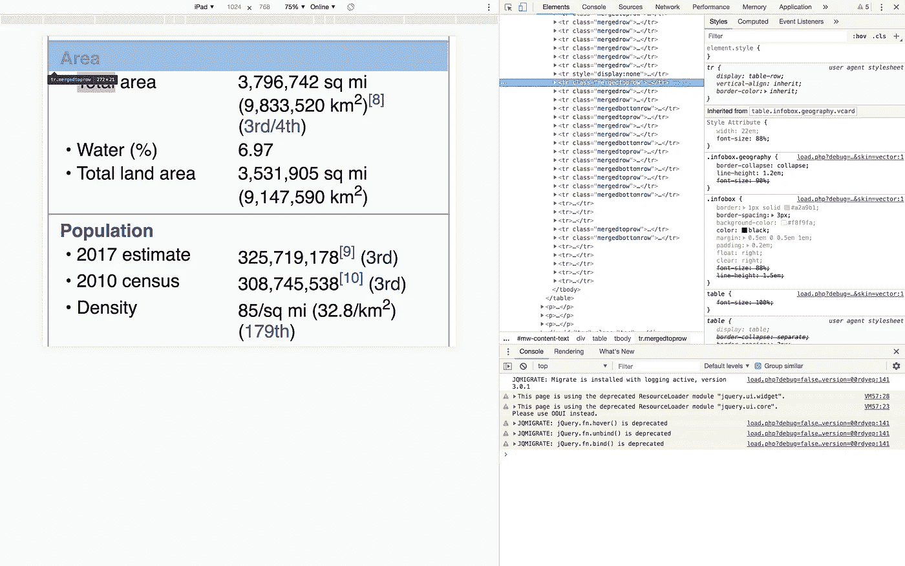
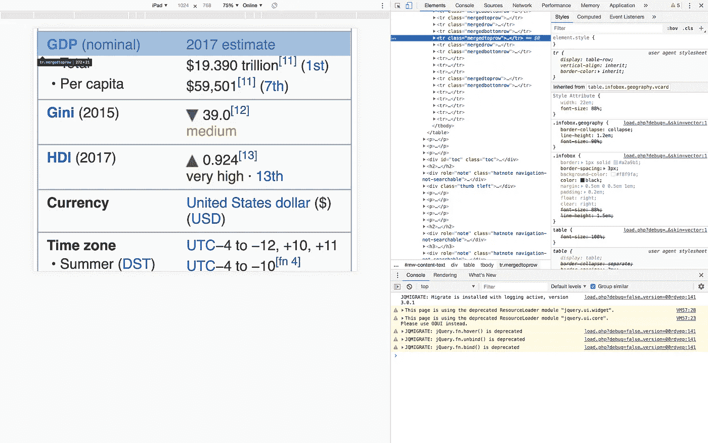

# 数据集创建和清理:使用 Python 进行 Web 抓取—第 1 部分

> 原文：<https://towardsdatascience.com/dataset-creation-and-cleaning-web-scraping-using-python-part-1-33afbf360b6b?source=collection_archive---------5----------------------->

“world map poster near book and easel” by [Nicola Nuttall](https://unsplash.com/@nicnut?utm_source=medium&utm_medium=referral) on [Unsplash](https://unsplash.com?utm_source=medium&utm_medium=referral)

在我的[上一篇文章](/creating-a-dataset-using-an-api-with-python-dcc1607616d)中，我讨论了使用应用编程接口(API)和 Python 库生成数据集。API 允许我们以一种简单的方式从网站中获取非常有用的信息。然而，并非所有网站都有 API，这使得收集相关数据变得困难。在这种情况下，我们可以使用网络抓取来访问网站的内容并创建我们的数据集。

> 网络抓取是一种用于从网站提取大量数据的技术，通过这种技术，数据被提取并以表格(电子表格)格式保存到您计算机中的本地文件或数据库中。— [韦伯维](https://www.webharvy.com/articles/what-is-web-scraping.html)

一般来说，网络搜集包括访问大量网站并从这些网站收集数据。然而，我们可以限制自己从单一来源收集大量信息，并将其用作数据集。在这个特殊的例子中，我们将探索维基百科。我还会解释我们需要的 HTML 基础知识。完整的项目可以在 Github 知识库[中使用 Python](https://github.com/kb22/Web-Scraping-using-Python) 进行网络抓取。

这个例子只是为了演示。但是，我们必须始终遵循网站指南，然后才能抓取该网站并出于任何商业目的访问其数据。

这是一篇由两部分组成的文章。在第一部分中，我们将探索如何使用 BeautifulSoup 从网站获取数据，在第二部分中，我们将清理收集的数据集。

# 确定内容

“man drawing on dry-erase board” by [Kaleidico](https://unsplash.com/@kaleidico?utm_source=medium&utm_medium=referral) on [Unsplash](https://unsplash.com?utm_source=medium&utm_medium=referral)

我们将访问[按人口统计的国家和属地列表](https://en.wikipedia.org/wiki/List_of_countries_and_dependencies_by_population)维基百科网页。该网页包括一个表格，其中列有国名、人口、数据收集日期、占世界人口的百分比和来源。如果我们去任何一个国家的页面，所有关于它的信息都写在页面上，右边有一个标准框。该框包括许多信息，如总面积、含水量、GDP 等。

这里，我们将把这两个网页的数据合并成一个数据集。

1.  **国家列表:**在访问第一页时，我们将提取国家列表、其人口和占世界人口的百分比。
2.  **国家:**然后我们将访问每个国家的页面，并获得包括总面积、水资源百分比和 GDP(名义)在内的信息。

因此，我们的最终数据集将包括每个国家的信息。

# HTML 基础

您在浏览器中浏览的每个网页实际上都是用[超文本标记语言(HTML)](https://en.wikipedia.org/wiki/HTML) 构建的。它有两个部分， **head** 包含标题和任何样式和 JavaScript 的导入， **body** 包含显示为网页的内容。我们对网页的主体感兴趣。

HTML 由标签组成。标签由开始的`<`和结束的`>` 尖括号描述，尖括号内的标签名称作为开始，如果在开始的尖括号后有正斜杠`/`，则标记结束。比如`

`、`
Some text
`等。

Homepage.html as an example

有两种方法可以直接访问网页上的任何元素(标签)。我们可以使用唯一的 **id** ，或者我们可以使用可以与多个元素关联的**类**。在这里，我们可以看到`
`的属性 *id* 为`base`，作为对该元素的引用，而所有用`td`标记的表格单元格都有相同的*类*，称为`data`。

通常有用的标签包括:

1.  每当你包含某些内容时，你就把它们一起包含在这个单一的实体中。它可以作为许多不同元素的父元素。因此，如果这里应用了一些样式更改，它们也会反映在它的子元素中。
2.  `<a>`:该标签中描述了链接，其属性`href`中提到了点击该链接将加载的网页。
3.  `
`:每当一些信息要以文本块的形式显示在网页上时，就使用这个标签。每个这样的标签都作为它自己的段落出现。
4.  ``:当信息要内联显示时，我们使用这个标签。当两个这样的标签并排放置时，它们会出现在同一行，不像段落标签。
5.  `<table>`:表格借助该标签在 HTML 中显示，其中数据显示在由行和列交叉形成的单元格中。

# 导入库

我们首先从导入必要的库开始，即 numpy、pandas、urllib 和 BeautifulSoup。

1.  numpy: 一个非常流行的库，它使得数组操作变得非常简单和快速。
2.  它帮助我们转换表格结构中的数据，因此我们可以使用已经被高效开发的众多函数来操作数据。
3.  我们使用这个库来打开我们想要从中提取数据的 url。
4.  **BeautifulSoup:** 这个库帮助我们获得想要处理的页面的 HTML 结构。然后，我们可以使用它的功能来访问特定的元素并提取相关信息。

Import all libraries

# 了解数据

最初，我们定义我们只是读取 url，然后从中提取 HTML 的基本功能。我们会在需要的地方引入新的功能。

Function to get HTML of a webpage

在`getHTMLContent()`函数中，我们传入 URL。这里，我们首先使用`urlopen`方法打开 url。这使我们能够应用 BeautifulSoup 库来使用解析器获取 HTML。虽然有许多可用的解析器，但在这个例子中我们使用了`html.parser`，它使我们能够解析 HTML 文件。然后，我们简单地返回输出，然后我们可以用它来提取我们的数据。

我们使用这个函数来获取国家列表的维基百科页面的 HTML 内容。我们看到这些国家出现在一张表格中。因此，我们使用`find_all()`方法来查找页面上的所有表格。我们在这个函数中提供的参数决定了它返回的元素。当我们需要表格时，我们将参数作为`table`传递，然后遍历所有的表格来确定我们需要的表格。

我们用`prettify()`函数打印每个表格。该函数使输出更具可读性。现在，我们需要分析输出，看看哪个表有我们要搜索的数据。经过大量的检查，我们可以看到带有类 *wikitable sortable* 的表中有我们需要的数据。因此，我们的下一步是访问这个表及其数据。为此，我们将使用函数`find()`,它不仅允许我们指定我们正在寻找的元素，还允许我们指定它的属性，比如类名。

Print all country links

HTML 中的表格由标签`<tr></tr>`表示的行组成。每一行都有单元格，这些单元格可以是使用`<th></th>`定义的标题，也可以是使用`<td></td>`定义的数据。因此，要访问每个国家的网页，我们可以从表格的国家列(第二列)的单元格中获取链接。因此，我们遍历表中的所有行，并读取变量`country_link`中第二列的数据。对于每一行，我们提取单元格，并在第二列中获得元素`a`(Python 中的编号从 0 开始，因此第二列意味着`cell[1]`)。最后，我们打印所有的链接。

这些链接不包括基地址，所以每当我们访问这些链接时，我们将附加`[https://en.wikipedia.org](https://en.wikipedia.org)`作为前缀。

虽然我开发的从每个国家的网页中提取数据的功能可能看起来很小，但在我完成这个功能之前，已经对它进行了多次迭代。让我们一步一步来探索。

每个国家的页面右侧都有一个信息框，包括座右铭、名称、GDP、面积和其他重要特征。所以，首先我们用和以前一样的步骤来识别这个盒子的名称，它是一个类为`infobox geography vcard`的表。接下来，我们定义变量`additional_details`来收集我们将从这个页面获得的所有信息，放在一个数组中，然后我们可以将这个数组追加到国家数据集的列表中。

当我们在国家页面进入 Chrome 浏览器的 inspect 模式(右击任意位置并选择`Inspect`选项)时，我们可以查看表格中每个标题的类别。我们对四个领域感兴趣，*面积—总面积、水(%)，以及 GDP(名义)—总量、人均*。

Area — Total Area and Water (%)

GDP (nominal) — Total and Per capita

我们可以很容易地推断出标题`Area`和`GDP (nominal)`有类`mergedtoprow`，而我们想要提取的数据有类`mergedrow`或`mergedrowbottom`。但是，我们不能直接访问任何数据元素，因为它们发生的顺序会根据每个国家而变化。对于一些国家，特定字段可能缺失，且`total area`的`mergedrow`可能是第 6 位，而对于一些其他国家，它可能是第 7 位。因此，我们需要首先看到`mergedtoprow`的文本，如果它与面积或 GDP(名义)匹配，我们应该读取并收集这些数据。

看起来很简单，但是当我尝试的时候，我立刻发现了一个问题，因为有些国家的`water (%)`超过了 100。这是不可能的，因此，我们一定遗漏了什么。这是我意识到问题所在的时候。你看，如果我们在区域标题后读取两个值，并且缺少水值，我们将错误地读取人口的第一个值，从而给我们错误的数据。因此，我们需要确保当`Population`标题被识别时，我们停止读取值。

现在，我们可以简单地将我们所有的知识添加到函数`getAdditionalDetails()`中。我们定义变量`read_content`来标记是否读取下一个值。除了前面描述的函数之外，我们在这里还使用了三种类型的函数:

1.  `get()`:这使我们不仅能找到，还能得到对特定元素的引用。
2.  `get_text()`:获取元素开始和结束标签中的值。
3.  `strip()`:这将删除文本中可能出现的任何额外的前导和尾随空格。我们还可以指定我们希望删除的任何特定值，例如，在我们的情况下，新的行字符`\n`。

迭代表中的所有行，迭代器检查当前行是否是匹配*区域*或 *GDP(名义)*的标题，并开始读取。在读取模式下，它会检查新元素是总面积还是总面积，如果是，它会读取并继续读取，以便在下一次运行时分别读取水(%)或人均 GDP。

我们使用`try`和`except`来确保即使我们错过了某些值，我们的整个过程也不会结束。这是我在遍历完整的国家列表时学到的另一个教训。有些国家没有我们需要的所有信息，或者我们可能找不到所需名称的表格。在这种情况下，我们的流程可能会抛出一个错误，我们必须捕获该错误以返回一个空数组，并允许该流程在其他国家继续进行。

# 创建数据集

最后，我们现在知道我们需要收集哪些信息以及如何收集。

我们首先从国家列表中读取表格的每一行，并收集每个国家的名称、人口和占世界人口的百分比。然后，我们使用该链接获得所有其他详细信息，包括总面积、水(%)、总 GDP 和人均 GDP。但是，如果附加信息少于 4，则该国家的信息缺失，我们不使用该数据。否则，我们将所有的信息添加到`data_content`数组中，该数组被编译到`dataset`数据帧中。

接下来，我们阅读表格的标题，并为 4 个额外的列添加标题。这些作为我们的数据集的标题，我们将其导出到一个. CSV 文件中，可以在这里找到。

尽管我们的数据集现在已经准备好了，但它不是最有用的格式。我们需要使用适当的格式、统一的指标并删除不必要的符号和值来清理这个数据集。我们将在本文的第二部分讨论这个问题。

希望你喜欢我的文章。请随时伸出手，分享你的想法。