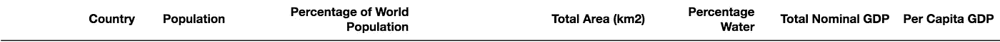
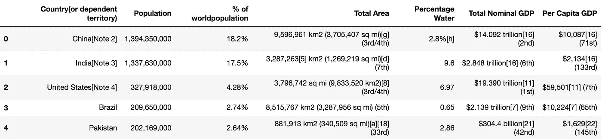
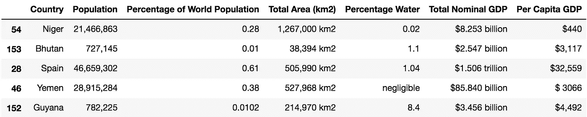
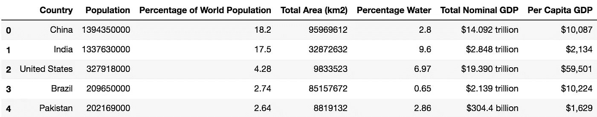
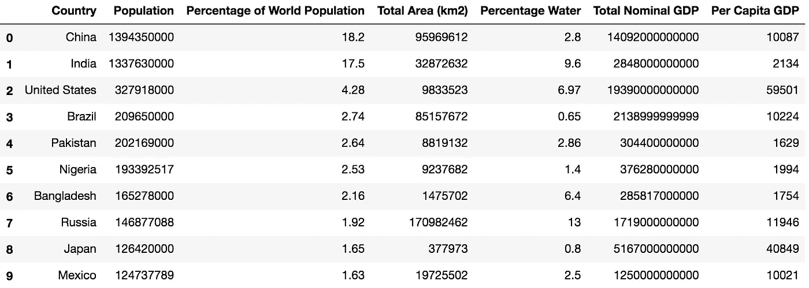

# 数据集创建和清理:使用 Python 进行 Web 抓取—第 2 部分

> 原文：<https://towardsdatascience.com/dataset-creation-and-cleaning-web-scraping-using-python-part-2-7dce33cddf66?source=collection_archive---------11----------------------->

“open book lot” by [Patrick Tomasso](https://unsplash.com/@impatrickt?utm_source=medium&utm_medium=referral) on [Unsplash](https://unsplash.com?utm_source=medium&utm_medium=referral)

在这个由两部分组成的系列文章的第一部分中，我们介绍了一种在 BeautifulSoup 和 Python 的帮助下使用网络抓取从维基百科网页中提取数据的方法。仔细观察数据集，我们可以清楚地看到，在收集的数据中存在必须消除的噪声。每当使用网络抓取收集数据时，它通常充满了我们在这里可以看到的噪音。因此，在执行任何分析之前，需要清理收集的数据以创建统一且可用的数据集。

在这里，我们将处理我们在上一部分创建的维基百科数据集，并逐一处理每一列，直到我们有一个相当有用的数据集。

# 导入库并读取 CSV 文件

我们导入三个库 *re* 、 *numpy* 和 *pandas* 。我们已经知道 numpy 和熊猫。第三个库`re`实际上是用来根据一个*正则表达式*(通常称为 *regex* )格式化字符串，它基本上定义了一个搜索模式。我们将在本文中探索它的用法，如何使用它摘自它的[文档](https://docs.python.org/3/library/re.html)。

首先，我们使用 pandas 函数`read_csv()`读取数据集文件，并将其存储在`dataset`变量中。

# **替换标题**

仔细检查后，可以发现标题可以做得更具描述性，因此我们将在必要的地方进行替换。我们将把`Country(or dependent territory)`改为`Country`、`% of worldpopulation`改为`Percentage of World Population`、`Total Area`改为`Total Area (km2)`。

Finalised column headings

现在，我们将使用新确定的列名来访问数据并细化其中的内容。

# 分析和清理数据集

Dataset.csv

让我们首先来看看数据集的当前状态。我们可以看到，几乎所有的列都有方括号和圆括号内的信息。方括号内的文字通常是指维基百科页面上的进一步链接。在我们的例子中，我们不会访问任何链接，这些链接不会提供有用的信息，所以我们可以删除它们。括号内的数据通常包括关于真实数据的附加信息。例如，在列`Total Area`中，面积在括号内以其他公制单位定义。我们也不需要这些数据，所以我们也可以删除所有的括号。

此外，我们从列`Percentage of World Population`和`Percentage Water`的所有值中删除“%”符号，因为这从列标题中可以直接看出。

Resultant dataframe

数据现在看起来好多了，但我们还有很多事情要做。

# 一次处理一列

`Country`帮助我们识别上下文，现在不需要修改。在我们前面的步骤之后，`Percentage of World Population`已经是正确的格式了，所以我们也不改变它。

## 人口和总面积列

`Population`列中的数字用逗号分隔。这里，我们将使用`replace()`函数删除逗号。这个函数将第一个参数作为我们想要替换的字符，第二个参数定义我们想要替换的字符。这里，我们什么都不用替换`,`，因此有了函数`replace(',','')`。

为了访问每个单元格，我们在`for`循环的帮助下迭代该列，然后使用 Pandas 函数`iloc[]`读取和更新该列中的特定单元格。

接下来，我们移动到`Total Area (km2)`列。我们也从删除该列中的逗号开始。接下来，一些列的数据在`sq mi`中，而其他列的面积在`km2`中。我们必须将所有的`sq mi`值乘以 2.58999，转换成`km2`。

为了实现这一点，我们检查单元格在字符串中是否有`sq mi`，如果有，我们删除除了`.`之外的所有非数字字符，并将值乘以 2.58999。该值最终被转换回整数。我使用了一个函数`repr`来获得该列中值的可打印版本。在查看结果时，我看到在可打印的格式中，`sq mi`实际上被表示为`sq\xa0mi`,匹配必须针对它进行。这也反映在代码中。如果单位已经在`km2`中，我们只需删除除`.`之外的所有非数字字符，并将值转换为整数。为了移除所有这样的字符，我们使用正则表达式`[^0-9.]+`，这基本上意味着我们移除任何计数中的所有字符(用`+`标记)，除了数字 0 到 9 和`.`

然而，在做同样的尝试时，我发现一些值在范围内，我们需要首先解决它们。因此，对于所有这些国家，我们读取范围，使用`split('-')`函数将其分割，并将第一个值作为我们将为该单元格考虑的值。

Modified ‘Population’ and ‘Total Area’ columns

## 百分比水柱

该列有一些异常值。首先，对于一些含水量很低的国家，如*阿尔及利亚*和*阿富汗*，此栏数值标有`Negligible`或`negligible`。此外，对于*智利*来说，最后还有一个额外的`b`存在。

因此，我们需要用`0.0`替换`Negligible`和`negligible`，并删除这些单元格中除数字和`.`之外的任何额外字符。我们使用前面定义的不带和带正则表达式的`replace()`函数来实现这一点。

对于某些缺失值的情况，记录的值不正确，必须删除。幸运的是，这很容易解决。我们可以简单地删除所有大于 100 的行。这是可行的，因为百分比值不能超过 100。我们首先使用`astype(float)`将列中的每个字符串转换为 float，然后只保留那些值小于或等于 100 的列。

Modified ‘Percentage Water’ column

## 名义国内生产总值和人均国内生产总值栏

对于`Total Nominal GDP`，我们首先去掉美元符号。接下来，我们观察到这一列中的金额被表示为*万亿*、*十亿*和*百万*的字符串。因此，我们读取每个单元格，识别面额，删除除数字和`.`之外的所有字符，并将金额乘以面额数值。

对于`Per Capita GDP`,我们保留数字 0-9 和`.`,同时删除所有其他字符，包括逗号和美元符号。

Final Dataset

# 导出最终数据集

最后，我们的数据集现在是干净的，可以导出到外部 CSV 文件中。我们使用熊猫函数`to_csv`将数据帧导出到文件`Final_dataset.csv`。

# 结论

在这篇文章中，我们发现虽然网络搜集的第一步即数据收集很重要，但是数据的清理也同样重要。这一步本身也有一些挑战，我们必须先解决这些挑战，然后才能开发合适的数据集进行有用的分析。最终的[数据集](https://github.com/kb22/Web-Scraping-using-Python/blob/master/Final_dataset.csv)也存在于 GitHub 存储库中。

希望你喜欢我的作品。请随时伸出手，评论，分享，发表你的看法。