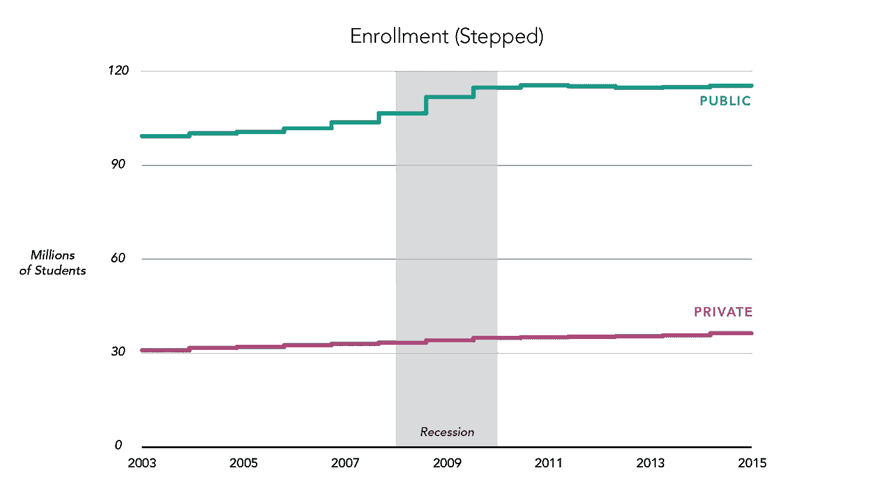
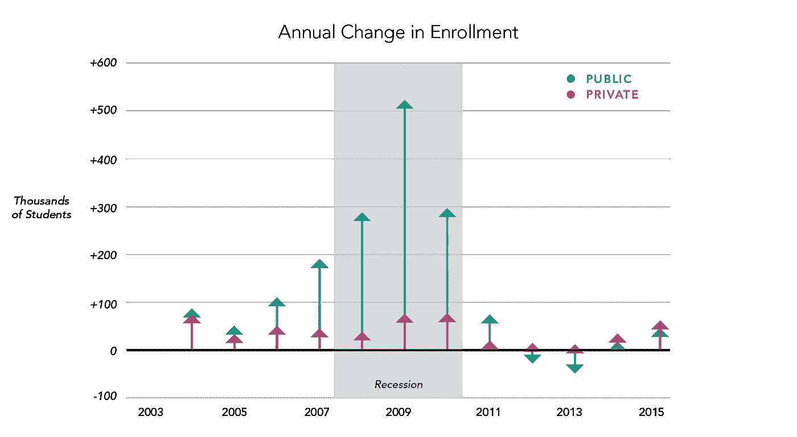
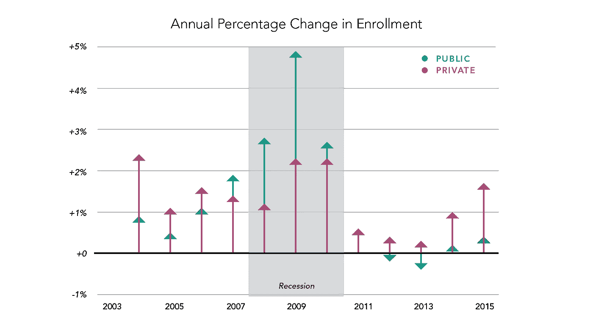
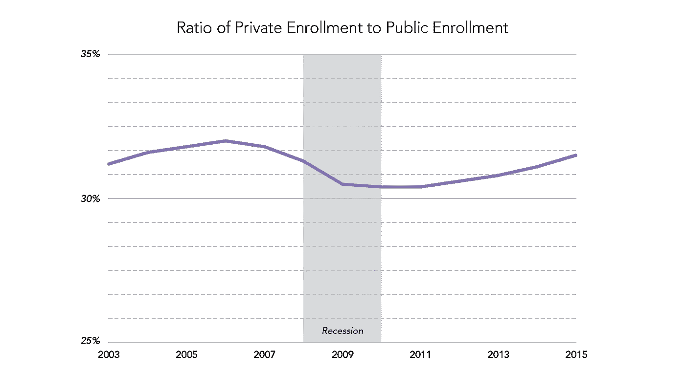
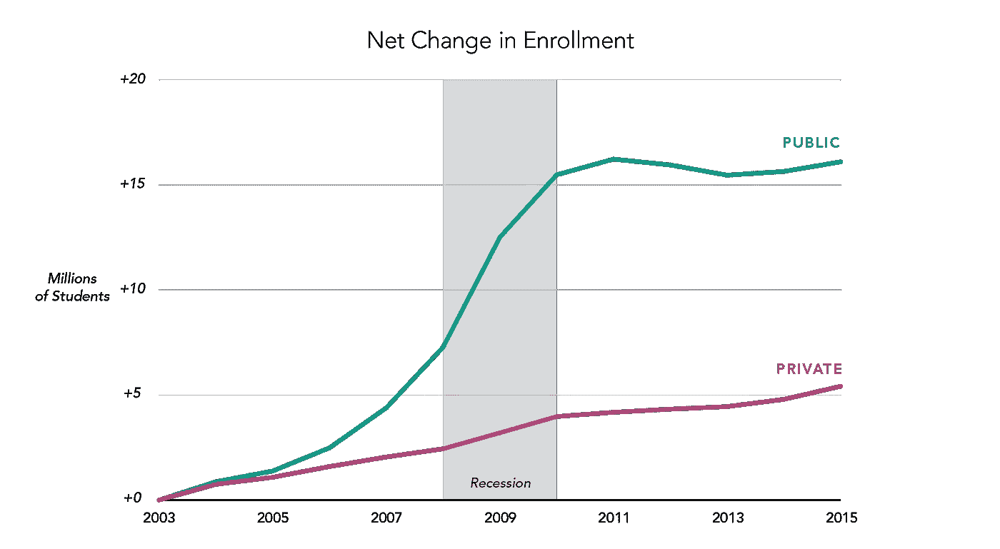
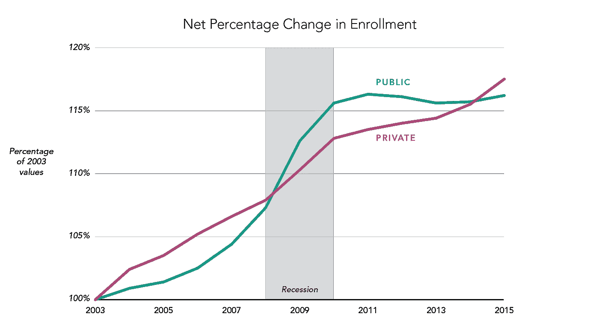

# DataViz 案例研究:规划大学招生的七种微妙不同的方法

> 原文：<https://towardsdatascience.com/dataviz-case-study-seven-subtly-different-ways-to-plot-college-enrollment-87815e18ccd0?source=collection_archive---------5----------------------->

即使是最简单的数据集也能以一百万种方式呈现。即使我们坚持最基本的方法，用线和点和条，我们也有很多选择。

这些选择微妙地塑造了我们的数据如何被阅读和解释，以及观众会得出什么结论。没有单一的“正确方式”来显示数据，因为每个项目都有编辑意图:要提出的论点、要讲述的故事、要让人难忘的关键见解。数据可视化人员只能通过密切关注他们技术的微妙之处来做到这一点——我想通过一个案例研究来说明这一点。

## **案例研究:大学招生**

最近，我需要帮助一位同事将 2003 年至 2015 年美国学院和大学的学生注册总数数据可视化，这些数据按公立或私立学校分类。她还想强调大衰退可能带来的任何影响。

让我们看看这些数据的七种呈现方式。在每一种情况下，我们都希望关注哪些趋势或事实被揭示，或变得更加明显，以及哪些趋势或事实被隐藏。

# #1:基本折线图

我的同事在她的报告草稿中开始了这个明显的选择，我在这里重新做了，而不是让你接受 MS Word 图形:

*强调什么*

*   公立和私立学校的**总体差异**:公立学校招收的学生数量是私立学校的三倍多。
*   经济衰退期间对公众的提价。其次，随后公众支出放缓，而私人支出小幅但稳步增长。

*评估*

很难讨厌这种直接的方法，但我觉得效果很弱。公私比较太重要了:这种关系是众所周知的，所以没什么意思。衰退时期的增长需要更多的关注，但它的规模和速度很难判断，因为相比之下图表的规模太大了。在这个数据集和许多数据集中，规模是一个基本的权衡:如果我们显示整体趋势，我们就会掩盖细节；如果我们放大细节，我们就失去了大局。我们必须选择哪个更重要。

接下来的选择探索了如何显示使该数据集的增加更重要。

# #2 阶梯折线图

一个小的变化是:不同年份之间的平滑，显示为一条平坦的线(样本每年只记录一次)。

*重点的变化*

*   我们可以更容易地看到增长的幅度。在公共场合，我们可能会察觉到经济衰退前和衰退期间的加速增长。
*   2011 年后，公众经历了一次下降，这一点更加明显。

*评估*

与基本折线图具有相似的效果。还不够远。

# #3 年度变化(增量)

以下是各组的同比变化。虽然这些可以显示为折线图，但我发现这种做法有些欺骗性，因为一个值不会直接影响下一个值。我喜欢箭头，因为它表明我们在应对变化。(但你可以想象不同的造型，以下几点保持不变。)

*强调什么*

*   这次**公招** **人数激增**中间。其次，它在衰退前就开始了，在衰退期间加速，然后停止。
*   经济衰退后，公共部门和私人部门都经历了衰退。

*什么被巧妙地编码了*

*   公立学校的变化幅度几乎不可避免地会比私立学校大，因为它们招收了更多的学生。所以总入学人数被巧妙地包括在内，尽管我们并没有真正用图表显示出来。

*失去了什么*

大的公共线路(几乎是字面上的)盖过了私人线路。而且观众可能会因为大小不同而得出奇怪的结论，这在这张图上并不明显。例如，人们可以推断，对公共机构而言，衰退是一个更加动荡的时期。但是每种类型的相对变化并没有显示出来:即使是很小的入学减速对士兵来说也可能是毁灭性的，但是在这里很难评估。

*评估*

这让我们聚焦于这些变化，并引起人们对经济衰退期间事件发生方式的关注。这个故事变得更加与公众有关。

# #4.相对年度变化

接下来，我将年度变化显示为当前值的百分比。

*强调什么*

*   在经济衰退之前和期间，T21 的私人和公众都经历了增长。公众在此期间有了更大的增长。
*   近年来，所有机构都在从沉寂中复苏；但是士兵们反弹得更快。

*隐藏着什么*

*   我们再也看不到，即使是间接的，公共机构总体上招收的学生要多得多。
*   我们看不到有多少学生受到影响。

*评估*

这对于真正比较公立和私立学校的兴衰更有用:它们受到相同事件的影响吗？他们可能会做出类似的决定吗？他们往同一个方向走吗？对于所有这些问题，我们现在可以形成部分答案:泡沫和衰退都受到了打击，但它们的反应不同。这也许可以从直线图中看出，但被严重模糊了。

# **#5 公私比例**

一种选择是计算某种比较并直接用图表表示出来，而不是强迫观察者两个组进行比较。这是私立学校占公立学校的比例:

*强调什么*

*   我们可以看到学生的总体分布实际上是如何随着时间推移而发生变化的，这可能与经济衰退有关。

*什么被遮住了*

*   有多少学生参与其中？
*   是公众、私人或两者的变化导致了这些变化吗？

*评估*

有趣的是，第一张图中的观察结果——公立学校招收了 3 倍多的学生——显示出随着时间的推移而变化。私立学校招生人数的早期增长也令人惊讶。这些直接比较在图 1 和图 2 中很难看出，在图 3 和图 4 中看不到。

这些转变可能会引发一些有趣的问题，但不幸的是，这些问题不能仅靠这张图表来回答。例如，是什么导致了私人资本的激增？我们可以回顾过去，看到这两种制度都有所增加；但是士兵相对增加更多。但也存在其他可能性(公共注册人数骤降)，我们在这里不会知道。

因此，如果我们可以用多张图来构建一个故事，这一张图可能值得包括在内。如果我们局限于一个图表(就像我一样)，它就没有包含足够的信息。

# **#6 净变化**

我们展示了自 2003 年以来的变化，而不是逐年变化。也就是我们把 2003 年定为零点。

*强调*

*   入学人数全面上升，但公立学校占据了大部分份额。
*   这种增长在衰退期间加速，在衰退之后减速——尤其是对公众而言。

*隐藏了什么*

*   2003 年的实际值是多少；总共有多少学生？

*评价*

这张图表在我们所看到的一些东西之间找到了一种有趣的平衡。我们仍然可以间接地看到公共机构的重要性，它们负责招收大多数新生。衰退期间的变化相当明显。人们很容易对私立学校和公立学校进行比较——但不是在相对的基础上，也不是在细节上，尤其是对于私立学校。

我们做出的主要牺牲是将事情固定在某一年。在这种情况下，这一年很大程度上是任意的(基于数据可用性)，而不是与一些关键事件相一致。这也会给人一些错误的印象:

*   入学人数开始时很低
*   公立学校和私立学校的总注册人数差不多

如果你的观众不熟悉数据的背景，他们更有可能做出这些错误的结论(没有办法自我纠正)。这意味着这种展示依赖于特定类型的观看者——以及一如既往的仔细标注。

# #7 相对净变化

同上，但我们采用自 2003 年以来的百分比变化:

*强调什么*

*   一种**公与私的竞赛**；不同时间谁在“赢”；以及 2008 年和 2014 年发生的逆转。
*   衰退期间公众的快速增长(T2 ),之后趋于平稳。

*隐藏着什么*

*   再问一次，我们所说的学生的绝对数量是多少
*   这两种类型在总注册人数上有何不同，例如，它们从哪里开始

*评估*

如果百分比增长真的是讨论中的一个关键变量(而不仅仅是一个好的代理)，或者两组之间存在某种竞争，那么这个图表提供了一些很好的见解。这些遐想确实将人们的注意力吸引到了衰退和随后的复苏上。

但是这里也有很多潜在的误解。没有背景知识的观众可以很容易地得出结论，这两种类型在入学人数上非常相似，并且确实在激烈争夺学生。但是我们知道公立学校在美国学生总数中所占的比例要大得多，不管我们在这张图表中看到的变化有多大。同样，有人可能会认为**私人即将** **超过公共**，这当然也是不正确的。

与第 6 条相比，这张图表更需要一个见多识广的观众，或者提供大量的背景和教育——当图表经常被浏览时，这是一个很高的要求。

由于我没有特别想强调一个“种族”，我判断这个情节太混乱了。

# 最后决定

最后，我向我的同事展示了图表 6，净变化。这似乎达到了……的恰当平衡

*   围绕经济衰退，以合理的细节强调变革
*   允许公/私之间的比较
*   仍然表明公立学校的总入学率更高

使用这个图表是可能的，因为我知道我的观众将熟悉高等教育的世界，包括公立和私立机构的典型入学情况。但是我的读者也不精通技术，也不一定擅长仔细阅读图表:我不想把他们和#5 或#7 混淆。

# 结论

我展示的七张图中的任何一张都可能是正确的选择:这取决于我们的编辑目的，以及我们试图接触的受众。

数据可视化是另一种交流模式，它与写作、漫画和演讲有着共同的问题。做出正确的选择取决于您对不同图形结构影响人类数据感知的方式的理解。这取决于你仔细检查你的选择，并考虑它们的影响。这取决于你了解你的观众。相反地…

## 不要

*   不要相信任何虚假的建议，告诉你有一种正确的方法来绘制特定类型的数据(“折线图是用于时间序列的！”).就像生活中的许多事情一样，“视情况而定。”
*   不要假装你能以某种宇宙的形式中立地呈现数据，这样所有包含在其中的美好智慧就会自然而然地流入读者体内。你需要做出编辑上的选择来帮助你的读者——你不可避免地会这样做，不管你是不是有意的。
*   不要以为你能拥有一切。为了强调某些事情，你必须淡化其他事情。最花哨的数据可视化也救不了你:随着复杂性的增加，解释会面临新的挑战。你必须做出取舍。

作为一名数据可视化从业者，你的工作就是要擅长于此，并发展出一种什么会起作用的感觉。你不能尝试所有可能的选择；但是可以试几个合理的。希望我在这里列举的七个例子能对你的过程有所帮助。