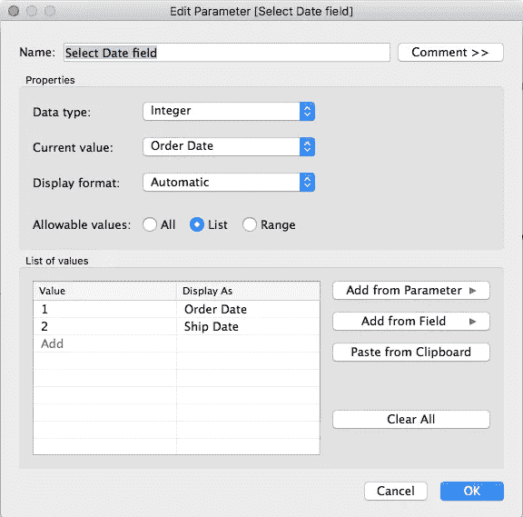
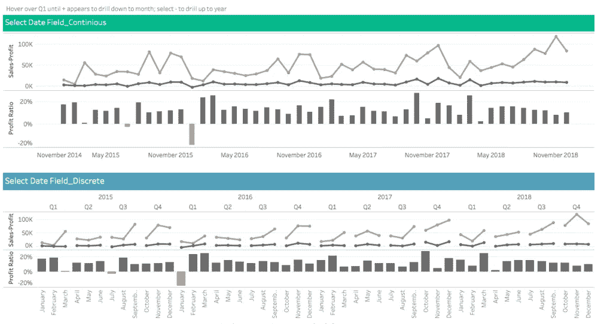
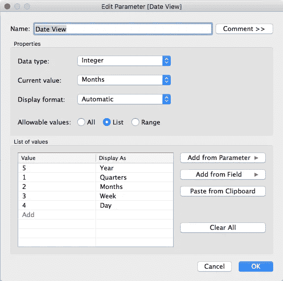
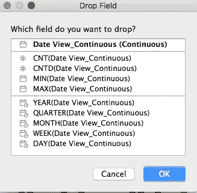
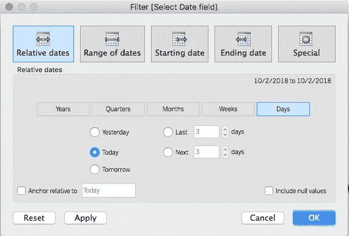
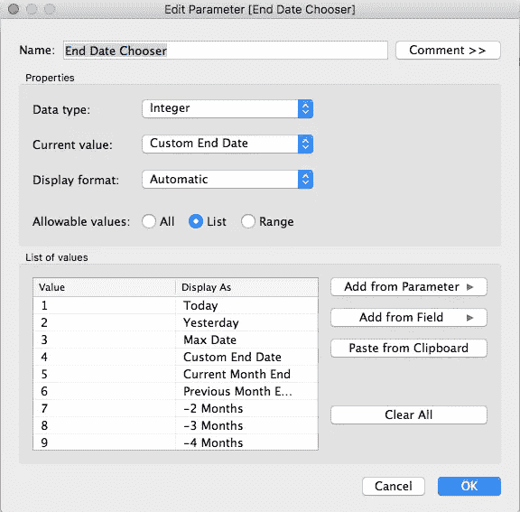
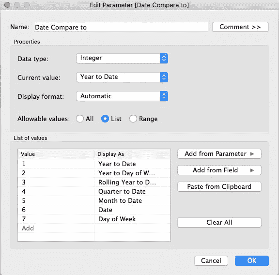

# Tableau 中的日期

> 原文：<https://towardsdatascience.com/dates-in-tableau-6900c9d4d8a3?source=collection_archive---------9----------------------->

这篇文章对那些正在处理财务数据的人或者任何正在追踪与去年数字相比企业表现的人来说都是有用的。

# 用例

用户希望从宏观和微观层面跟踪上一年的销售情况(YTD，Day YOY)。

1.  **在日期字段之间切换** —当处理财务数据时，用户希望看到订单进来时的销售情况，但也希望跟踪订单何时在会计系统中登记。为用户提供在这两个日期字段之间轻松切换的能力，同时只保留一组报告和图表。
2.  **上下钻取** —当使用日期字段构建时间序列图时，Tableau 包括上下钻取日期部分的能力。但是并不是所有的用户都知道将鼠标悬停在日期轴上来查看-/+，或者您希望限制用户向下或向上钻取的能力。
3.  **日期比较** —相对日期范围过滤器可用于选择 YTD、MTD 和 Today，但不允许同比(YOY)或滚动日期范围比较。构建最常见的日期范围比较，以考虑同比和滚动周期。此外，能够改变结束日期，以跟踪有多远，从去年的销售。


下面的工作簿显示了每个步骤的最终结果，最后一个选项卡“时间序列”将所有内容汇总在一起。我决定展示如何使用连续和离散来构建每个组件，因为根据需求，两者都有用例。

[](https://public.tableau.com/views/DateSelector/DateCompare?:embed=y&:display_count=yes) [## 选择日期字段；在字段日期视图之间切换；向上钻取和向下钻取日期比较；年初至今…

### 选择日期字段；在字段日期视图之间切换；向上钻取和向下钻取日期比较；年初至今，年复一年以及…

public.tableau.com](https://public.tableau.com/views/DateSelector/DateCompare?:embed=y&:display_count=yes) 

**警告**涉及参数(如本工作簿中的参数)的行级计算将增加加载时间。查看[这篇互联文章](https://interworks.com/blog/modonnell/2015/10/09/tableau-performance-checklist-calculations-avoid-row-level-calculations/)。

基于 Carl Slifer 的 Interworks [帖子，日期比较变得容易](https://interworks.com/blog/cslifer/2016/03/22/date-comparisons-tableau-made-easy)。

# 在日期字段之间切换

使用参数可以很容易地在两个或多个日期字段之间转换。

**第一步。**创建一个参数字段，[选择日期字段]。将数据类型设置为整数将有助于提高性能，因为整数和布尔数据类型比日期和字符串数据类型运行得更快。每个值都可以有一个容易识别的名称。



**第二步。**创建计算[选择日期字段]

```
CASE [Parameters].[Select Date field]WHEN 1 THEN [Order Date]WHEN 2 THEN [Ship Date]END
```

**第三步。**在视图中放置计算并显示参数。

下面我使用[选择日期字段]计算构建了两个图表。请注意，连续图表的线条中没有断点，每个月/年都没有标记，而离散图表的线条中有断点，每个年、季度和月都有标记。



# 上下钻取

构建一个参数来切换到不同的日期级别。

**第一步。**创建【日期视图】参数



**第二步。**创建日期视图计算。请注意，我将使用在上一步中创建的[选择日期字段]。如果您不需要在日期之间切换，则可以使用所需的日期字段。

日期视图 _ 连续

```
CASE [Parameters].[Date View]WHEN 5 THEN DATE(DATETRUNC('year', [Select Date field]))WHEN 1 THEN DATE(DATETRUNC('quarter', [Select Date field]))WHEN 2 THEN DATE(DATETRUNC('month', [Select Date field]))WHEN 3 THEN DATE(DATETRUNC('week', [Select Date field]))WHEN 4 THEN DATE(DATETRUNC('day', [Select Date field]))END
```

日期视图 _ 离散

```
CASE [Parameters].[Date View]WHEN 5 THEN DATENAME('year',[Select Date field])WHEN 1 THEN DATENAME('year',[Select Date field]) + ' Q' + DATENAME('quarter',[Select Date field])WHEN 2 THEN DATENAME('year',[Select Date field]) + '-' + STR(DATEPART('month',[Select Date field]))WHEN 3 THEN DATENAME('year',[Select Date field]) + ' W' + STR(DATEPART('week',[Select Date field]))WHEN 4 THEN DATENAME('year',[Select Date field]) + '-' + STR(DATEPART('month',[Select Date field])) + '-' + STR(DATEPART('day',[Select Date field]))END
```

**第三步。**放置在视图上

连续的

在 Mac 上，按住“option”键，选择[日期视图 _ 连续]并放置在列上。将弹出一个新的下拉字段窗口，选择第一个选项“日期视图 _ 连续(连续)”，该选项不会分配静态日期部分，并允许参数正常工作。



分离的

将[Date View_Discrete]移动到列中，默认情况下将不应用日期部分。

让我们比较两个时间序列。现在我们看到离散时间序列不包含间断。我也更喜欢离散标签，因为它根据选择的日期视图来标记日期。在连续时间序列将根据所选的日期视图进行调整的情况下，连续几个月显示的日期可能会误导用户。


# 年初至今，滚动期间，同比

相对日期允许用户选择 YTD、MTD 和 Day，但不允许进行年度比较或滚动期比较。



为了便于进行年度对比和滚动期对比，我们将创建 2 个参数；第一个[结束日期选择器]将决定结束日期，第二个[日期比较]将告诉您要查看的日期范围类型。下面是我经常听到用户要求的 7 个日期对比。这些比较可以分为三类:年初至今，滚动期，同比。每个结束日期将根据[结束日期选择器]确定。在[日期比较仪表盘](https://public.tableau.com/views/DateSelector/DateCompare?:embed=y&:display_count=yes)上，进行选择以查看日期范围如何变化。

**年初至今**:从日历年的第一天开始

1.年初至今(例如，2018 年 9 月 15 日)

2.一年中的每一天(例如，星期一、星期二)

**滚动周期**:连续天数

3.年初至今累计

**同比**:上年同期的当前结果

4.季度至今

5.本月至今

6.日期(例如，2018 年 9 月 15 日)

7.一周中的某一天(例如，星期一、星期二)

构建[结束日期选择器]首先创建参数



然后构建[结束日期选择器]计算。这可以根据数据更新的频率进行调整。大多数时间默认为昨天，因为在许多情况下，提取每天刷新一次。当用户需要跟踪 YTD 和 MTD 发生的事情时，月末选项(例如，当前、上一个月、2 个月、当前年末)很方便。

```
DATE(Case [Parameters].[End Date Chooser]WHEN 1 THEN TODAY()WHEN 2 THEN DATEADD('day', -1, TODAY())WHEN 3 THEN { MAX([Select Date field]) }WHEN 4 THEN [Custom End Date]WHEN 5 THEN DATEADD('day',-1,DATEADD('month',1,DATETRUNC('month',TODAY())))WHEN 6 THEN DATEADD('day',-1,DATETRUNC('month',TODAY()))WHEN 7 THEN DATEADD('day',-1,DATEADD('month', -1, DATETRUNC('month',TODAY())))WHEN 8 THEN DATEADD('day',-1,DATEADD('month', -2, DATETRUNC('month',TODAY())))WHEN 9 THEN DATEADD('day',-1,DATEADD('month', -3, DATETRUNC('month',TODAY())))WHEN 10 THEN DATEADD('day',-1,DATEADD('month', -4, DATETRUNC('month',TODAY())))WHEN 11 THEN DATEADD('day',-1,DATEADD('month', -5, DATETRUNC('month',TODAY())))WHEN 12 THEN DATEADD('day',-1,DATEADD('month', -6, DATETRUNC('month',TODAY())))WHEN 13 THEN DATEADD('day',-1,DATEADD('month', -7, DATETRUNC('month',TODAY())))WHEN 14 THEN DATEADD('day',-1,DATEADD('month', -8, DATETRUNC('month',TODAY())))WHEN 15 THEN DATEADD('day',-1,DATEADD('month', -9, DATETRUNC('month',TODAY())))WHEN 16 THEN DATEADD('day',-1,DATEADD('month', -10, DATETRUNC('month',TODAY())))WHEN 17 THEN DATEADD('day',-1,DATEADD('year', 1, DATETRUNC('year',TODAY())))END)
```

接下来创建[日期比较对象]参数。



创建[比较日期]计算

```
CASE [Parameters].[Date Compare to]//Year To DateWHEN 1 THEN//CurrentIIF( DATEPART('dayofyear',[Select Date field]) <= DATEPART('dayofyear',[End Date Chooser])AND YEAR([Select Date field]) - YEAR([End Date Chooser]) = 0, 0//Previous, IIF( [Select Date field] <=DATEPARSE('MM-dd-yyyy',(STR(MONTH([End Date Chooser]))+'-'+STR(DAY([End Date Chooser]))+'-'+STR(YEAR(DATEADD('year',-1, [End Date Chooser])))))AND YEAR([Select Date field]) - YEAR([End Date Chooser]) = -1, -1, NULL))//Year to WeekdayWHEN 2 THEN//CurrentIIF( DATEPART('dayofyear',[Select Date field]) <= DATEPART('dayofyear',[End Date Chooser])AND YEAR([Select Date field]) - YEAR([End Date Chooser]) = 0, 0//Previous, IIF(  YEAR([Select Date field]) - YEAR([End Date Chooser]) = -1AND DATEPART('week', [Select Date field])*10 + DATEPART('weekday', [Select Date field])<= DATEPART('week', [End Date Chooser])*10 + DATEPART('weekday', [End Date Chooser]), -1, NULL))//Rolling  Year to DateWHEN 3 THEN//The first statement sets the conditions for a date to be considered the “current period.”//It will check every date to the date we've chosen as our starting point.//It must be based on whatever date we’ve chosen and go back a user chosen number of months, weeks, days, etc.//If the difference between these dates is >=0 and < our Period Length, we consider it to be the “current period.”IIF( DATEDIFF('day',[Select Date field],[End Date Chooser]) >=0AND DATEDIFF('day',[Select Date field],[End Date Chooser])< 365, 0//The second statement sets the conditions for a date to be considered the “previous period.”//It will compare every date to the date we've chosen as our starting point.//It will be based on whatever date we've chosen and it will immediately precede the “current period” and be the same length.//If the difference between the dates is > the Period Length but also < two times the length, it will be the “previous period.”, IIF( DATEDIFF('day',[Select Date field],[End Date Chooser]) >= 365AND DATEDIFF('day',[Select Date field],[End Date Chooser]) < 2*365, -1, NULL))//Quarter to DateWHEN 4 THEN//CurrentIIF( [Select Date field] <= [End Date Chooser]AND DATEDIFF('quarter',[Select Date field],[End Date Chooser])= 0, 0//Previous, IIF(  [Select Date field] <=DATEPARSE('MM-dd-yyyy',(STR(MONTH([End Date Chooser]))+'-'+STR(DAY([End Date Chooser]))+'-'+STR(YEAR(DATEADD('year',-1, [End Date Chooser])))))AND DATEDIFF('quarter',[Select Date field],[End Date Chooser]) = 4, -1, NULL))//Month to DateWHEN 5 THEN//CurrentIIF( [Select Date field] <= [End Date Chooser]AND DATEDIFF('month',[Select Date field],[End Date Chooser])= 0, 0//Previous, IIF( DAY([Select Date field]) <= DAY([End Date Chooser])AND DATEDIFF('month',[Select Date field],[End Date Chooser])= 12, -1, NULL))//DateWHEN 6 THEN//CurrentIIF( DATEDIFF('day',[Select Date field],[End Date Chooser])= 0, 0//Previous, IIF( [Select Date field] =DATEPARSE('MM-dd-yyyy',(STR(MONTH([End Date Chooser]))+'-'+STR(DAY([End Date Chooser]))+'-'+STR(YEAR(DATEADD('year',-1, [End Date Chooser]))))), -1, NULL))//WeekdayWHEN 7 THEN//CurrentIIF( DATEDIFF('day',[Select Date field],[End Date Chooser])= 0, 0//Previous, IIF(  YEAR([Select Date field]) - YEAR([End Date Chooser]) = -1AND DATEPART('week', [Select Date field])*10 + DATEPART('weekday', [Select Date field])= DATEPART('week', [End Date Chooser])*10 + DATEPART('weekday', [End Date Chooser]), -1, NULL))END
```

# 把所有的放在一起

最后一步，我们将创建一个仅使用当前年份的日期字段，这样我们就可以在月/日匹配的时间序列上显示上一个和当前时间段。

创建计算[日期月/日/年]。这将创建一个匹配月和日的新日期字段，并使用[结束日期选择器']获取当前期间年份。添加了额外的逻辑来考虑闰年，闰年在二月有额外的一天。如果不加上这个，那么 2 月 29 日将在 3 月结束。

```
DATE(STR(MONTH([Select Date field]))+"/"+IIF(DATEPART('day',[Select Date field]) = 29 AND DATEPART('month',[Select Date field]) = 2,STR(DAY(DATEADD('day', -1, [Select Date field]))),STR(DAY([Select Date field])))+"/"+STR(YEAR([End Date Chooser])))
```

然后根据上一节中的逻辑创建[日期视图 _ 连续]和[日期视图 _ 离散]，将日期切换到[日期月/日/年]。

现在我们有了满足本文开头描述的原始用例的最终视图。最终的工作簿可以在这里[查看。](https://public.tableau.com/views/DateSelector/DateViewRange?:embed=y&:display_count=yes)

