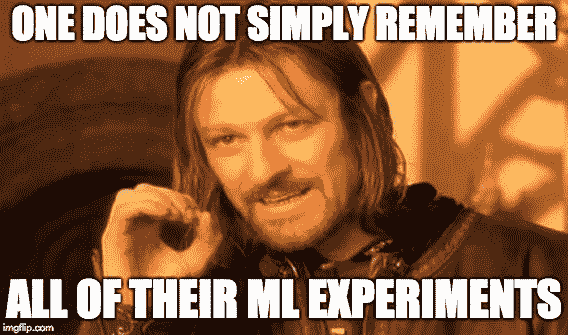
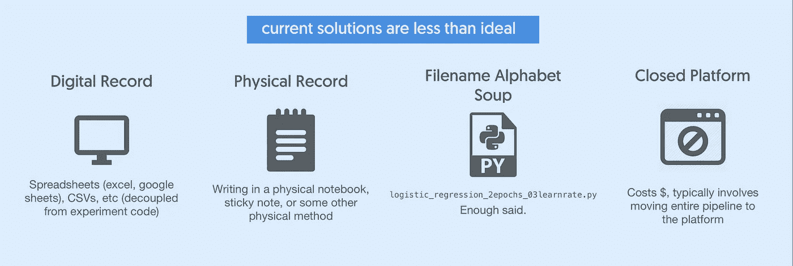
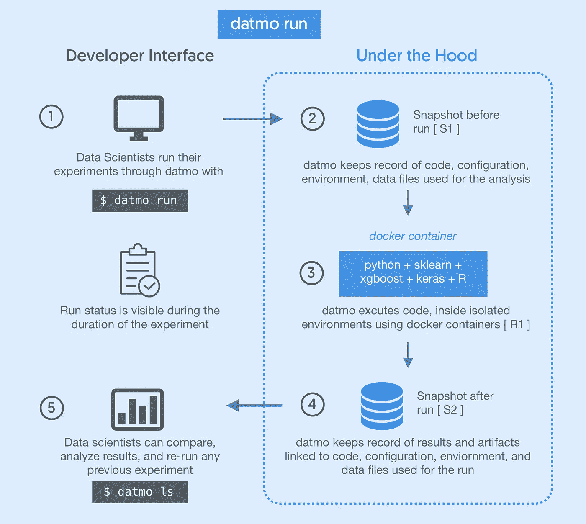
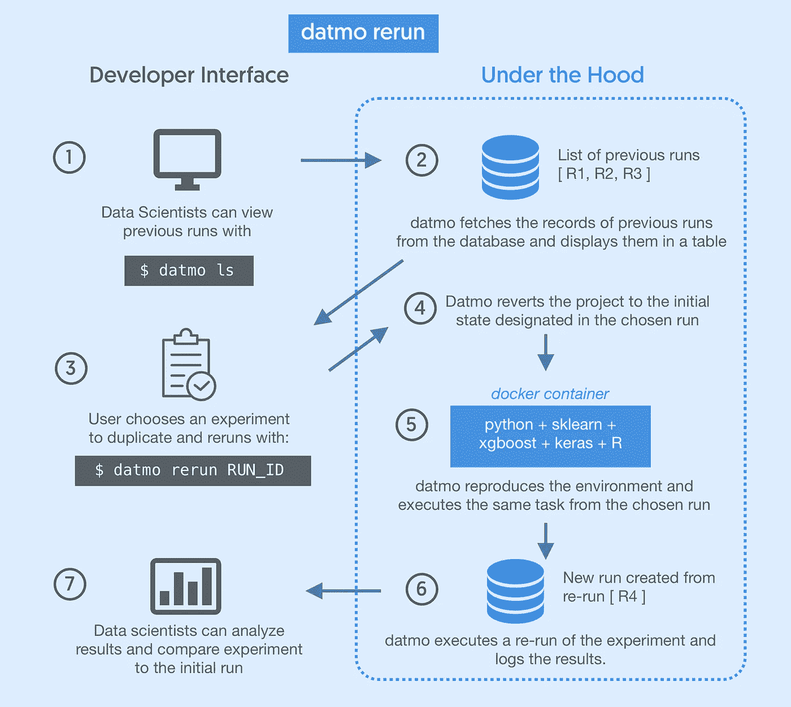
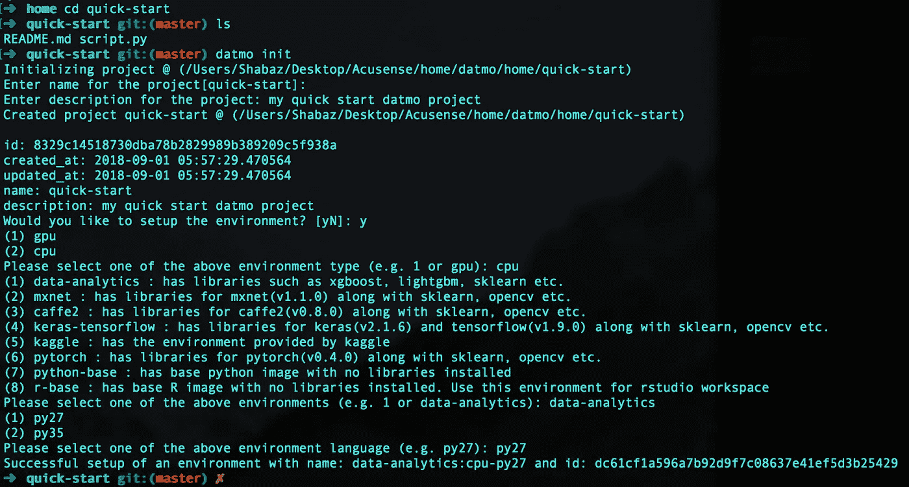
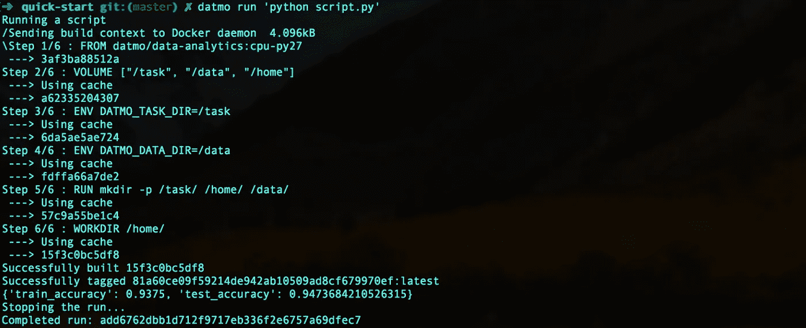
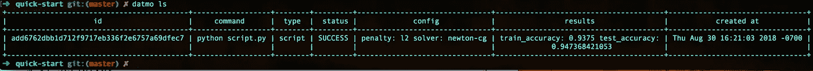
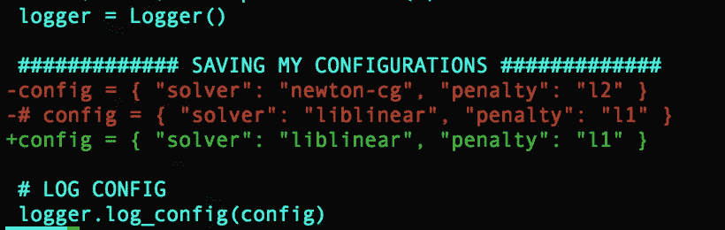
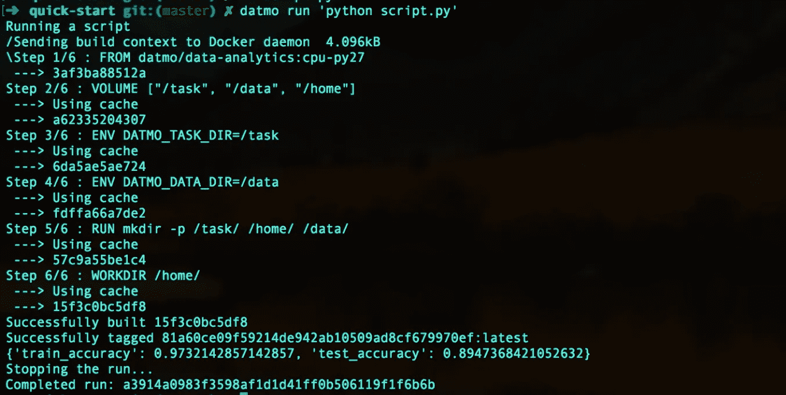
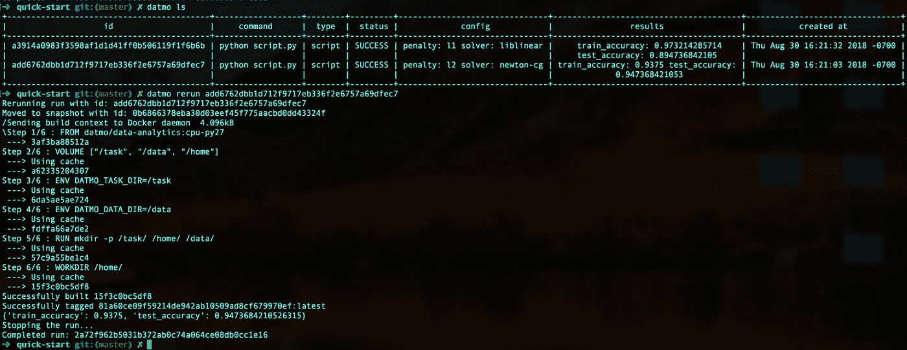

# Datmo:用于跟踪和可重复机器学习实验的开源工具

> 原文：<https://towardsdatascience.com/datmo-the-open-source-tool-for-tracking-and-reproducible-machine-learning-experiments-ce1936188e0c?source=collection_archive---------9----------------------->



由于数据科学家在研究生院和工作中经常训练模型，我们在模型构建过程中面临许多挑战。特别是，这些是我们认为最大的问题:

1.  管理库:我们大多数人都面临着安装运行代码所需的神奇的软件包排列的问题。有时候把 CUDA 升级到 9.2 就是 TensorFlow 1.9 破了。对于其他人来说，这是解决 PyTorch，CuDNN 和 GPU 驱动程序的魔方。用于构建机器学习模型的不断发展的框架和工具越来越多，它们都是独立开发的——简而言之，管理它们的交互是一个巨大的痛苦。
2.  **管理实验**:三次运行前测试精度较高，但我忘记了我使用了什么超参数配置，会发生什么情况？或者试图从最近一批运行中记住哪个版本的预处理产生了最好的模型？需要记录实验以及环境、代码和数据，以及其他实验元数据的例子数不胜数，但是它们在现状中是分离的。

这个问题最近在社区中引起了广泛关注，这是谷歌的皮特·沃顿的[博客](https://petewarden.com/2018/03/19/the-machine-learning-reproducibility-crisis/)。



> 我们的解决方案:

这些问题让我们头疼了无数次，在和朋友聊过之后，我们知道我们并不孤单。我们想要的东西不仅能在实验过程中跟踪配置和结果，还能让数据科学家通过重新运行来重现任何实验！

我们最初将它构建为一个内部解决方案，用于跟踪我们的实验，使它们具有可重复性，并且易于设置环境。当我们开始扩展它时，我们努力开发一种工具，它有一个开放简单的接口，可以与我们已经在做的机器学习的方式无缝集成；相对于框架来说是通用的，但是功能强大，提供了完全的可复制性。基本上，我们可以给我们的朋友一些东西，这样他们可以在命令行上用几个命令运行他们的实验，并且仍然可靠地重复它们。

在我们自己构建和使用它之后，我们决定将其作为一个名为 [***datmo***](https://github.com/datmo/datmo) 的开源工具提供。

下面是[***datmo***](https://github.com/datmo/datmo)的工作原理！

在初始项目设置之后，只需要一个命令来运行实验，最后再用另一个命令来分析结果！



Running an experiment with datmo

这看起来不错，但是当我们有多个实验时会发生什么呢？ ***datmo*** 在这里得到了更多的使用，因为我们可以使用它来比较和分析结果，并在稍后的时间点重新运行先前的实验。下面是如何使用 ***datmo*** 来实现这一点！



Rerunning a previous experiment with datmo

现在，让我们用这个例子来弄脏我们的手。有了 ***datmo*** ，我们消除了复杂性，同时提供了一种快速启动一切的方法。

> 快速入门:

对于这个例子，我们将展示来自经典 [Fisher Iris 数据集](https://en.wikipedia.org/wiki/Iris_flower_data_set)的一个简单分类器的训练

**0。预先请求:**

> 让我们首先确保我们有 datmo 的先决条件。Docker 是主要的先决条件，所以让我们确保 docker 已经安装(并且正在运行！)才开始。你可以在这里找到基于你的 OS 的说明: [MacOS](https://docs.docker.com/docker-for-mac/install/#install-and-run-docker-for-mac) ， [Windows](https://docs.docker.com/docker-for-windows/install/) ， [Ubuntu](https://docs.docker.com/install/linux/docker-ce/ubuntu/#uninstall-old-versions) 。

然后，我们可以使用以下命令从您的终端安装 ***datmo*** :

```
$ pip install datmo
```

## 1.克隆这个 GitHub [项目](https://github.com/shabazpatel/quick-start.git)，

```
$ git clone [https://github.com/shabazpatel/quick-start.git](https://github.com/shabazpatel/quick-start.git)
```

## 2.在您的项目中，使用 CLI 初始化 datmo 客户端

```
$ cd quick-start
$ datmo init
```

然后，响应以下提示:

```
Enter name: (up to you!)Enter description: (up to you!)
```

接下来，将询问您是否想要设置您的环境。

选择`y`并在出现提示时依次选择以下选项:

```
Please select one of the above environment type: **cpu**Please select one of the above environments: **data-analytics**Please select one of the above environment language: **py27**
```



## 3.现在，使用下面的命令运行您的第一个实验，

```
$ datmo run ‘python script.py’
```



让我们看看所有运行的列表，

```
$ datmo ls
```



## 4.现在让我们修改新一轮的脚本，

我们将更改`script.py`文件。让我们取消脚本中下面一行的注释，并删除另一个配置字典，

```
# config = { "solver": "liblinear", "penalty": "l1" }
```



## 5.现在我们已经更新了脚本中的环境和配置，让我们运行另一个实验，

```
$ datmo run ‘python script.py’
```



## 6.一旦完成，我们现在将有两个实验跟踪，能够在任何机器上重新运行

```
Check for the previous runs with:
$ datmo lsSelect the earlier run-id to rerun the first experiment
$ datmo rerun <run-id>
```



恭喜你，你已经成功地复制了之前的实验！

以前，这一过程会浪费时间和精力，带来各种故障排除和令人头痛的问题！使用 **datmo** ，我们运行实验，跟踪它们，并用 4 个命令重新运行它们。现在，您可以使用这个通用标准分享您的实验，而不必担心复制，无论是队友复制您的工作还是尝试将模型部署到生产中。这显然只是一个小样本，但是您可以出去亲自尝试其他流，例如在 2 分钟内旋转 TensorFlow jupyter 笔记本！

在 [GitHub](https://github.com/datmo/datmo) 上查看我们，并在 [@datmoAI](https://twitter.com/datmoAI) ✌️给我们反馈