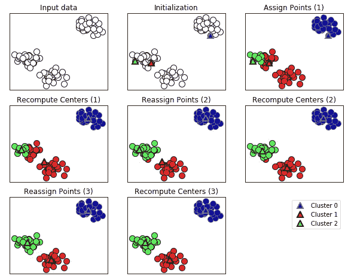
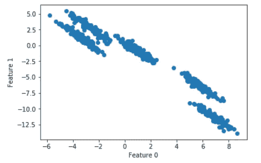
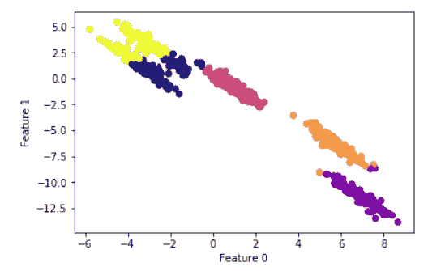
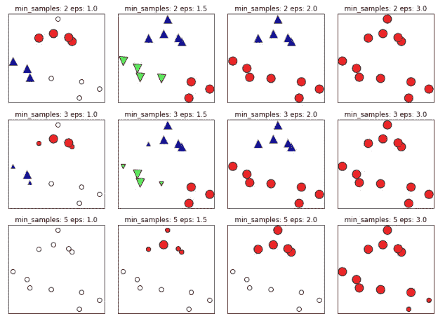
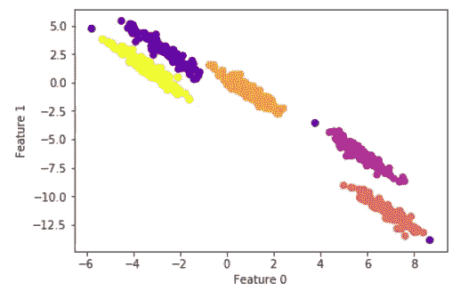

# 数据形状的 DBSCAN 聚类 k-means 不能很好地处理(在 Python 中)

> 原文：<https://towardsdatascience.com/dbscan-clustering-for-data-shapes-k-means-cant-handle-well-in-python-6be89af4e6ea?source=collection_archive---------0----------------------->

在这篇文章中，我想从 Andreas C. Müller & Sarah Guido 的[使用 Python 进行机器学习简介](http://shop.oreilly.com/product/0636920030515.do)中选取一些内容，并简要阐述其中一个示例，以展示当 [k-means 集群](https://en.wikipedia.org/wiki/K-means_clustering)似乎不能很好地处理数据形状时 [DBSCAN](https://en.wikipedia.org/wiki/DBSCAN) 集群的一些优势。我将直奔主题，所以我鼓励你阅读第三章的全部内容，从 168 页开始，如果你想扩展这个话题的话。当描述算法的工作时，我将引用这本书。

## 使聚集

*   **它的任务是将数据集划分成组，称为集群**
*   **目标是以这样的方式分割数据，使得单个聚类中的点非常相似，而不同聚类中的点不同**

## k 均值聚类

*   **试图找到代表数据**的特定区域的*聚类中心*
*   **在两个步骤之间交替:将每个数据点分配给最近的聚类中心，然后将每个聚类中心设置为分配给它的数据点的平均值**
*   **当实例到集群的分配不再改变时，算法结束**

这就是 k-means 在可视化表示中的工作方式:

```
import mglearnmglearn.plots.plot_kmeans_algorithm()
```



k-means 聚类的一个问题是，它假设所有方向对于每个聚类都是同等重要的。这通常不是大问题，除非我们遇到一些形状奇怪的数据。

在本例中，我们将人工生成该类型的数据。使用本书作者提供的以下代码(对聚类数做了一些小的修改)，我们可以生成一些 k-means 无法正确处理的数据:

```
import numpy as np
import matplotlib.pyplot as plt
from sklearn.datasets import make_blobs
from sklearn.cluster import KMeans# generate some random cluster data
X, y = make_blobs(random_state=170, n_samples=600, centers = 5)
rng = np.random.RandomState(74)# transform the data to be stretched
transformation = rng.normal(size=(2, 2))
X = np.dot(X, transformation)# plot
plt.scatter(X[:, 0], X[:, 1])
plt.xlabel("Feature 0")
plt.ylabel("Feature 1")
plt.show()
```



正如你所看到的，我们可以说有 5 个定义好的具有拉伸对角线形状的集群。

让我们应用 k 均值聚类:

```
# cluster the data into five clusters
kmeans = KMeans(n_clusters=5)
kmeans.fit(X)
y_pred = kmeans.predict(X)# plot the cluster assignments and cluster centers
plt.scatter(X[:, 0], X[:, 1], c=y_pred, cmap="plasma")
plt.scatter(kmeans.cluster_centers_[:, 0],   
            kmeans.cluster_centers_[:, 1],
            marker='^', 
            c=[0, 1, 2, 3, 4], 
            s=100, 
            linewidth=2,
            cmap="plasma")plt.xlabel("Feature 0")
plt.ylabel("Feature 1")
```



我们在这里可以看到， *k-means* 已经能够正确地检测到中间和底部的集群，而对于顶部的集群则存在问题，这些集群彼此非常接近。作者说:*“这些群体向对角线拉伸。由于 k-means 只考虑到最近的聚类中心的距离，它不能处理这类数据”*

让我们看看 DBSCAN 聚类如何帮助处理这种形状:

## 基于密度的噪声应用空间聚类

关于 DBSCAN 集群的一些亮点摘自该书:

*   代表*“基于密度的有噪声应用的空间聚类”*
*   不需要用户预先设置聚类数*和*
*   可以捕捉复杂形状的集群
*   可以识别不属于任何聚类的点(作为异常值检测器非常有用)
*   比凝聚聚类和 k-means 稍慢，但仍可扩展到相对较大的数据集。
*   工作原理是识别特征空间的*拥挤*区域中的点，其中许多数据点靠得很近(特征空间中的密集区域)
*   密集区域内的点称为*岩心样本*(或岩心点)
*   DBSCAN 中有两个参数:`min_samples`和`eps`
*   如果在到给定数据点的距离`eps`内至少有`min_samples`个数据点，则该数据点被分类为*岩心*样本
*   通过 DBSCAN 将彼此距离比距离`eps`更近的*核心*样本放入同一簇中。

这是聚类如何根据两个参数的选择而变化的示例:

```
mglearn.plots.plot_dbscan()
```



In this plot, points that belong to clusters are solid, while the noise points are shown in white. Core samples are shown as large markers, while boundary points are displayed as smaller markers. Increasing eps (going from left to right in the figure) means that more points will be included in a cluster. This makes clusters grow, but might also lead to multiple clusters joining into one. Increasing min_samples (going from top to bottom in the figure) means that fewer points will be core points, and more points will be labeled as noise.

参数`eps`在某种程度上更重要，因为它决定了点靠近*意味着什么。*将`eps`设置得很小将意味着没有点是核心样本，并且可能导致所有点被标记为噪声。将`eps`设置得非常大将导致所有点形成一个单独的簇。

让我们回到我们的例子，看看 DBSCAN 如何处理它:

```
from sklearn.cluster import DBSCAN
from sklearn.preprocessing import StandardScalerscaler = StandardScaler()
X_scaled = scaler.fit_transform(X)# cluster the data into five clusters
dbscan = DBSCAN(eps=0.123, min_samples = 2)
clusters = dbscan.fit_predict(X_scaled)# plot the cluster assignments
plt.scatter(X[:, 0], X[:, 1], c=clusters, cmap="plasma")
plt.xlabel("Feature 0")
plt.ylabel("Feature 1")
```



在扭曲`eps`和`min_samples`一段时间后，我得到了一些相当一致的集群，仍然包括一些噪声点。

*   虽然 DBSCAN 不需要显式地设置簇的数量，但是设置`eps`隐式地控制将找到多少个簇。
*   缩放数据后，为`eps`找到一个好的设置有时会更容易，因为使用这些缩放技术将确保所有特征具有相似的范围。

最后，考虑到我们创建了明确定义 5 个聚类的数据点，我们可以使用 adjusted_rand_score 来衡量性能。这种情况并不常见，因为在实际情况中，我们一开始就没有聚类标签(因此我们需要应用聚类技术)。因为在这种情况下，我们有标签，我们可以测量性能:

```
from sklearn.metrics.cluster import adjusted_rand_score#k-means performance:
print("ARI =", adjusted_rand_score(y, y_pred).round(2))
ARI = 0.76#DBSCAN performance:
print("ARI =", adjusted_rand_score(y, clusters).round(2))
ARI = 0.99
```

你有它！DBSCAN 得分为 0.99，而 k-means 仅得 0.76