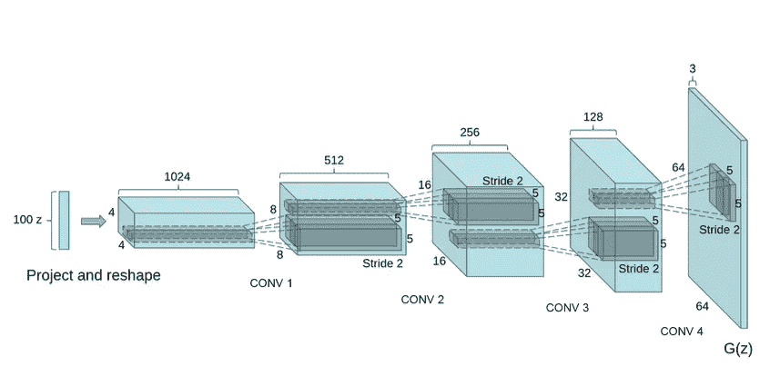
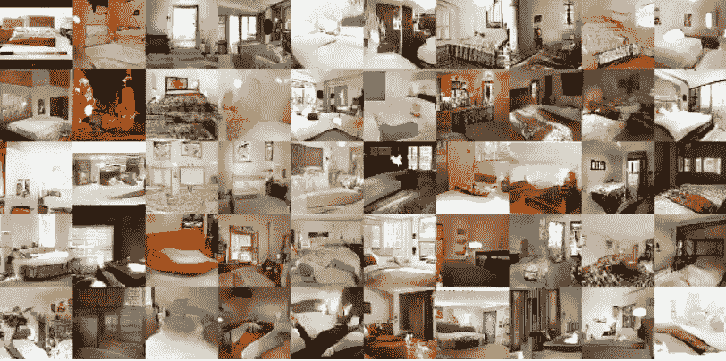

# 深度卷积生成对抗网络

> 原文：<https://towardsdatascience.com/dcgans-deep-convolutional-generative-adversarial-networks-c7f392c2c8f8?source=collection_archive---------6----------------------->

生成对抗网络最有趣的部分之一是生成网络的设计。生成器网络能够获取随机噪声并将其映射到图像中，使得鉴别器无法辨别哪些图像来自数据集，哪些图像来自生成器。

这是神经网络的一个非常有趣的应用。通常，神经网络将输入映射为二进制输出(1 或 0)，可能是回归输出(某个实数值)，甚至是多个分类输出(如 MNIST 或 CIFAR-10/100)。

在本文中，我们将看到神经网络如何从随机噪声映射到图像矩阵，以及在生成器网络中使用卷积层如何产生更好的结果。

我们将回顾在 ICLR 展示 [DCGANs 的论文，这是一个生成卧室的生成器网络架构，我们将回顾来自 GANs-in-Action 知识库的一些 Python/Keras 代码。](https://arxiv.org/abs/1511.06434)



这是 LSUN 场景建模论文中介绍的 DCGAN 生成器。该网络接收一个 100×1 的噪声矢量，表示为 Z，并将其映射到 64×64×3 的 G(Z)输出。

这种架构特别有趣的是第一层扩展随机噪声的方式。网络从 100x1 到 1024x4x4！这一层被称为“项目和整形”。

我们看到，在这一层之后，应用了传统的卷积层，该卷积层使用传统卷积层教导的(N+P — F)/S + 1 等式来重塑网络。在上图中，我们可以看到 N 参数(高度/宽度)从 4 到 8 到 16 到 32，似乎没有任何填充，内核过滤器参数 F 是 5x5，步幅是 2。您可能会发现，这个等式对于设计定制输出大小的卷积层非常有用。

我们看到网络从

100 x 1→1024 x 4 x 4→512 x 8 x 8→256 x 16 x 16→128 x 32 x 32→64 x 64 x 3



以上是论文中给出的网络输出，引用了 5 代训练后的结果。相当令人印象深刻的东西。

现在，让我们看一些 python 代码:

这段代码摘自 Jakub Langr 和 Vladimir Bok 创建的 gans-in-action 知识库，据我所知，这是在 Keras 中实现 gans 的最佳入门代码。我认为这本书还没有发行，但我想象它会很好。

[](https://github.com/GANs-in-Action/gans-in-action/blob/master/chapter-3/Chapter_3_GAN.ipynb) [## 战斗中的甘斯/战斗中的甘斯

### 行动中的 GANs 的伙伴知识库:具有生成性对抗网络的深度学习…

github.com](https://github.com/GANs-in-Action/gans-in-action/blob/master/chapter-3/Chapter_3_GAN.ipynb) 

下面的代码是我如何运行我的第一个 GAN 网络的，(没有实现 DCGANs):

```
def generator(img_shape, z_dim):
  model = Sequential() # Hidden layer
  model.add(Dense(128, input_dim = z_dim)) # Leaky ReLU
  model.add(LeakyReLU(alpha=0.01)) # Output layer with tanh activation
  model.add(Dense(28*28*1, activation='tanh'))
  model.add(Reshape(img_shape) z = Input(shape=(z_dim,))
  img = model(z) return Model(z, img)
```

下面的架构并不复杂，实际上在 MNIST 数据集的例子上产生了相当不错的结果。该模型接受噪声矢量并将其映射到密集连接的层，该层映射到输出层，该输出层是被整形为 28×28 MNIST 数字矩阵的平面 784×1 矢量。

现在让我们将其与 gans-in-action 存储库中提供的 DCGAN 代码进行对比:

```
def generator(img_shape, z_dim):
  model = Sequential()

  # Reshape input into 7x7x256 tensor via a fully connected layer
  model.add(Dense(256*7*7, input_dim = z_dim))
  model.add(Reshape((7,7,256)) # Transposed convolution layer, from 7x7x256 into 14x14x128 tensor
  model.add(Conv2DTranspose(
               128, kernel_size = 3, strides = 2, padding='same')) #Batch normalization
  model.add(BatchNormalization()) #Leaky ReLU
  model.add(LeakyReLU(alpha=0.01)) # Transposed convolution layer, from 14x14x128 to 14x14x64 tensor
  model.add(Conv2DTranspose(
              64, kernel_size=3, strides=1, padding='same')) # Batch normalization
  model.add(BatchNormalization()) # Leaky ReLU
  model.add(LeakyReLU(alpha=0.01)) # Transposed convolution layer, from 14x14x64 to 28x28x1 tensor
  model.add(Conv2DTranspose(
               1, kernel_size = 3, strides = 2, padding='same')) # Tanh activation
  model.add(Activation('tanh')) z = Input(shape=(z_dim,))
  img = model(z) return Model(z, img)
```

我们看到上面的架构非常类似于 ICLR，LSUN 场景生成器论文中提出的 DCGAN。输入从 100×1 噪声投射到 7x7x256 张量，然后卷积，直到达到 28×28×1 MNIST 数字输出。


同样，我们看到同样的项目和整形，接着是卷积层进入起始代码中图表的输出。

# 结论

我希望这篇文章能帮助您开始构建自己的 DCGANs。我认为它至少很好地解释了高层架构应该如何工作。剩下的挑战在于为卷积层以及投影和整形层找到正确的参数。

我真的发现这个开源代码库和 ICLR 论文的结合有助于我理解这个概念。我对构建 GANs 并看到他们能做什么感到非常兴奋，请留下您认为真正有帮助的任何其他资源的评论。如果您想了解使用这些 DCGANs 进行数据扩充的进一步研究，请点击此处。

# [CShorten](https://medium.com/@connorshorten300)

Connor Shorten 是佛罗里达大西洋大学计算机科学专业的学生。对计算机视觉、深度学习和软件工程感兴趣。