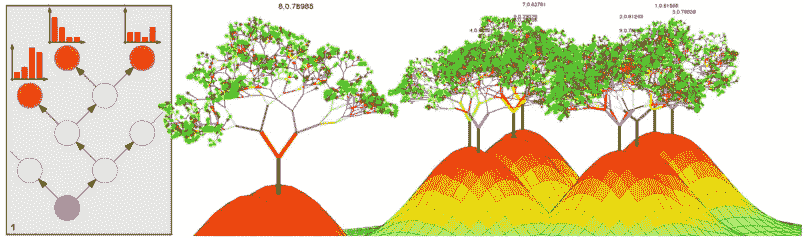
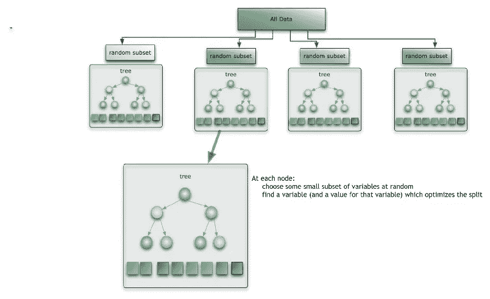
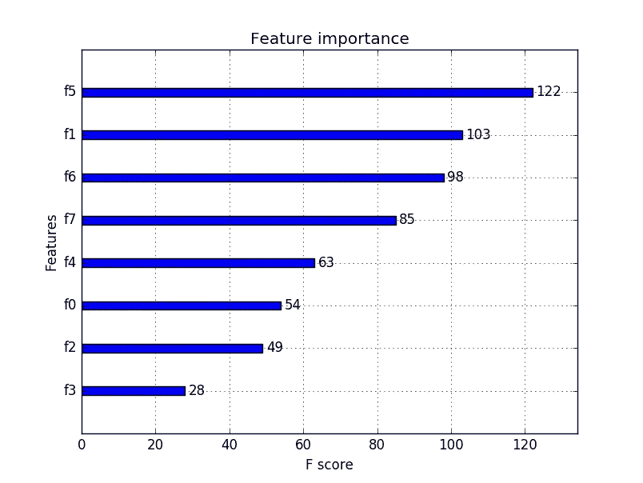
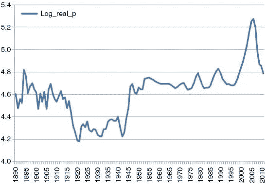
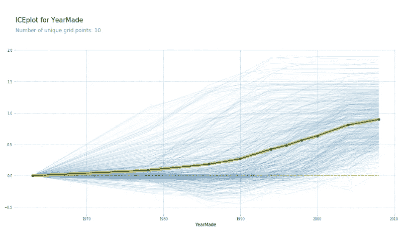
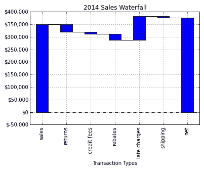

# 对随机森林进行解码

> 原文：<https://towardsdatascience.com/de-coding-random-forests-82d4dcbb91a1?source=collection_archive---------7----------------------->

## **用 Python 从头开始构建你的随机森林，并解释“黑盒”背后的数学原理**

**动机**:随机森林集成广泛用于现实世界的机器学习问题、分类以及回归。它们的受欢迎程度可以归因于这样一个事实，即实践者通常使用随机森林算法获得最佳结果，只需最少的数据清理，并且没有特征缩放。为了更好地掌握基本原理，我决定从头开始编写一个随机森林，并对数据中的不同特征及其在决定最终结果中的作用进行一些可视化。人们普遍认为这是一个黑盒，快速浏览一下这个算法将会证明它实际上是很容易解释的，除了是一种利用“多数票的力量”的强大技术。

# **简介**

随机森林集成是一种分而治之的方法，用于提高单个弱决策树模型的性能。这背后的主要原理是一群“弱学习者”可以走到一起形成一个“强学习者”。每个分类器，单独地，是一个“弱学习者”，而所有的分类器放在一起是一个“强学习者”。

## 随机森林集合

随机森林概念的核心是对大量决策树的结果进行平均。决策树通常是向不熟悉机器学习的人解释预测背后的直觉的便捷工具。但是解释一个随机森林如何得出一个预测，以及使用哪些特征或独立变量，可能是一项相当艰巨的任务。随机森林经常被误解为“黑盒”或难以理解。

Random Forest Ensemble

## **用 Python 编码随机森林**

下一节将从头开始演示随机森林的编码和优化，并深入了解随机森林的工作方式。我们还着眼于理解在预测结果时，某些特征如何以及为什么比其他特征被赋予更大的权重。

## **随机森林和决策树类**

使用 Python 中面向对象的编程方法，定义了由“决策树”对象组成的类“RandomForest”。随机森林基本上是其决策树执行的每个核心功能的收集器和平均值计算器。

The Random Forest class

The Decision Tree class

*   构造函数(__init__)采用样本大小或训练样本的数量来为每棵树考虑，以及为每棵树分割的最大特征，以便在每棵树中灌输随机性并消除预测中的偏差。它还需要随机森林算法中使用的一些其他常见超参数。
*   fit 方法执行使用训练数据构造随机森林的成员树的关键功能。
*   predict 方法执行跨每个成员树平均测试数据预测的功能，以决定测试数据的最终预测结果。

## **训练模型的逻辑流程**

随机森林类中的 fit()方法被调用用于训练模型，该方法调用决策树类中的函数 var_split()，该函数循环调用 find_better_split()。这将构造林中的每个成员决策树，并适合每棵树的定型数据。

var_split() function implementation in Decision Tree

find_better_split() function implementation

在找到在每次分裂时最大化同质性的特征之后，决策树递归地分裂成左和右子树。这是通过双回路逻辑实现的:

*   第一个循环是遍历树的所有特征，以确定哪个特征对于特定级别的分割是最好的。var_split()函数为每个特性调用 find_better_split()，以确定产生最纯粹叶节点的特性。
*   在内部循环中，对每个特征调用 find_better_split()函数，以计算该特征的最佳值，在该最佳值处应该对树进行分割。
*   这是通过对该特性的值进行排序、遍历该特性的所有不同值并跟踪因变量的相应值来实现的。
*   计算分数，该分数是通过在每个不同的值处为每个特征分割树而获得的信息增益。该分数表示分裂后形成的子树的方差，需要将其最小化。
*   导致子树中最低方差或最大同质性的特征和特征值的组合被选择用于分割。
*   在找到最佳特征和最佳分割值后，树被分割成左右子树，并且该类的 leftTree 和 rightTree 成员被填充。
*   在 leftTree 和 rightTree 成员上递归调用函数 var_split()，以找到要分割的最佳特征以及该特征的最佳值。这一直持续到满足叶节点的条件之一，即达到树的最大深度或达到数据样本的最小量。
*   分配给该叶的值是包含在其中的训练样本的平均值，或者是共同代表该叶中数据的相应值。

## **对测试/验证数据集进行预测**

predict() function for Random Forest

predict() implementation for a Decision Tree

使用该模型预测结果的代码非常简单明了。

*   随机森林集合的预测是通过平均每个单独决策树的预测来完成的。

**注意**:对于随机森林回归器来说，平均预测是一种很好的技术，但是对于随机森林分类器来说，考虑树木预测的**频率**并选择具有最大频率的预测值才是正确的做法。

*   在决策树中，对每一行的预测是通过遍历树，将特征值与要在每一层上分割的特征值进行比较，如果特征值较小，则导航到左侧子树，如果特征值较大，则导航到右侧子树来完成的。这一直持续到到达叶节点。
*   然后，对该行的预测是叶节点中包含的值，该值已在训练阶段预先分配。

## 解释随机森林模型

我们现在有了自己的随机森林集合库的基本结构。让我们添加功能交互和树解释的超级有用的增强，这是帮助解释随机森林的重要概念。

## **特征重要性背后的直觉**

Calculate feature importances for this model

要了解某个特定特征在决定模型预测时有多大发言权，请遵循以下方法:

*   记录数据集预测的评估指标(准确性或误差)。
*   接下来，使用 Numpy 库中的 shuffle()方法对重要性有待确定的特性的值进行随机洗牌。
*   通过运行模型来预测具有该特定特征列的值的数据集的值，再次计算评估度量。
*   计算得到的度量和没有打乱特征值的先前度量之间的差异。
*   如果差异很大，得到的度量要差得多，那么这个特定的特性在决定模型预测时肯定有很大的发言权。

如果随机改变某个特性的值会导致模型性能急剧下降，我们可以说这个特性肯定会在树中相对较高的位置使用，并且**很重要**。在我的实现中，这种技术已经通过遍历特性而被用于每个特性。

可以为特征及其相应的重要性绘制漂亮的可视化图形，如条形图，以解释我们的随机森林模型赋予不同特征的权重。

Feature Importance Chart

## **随机森林的部分相关图**

部分相关图对于理解结果或目标变量如何随特定特征变化，以及目标和该特征之间的实际关系特别有用。是单调递增/递减还是无规律？

## **单变量图与部分相关图**

如果我们看一个典型的单变量图来寻找一个特征对目标变量的影响，我们很少看到连续的上升/下降曲线或直线。单变量图通常是不规则的。

例如，假设您正在处理一个住房数据集，并希望在给定一组要素(包括房屋建造年份、地点和其他要素)的情况下预测房价。如果你绘制一个价格与建造年份的单变量图，你会看到一条连续上升的曲线，因为房地产价格通常会随着时间的推移而上涨。但是在几年间，这一情节变得越来越糟。这会错误地让你相信这几年是房价下跌的年份。

Univariate Plot for the log of House Prices varying with Year Built

然而，这可能是因为那些年买的大多数房子都在相对便宜的地方，因此曲线下降。

一个部分相关图将解决这个问题，并显示价格和年份之间的真实关系，你会发现它们毕竟是持续增长的。这是因为在部分相关图中，我们只考虑变化的特征，确保所有其他特征保持不变。因此，我们从其他因变量中剔除噪声，并更好地理解每个特征与目标变量之间相互作用的真实性质。

Partial Dependence Plot would show the correct trend of prices against Year Built

## 部分依赖图的实现

我的部分依赖图的实现方式如下:

Partial Dependence Plot for a particular feature

*   保持所有其他列(特征值)不变，继续遍历要考虑的要素的所有唯一值，并运行模型来预测该要素的每个唯一值的结果。
*   绘制结果值，以了解目标变量随特定特征变化的趋势。

保持其他列不变并改变计算依赖的特征，是解决来自外部源的噪声渗入特征和目标之间关系的描述的问题的关键。

## **随机森林的树解释器**

解释随机森林预测流程的一个非常有用的技术是对每个决策树使用树解释器。

Tree Interpreter Class with the predict function

树根处的值(简单地说就是训练数据中所有目标的平均值)被称为“偏差”。

树解释器类中的 predict()函数调用决策树中的 predict_row_for_ti()函数，该函数预测“行”或单个数据样本的结果。

在每次分割时，使用分割成子树后样本平均值的变化量来计算分割中使用的特征的贡献。

特征贡献被存储在一个数组中，直到到达一个叶子，然后结果被返回给树解释器。

在叶节点，返回该数据样本的预测值，以及偏差和“贡献”，即每个特征对最终结果的贡献。

Function inside the Decision Tree, used by the Tree Interpreter

## **基于树形解释器的瀑布图**

使用 python 中最新的“瀑布”包，每个特性对到达叶节点(最终结果)的贡献可以通过瀑布图可视化。

瀑布图是可视化每个特性贡献的最有效方法之一，从树根开始，直到叶节点的最终结果。

Waterfall Chart with the contributing features in X axis and resulting target values in the Y axis

## **未来的增强功能**

需要进一步丰富随机森林库的几个方面如下:

在树解释的基础上，需要对随机森林中的特征的相关性进行工作，通过找到在连续分割中经常使用的特征组，因此可能具有更高的相关性。

这将是探索随机森林中特征相互作用的第二种方法，第一种方法是可以扩展到多个特征的部分相关图。

**注意**:Python 中的标准机器学习库在速度和效率方面进行了高度优化，因此你从头编写的任何代码都可能需要在**cy thon**(Python 使用的底层 C 实现)中执行，以获得更快的结果。为此，只需将“%%cython”添加到代码的开头。

## **最终想法和关键要点**

这是从头开始编写机器学习算法的良好起点，也是理解 Python 中几个超级有用的库的良好起点，包括用于快速数学计算的 Numpy 和用于数据可视化的 Matplotlib。

完整的实现可以在我的 Jupyter 笔记本中找到，网址是 https://github . com/SonaliDasgupta/mlandiaalgorithmsfromsscratch，在那里我尝试了使用数据集的想法和可视化。代码必须进一步完善和优化，我正在努力。非常欢迎任何建议或贡献。

这对我来说是一个非常愉快的练习，我希望我已经帮助你在数学上和视觉上更深入地研究了随机森林实现，并且理解它并不像看起来那么复杂或“黑箱”。

## **参考文献**:

1.  [http://blog . citizennet . com/blog/2012/11/10/random-forests-ensembles-and-performance-metrics](http://blog.citizennet.com/blog/2012/11/10/random-forests-ensembles-and-performance-metrics)
2.  [https://course.fast.ai/ml.html](https://course.fast.ai/ml.html)