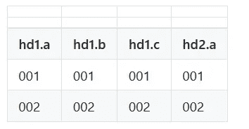
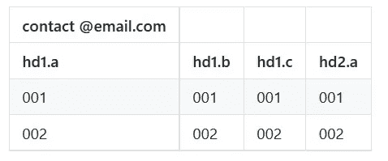
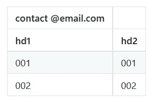

# 处理数据灾难:简单的修复

> 原文：<https://towardsdatascience.com/dealing-with-data-disasters-simple-fixes-6f588f57f993?source=collection_archive---------7----------------------->

您多久收到一次已经准备好用于分析或数据可视化的数据集？不是来自 viz 示例或教程的？我不知道你是怎么想的，但是几乎所有到我手里的数据都需要至少一点点的清理。

大多数修复都相当简单，有些可以很容易地手动完成。然而，有时我会得到一大堆文件，手动修复每个文件会相当耗时。所以我一直在用 python 开发一个小的命令行工具，来加速一些数据清理的苦差事。该工具创建了一个新文件，因此原始数据文件仍然是完整的。

# 通过命令行使用工具

## 撇

`python cleaner.py -skim`

这将删除 csv 文件开头的任何空行或多余行。这个似乎很容易用手修复。只需打开文件并删除有问题的行。很简单。

但是如果它是一组 2000+的文件，并且在每个文件的前两行都有一个徽标，也许还有一个电子邮件地址呢？有些文件下面有一个空行，有些有三个空行。有些还有邮寄地址。

为了处理标题行上面的这些额外的行，标记“-skim”告诉 cleaner.py 脚本将所有数据保存到一个新的 csv 文件中，不包含额外的行。空行很容易。该脚本只是检查这些行中是否有任何内容，然后跳到第一个有内容的行。



empty rows above header row

如果有额外的行，带有徽标或联系信息，事情会变得稍微复杂一些。大多数情况下，文件有几列数据，额外的行只是一列或两列。在这种情况下，脚本会检查第一行的长度是否小于数据行的一半(在此之前会检查数据行的长度)。



extra rows above header row

但是，这种方法在只有几列数据的情况下会失败。还有其他边缘情况，但这是最常见的。



extra row, but too few columns of data → fail to

在这种情况下，最好使用'-rows '标志来指示要保存哪些行。

## 选择特定行

如果您知道您想要哪些行，您可以使用'-rows '标志来选择它们。

`python cleaner.py -rows 1-20`

如果你只想跳过前 10 行，你可以只使用你想开始的行号。该脚本假设您需要这之后的所有内容。

`python cleaner.py -rows 10`

这也可以与“-skim”和“-cols”结合使用

`python cleaner.py -skim -rows 10 -cols 2-5`

这将删除额外的标题，并保存原始文件中的特定行和列。当我创建测试或样本集时，我经常使用它。

## 选择特定列

```
python cleaner.py -cols 2, 5-9, 12
```

*   可以按索引在范围内单独选择特定的列
*   索引从 0 开始。

***功能与选择行时略有不同。***

*   如果只给出一个索引->只选择该列。
*   要选择一个列和后面的所有列，如 8 之后的所有列，请使用“+”

```
 -cols 8+ 
```

***为什么？***

列选择不同于行选择，因为我发现我通常对原始数据集中的特定列感兴趣。有时候，一个数据集有很多问题，我只想一次处理一列(或几列)。对于行，我通常只需要一个小的子集，哪一行并不重要。我可能只想要最后 20 行，但是我可能不需要指定第 9 行和第 21 行。

# 默认情况下会发生什么？

许多事情会自动完成。

## “未命名”标题-移除

将 excel 表转换为 csv 可能会导致第一行的空单元格被填充“未命名:#”，因此这些单元格将从标题行中删除。

## 移除空列和空行

一些 csv 文件有空的列和行。这些会自动删除。如果一个文件有很多空的列和行，我可能会在做任何事情之前运行清除程序，不带任何标志。

## 删除多余的表格和总和行:

有些文件在所有实际数据下方有汇总表，或者有一行是列总和。这些都被移除了。

## 展平标题:

如果有多层标题，它们会被展平成一行。

所以像这样的桌子

会被转换成这样的东西

注意:如果设置了“另存为 json”选项，这个展平功能将被忽略…我们将在另一篇文章中详细讨论 json。

在本系列的下一篇文章中，我们将讨论一些稍微复杂一点的修复…比如从一列的内容中提取一个丢失的标题名。

这个项目的源代码可以在 [github](https://github.com/kristin-henry-sf/dataPython) 上找到。