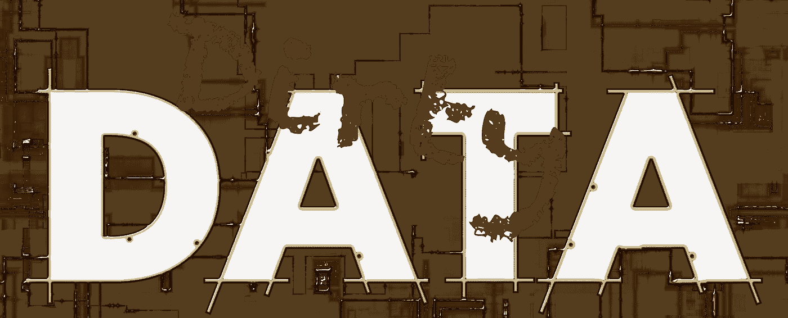

# 处理学习系统中的脏数据

> 原文：<https://towardsdatascience.com/dealing-with-dirty-data-in-your-learning-systems-81999f199037?source=collection_archive---------6----------------------->

每个伟大的学习系统背后都有数据。你对系统做得越多，产生的数据就越多。你越是合并系统、导入历史记录和篡改数据来解决问题，你生成的数据就越多，数据就越不“干净”。什么是干净数据？什么是脏数据？如何清理脏数据？问题问题。

让我们从如何定义干净数据和脏数据开始。在我的定义中，干净数据是通过直接使用系统生成的数据。在学习系统中，当你创建一个新用户时，当他们完成学习时，当他们变得有能力或在作业中被标记时，就会产生数据。它是通过使用系统工具，由学习者或辅导员的行动直接分配的。很完整也很准确。脏数据不干净！它包含错误或缺少关键字段。脏数据是由许多其他因素引入的。这可能是管理员“调整”学习记录，导入其他地方记录的记录，合并不同系统的记录，引入不完整的数据以及任何涉及直接调整后端数据库的事情。

所以导入和调整数据是有风险的事情。这并不是说你做了一次就自动破坏或污染了你所有的数据，但这肯定意味着你要冒这个风险。如果你的数据杂乱无章，你就有被感染的风险，而且很难清除。如果你想知道我们到底为什么要这么做，答案很简单，现实生活并不像总是让一切都通过你的系统那样简单或清晰。我们知道，有时您会在其他地方生成或保存数据，并且确实需要将它们带过来。所以为了安全起见，你必须采取保护措施。就数据而言，这意味着在让数据进入您和您的系统之前，要对数据进行相当严格的筛选。这也是为什么项目的早期范围界定阶段如此重要的另一个原因。一旦您发现数据是脏的，下一步就是清理它。数据清理可能是一个及时的(因此也是昂贵的)过程，所以你提供的数据越好，清理的痛苦就越少。

我在导入的数据中看到的最大的失败是每一行数据都缺少唯一的标识符。如果没有，清理工作将从为每个用户、每个“对象”、系统中任何地方引用的所有内容分配唯一标识符开始。您可以将唯一标识符的不一致使用算作没有唯一标识符，事实上这更糟糕，因为它使数据在第一次检查时看起来相当干净。数据差距也是常见的问题，在某些情况下，这是可以接受的，在其他情况下，它们是不可接受的；想象一个课程代码为空，但有一个完成日期。你认为一个学习系统如何处理一门课程，而不识别它，只知道它是什么时候完成的(这不是很好)。相似但不相同的数据是另一个痛苦。您和我都知道 St .和 Street 可能是相同的，但是在数据方面它们是不同的(这就是为什么那些唯一的 id 如此重要)。

如何判断您的数据是否是脏的？有一些非常关键的事情将很快决定这一点。差距是最明显的一个，尤其是在必需的 ID 字段中。使用 Excel 等电子表格程序中的工具进行一些分析，可以找到重复的内容。缺少 ID 字段也是一个非常明显的起点！数据的关键是系统化。脏数据通常是由人为错误引起的，在日常使用中不接触数据会增加数据保持干净的机会。当然，具有讽刺意味的是，脏数据通常需要大量的人工干预才能恢复到干净的状态。

最大的危险是，你的系统中有很多数据因为系统而变得非常干净，然后你向其中引入了一点脏数据。突然，您的系统的整个数据集遭到破坏，您的少量脏数据突然产生了大量脏数据。清理由此造成的混乱远比在导入数据之前确保数据是干净的要重要得多。

我的建议是双重的。首先让你的系统来管理你的数据，如果可以的话，不要插手。其次，如果您必须从外部来源引入数据，那么在导入之前，需要花费时间和精力来确保数据是干净的。当然，你可以导入它，然后清理它，但这样你就清理了整个系统，这是非常痛苦的。

如果你打算改变系统或者把你的学习系统和你的人力资源系统联系起来，这是清理你的数据的好时机。请记住，干净数据加上脏数据等于大量脏数据，最好在链接或引入新系统之前完成这项工作。

如果那些肮脏的数据让你觉得肮脏，我道歉！请随意附和您的肮脏数据故事，但不要期望我做所有的清理工作！