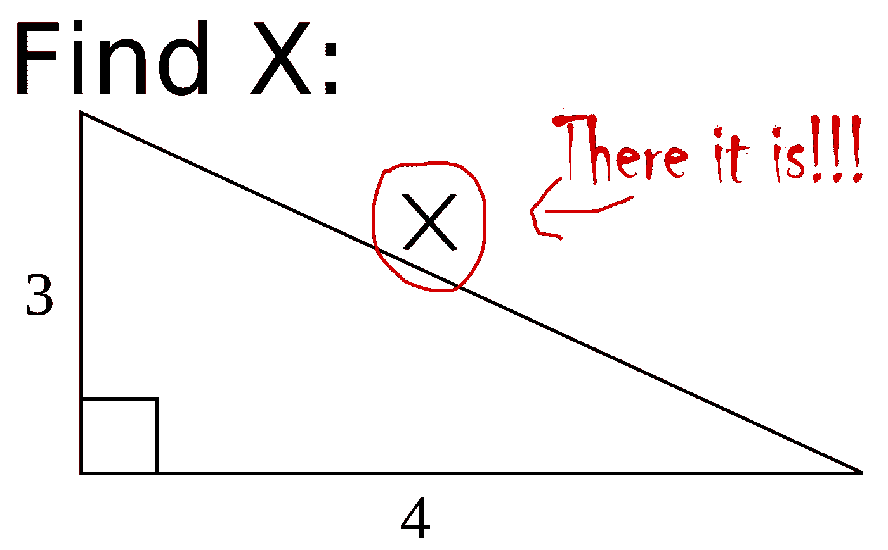
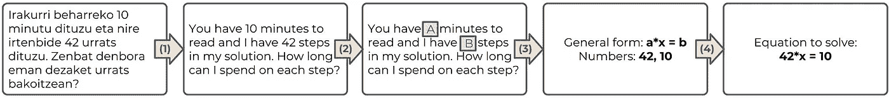
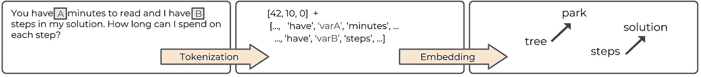
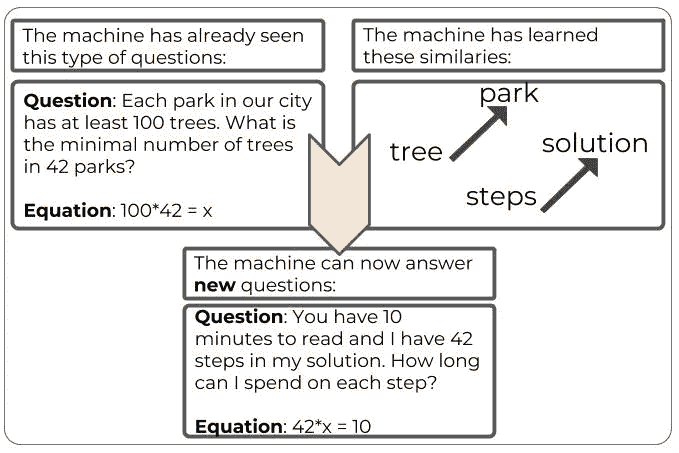
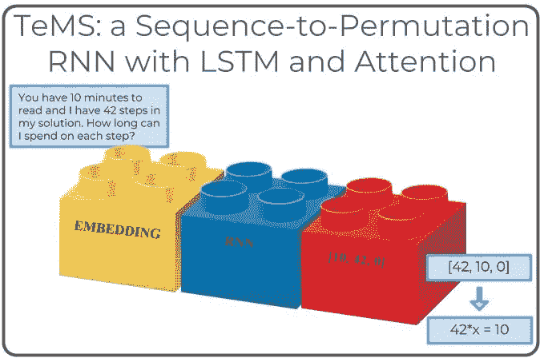
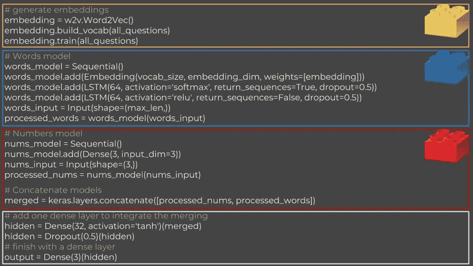

# 亲爱的数学，我不是你的治疗师，解决你自己的问题。

> 原文：<https://towardsdatascience.com/dear-math-i-am-not-your-therapist-solve-your-own-problems-da835102dacb?source=collection_archive---------14----------------------->

## 或者实际上，我会建立一个神经网络来为你解决这些问题。

想象一下一个类似私人数学家教的网站。它可以解方程，甚至指导你解方程，这样你就可以自己解下一个方程了。现在想象一下，有一天你想和你的自动导师不仅通过方程进行交互，还可以使用你的自然语言。

好吧，别再想了。这个名为 [Simplisico](https://simplisico.com/) 的网站已经存在。为了让你能够用你的自然语言与它互动，在这个过程中需要发生的一件事是，Simplisico 将自己理解你实际上试图解决的方程。这就是我来的原因。在这篇文章中，我将分享我是如何创建一个 [POC](https://en.wikipedia.org/wiki/Proof_of_concept) 来应对**阅读一个文本数学问题并提取潜在方程**的挑战的。

Don’t worry, we don’t really have 42 steps to cover, and you have less than 10 min. of reading ahead of you.

# 让我们做个计划吧！

在我们进入细节之前，让我们考虑一下我们将如何应对这个挑战。

**步骤(1)**——当面对一个文本数学问题时，确保问题是用我们能读懂的语言写的。我的意思是，如果问题是用巴斯克语写的，而我不会说巴斯克语，我就必须把问题翻译成我能理解的语言，然后才能尝试解决数学问题。

那么，解决数学任务本身的一个办法，就是:
**(2)** 【隐藏】带参数的题中数字， **【3】**了解方程的结构，
**【4】**将数字插入正确的地方。

在接下来的部分中，我们将看到我们如何使用**现有工具**执行步骤 **(1)-(2)** ，以及我们如何构建一个**神经网络**来实现步骤 **(3)-(4)** 。

# 预处理——教我们的机器阅读

让我们看看如何使用两个现有工具，分两步将问题翻译成机器能够理解的语言:

首先我做了一个叫 [**记号化**](https://en.wikipedia.org/wiki/Lexical_analysis#Tokenization) 的东西，把问题中的数字换成变量名，把问题分成单词，去掉标点符号。我使用 [NLTK](https://www.nltk.org/api/nltk.tokenize.html) 包轻松做到了这一切。

然后，我做了一件叫做 [**嵌入**](https://en.wikipedia.org/wiki/Word_embedding) 的事情，这意味着我将单词“翻译”成高维空间中的向量，以一种保留它们的语义和句法关系的方式。由于 [Gensim](https://radimrehurek.com/gensim/models/word2vec.html) 包中的 [Word2Vec](https://en.wikipedia.org/wiki/Word2vec) 算法，这也是一个相当简单的步骤。

让我们想一想目前为止我们获得了什么。假设我的机器已经知道如何解决在公园里数树的问题。现在，如果它也知道公园里的树和解决方案中的步骤之间存在类似的关系，那么当我让它计算解决方案中的步骤时，它将有史以来第一次知道应用它已经知道的相同逻辑来计算树。

所以现在，实际上，我们教会了我们的机器阅读。

让我们继续主要部分，在这里我们讨论将提取基础方程的**神经网络。**

# 流行语驱动开发

如果你对神经网络有一点了解(如果没有，你可以阅读[我写的这个快速介绍](https://medium.freecodecamp.org/neural-networks-for-dummies-a-quick-intro-to-this-fascinating-field-795b1705104a)，那么我可以直接告诉你，我为这个任务构建的神经网络是**一个具有长短期记忆和注意力的序列排列递归神经网络**。

该死，这是一个口。

让我们一点一点地了解它。

首先，输入是一个文本数学问题，因此是单词的**序列**。为什么输出会是一个 [**排列**](https://en.wikipedia.org/wiki/Permutation) ？因为我们期望机器在输入问题中看到的每个数字，都会出现在输出等式中。然后，如果我们知道方程的结构是什么，那么我们就可以把问题简化为寻找输入问题中数字的正确排列。

现在， [**递归神经网络**](https://en.wikipedia.org/wiki/Recurrent_neural_network)**【RNN】**是指网络中包含某种反馈回路的通用架构。在我们的例子中，网络将一次读取每个单词，这是**短期记忆**部分，但它也将在它被读取的上下文中读取单词。这是**长期记忆**的部分。另外，假设我在问题的开头加了一句“我想在 Medium 上写一篇博文”。显然这并没有给我想要解的方程增加任何信息，所以我想让网络知道不要给这类句子太多的**关注**。

最后缺失的部分是我们想要重新引入之前放在一边的**数字**。我们可以通过**将**输入的数字与上一步的输出连接起来，让它们流经另一层神经元。

使用 [Keras](https://keras.io/) 包的一些基本功能可以获得网络架构的所有这些方面。

The internet is full of Lego blocks. We just need to learn how to connect them.

# 这是所有的乡亲

如果你遵循了这些步骤，瞧，你得到了一个可以阅读文本数学问题并提取潜在方程的算法！

更好的是，你现在知道了一种方法来应对涉及文本理解的挑战。

现在你可以想一想——你想解开什么语言之谜？你如何用你在这里学到的知识来解开这个谜？。

现在是探索这个迷人领域的真正激动人心的时刻，越来越复杂的工具变得越来越容易获得，天空不再是你对现有机制有基本了解就能实现的极限。**网上到处都是乐高积木。我们只需要学会如何把它们联系起来。**

*【观看* [*这个*](https://www.youtube.com/watch?v=W9U2Qb1F5h8) *来了解更多我在这个项目上的冒险经历。】*