# 调试一个用 TensorFlow 和 Keras 编写的机器学习模型

> 原文：<https://towardsdatascience.com/debugging-a-machine-learning-model-written-in-tensorflow-and-keras-f514008ce736?source=collection_archive---------3----------------------->

## 可能出错的事情，以及如果出错如何诊断。

在本文中，在我调试 TensorFlow 模型的过程中，您可以看到我的身后。我做了很多傻事，所以请不要评价。

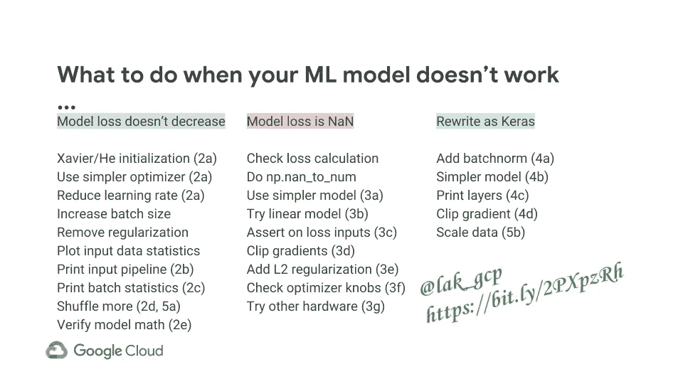

Cheat sheet. The numbers refer to sections in this article (https://bit.ly/2PXpzRh)

# 1ML 模型的目标

你可以在 GitHub 上看到[最终(工作)模型](https://github.com/GoogleCloudPlatform/training-data-analyst/tree/master/blogs/lightning/ltgpred)。我正在建立一个模型来预测 30 分钟后的闪电，并计划在美国气象学会上向[展示它。基本思想是在红外和全球闪电测绘仪(GLM) GOES-16 数据的每个像素周围创建 64x64 图像补片，如果照明图像实际上在 30 分钟后出现在像素周围的 16x16 图像补片内，则将像素标记为“has_ltg=1”。](https://ams.confex.com/ams/2019Annual/meetingapp.cgi/Paper/354046)

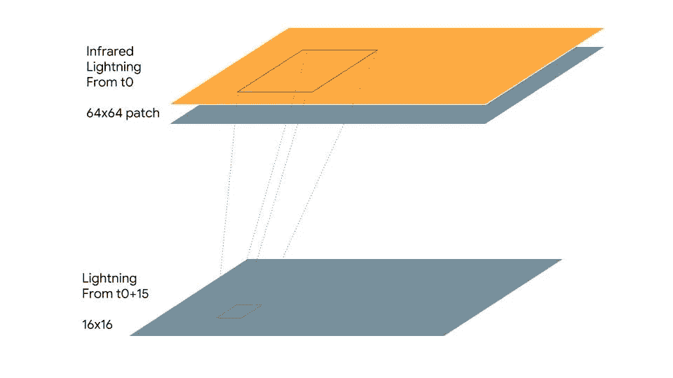

根据当前的红外和 GLM 数据，以这种方式训练的模型可以用于实时预测 30 分钟后的闪电。

## 1a。输入函数

我写了一个 convnet 模型，大量借鉴了为 TPU 编写的 [ResNet 模型的训练循环，并修改了输入函数(读取我的数据，而不是 JPEG)和模型(一个简单的卷积网络，而不是 ResNet)。](https://github.com/tensorflow/tpu/tree/master/models/official/resnet)

将输入转换为张量的代码的关键位:

```
parsed = tf.parse_single_example(
    example_data, {
        **'ref'**: tf.VarLenFeature(tf.float32),
        **'ltg'**: tf.VarLenFeature(tf.float32),
        **'has_ltg'**: tf.FixedLenFeature([], tf.int64, 1),
    })
parsed[**'ref'**] = _sparse_to_dense(parsed[**'ref'**], height * width)
parsed[**'ltg'**] = _sparse_to_dense(parsed[**'ltg'**], height * width)
label = tf.cast(tf.reshape(parsed[**'has_ltg'**], shape=[]), dtype=tf.int32)
```

本质上，每个 TensorFlow 记录(由 Apache 射束管道创建)由 ref、ltg 和 has_ltg 字段组成。ref 和 ltg 是可变长度数组，它们被整形为密集的 64x64 矩阵(使用 tf.sparse_tensor_to_dense)。标签只是 0 或 1。

然后，我将两张解析后的图像叠加在一起:

```
stacked = tf.concat([parsed[**'ref'**], parsed[**'ltg'**]], axis=1)
**img =** tf.reshape(stacked, [height, width, n_channels])
```

此时，我有一个张量是[？64，64，2]，即一批 2 通道图像。make_input_fn 中输入管道的其余部分(列出文件、通过并行交错读取文件、预处理数据、使形状静态化以及预取)本质上只是从 ResNet 代码复制粘贴而来的。

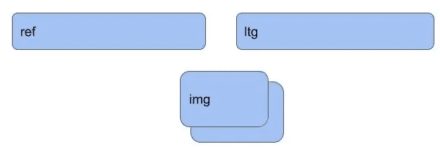

Stacking the two 4096-length arrays into a 3D tensor of shape (64, 64, 2)

## 1b。运行代码

我通过在本地以小批量运行训练器几个步骤来开发代码:

```
gcloud ml-engine local train \
    --module-name=trainer.train_cnn --package-path=${PWD}/ltgpred/trainer \
    -- \
    --train_steps=10 --num_eval_records=512 --train_batch_size=16 \
    --job-dir=$OUTDIR --train_data_path=${DATADIR}/train* --eval_data_path=${DATADIR}/eval*
```

然后，我使用配有更大 GPU 的大型机器在 Cloud ML Engine 上的更大数据集上运行了它:

```
gcloud ml-engine jobs submit training $JOBNAME \
    --module-name=trainer.train_cnn --package-path=${PWD}/ltgpred/trainer --job-dir=$OUTDIR \
    --region=${REGION} --scale-tier=CUSTOM --config=largemachine.yaml \
    --python-version=3.5 --runtime-version=1.8 \
    -- \
    --train_data_path=${DATADIR}/train* --eval_data_path=${DATADIR}/eval* \
    --train_steps=5000 --train_batch_size=256 \
    --num_eval_records=128000 
```

这很有用。我的大部分调试和开发都是通过本地运行来完成的。这样，我可以在不连接的情况下工作，不需要在我的机器上安装 GPU。

# 2 模型不学习

一旦我写好代码并运行它，我发现这个模型很快就产生了令人怀疑的相同损失:

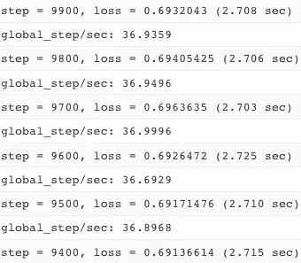

并达到了一个精度指标，这个指标从公元 1000 年开始就一直保持不变:

```
'rmse': 0.49927762, 'accuracy': 0.6623125,
```

## 2a。非常嫌疑犯

当机器学习模型不会学习时，有几个常见的疑点。我试着改变初始化。默认情况下，TensorFlow 使用 zeros _ initializer[编辑:事实证明我不需要这样做— tf.layers.conv2d 继承自 [Keras 的 Conv2D](https://keras.io/layers/convolutional/#conv2d) ，它使用与 Xavier 相同的 glorot _ uniform。如何使用 Xavier(它使用小的初始值)，并为可重复性设置随机种子？

```
xavier = tf.contrib.layers.xavier_initializer(seed=13)
*c1 = tf.layers.conv2d(
       convout,
       filters=nfilters,
       kernel_size=ksize,* ***kernel_initializer=xavier,*** *strides=1,
       padding='same',
       activation=tf.nn.relu)*
```

将梯度从复杂的 AdamOptimizer 改为可靠的备用 GradientDescentOptimizer 如何？

把学习率从 0.01 降到 1e-6 怎么样？

这些都没用，但这是我第一次尝试。

## 2b。TensorFlow 打印

我的输入函数可能每次都返回相同的数据吗？这就解释了为什么模型被卡住了。我如何知道输入函数正在读入什么？

验证输入函数是否正确的一个简单方法是简单地打印出读取的值。然而，你不能只打印一个张量:

```
print(img)
```

这将只是打印出张量的元数据，而不是它的值。相反，您需要在程序执行时评估张量的值:

```
print(img.eval(sess=...))
```

即使这样也不行，因为 Estimator API 没有给你一个会话句柄。解决办法就是用 tf。打印:

```
img = tf.Print(img, [img], "image values=")
```

这样做的目的是在原始 img 节点和新 img 节点之间插入打印节点，以便在再次使用图像节点之前打印值:

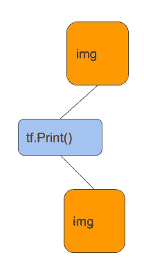

tf.Print() allows you to insert a printing node in the TensorFlow graph so that you can print out the values of a Tensor as the program executes.

## 2c。张量的打印统计

但是，一旦我这样做了，我只得到前 3 或 4 个值(默认情况下，tf。打印不打印整个张量)它们大部分为零。它们是零，是因为卫星图像往往有很多零，还是因为我的输入管道有一个 bug？简单地打印图像并不是一个好主意。所以，我决定打印出输入的统计数据:

```
numltg = tf.reduce_sum(labels)
ref = tf.slice(img, [0, 0, 0, 0], [-1, -1, -1, 1])
meanref = tf.reduce_mean(ref, [1, 2])
ltg = tf.slice(img, [0, 0, 0, 1], [-1, -1, -1, 1])
meanltg = tf.reduce_mean(ltg, [1, 2])ylogits = tf.Print(ylogits, 
             [numltg, meanref, meanltg, ylogits], "...")
```

TensorFlow 中的 reduce_*函数允许您沿轴求和。因此，第一个函数 reduce_sum(labels)计算批次中标签的总和。由于标签是 0 或 1，这个总和告诉我该批中照明示例的数量。

我还想打印反射率和闪电输入图像补丁的平均值。为此，我想对高度和宽度求和，但保持每个示例和通道独立——这就是为什么在 reduce_mean 调用中看到[1，2]。第一个 tf.slice 获取第一个通道，第二个 slice 获取第二个通道(-TF . slice 中的 1 告诉 TensorFlow 获取那个维度中的所有元素)。

还要注意，我已经在 ylogits 的位置插入了 Print 节点，可以打印整个张量列表。这很重要——您必须将 Print()放入图中实际使用的节点。如果我做了:

```
numltg = tf.Print(numltg, 
             [numltg, meanref, meanltg], "...")
```

整个分支将被优化掉，因为我的模型实际上并没有在任何地方使用 numltg！

一旦我运行代码，我发现每一批都有一个好的(和不同的)闪光点组合，每一批的平均值看起来有点相似，但每一批都不同。

## 2d。调整洗牌

虽然这不是我们试图解决的问题，但这种批量方式的相似性是很奇怪的。怀着这种好奇心查看代码，我发现我已经硬编码了一个洗牌大小:

```
dataset = dataset.shuffle(1024)
```

将此更改为

```
dataset = dataset.shuffle(batch_size * 50)
```

解决了批处理问题。

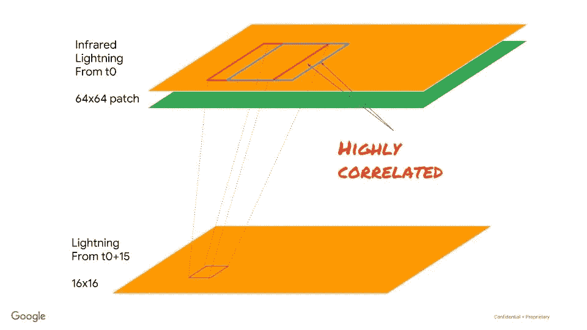

Because successive patches are highly correlated, it is important to shuffle in a large buffer

问题是，因为数据是从滑动窗口创建的，所以连续的例子往往高度相关，所以我需要在足够大的缓冲区内移动，以便从卫星图像的不同部分(或者更好的是，不同的图像)获得例子。在 ResNet 的案例中，每个训练示例都是完全不同的图像，因此这不是他们关心的问题。复制粘贴再次来袭！

## 2e。ReLu 削波和饱和

但是回到最初的问题。为什么准确度和 RMSE 卡住了？我在这里运气不错。我不得不插入 tf。Print()在某个地方，所以我进入了一个我知道我需要的节点——在我的模型函数(ylogits)的输出节点上。我还碰巧打印出了 ylogits，瞧……每次输入都是不同的值，ylogits 开始是随机的，但很快就变成了零。

为什么 ylogits 为零？仔细查看 ylogits 的计算，我注意到我写了:

```
ylogits = tf.layers.dense(
  convout, 1, activation=tf.nn.relu, kernel_initializer=xavier)
```

哎呀！通过在输出密集层上设置 ReLu 激活函数，我确保了 ylogits 永远不会为负。与此同时，闪电比非闪电更罕见，因此优化器将 ylogits 推到了它所能采取的最小可能值。也就是零。因为 ReLu 在零度以下饱和，所以东西有可能卡在那里。

分类网络的倒数第二层类似于回归网络的最后一层。它必须是:

```
ylogits = tf.layers.dense(
  convout, 1, **activation=None**, kernel_initializer=xavier)
```

傻，傻，小虫。发现并修复。咻！

# 3.NaN 损失

现在，当我运行它，我没有得到一个卡住的准确性指标。更糟。我得了……”南在训练中失利如果有什么会让一个 ML 从业者感到恐惧的话，那就是 NaN 的损失。哦，好吧，如果我能解决这个问题，我会写一篇博文。

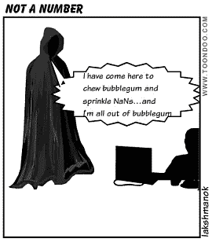

NaNs are spooky

与不训练的模型一样，NaN 的损失有几个常见的疑点。尝试自己计算交叉熵损失就是其中之一。但我没有那样做。我计算的损失是:

```
loss = tf.reduce_mean(
    tf.nn.sigmoid_cross_entropy_with_logits(
        logits=tf.reshape(ylogits, [-1]),
        labels=tf.cast(labels, dtype=tf.float32)))
```

这应该是数值稳定的。另一个问题是学习率太高。我切换回 AdamOptimizer，尝试设置一个较低的学习率(1e-6)。不去。

另一个问题是输入数据本身可能包含 nan。这应该是不可能的—使用 TFRecords 的好处之一是 TFRecordWriter 不会接受 NaN 值。为了确保万无一失，我回到输入管道，将 np.nan_to_num 添加到将数组插入 TFRecord 的代码段中:

```
**def** _array_feature(value):value = np.nan_to_num(value.flatten())
  **return** tf.train.Feature(float_list=tf.train.FloatList(value=value))
```

还是不行。

## 3a。更简单的深度学习模型

也许有太多的重量？我使模型中的层数可配置，并尝试了不同的层数和更小的内核大小:

```
*convout = img* **for** layer **in** range(nlayers):
  nfilters = (nfil // (layer+1))nfilters = 1 **if** nfilters < 1 **else** nfilters
  *# convolution* c1 = tf.layers.conv2d(
      convout,
      filters=nfilters,
      kernel_size=ksize,
      kernel_initializer=xavier,
      strides=1,
      padding=**'same'**,
      activation=tf.nn.relu)
  *# maxpool* convout = tf.layers.max_pooling2d(c1, pool_size=2, strides=2, padding=**'same'**)
  **print**(**'Shape of output of {}th layer = {} {}'**.format(
      layer + 1, convout.shape, convout))

outlen = convout.shape[1] * convout.shape[2] * convout.shape[3]
p2flat = tf.reshape(convout, [-1, outlen])  *# flattened* **print**(**'Shape of flattened conv layers output = {}'**.format(p2flat.shape))
```

还是不行。南的损失依然存在。

## 3b。回到线性

如果我完全去掉深度学习模型会怎么样？还记得我对输入图像的调试统计吗？如果我们试图训练一个模型，仅基于这些工程特征来预测照明，会怎么样？

```
halfsize = params[**'predsize'**]
qtrsize = halfsize // 2
ref_smbox = tf.slice(img, [0, qtrsize, qtrsize, 0], [-1, halfsize, halfsize, 1])
ltg_smbox = tf.slice(img, [0, qtrsize, qtrsize, 1], [-1, halfsize, halfsize, 1])
ref_bigbox = tf.slice(img, [0, 0, 0, 0], [-1, -1, -1, 1])
ltg_bigbox = tf.slice(img, [0, 0, 0, 1], [-1, -1, -1, 1])
engfeat = tf.concat([
  tf.reduce_max(ref_bigbox, [1, 2]), *# [?, 64, 64, 1] -> [?, 1]* tf.reduce_max(ref_smbox, [1, 2]),
  tf.reduce_mean(ref_bigbox, [1, 2]),
  tf.reduce_mean(ref_smbox, [1, 2]),
  tf.reduce_mean(ltg_bigbox, [1, 2]),
  tf.reduce_mean(ltg_smbox, [1, 2])
], axis=1)ylogits = tf.layers.dense(
  engfeat, 1, activation=None, kernel_initializer=xavier)
```

我决定创建两组统计数据，一组在 64x64 的盒子中，另一组在 16x16 的盒子中，并用这 6 个输入特征创建一个逻辑回归模型。

不去。还是南。这非常非常奇怪。一个线性模型应该永远不会过时。从数学上来说，这太疯狂了。

但是就在它结束之前，这个模型达到了 75%的准确率。这太有希望了。但是 NaN 的事越来越让人讨厌了。有趣的是，就在它与 loss = NaN“背离”之前，该模型根本没有背离，亏损一直在下降:

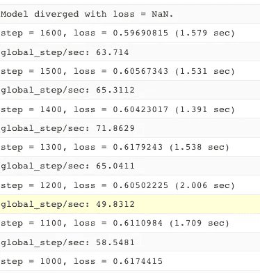

## 3c。验证损失的输入

四处寻找是否有另一种方法来计算损失，我发现现在有一个方便的函数:

```
loss = tf.losses.sigmoid_cross_entropy(labels,
  tf.reshape(ylogits, [-1]))
```

当然，这可能不能解决任何问题，但是最好使用这个函数，而不是自己调用 reduce_mean。但是在这里，让我们添加断言来缩小问题的范围:

```
**with** tf.control_dependencies([
  tf.Assert(tf.is_numeric_tensor(ylogits),[ylogits]),
  tf.assert_non_negative(labels, [labels]),
  tf.assert_less_equal(labels, 1, [labels])
]):
  loss = tf.losses.sigmoid_cross_entropy(labels,
    tf.reshape(ylogits, [-1]))
```

本质上，我断言 ylogits 是数值型的，每个标签介于 0 和 1 之间。只有满足这些条件，我才能计算损失。否则，程序应该抛出一个错误。

## 3d。剪辑渐变

断言不会触发，但是程序仍然以 NaN 丢失结束。在这一点上，似乎很清楚问题不在于输入数据(因为我在那里做了一个 nan_to_num)或我们的模型计算(因为断言不会触发)本身。它可能在反向传播中，可能在梯度计算中？

例如，也许一个不寻常(但正确)的例子会导致意想不到的高梯度幅度。让我们通过剪切梯度来限制这种不寻常示例的影响:

```
optimizer = tf.train.AdamOptimizer(learning_rate=0.001)
optimizer = **tf.contrib.estimator.clip_gradients_by_norm(
  optimizer, 5)**
train_op = optimizer.minimize(loss, tf.train.get_global_step())
```

那也没用。

## 3e。L2 损失

如果有许多非常相似的输入，权重本身可能会爆炸。随着时间的推移，一个输入节点可能会产生非常高的正幅度，而下一个输入节点可能会产生非常高的负幅度。使网络避免这种情况的一种方法是通过在损失函数中增加一个额外项来惩罚高幅度权重:

```
l2loss = tf.add_n(
  [tf.nn.l2_loss(v) **for** v **in** tf.trainable_variables()])
loss = loss + 0.001 * l2loss
```

这将获得所有可训练变量(权重和偏差),并根据这些可训练变量的值对损失进行惩罚。理想情况下，我们只惩罚体重(而不是偏见)，但这只是为了尝试。

## 3f。亚当·艾司隆

再多逛逛，我意识到 AdamOptimizer 的[文档解释默认的ε值 1e-8 可能有问题。本质上，小的ε值会导致不稳定，即使ε的目的是防止被零除。这回避了为什么这是默认值的问题，但是让我们试试推荐的更大的值。](https://www.tensorflow.org/api_docs/python/tf/train/AdamOptimizer)

```
optimizer = tf.train.AdamOptimizer(
    learning_rate=params[**'**learning_rate**'**], **epsilon=0.1)**
```

这就把 NaN 推得更远了，但还是失败了。

## 3g。不同的硬件

另一个原因可能是 CUDA 错误之类的。让我们尝试在不同的硬件上进行训练(用 P100 代替特斯拉 K80 ),看看问题是否仍然存在。

```
trainingInput:
  scaleTier: CUSTOM
  masterType: complex_model_m_p100
```

还是不行。

# 4.重写为 Keras

有时，当留下一个难以解决的 bug 时，最好尝试用一种完全不同的方式重写模型。


Let’s start again

所以，我决定用 Keras 重写模型。这也给了我学习 Keras 的机会，这是我一直想做的事情。用柠檬做柠檬汁之类的。

## 4a。CNN 与 Batchnorm

在 Keras 中，用 batchnorm 创建 CNN(这将有助于保持范围内的渐变)非常容易。(谢谢你，弗朗索瓦)。简单到我到处都放了 batchnorm。

```
img = keras.Input(shape=[height, width, 2])
cnn = keras.layers.BatchNormalization()(img)
**for** layer **in** range(nlayers):
  nfilters = nfil * (layer + 1)
  cnn = keras.layers.Conv2D(nfilters, (ksize, ksize), padding=**'same'**)(cnn)
  cnn = keras.layers.Activation(**'elu'**)(cnn)
  cnn = keras.layers.BatchNormalization()(cnn)
  cnn = keras.layers.MaxPooling2D(pool_size=(2, 2))(cnn)
  cnn = keras.layers.Dropout(dprob)(cnn)
cnn = keras.layers.Flatten()(cnn)
ltgprob = keras.layers.Dense(10, activation='sigmoid')(cnn)
```

还要注意，最后一层直接增加了一个 s 形激活。没有必要在逻辑上浪费时间，因为优化为我们解决了数字问题:

```
optimizer = tf.keras.optimizers.Adam(lr=params[**'learning_rate'**])
model.compile(optimizer=optimizer,
              loss=**'binary_crossentropy'**,
              metrics=[**'accuracy'**, **'mse'**])
```

不错！

不幸的是(你现在知道了)，我还是得了 NaNs！

啊。好吧，回到起点。让我们在喀拉斯做所有在 TensorFlow 做过的事情。

## 4b。Keras 中的特征工程

第一步是忘掉所有这些深度学习的东西，建立一个线性模型。你是怎么做到的？我有一个图像。我需要做特征工程，送到密集层。在 Keras 中，这意味着我必须编写自己的层来完成功能工程:

```
**def** create_feateng_model(params):
  *# input is a 2-channel image* height = width = 2 * params[**’predsize’**]
  img = keras.Input(shape=[height, width, 2])

  engfeat = keras.layers.Lambda(
    **lambda** x: engineered_features(x, height//2))(img)

  ltgprob = keras.layers.Dense(1, activation=**’sigmoid’**)(engfeat)

  *# create a model* model = keras.Model(img, ltgprob)
```

engineered_features 与之前的 TensorFlow 函数完全相同！关键思想是，要将 TensorFlow 函数包装到 Keras 层中，可以使用 Lambda 层并调用 TensorFlow 函数。

## 4c。打印图层

但是我想打印出图层，以确保流过的数字是正确的。我该怎么做？tf。Print()不行，因为，嗯，我没有张量。我有 Keras 层。

嗯，tf。Print()是一个张量流函数，因此，使用相同的 Lambda 层技巧:

```
**def** print_layer(layer, message, first_n=3, summarize=1024):
  **return** keras.layers.Lambda((
    **lambda** x: tf.Print(x, [x],
                      message=message,
                      first_n=first_n,
                      summarize=summarize)))(layer)
```

然后可以调用它作为:

```
engfeat = print_layer(engfeat, **"engfeat="**)
```

## 4d。剪裁渐变

在 Keras 中裁剪渐变？轻松点。每个优化器都支持 clipnorm。

```
optimizer = tf.keras.optimizers.Adam(lr=params[**'learning_rate'**],
                                     clipnorm=1.)
```

嘿，我喜欢 Keras 这个东西——它给了我一个漂亮、简单的 API。此外，它与 TensorFlow 很好地互操作，在我需要的时候给我低级别的控制。

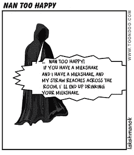

NaN is still there, slurping my milkshake

哦，对了。我仍然有南的问题

# 5.揭露数据

最后一件事，我有点忽略了。NaN 问题也可能由未缩放的数据引起。但是我的反射率和闪电数据都在范围[0，1]内。所以，我根本不需要缩放。

尽管如此，我还是闲着没事。不如我把图像数据归一化(减去均值，除以方差)，看看有没有帮助。


Yes, I’m clutching at straws now

为了计算方差，我需要遍历整个数据集，所以这是 Beam 的工作。我可以用张量流变换来做这个，但是现在，让我用 Beam 来破解它。

## 5a。混洗波束中的训练数据

既然我正在重写我的管道，我也可以一劳永逸地解决洗牌的问题(见第 2d 节)。增加洗牌缓冲区大小是一个黑客。我真的不想按照创建图像补丁的顺序写入数据。让我们随机排列 Apache Beam 中图像补丁的顺序:

```
*# shuffle the examples so that each small batch doesn't contain
# highly correlated records* examples = (examples
    | **'{}_reshuffleA'**.format(step) >> beam.Map(
        **lambda** t: (random.randint(1, 1000), t))
    | **'{}_reshuffleB'**.format(step) >> beam.GroupByKey()
    | **'{}_reshuffleC'**.format(step) >> beam.FlatMap(**lambda** t: t[1]))
```

本质上，我给每个记录分配一个随机键(1 到 1000 之间),按随机键分组，删除键并写出记录。现在，连续的图像补片不会一个接一个地跟随。

## 5b。计算阿帕奇波束的方差

如何计算阿帕奇波束的方差？我像往常一样，在 StackOverflow 上搜索一些我可以复制粘贴的东西。不幸的是，我只找到了一个没有答案的问题。哦，好吧，认真编写一个定制的合并器:

```
import apache_beam as beam
import numpy as npclass MeanStddev(beam.CombineFn):
  def create_accumulator(self):
    return (0.0, 0.0, 0) # x, x^2, countdef add_input(self, sum_count, input):
    (sum, sumsq, count) = sum_count
    return sum + input, sumsq + input*input, count + 1def merge_accumulators(self, accumulators):
    sums, sumsqs, counts = zip(*accumulators)
    return sum(sums), sum(sumsqs), sum(counts)def extract_output(self, sum_count):
    (sum, sumsq, count) = sum_count
    if count:
      mean = sum / count
      variance = (sumsq / count) - mean*mean
      # -ve value could happen due to rounding
      stddev = np.sqrt(variance) if variance > 0 else 0
      return {
        'mean': mean,
        'variance': variance,
        'stddev': stddev,
        'count': count
      }
    else:
      return {
        'mean': float('NaN'),
        'variance': float('NaN'),
        'stddev': float('NaN'),
        'count': 0
      }

[1.3, 3.0, 4.2] | beam.CombineGlobally(MeanStddev())
```

请注意这里的工作流程——我可以在一系列数字上快速测试它，以确保它正常工作。

然后，我去给 StackOverflow 添加了[答案](https://stackoverflow.com/a/52958771/3645038)。也许我需要的只是一些好的因果报应…

## 5b。写出平均值、方差

然后，我可以转到我的管道代码并添加:

```
**if** step == **'train'**:
  _ = (examples
    | **'get_values'** >> beam.FlatMap(
        **lambda** x : [(f, x[f]) **for** f **in** [**'ref'**, **'ltg'**]])
    | **'compute_stats'** >> beam.CombinePerKey(MeanStddev())
    | **'write_stats'** >> beam.io.Write(beam.io.WriteToText(
        os.path.join(options[**'outdir'**], **'stats'**), num_shards=1))
  )
```

本质上，我提取 example['ref']和 example['ltg']并创建元组，然后按键对其进行分组。然后，我可以计算整个数据集上这两幅图像中每个像素的平均值和标准差。

一旦我运行了管道，我就可以打印结果统计数据:

```
gsutil cat gs://$BUCKET/lightning/preproc/stats*('ltg', {'count': 1028242, 'variance': 0.0770683210620995, 'stddev': 0.2776118172234379, 'mean': 0.08414945119923131})('ref', {'count': 1028242, 'variance': **masked**, 'stddev': 0, 'mean': masked})
```

蒙面？@#$@#$@#是什么意思？原来[掩码数组](https://currents.soest.hawaii.edu/ocn760_4/_static/masked_arrays.html)是一个特殊的数字东西。被屏蔽的值不是 NaN，所以如果用 Numpy 处理它们，nan_to_num()不会对它做任何事情。另一方面，它看起来是数值，所以我所有的张量流断言都不成立。带有屏蔽值的数值运算会产生屏蔽值。

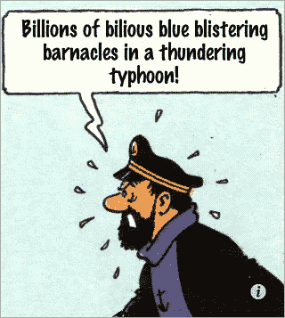

Masked? What the @#@$#@ does masked mean?

屏蔽值就像 NaN 一样——它们会从房间的另一端啜饮你的奶昔，但是常规的 numpy 和 TensorFlow 库方法对屏蔽一无所知。

## 5c。更改屏蔽值

由于屏蔽只发生在反射率网格中(我自己通过积累闪电创建闪电网格)，我必须在读取后将屏蔽值转换成一个好的数字

```
ref = goesio.read_ir_data(ir_blob_path, griddef)
ref = np.ma.filled(ref, 0) *# mask -> 0*
```

现在，当我重新运行管道时，我得到了合理的值:

```
('ref', {'count': 1028242, 'variance': 0.07368491739234752, 'stddev': 0.27144965903892293, 'mean': 0.3200035849321707})('ltg', {'count': 1028242, 'variance': 0.0770683210620995, 'stddev': 0.2776118172234379, 'mean': 0.08414945119923131})
```

这些都是小数字。不应该有任何缩放的理由。因此，让我们在解决掩蔽问题的情况下进行训练。

这一次，没有楠。相反，程序崩溃，日志显示:

```
Filling up shuffle buffer (this may take a while): 251889 of 1280000
The replica master 0 ran out-of-memory and exited with a non-zero status of 9(SIGKILL)
```

## 5d。减小混洗缓冲区大小

副本零是输入管道(读取数据发生在 CPU 上)。为什么它要一次将 1280000 条记录全部读入 shuffle 缓冲区？

现在，输入数据已经被我的光束/数据流很好地混洗了，我甚至不需要那么大的混洗缓冲区(以前是 5000，见 2d 部分):

```
dataset = dataset.shuffle(batch_size * 50) *# shuffle by a bit*
```

12 分钟后，训练以 83%的准确率结束。！！).哪儿都没有 NaNs。

吼吼！

## 5e。连接模型

请记住，我们只做了一个由工程特征组成的线性模型。让我们并行添加回 convnet。想法是连接两个密集层，这样我的模型架构可以包含 CNN 层和特征工程:

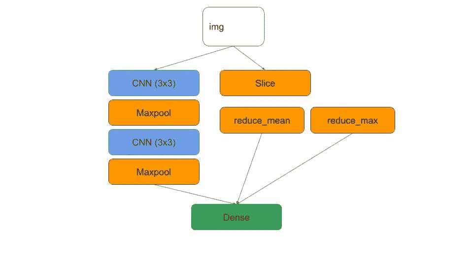

A combined model would be great

这是如何在 Keras 中做到这一点的，其中加入了一些 batchnorm 和 dropouts，因为它们很容易添加:

```
cnn = keras.layers.BatchNormalization()(img)
**for** layer **in** range(nlayers):
  nfilters = nfil * (layer + 1)
  cnn = keras.layers.Conv2D(nfilters, (ksize, ksize), padding=**'same'**)(cnn)
  cnn = keras.layers.Activation(**'elu'**)(cnn)
  cnn = keras.layers.BatchNormalization()(cnn)
  cnn = keras.layers.MaxPooling2D(pool_size=(2, 2))(cnn)
cnn = keras.layers.Flatten()(cnn)
cnn = keras.layers.Dropout(dprob)(cnn)
cnn = keras.layers.Dense(10, activation=**'relu'**)(cnn)

*# feature engineering part of model* engfeat = keras.layers.Lambda(
  **lambda** x: engineered_features(x, height//2))(img)

*# concatenate the two parts* both = keras.layers.concatenate([cnn, engfeat])
ltgprob = keras.layers.Dense(1, activation=**'sigmoid'**)(both)
```

现在，我有 85%的准确率。这仍然是一个小数据集(只有 60 天的卫星数据)，这可能是深度学习路径没有增加那么多价值的原因。所以，我会回去生成更多的数据，训练更长的时间，在 TPU 上训练等等。

但是这些事情可以等。现在，我要去庆祝了。