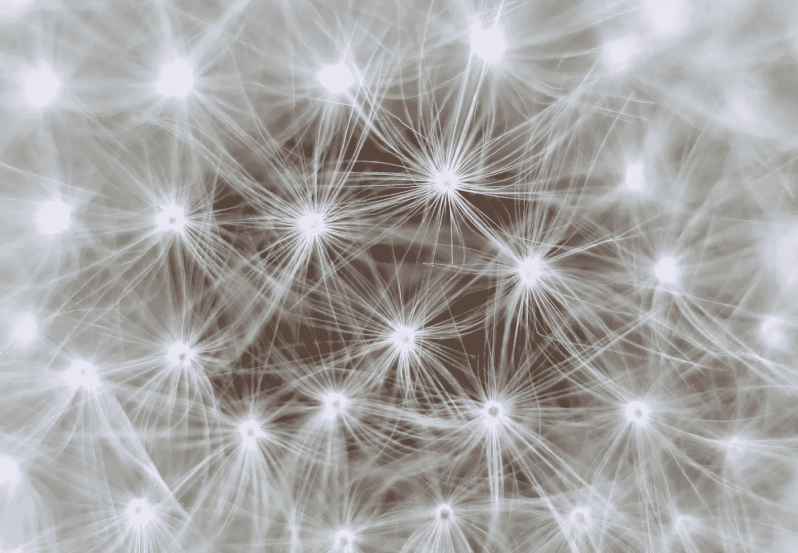

# 12 月版:深度学习

> 原文：<https://towardsdatascience.com/december-edition-deep-learning-5aa3d480e49?source=collection_archive---------7----------------------->

## 9 篇必读文章

## [人工智能从业者需要应用的 10 种深度学习方法](/the-10-deep-learning-methods-ai-practitioners-need-to-apply-885259f402c1)

由[詹姆斯·勒](https://medium.com/u/52aa38cb8e25?source=post_page-----5aa3d480e49--------------------------------) — 13 分钟读完。

过去十年，对机器学习的兴趣激增。你几乎每天都能在计算机科学项目、行业会议和《华尔街日报》上看到机器学习。

[**订阅我们即将推出的作家快讯**](https://docs.google.com/forms/d/e/1FAIpQLSe99M_OOAhycLPlnsmaqY7yt320OsBkz7GjKZG4RRxdJSwH7w/viewform) **！我们的目标是更好地支持我们的作者，让他们能够进一步参与我们出版物的发展。**

## [理解神经网络中的目标函数](/understanding-objective-functions-in-neural-networks-d217cb068138)

由 [Lars Hulstaert](https://medium.com/u/247991304a87?source=post_page-----5aa3d480e49--------------------------------) — 9 分钟读取。

这篇博文的目标读者是有机器学习经验的人，他们希望对用于训练神经网络的不同目标函数有更好的直觉。

## [揭开“EM 路由矩阵胶囊”的神秘面纱第 1 部分:概述](/demystifying-matrix-capsules-with-em-routing-part-1-overview-2126133a8457)

通过 [Sahaj Garg](https://medium.com/u/d4cb6777d638?source=post_page-----5aa3d480e49--------------------------------) — 13 分钟读取。

最近，深度学习之父之一杰弗里·辛顿(Geoffrey Hinton)发布了一种革命性的计算机视觉架构:胶囊网络，在机器学习界掀起了波澜。

## [神经网络的软介绍](/a-soft-introduction-to-neural-networks-6986b5e3a127)

由[舒邦德赛](https://medium.com/u/87a30c82bb9e?source=post_page-----5aa3d480e49--------------------------------) — 9 分钟读完。

在过去的几年里，神经网络已经成为机器学习的同义词。最近，我们已经能够制造神经网络，它可以产生栩栩如生的面孔，转移动态艺术风格，甚至可以按年“老化”一个人的照片。

## [应用深度学习](/applied-deep-learning-part-4-convolutional-neural-networks-584bc134c1e2?source=user_profile---------0----------------) ( [第一部分](/applied-deep-learning-part-1-artificial-neural-networks-d7834f67a4f6)、[第二部分](/applied-deep-learning-part-2-real-world-case-studies-1bb4b142a585)、[第三部分](/applied-deep-learning-part-3-autoencoders-1c083af4d798)、[第四部分](/applied-deep-learning-part-4-convolutional-neural-networks-584bc134c1e2))

由 [Arden Dertat](https://medium.com/u/6db35fa87ba2?source=post_page-----5aa3d480e49--------------------------------) — 23 分钟读取。

欢迎来到应用深度学习教程系列。我们将从人工神经网络(ANN)开始，特别是前馈神经网络，对几种深度学习技术进行详细分析。

—

## [一种新型深度神经网络](/a-new-kind-of-deep-neural-networks-749bcde19108)

通过[Eugenio culrciello](https://medium.com/u/e53b1a2a902f?source=post_page-----5aa3d480e49--------------------------------)—7 分钟阅读。

又有**新一波深度神经网络**来了。它们是前馈模型的发展，我们之前详细分析过。

## [参加 Deeplearning.ai 课程后的感想](/thoughts-after-taking-the-deeplearning-ai-courses-8568f132153)

通过 [Arvind N](https://medium.com/u/6e6d06d4b300?source=post_page-----5aa3d480e49--------------------------------) — 8 分钟读取。

在全职工作和家里蹒跚学步的孩子之间，我用业余时间学习认知科学和人工智能的思想。偶尔会出现一篇很棒的论文/视频/课程，你会立刻被吸引住。

## [深度网络架构的直观指南](/an-intuitive-guide-to-deep-network-architectures-65fdc477db41)

由 [Joyce Xu](https://medium.com/u/22cab2846a16?source=post_page-----5aa3d480e49--------------------------------) — 9 min 阅读。

在过去的几年里，计算机视觉深度学习的许多进展都可以归结为少数几个神经网络架构。

## [深度学习之美背后的秘密酱:激活功能初学者指南](/secret-sauce-behind-the-beauty-of-deep-learning-beginners-guide-to-activation-functions-a8e23a57d046)

由 [Mate Labs](https://medium.com/u/8be436c6fb14?source=post_page-----5aa3d480e49--------------------------------) — 7 分钟读取。

激活功能是获取输入信号并将其转换为输出信号的功能。激活函数将非线性引入网络，这就是为什么我们称之为非线性。

我们也感谢最近加入我们的所有伟大的新作家，[萨哈吉·加尔格](https://medium.com/u/d4cb6777d638?source=post_page-----5aa3d480e49--------------------------------)，[克里斯·道塞特](https://medium.com/u/bf9d4923698f?source=post_page-----5aa3d480e49--------------------------------)，[佩曼·泰伊](https://medium.com/u/d382998cf5b3?source=post_page-----5aa3d480e49--------------------------------)，[蒂尔塔杰约蒂·萨卡尔](https://medium.com/u/cb9d97d4b61a?source=post_page-----5aa3d480e49--------------------------------)，[克莱尔·莱萨奇](https://medium.com/u/6daaee9ebc29?source=post_page-----5aa3d480e49--------------------------------)，[贾斯汀·盖奇](https://medium.com/u/4e290d6890de?source=post_page-----5aa3d480e49--------------------------------)，[鲍里斯·安德亚](https://medium.com/u/67df8b49295c?source=post_page-----5aa3d480e49--------------------------------)，[贾斯帕·麦克切斯尼](https://medium.com/u/96589cfde000?source=post_page-----5aa3d480e49--------------------------------)，[德瓦尔·沙阿](https://medium.com/u/1617c5479fda?source=post_page-----5aa3d480e49--------------------------------)，[瑞安](https://medium.com/u/5639edce041f?source=post_page-----5aa3d480e49--------------------------------) [安东尼·雷佩托](https://medium.com/u/6374f82a1f5c?source=post_page-----5aa3d480e49--------------------------------)、[本·韦伯](https://medium.com/u/a80e1f69e782?source=post_page-----5aa3d480e49--------------------------------)、[杰卡特琳娜·科卡特朱哈](https://medium.com/u/8818b5f3eb46?source=post_page-----5aa3d480e49--------------------------------)、[菲利克斯·莫尔](https://medium.com/u/330be7bbc79d?source=post_page-----5aa3d480e49--------------------------------)、[乔治·克拉萨达基斯](https://medium.com/u/f050c7452249?source=post_page-----5aa3d480e49--------------------------------)等等很多人。 我们邀请你看看他们的简介，看看他们的工作。