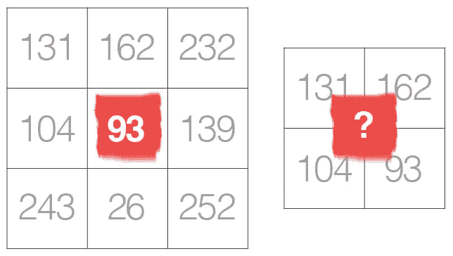

# 确定 CNN 的最佳核大小

> 原文：<https://towardsdatascience.com/deciding-optimal-filter-size-for-cnns-d6f7b56f9363?source=collection_archive---------2----------------------->

卷积神经网络(CNN)是从像图像这样的数据点中自动提取有用特征(无需手动调整)以解决像图像分类或对象检测这样的给定任务的神经网络。现在您已经了解了它们在您的数据集上的用途，您开始想知道:除了调整您的网络的各种超参数之外，我如何知道什么是适合网络的内核大小？让我们进一步挖掘！

让我们设定一些共同的基本规则，以便在整个讨论过程中保持在同一平台上:

*   我们将主要研究图像上的 2D 卷积。这些概念也适用于 1D 和三维卷积，但可能不直接相关。
*   像 3x3 这样的 2D 卷积滤波器在尺寸上将总是具有第三维。第三维等于输入图像的通道数。例如，我们对灰度图像(具有 1 个黑白通道)应用 3x3x1 卷积滤镜，而对彩色图像(具有 3 个通道，红色、蓝色和绿色)应用 3x3x3 卷积滤镜。
*   在接下来的讨论中，我们假设零填充。

在卷积中，卷积滤波器滑过图像的所有像素，取它们的点积。我们这样做是希望卷积滤波器加权的像素的线性组合能够从图像中提取某种特征。记住这些事情就完成了:

*   图像中大多数有用的特征通常是局部的，一次取几个局部像素来应用卷积是有意义的。
*   这些有用的特征中的大多数可以在图像中的不止一个地方找到。因此，在整个图像上滑动单个核是有意义的，希望使用相同的核在图像的不同部分提取该特征。
*   此外，使用小内核而不是完全连接的网络的额外好处是受益于重量共享和计算成本的降低。简单解释一下这一点，因为我们对图像中的不同像素组使用相同的核，所以当我们对这些像素组进行卷积时，在这些像素组之间共享相同的权重。并且由于权重的数量少于完全连接的层，我们可以反向传播的权重较少。

既然我们已经将卷积滤波器大小作为可供选择的超参数之一，那么就需要在更小或更大的滤波器大小之间做出选择。让我们快速比较两者，选择最佳滤波器尺寸:

Comparing smaller and larger convolutional kernel sizes theoretically.

现在，我们对使用不同尺寸的提取有了一些了解，接下来我们将针对小尺寸(3x3)和大尺寸(5x5)滤波器使用卷积示例:

Comparing smaller and larger convolutional kernel sizes using a 3x3 and a 5x5 example.

基于上面的比较，我们可以得出结论，较小的内核比较大的内核更受欢迎。

此外，您可能会注意到，与 2x2 或 4x4 内核大小相比，奇数内核大小更受青睐。解释如下:

对于奇数大小的过滤器，所有先前层像素将对称地围绕输出像素。如果没有这种对称性，我们将不得不考虑在使用均匀大小的内核时发生的跨层失真。因此，为了提高实现的简单性，甚至大小的内核过滤器也大多被跳过。如果你认为卷积是从给定像素到中心像素的插值，我们不能使用偶数大小的滤波器插值到中心像素。

因此，一般来说，我们希望使用更小的奇数大小的内核过滤器。但是，由于提取的特征是细粒度的和局部的，没有来自相邻像素的信息，因此从候选最佳滤波器尺寸列表中排除了 1x1。此外，它并没有真正做任何有用的特征提取！

因此，3x3 卷积滤波器通常工作正常，并且经常是流行的选择！

*原载于 2018 年 8 月 19 日*[*【icecreamlabs.com】*](https://icecreamlabs.com/2018/08/19/3x3-convolution-filters%e2%80%8a-%e2%80%8aa-popular-choice/)*。*