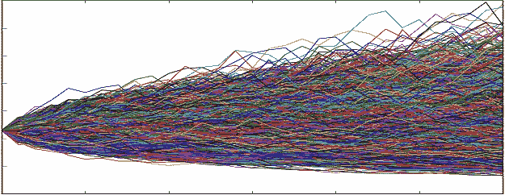
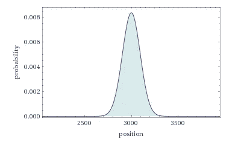
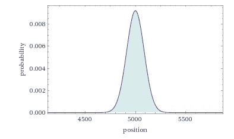
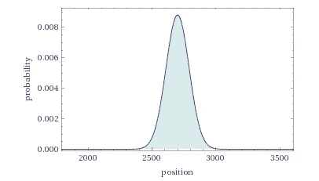
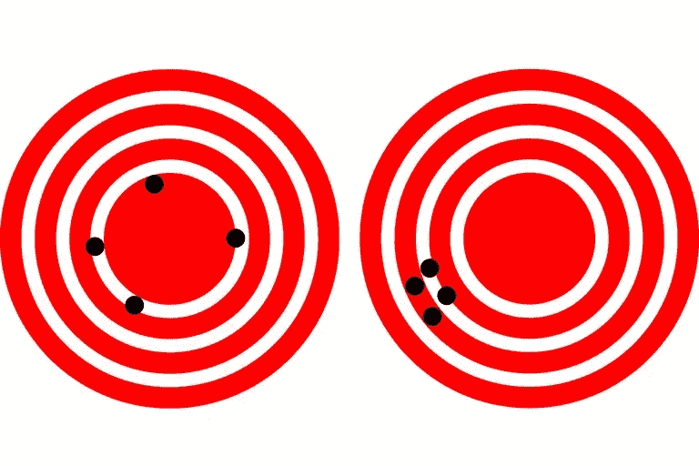
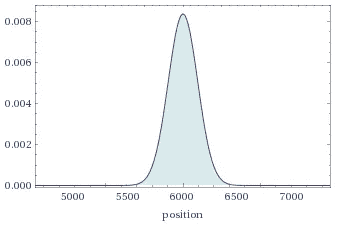

# 作为随机漫步的决策

> 原文：<https://towardsdatascience.com/decision-making-as-a-random-walk-6ed37e154633?source=collection_archive---------26----------------------->

Monte Carlo Simulation from [Numex Exchange](https://numex-blog.com/wp-content/uploads/2018/01/monte_carlo_price_1.png).

我做的每一个决定都是正确的吗？大概不会。当我承认自己会做出错误的决定时会发生什么——我如何利用这些知识来提高我的效率？这篇文章是关于决策是一个随机过程意味着什么，以及如何利用这些知识做得更好。

如果你将一枚公平的硬币抛 10000 次，每次它出现时*正面*你向前迈一步，而*反面*你后退一步——你预计能走多远？碰巧，不是很远。

但是假设这个硬币是不公平的——它的重量使得它有 65%的机会正面朝上。你希望这次能走多远？概率告诉我们你平均前进了 3000 步。20%上来*个头*？倒退六千步。

Random walk position simulation with forward p=0.65 with steps=10000; graphic from WolframAlpha.

这和决策有什么关系？嗯，去年我发了 10，487 封邮件。每一封电子邮件都可以被视为抛硬币，目的是推动我的组织向前发展。每封电子邮件也是一个决定:区分特性的优先级，跟踪构建的交付，起草 RFP 回复。

并非所有的决定都是平等的。在这里，我将讨论影响决策的不同因素，并检查它们的影响。然后，我将利用这种影响来展示决策成功不是二元的，并展示我们可以改进决策的不同方式。

首先，我将回顾以下因素:

*   正确决策的概率
*   决策速度
*   决策的规模或范围

## 正确决策的概率

这相当简单——如果你更频繁地做出正确的决定，你会在随机漫步中走得更远。如果你不经常做出正确的决定，你会变得更不积极，甚至倒退(并且偏离你的公司目标)。

Random walk position simulation with forward **p=0.65 (left) and p=0.75 (right)** with steps=10000; graphics from WolframAlpha.

然而，差异的大小相当重要。决策成功增加 10 个百分点——从 65%增加到 75% —会导致向前多走 2000 步。在这种情况下，净收益增加了 40%。因此，作为一名经理，专注于改善下属的决策可以带来巨大的回报——尤其是在表现较差的员工中。甚至可以改善决策的专业指导、高管教育和研讨会也可能值得 40%的净投资回报率。

同样，做出更糟糕的决定也同样有害。与最初的 65%相比，55%的决策成功率减少了 2，000 步的净前进步骤，导致总体结果减少了 67%,这相当具有破坏性。

## 决策速度

现在让我们看看决策的速度。让我们想象一下，我们做决定的速度慢了 10%，所以除了一个不愉快的收件箱，我们最终只做了 9000 个决定，而不是 10000 个。

Random walk position simulation with forward p=0.65 with **steps=10000 (left) and steps = 9000 (right)**; graphics from WolframAlpha.

决策速度下降 10%会导致前进的步伐减少 250 步，或者前进的步伐减少 8.3%。速度没有产生如此显著影响的原因是，你不仅做出的正确决定更少，因此不会走得更远，而且做出的错误决定也更少，因此不会如此显著地阻碍进步。

Accuracy (left) versus precision (right). [ThoughtCo](https://www.thoughtco.com/difference-between-accuracy-and-precision-609328).

另一个变化不大的因素是标准偏差——采用 9，000 步而不是 10，000 个导联，预期结果的偏差会小 5%左右。这可以被忽略，因为决策倾向于关注准确性而不是精确性。毕竟，获得精确的、平庸的结果通常不如分散的、积极的结果令人满意。

## 决策的规模

考察决策规模的最后一个因素*是通过影响力*来衡量的。为了模拟这一点，我们增加了步长——一个两倍重要的正确决定会让我们前进两步，而不是一步，但一个错误的决定会让我们后退两步。

Random walk position simulation with forward p=0.65 with steps=10000 **and step size = 2**; graphic edited, original from WolframAlpha.

当步长增加一倍时，我们的预期结果也会增加一倍，在这个场景中，从 3，000 步增加到 6，000 步。然而，如果你的预期结果是*负的*(比如如果 p=0.45)，那么你就是双倍的结果，并且会进一步亏损。

有趣的是，步长的增加使标准差保持不变，所以你改变了结果，而精度没有任何变化。

## 综合

既然我们已经检查了影响随机漫步的因素，那么关键的要点是什么呢？

*   做出正确的决定比快速做出决定重要得多。因此，总的来说，花时间仔细考虑事情并做出正确的决定比做出更多的决定更有益。
*   重大决策会对你的结果产生巨大的影响，但不会牺牲精确性。如果我们认为精确度是风险的代表，那么做出更少、更重要的决定对结果更有利。
*   综合这些因素，要最大限度地提高性能，最重要的是做出高影响决策，但低影响决策可能可以忽略不计。因此，能够识别哪些决策可能具有最大的影响，从而能够花时间专注于做出正确的决策是有价值的。

我们应该如何利用这些要点来改进我们的决策？

1.  快速确定哪些决策是最重要的，并专注于这些决策，指派你的最佳决策者。
2.  可能很快就能做出的小决定是委派的好对象。这为团队成员提供了在迭代过程中实践和决策的机会。随着时间的推移，反馈循环和教育是改善结果的关键。
3.  需要长时间的小决定应该妥协。举个例子，一个普通的产品经理可能会花费大量低效的时间来回答关于产品调色板的小决定——抛硬币会造成多大的伤害？或者，在你的组织中寻找快速做出这些决定的能力——在这个例子中，让一个 UI 设计师来负责这个决定可能会提高决策的速度，从而提高结果。
4.  对决策过程进行时间限制，以避免浪费时间对决策结果做出微不足道的改进。最终，花费两倍的时间来提高微小的成功概率会成为一种浪费。

我们可以随机地思考决策吗？我们工作的其他哪些方面可以并且应该重新思考？请在下面的评论中告诉我你的想法！