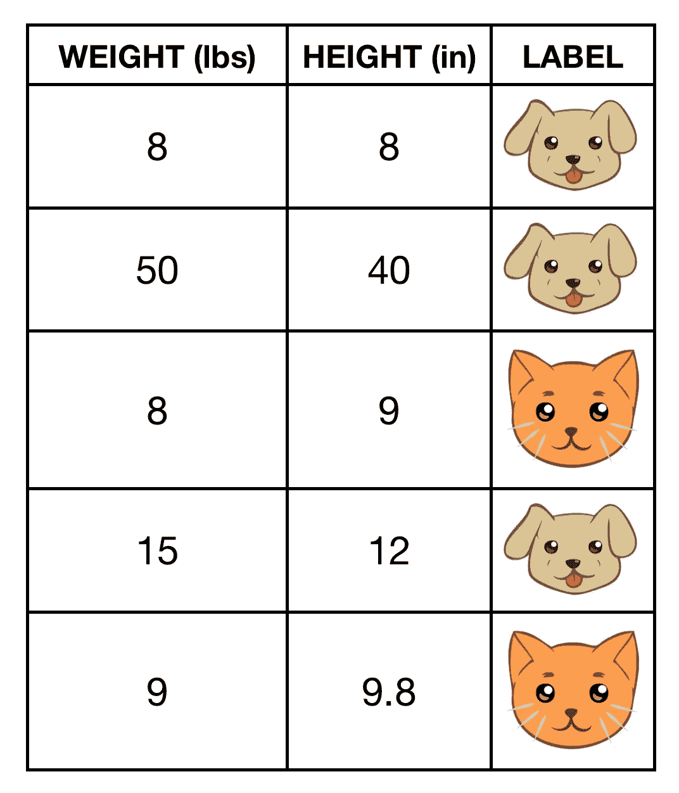
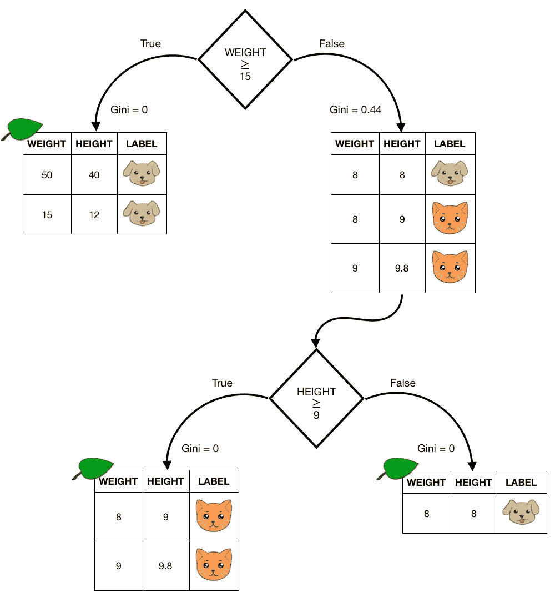
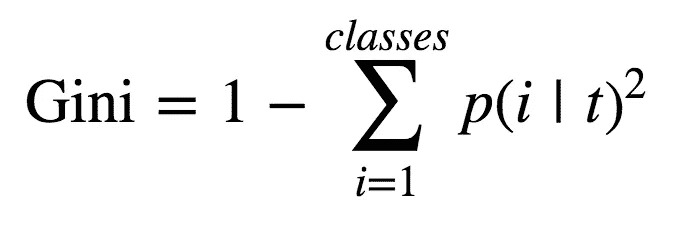
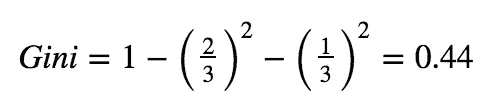
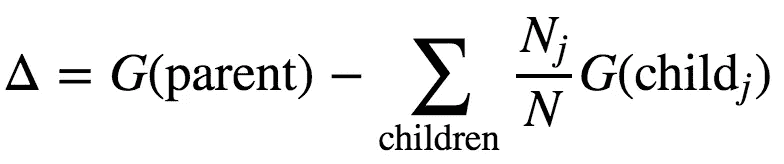
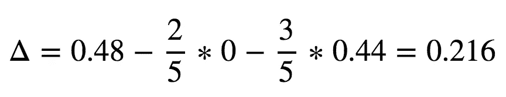
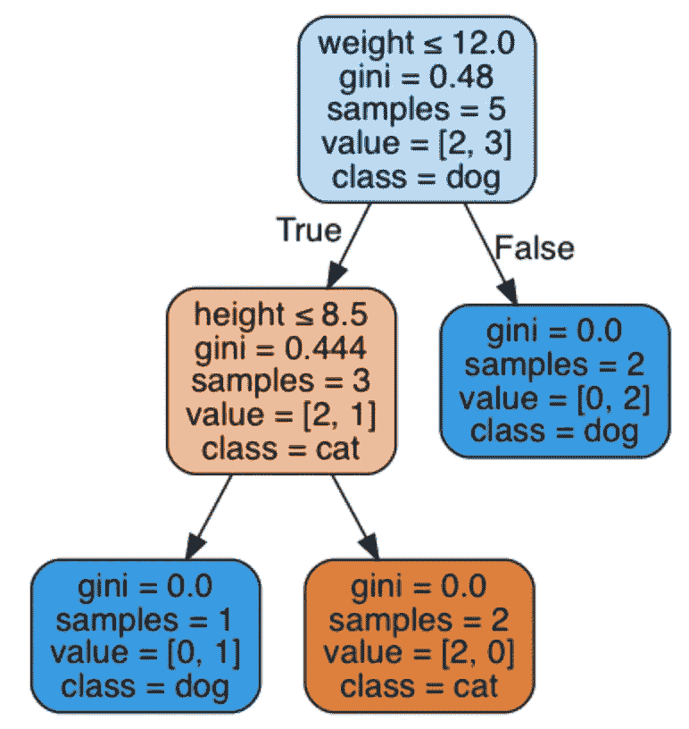

# 决策树:一种像人脑一样工作的算法

> 原文：<https://towardsdatascience.com/decision-tree-an-algorithm-that-works-like-the-human-brain-8bc0652f1fc6?source=collection_archive---------5----------------------->

“sun light passing through green leafed tree” by [Jeremy Bishop](https://unsplash.com/@tentides?utm_source=medium&utm_medium=referral) on [Unsplash](https://unsplash.com?utm_source=medium&utm_medium=referral)

决策树是机器学习中最常用的算法之一，主要用于分类，也用于回归问题。每当我们在做决定前问自己一个问题时，我们的大脑就像决策树一样工作。比如:*外面是阴天吗？如果是的话，我会带一把伞。*

当训练一个数据集对一个变量进行分类时，决策树的思想是根据某个特征值将数据划分成更小的数据集，直到目标变量全部归入一个类别。当人脑根据经验(即多云的天空)决定选择“分裂特征”时，计算机根据最大*信息增益*分裂数据集。让我们定义一个简单的问题，然后进行一些计算，看看这到底意味着什么！

Cats and dogs dataset

假设我们要构建一个决策树，根据体重和身高来确定宠物是猫还是狗。我们可以根据两个特征之一的特定值来划分这些数据点，例如:对于大于 15 磅的体重，我确信该宠物是一只狗，至少根据这个非常简单的数据集是这样的。但是如果权重小于这个值，我的子集将包含两只猫和一只狗，所以我需要再次分割子集，直到只剩下一个类。换句话说，直到我的所有子集都是纯 T4。我实际上为这些数据值画了一个决策树，如下所示:

Decision tree example.

每棵树都从一个根节点开始，即第一次分裂。不需要想太多，我们可以很容易地找到不同类型的根节点来分割数据，并在相同的步骤中找到解决方案。但是计算机如何决定如何定义节点呢？毫无疑问，它将寻找最有效的方式，为了理解这是什么，我们需要引入**基尼**:“最常用的不平等衡量方法”。这个不等式指的是节点后面每个子集中的目标类。为此，它可以在每次拆分后计算，并且根据不等式在一个节点后如何变化，我们还可以定义“信息增益”。

Definition of Gini

为了计算基尼系数，我们考虑在一个节点后找到每个类的概率，我们对这些值的平方求和，然后从 1 中减去这个值。由于这个原因，当一个子集是纯的(即其中只有一个类)时，Gini 将是 0，因为找到那个类的概率确实是 1！在这种情况下，我们说我们已经到达了一片*叶子*，因为当我们达到目标时，没有必要再分裂了。但是如果我们看上面的图片，在错误情况下的根节点之后，我们有一个包含 3 个观察值的子集，其中 2 个是猫，1 个是狗。如果我们想计算该子集的基尼系数，我们有:

Gini of the resulting dataset for weight greater or equal to 15 lbs

除了基尼系数，另一个可以用来计算阶层不平等的指标是熵。它们有着相同的目的，但熵的大小略有不同；然而，为此目的，我们将只使用基尼系数。

根据我们选择的分裂策略，我们将为每个子集提供不同的基尼值，并且根据节点后的基尼值，我们可以定义**信息增益:**

Definition of Information Gain

这被定义为父母的基尼系数和子女基尼系数的加权平均值之差。如果我们参考上面的例子，通过简单地应用定义，知道初始数据集的基尼等于 0.48，我们可以计算根节点之后的信息增益(在 15 磅的权重值处分裂):

Information gain after root node

然后，决策树将考虑所有可能的拆分，并选择具有最高信息增益的拆分。其实我们做点编码，看看什么是按 Python 的决策树！

通过运行下面的代码，我们从零开始构建数据框架，只用几行代码就能适应模型。

> 注意:在训练模型之前训练/测试 split 是一个很好的做法，可以防止过度拟合，也可以仔细检查这种模型在看不见的数据上的表现。在这种情况下，我跳过了这一步，因为数据帧只包含少量的观察值。

需要指出的是，在实例化`DecisionTreeClassifier`时，我没有在括号中指定任何参数。当处理非常大的数据集时，为了防止你的树失去控制和过度拟合，查看`max_depth`来指定你的树的最大分裂级别是非常有用的。此外，设置`max_features`也很有用，这是一个在搜索最佳分割时限制要查看的预测值数量的参数。此外，如果您希望您的树基于熵而不是基尼进行优化，只需在实例化对象时编写`criterion = 'entropy'`即可。如果您想进一步了解如何调整模型，请参考[决策树文档](http://scikit-learn.org/stable/modules/generated/sklearn.tree.DecisionTreeClassifier.html)。

太好了，我们造好了模型！但是这到底意味着什么呢？决策树的妙处在于它很容易被解释，所以让我们来绘制它吧！为了运行下面的代码片段，你可能需要先在你的笔记本上运行`!pip install pydotplus pydot2`。

这段代码的输出如下图所示。

很酷，对吧？在上面我“手工制作”的决策树中，我选择了 15 磅的权重作为根节点，算法决定对相同的变量进行分割，但值为 12。这创建了一个只有狗的叶子(事实上，对于大于 12 的重量，基尼= 0)。从根节点后的真实条件生成的子集，已根据值为 8.5 的高度变量进一步分割。这最后一次分裂产生了两个具有零基尼值的纯 T2 子集。

那么，我们为什么应该或不应该使用决策树呢？以下是利弊的简要列表:

**优点**

*   它非常容易理解，尤其是当我们需要将我们的发现传达给非技术观众的时候
*   它能很好地处理有噪声或不完整的数据
*   它可用于回归和分类问题

**缺点**

*   它可能是不稳定的，这意味着数据中的小变化可能会转化为模型中的大变化
*   它往往会过度拟合，这意味着低偏差但高方差:即，即使训练数据上的分数很高，在看不见的数据上也可能表现不佳

幸运的是，有许多技术可以处理过度拟合，这是决策树的主要缺点。通过使用 *bagging* 或 *boosting* 方法，我们可以从决策树概念出发，通过使用`[RandomForestClassifier](http://scikit-learn.org/stable/modules/generated/sklearn.ensemble.RandomForestClassifier.html)`或`[AdaBoostClassifier](http://scikit-learn.org/stable/modules/generated/sklearn.ensemble.AdaBoostClassifier.html)`等模型来开发更精确的分析。这些都是*集成*方法，但是随机森林通过*增强捕获*生成了许多“新数据集”(即，用替换采样原始数据帧)；它为每一个新的数据帧拟合一棵树，并通过对森林中的所有树进行平均来进行预测。相反，Ada Boost 是一个自适应树，它通过调整不正确的分类实例，同时始终使用相同的数据帧来进行自我学习。