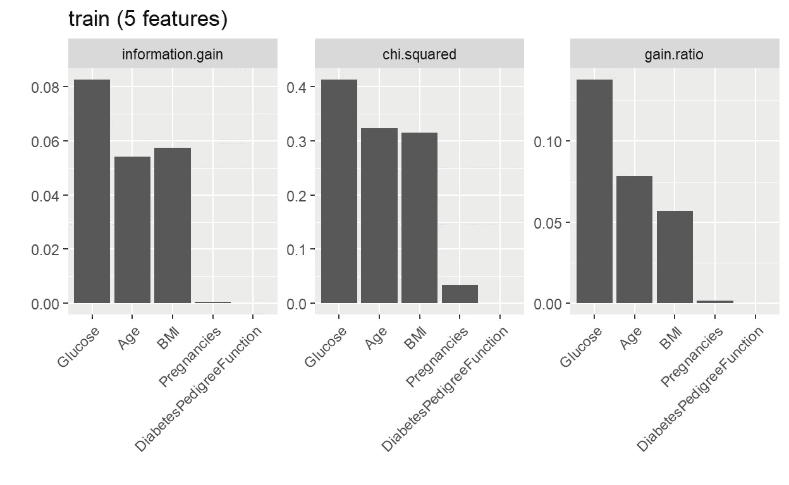
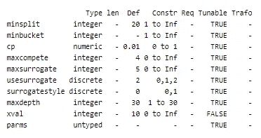
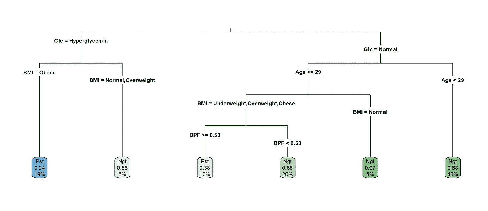
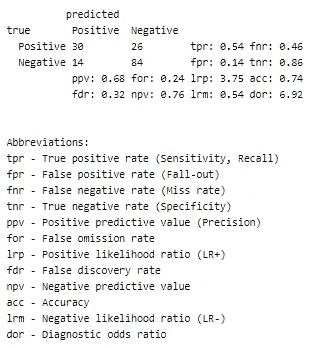
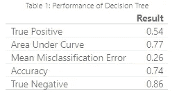
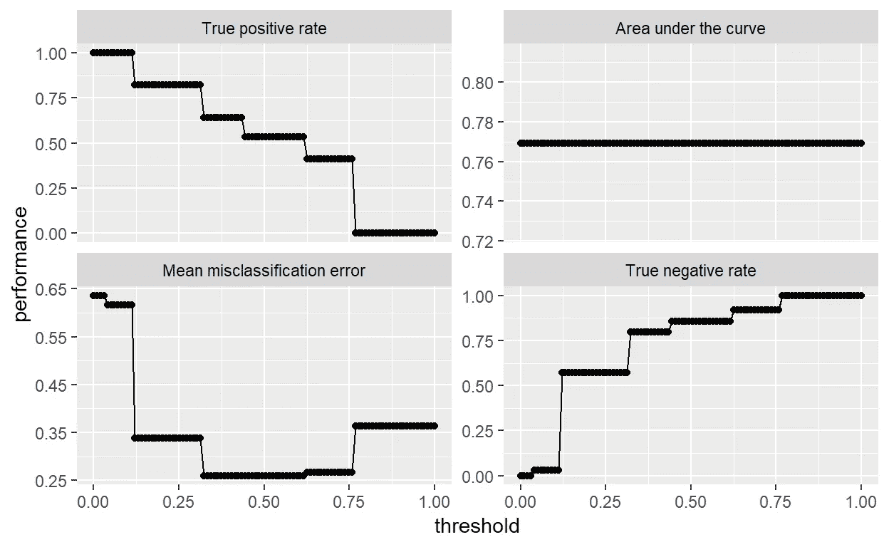
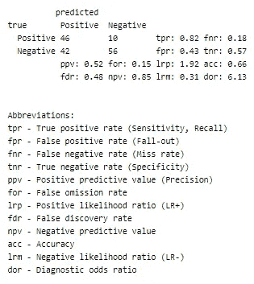
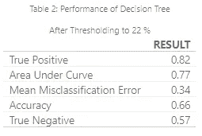

# 在 R 中使用 mlr 进行机器学习:决策树的逐步方法

> 原文：<https://towardsdatascience.com/decision-tree-classification-of-diabetes-among-the-pima-indian-community-in-r-using-mlr-778ae2f87c69?source=collection_archive---------12----------------------->

## 优化性能的超参数调整。

我个人喜欢使用`mlr`来执行我的机器学习任务，但是你也可以使用任何你喜欢的其他库。

首先让我们加载相关的库:

*   `mlr`用于机器学习算法
*   `FSelector`进行特征选择。(同样，你可以使用任何你想要的特征选择库)
*   `rpart.plot`因为我想可视化这棵树，所以我将使用`rpart`决策树算法。

```
library(mlr) 
library(FSelector) 
library(rpart.plot) glimpse(Diabetes)Observations: 768 Variables: 6 
$ Pregnancies <fct> Yes, Yes, Yes, Yes, No, Yes, Yes... 
$ Glucose <fct> Hyperglycemia, Normal, Hyperglyc... 
$ BMI <fct> Obese, Overweight, Normal, Overw... 
$ DiabetesPedigreeFunction <dbl> 0.627, 0.351, 0.672, 0.167, 2.28... $ Age <int> 50, 31, 32, 21, 33, 30, 26, 29, ... $ Outcome <fct> Positive, Negative, Positive, Ne...
```

看看我在[上一篇文章](https://medium.com/@aselmendis123/easy-data-science-with-r-and-python-diabetes-among-the-pima-indians-an-exploratory-analysis-d7bc321d0fa7?sk=02c9acfed5e39e0beb7068f2eecd683b)中处理过的数据集，它显示了我们将要处理的变量。

# 训练和测试设备

我将使用 80/20 训练/测试数据集。

```
set.seed(1000) 
train_index <- sample(1:nrow(Diabetes), 0.8 * nrow(Diabetes)) 
test_index <- setdiff(1:nrow(Diabetes), train_index) 
train <- Diabetes[train_index,] test <- Diabetes[test_index,]list( train = summary(train), test = summary(test) )
```

*   训练集显示我们的目标变量有 212 个正面结果和 402 个负面结果。
*   测试集显示我们有 56 个正面结果和 98 个负面结果。

*我们的目标变量存在明显的类别不平衡，因为它偏向于“阴性”(无糖尿病)，我们将发现更难建立一个“阳性”结果的预测模型。*

*你可以通过重新平衡类来解决这个问题，这需要重新采样。但是，我将在预测阶段调整概率阈值。我不知道这是否会解决任何潜在的问题，但阈值调整允许你改变预测，以给出一个完全不同的结果。*

# 决策图表

```
(dt_task <- makeClassifTask(data=train, target="Outcome"))Supervised task: train 
Type: classif 
Target: Outcome 
Observations: 614 
Features: numerics factors ordered functionals 
            2        3        0       0 
Missings: FALSE 
Has weights: FALSE 
Has blocking: FALSE 
Has coordinates: FALSE 
Classes: 2 Positive Negative 
             212      402 
Positive class: Positive
```

首先，我们必须使用我们的训练集进行分类任务。在这里，我们可以定义我们试图解决的机器学习问题的类型，并定义目标变量。

我们可以看到，`Outcome`的`Positive`等级已经默认为机器学习任务中的正类。情况并非总是如此。您可以通过指定`Positive=x`来更改它(其中‘x’是您想要预测的变量的目标级别)。在这种情况下，我们希望预测糖尿病患者(即`Outcome`变量的`Positive`水平)。

# 学习者

```
(dt_prob <- makeLearner('classif.rpart', predict.type="prob"))Learner classif.rpart from package rpart 
Type: classif 
Name: Decision Tree; Short name: rpart 
Class: classif.rpart 
Properties: twoclass,multiclass,missings,numerics,factors,ordered,prob,weights,featimp 
Predict-Type: prob 
Hyperparameters: xval=0
```

在创建分类任务后，我们需要创建一个学习器，它将在以后接受我们的任务来学习数据。我选择了 rpart 决策树算法。这是递归分割决策树。

# 特征选择

为了选择哪些特征提供了预测`Positive`的最佳机会，`generateFilterValuesData`给我们每个特征一个分数。这可以用`PlotFilterValues`来绘制。每个变量的分数取决于您选择的标准。这里我选择**信息增益**、**卡方**和**增益比**作为我的标准。

```
generateFilterValuesData(dt_task, method = c("information.gain","chi.squared", "gain.ratio")) %>% plotFilterValues()
```



`generateFeatureImportanceData`功能也以类似的方式工作。除了它将根据给定的性能标准向我们显示每个特性的重要性。我选择了**真阳性率**和**曲线下面积**。

```
generateFeatureImportanceData(task=dt_task, learner = dt_prob,measure = tpr, interaction = FALSE)FeatureImportance: Task: train Interaction: FALSE Learner: classif.rpart Measure: tpr Contrast: function (x, y) x - y Aggregation: function (x, ...) UseMethod("mean") Replace: TRUE Number of Monte-Carlo iterations: 50 Local: FALSE tpr
Pregnancies 0
Glucose -0.1869811
BMI -0.1443396
DiabetesPedigreeFunction -0.06339623
Age -0.06896226generateFeatureImportanceData(task=dt_task, learner = dt_prob,measure = auc, interaction = FALSE)FeatureImportance: Task: train 
Interaction: FALSE 
Learner: classif.rpart 
Measure: auc 
Contrast: function (x, y) x - y 
Aggregation: function (x, ...) 
UseMethod("mean") 
Replace: TRUE 
Number of Monte-Carlo iterations: 50 
Local: FALSE auc
Pregnancies 0
Glucose -0.1336535
BMI -0.07317023
DiabetesPedigreeFunction -0.01907362
Age -0.08251478
```

从上面的输出中我们可以看到:

*   信息增益和增益率显示怀孕得分为零或低分。
*   `generateFeatureImportanceData`将 TPR 和 AUC 作为绩效衡量指标时，显示妊娠得分为零。

纵观所有证据，`Pregnancies`将是我丢弃的唯一变量。其他变量仍然显示出对某些标准的预测能力。

*鉴于我们只剩下 4 个特征，可能存在不符合我的模型的风险。对此的另一个理由是，我首先没有很多行数据要处理。这是关于什么是合适的数据量和特征(维数灾难)的持续讨论。*

看下面，我已经把怀孕从我们的训练和测试集中去掉了，并用我们的新训练集做了一个新的分类任务。

```
set.seed(1000) 
train <- select(train, -Pregnancies) 
test <- select(test, -Pregnancies)list( train = summary(train), test = summary(test) )
```

另一个问题是，在葡萄糖类别中，“低血糖症”在整个数据集中只有 5 种表现。当我们进行交叉验证时，这将是一个问题，因为几乎可以肯定，这个水平将在任何折叠中缺失。这将不允许模型在以后被适当地训练。因此，我们需要从两个数据集中去除低血糖:

```
train <- filter(train, Glucose!='Hypoglycemia') %>% droplevels() 
test <- filter(test, Glucose!='Hypoglycemia') %>% droplevels()list( train = summary(train), test = summary(test) )
```

因为我们现在有了新的数据集，所以我们需要基于新的训练集进行新的分类任务。

```
(dt_task <- makeClassifTask(data=train, target="Outcome"))Supervised task: train 
Type: classif 
Target: Outcome 
Observations: 609 
Features: numerics factors ordered functionals 
            2        2       0        0 
Missings: FALSE 
Has 
weights: FALSE 
Has blocking: FALSE 
Has coordinates: FALSE 
Classes: 2 
Positive Negative 
 210        399 
Positive class: Positive
```

# 超参数调谐

现在，任何机器学习算法都需要我们根据自己的判断来调整超参数。调整超参数是为机器学习参数选择一个值的过程，目标是获得您想要的性能水平。

在`mlr`中调整机器学习算法包括以下步骤:

*   定义搜索空间。
*   定义优化算法(又名调优方法)。
*   定义评估方法(即重新取样策略和性能测量)。

# 搜索空间

因此，定义搜索空间就是为给定的特征/变量指定参数。因为我们在这篇文章中关注决策树，使用`getParamSet(learner)`函数，我们可以获得我们想要的算法的超参数。

我们需要`rpart`学习者的参数。

```
getParamSet("classif.rpart")
```



getParamSet(“classif.rpart”)

我们可以看到`rpart`有 10 个超参数，只有`xval`是不可调整的(即不能改变)。

以下是对上述参数的解释:

*   `minsplit`

*一个节点中的最小观察数，例程甚至会尝试为其计算一个分裂。默认值为 20。调整这个参数可以节省计算时间，因为较小的节点几乎总是被交叉验证删除。*

*   `minbucket`

*终端节点中的最小观察数。默认是* `*minspit/3*` *(虽然不知道这是不是最优选择)。*

*   `maxcompete`

*如果设置为 1，这将显示在节点上给出最佳分割的变量。如果设置大于 1，那么它会给你第二，第三等..最好的。它对计算时间没有影响，对使用的内存影响最小。*

*   `maxdepth`

这控制了树可以建多深。

*   `cp`

*这是复杂度参数。它越低，树就会长得越大。一个* `*cp=1*` *会导致根本没有树。这也有助于修剪树木。无论* `*cp*` *的值是多少，我们都需要小心不要让树过度生长。更高的复杂性参数会导致过度绘制的树。我个人发现一个非常高的复杂度参数值(在我的例子中超过 0.3)会由于过度运行而导致树的欠拟合，但是这也取决于你拥有的特性的数量。*

我以前没有使用过代理变量，所以在这种情况下我将省略它们。我只是不想在没有足够的理解来解释我自己的情况下在这一点上继续下去。

所以现在我们需要把超参数设置成我们想要的。记住没有一个确切的正确答案。我们需要定义空间并运行搜索，以根据我们定义的空间自动找到哪些超参数值将给出最佳结果。这意味着超参数的变化(大或小)可能会影响性能，也可能不会。

所以，如果你时间紧迫，要么跟随你的直觉，要么为超参数定义一个大空间，如果你有一台强大的机器和非凡的耐心，让`mlr`做繁重的工作。

```
dt_param <- makeParamSet( 
makeDiscreteParam("minsplit", values=seq(5,10,1)), makeDiscreteParam("minbucket", values=seq(round(5/3,0), round(10/3,0), 1)), 
makeNumericParam("cp", lower = 0.01, upper = 0.05), makeDiscreteParam("maxcompete", values=6), makeDiscreteParam("usesurrogate", values=0), makeDiscreteParam("maxdepth", values=10) )
```

对于我正在使用的模型，我将设置:

*   `minsplit` = [5，6，7，8，9，10]
*   `minbucket` = [5/3，10/3]
*   `cp` = [0.01，0.05]
*   `maxcompete` = 6
*   `usesurrogate` = 0
*   `maxdepth` = 10

> 我没有定义大空间的主要原因是我以前定义过，它运行了大约 4 个小时，有 **100，000 个**超参数组合。对我个人来说，这是太多的时间了，除非我正在做一个能从中受益匪浅的项目。

# 最优化算法

我们可用的标准但缓慢的算法之一是*网格搜索*来选择一组适当的参数。

```
ctrl = makeTuneControlGrid()
```

这就是我们如何指定我们想要运行网格搜索。有了上面指定的空间，在`dt_param`的情况下，我们得到了 120 种可能的组合。

# 使用重采样评估调优

指定上述内容后，我们现在可以进行调优过程了。我们定义一个重采样策略并记录性能。

我们将重采样策略设置为分层采样的三重交叉验证。如果你在目标变量中有阶级不平衡，分层抽样是有用的。它将尝试在每个文件夹中拥有相同数量的类。通常，为了从 k 重交叉验证中获得好的结果，3-5 重交叉验证将会很好。*折叠多少次*也取决于你有多少数据(即因素/类别的级别数，行数)。

```
rdesc = makeResampleDesc("CV", iters = 3L, stratify=TRUE)
```

# 调谐

我们现在可以使用`tuneParams`向我们展示我们指定的超参数值的什么组合会给出最佳结果。

在`measures`中，您可以定义想要查看的绩效标准。我还想在交叉验证时从测试集中得到真实阳性率的标准差。这个增加的度量应该给我们一个指示，表明这个度量的每个折叠之间的价差有多大。

```
set.seed(1000) 
(dt_tuneparam <- tuneParams(learner=dt_prob, 
                 resampling=rdesc, 
                 measures=list(tpr,auc, fnr, mmce, tnr, setAggregation(tpr, test.sd)), 
                 par.set=dt_param, 
                 control=ctrl, 
                 task=dt_task, 
                 show.info = TRUE) )Tune result: Op. pars: minsplit=9; minbucket=2; cp=0.0144; maxcompete=6; usesurrogate=0; maxdepth=10 tpr.test.mean=0.6095238,auc.test.mean=0.7807376,fnr.test.mean=0.3904762,mmce.test.mean=0.2725780,tnr.test.mean=0.7894737,tpr.test.sd=0.0704698
```

在运行调谐器时，我们看到我们设置的参数有 120 种可能的组合。输出底部的最终结果(即`[Tune] Result:...)`给出了我们的最佳组合。这将在每次运行时改变。只要您可以看到类似的性能结果，继续使用当前数据集应该没有危险。如果性能结果开始偏离太多，数据可能不充分。

在最优超参数中，测试集中的真阳性率的标准偏差是 0.0704698，这是相对较低的，并且可以给我们稍后在预测时将获得的真阳性率一个概念。*如果预测的 TPR 与交叉验证期间获得的 TPR 接近或在 1 个标准偏差之间，则表明我们的模型运行良好(这只是我的观点，其他人可能需要更小的扩散)*

***注意*** `*tuneParams*` *知道哪个绩效衡量标准最小化和最大化。例如，它知道如何最大化精确度和最小化错误率(mmce)。*

> 另一方面，正如我之前提到的，我定义了一个大的搜索空间，花了大约 4 个小时完成，最终得到了 100，000 个组合。这是结果:
> 
> *【调】结果:minsplit = 17min bucket = 7；cp = 0.0433max compete = 4；use surrogate = 0；max depth = 7:TPR . test . mean = 0.6904762，auc.test.mean=0.7277720，f1.test.mean=0.6156823，acc.test.mean=0.7283265，mmce.test.mean=0.2716735，timepredict.test.mean=0.000000，tnr.test.mean=0.7460928*

*虽然 TPR 更高，但我将使用我以前的超参数，因为它的计算成本更低。*

## 最优超参数

```
list( `Optimal HyperParameters` = dt_tuneparam$x, 
      `Optimal Metrics` = dt_tuneparam$y )$`Optimal HyperParameters` 
$`Optimal HyperParameters`$minsplit [1] 9 
$`Optimal HyperParameters`$minbucket [1] 2 
$`Optimal HyperParameters`$cp [1] 0.01444444 
$`Optimal HyperParameters`$maxcompete [1] 6 
$`Optimal HyperParameters`$usesurrogate [1] 0 
$`Optimal HyperParameters`$maxdepth [1] 10 $`Optimal Metrics` 
tpr.test.mean auc.test.mean fnr.test.mean mmce.test.mean 
0.60952381    0.78073756    0.39047619      0.27257800 
tnr.test.mean tpr.test.sd 
0.78947368     0.07046976
```

使用`dt_tuneparam$x`我们可以提取最优值，而`dt_tuneparam$y`给我们相应的性能指标。

`setHyperPars`将使用其最佳值调整学习者。

```
dtree <- setHyperPars(dt_prob, par.vals = dt_tuneparam$x)
```

# 模特培训

```
set.seed(1000) dtree_train <- train(learner=dtree, task=dt_task) getLearnerModel(dtree_train)n= 609 node), split, n, loss, yval, (yprob) * denotes terminal node 1) root 609 210 Negative (0.34482759 0.65517241) 2) Glucose=Hyperglycemia 149 46 Positive (0.69127517 0.30872483) 4) BMI=Obese 117 28 Positive (0.76068376 0.23931624) * 5) BMI=Normal,Overweight 32 14 Negative (0.43750000 0.56250000) * 3) Glucose=Normal 460 107 Negative (0.23260870 0.76739130) 6) Age>=28.5 215 78 Negative (0.36279070 0.63720930) 12) BMI=Underweight,Overweight,Obese 184 77 Negative (0.41847826 0.58152174) 24) DiabetesPedigreeFunction>=0.5275 61 23 Positive (0.62295082 0.37704918) * 25) DiabetesPedigreeFunction< 0.5275 123 39 Negative (0.31707317 0.68292683) * 13) BMI=Normal 31 1 Negative (0.03225806 0.96774194) * 7) Age< 28.5 245 29 Negative (0.11836735 0.88163265) *rpart.plot(dtree_train$learner.model, roundint=FALSE, varlen=3, type = 3, clip.right.labs = FALSE, yesno = 2)
```



Decision Tree Classification of the Pima Indian Diabetes dataset

```
rpart.rules(dtree_train$learner.model, roundint = FALSE)Outcome 0.24 when Glucose is Hyperglycemia & BMI is Obese 0.38 when Glucose is Normal & BMI is Underweight or Overweight or Obese & Age >= 29 & DiabetesPedigreeFunction >= 0.53 0.56 when Glucose is Hyperglycemia & BMI is Normal or Overweight

0.68 when Glucose is Normal & BMI is Underweight or Overweight or Obese & Age >= 29 & DiabetesPedigreeFunction < 0.53 0.88 when Glucose is Normal & Age < 29 0.97 when Glucose is Normal & BMI is Normal & Age >= 29
```

在训练决策树之后，我能够用`rpart.plot`函数绘制它，并且我可以很容易地用`rpart.rules`看到树的规则。因为`mlr`是一个机器学习算法的包装器，我可以根据自己的喜好定制，这只是一个例子。

# 模型预测(测试)

现在，我们让经过训练的学习者使用我们的测试数据进行预测。

```
set.seed(1000) 
(dtree_predict <- predict(dtree_train, newdata = test))Prediction: 154 observations predict.type: prob threshold: Positive=0.50,Negative=0.50 time: 0.00 truth prob.Positive prob.Negative response 1 Negative 0.3170732 0.6829268 Negative 2 Positive 0.6229508 0.3770492 Positive 3 Negative 0.4375000 0.5625000 Negative 4 Negative 0.3170732 0.6829268 Negative 5 Positive 0.7606838 0.2393162 Positive 6 Negative 0.1183673 0.8816327 Negative ... (#rows: 154, #cols: 4)
```

对每一行进行分类的阈值是 50/50。这是默认的，但以后可以更改(我将这样做)。

```
dtree_predict %>% calculateROCMeasures()
```



现在我们有了模型的混淆矩阵。我们看到它在预测`Negative`结果方面表现出色，但在预测`Positive`结果方面表现不佳。这本质上是由于我们数据集中的类别不平衡。这就是为什么阈值是一个更容易的策略来获得我们的首选模型。当然，如果我们的数据中有平衡的类和更多的观察行会更好，但这并不总是一个选择或现实。

为了更连贯地查看我们模型的性能，我们可以使用我编写的以下代码以一种可展示的方式来查看它。

```
Performance <- performance(dtree_predict, measures = list(tpr,auc,mmce, acc,tnr)) %>% 
as.data.frame(row.names = c("True Positive","Area Under Curve", "Mean Misclassification Error","Accuracy","True Negative")) Performance %>% kable(caption="Performance of Decision Tree",digits = 2, format = 'html', col.names = "Result")
```



这些指标相当令人满意。但是我们仍然可以实现更高的 TPR，如下所述。在某些情况下，包括这一点，TPR 将是最重要的，而不是 TNR。但是在我看来，我需要达到一个令人满意的 TNR，因为如果不是这样，我的错误分类率将会很高。

# 阈值处理

```
(dtree_threshold <- generateThreshVsPerfData(dtree_predict, measures = list(tpr,auc, mmce,tnr)) %>% plotThreshVsPerf() + geom_point() )
```



Performance vs Classification Threshold

我个人对这个模型的目标是获得一个可接受的和令人满意的`True Positive Rate`和`True Negative Rate`。由于 AUC 在所有阈值上保持不变，我们不需要关心它。通过改变阈值，我故意创建了一个有偏见的模型，但这是一个正常的机器学习问题。****偏差-方差权衡*** *是如此常见，我们需要学会驾驭它。这是一个完全不同的话题，任何做机器学习的人都需要一些这方面的知识。**

*下面您将看到 3 个不同的阈值:*

*   *TPR 低于 100%的最大阈值。*
*   *TPR 高于 80%的最低阈值。*
*   *两个阈值的平均值。*
*   *我们的 TNR 高于 70%的最大阈值。*

```
*list( 
`TPR Threshold for 100%` = tpr_threshold100 <- dtree_threshold$data$threshold[ which.max(dtree_threshold$data$performance[ dtree_threshold$data$measure=="True positive rate"]<1)], `TPR Threshold for 80%` = tpr_threshold80 <- dtree_threshold$data$threshold[ which.min(dtree_threshold$data$performance[ dtree_threshold$data$measure=="True positive rate"]>0.80)], `Average Threshold` = avg_threshold <- mean(c(tpr_threshold100,tpr_threshold80)), `TNR Threshold for 80%` = tnr_threshold80 <- dtree_threshold$data$threshold[ which.max(dtree_threshold$data$performance[ dtree_threshold$data$measure=="True negative rate"]>0.70)] )*
```

*$ `TPR Threshold for 100%` [1] 0.1212121*

*$`TPR Threshold for 80%`[1]0.3232323*

*$ `Average Threshold` [1] 0.222222*

*$ `TNR Threshold for 80%` [1] 0.3232323*

*使用`avg_threhsold`再次预测我们的模型，我们可以获得以下性能指标。然而，从图中的阈值和我在上面定义的阈值来看，我们的真实负利率将受到很大的冲击。*

```
*DecisionTree <- dtree_predict %>% setThreshold(avg_threshold) (dt_performance <- DecisionTree %>% performance(measures = list(tpr,auc, mmce,tnr)) )tpr           auc      mmce     tnr 
0.8214286 0.7693149 0.3376623 0.5714286*
```

*我们的 TPR 现在是 82.14 %。这与 50/50 的门槛有着巨大的差异。我们的 TNR 已经降低到 57.14 %，但这是我们的模型偏向 TPR 的结果。我在下面解释新的混淆矩阵。*

```
*(dt_cm <- DecisionTree %>% calculateROCMeasures() )*
```

**

*我们注意到以下其他变化:*

*   *由于阈值差异，TNR 减少到 57 %。*
*   *FPR 增加到了 43 %。这意味着该模型具有增加的 1 型错误的可能性，其中当它实际上不存在时，它将检测到糖尿病。为了获得更高的 TPR，这是我们必须做出的牺牲。*
*   *准确率降到了 66 %。这是改变门槛的另一个后果。这不是一个值得关注的原因，因为我们的模型做了我想让它做的事情——具有很高的真实阳性率。如果我们只关心对某个结果的准确预测，那么准确性就不是模型性能的充分衡量标准。大多数情况下都是这样，但即使这样，您仍然需要深入研究模型性能。*

```
*Performance_threshold <- performance(DecisionTree, measures = list(tpr,auc, mmce, acc, tnr)) %>% 
as.data.frame(row.names = c("True Positive","Area Under Curve", "Mean Misclassification Error","Accuracy","True Negative")) Performance_threshold %>% kable(caption=paste("Performance of Decision Tree\n\nAfter Thresholding to",(avg_threshold*100) %>% round(0),'%'), digits = 2, format = 'html', col.names = 'RESULT')*
```

**

*更改分类阈值后，我们可以看到新的性能指标。阈值对于用户和问题的领域来说是非常主观的。有时，根据错误分类的代价，有必要将模型的性能向一个方向倾斜。在这种情况下，对于患者来说会有许多假阳性，但是如果将这些患者错误分类的成本不是太高，那么获得正确诊断的更高可能性(即真阳性)是值得的。*

*最后，设置阈值是必要的，尤其是当你有一个不平衡的数据集时(例如，不平衡数量的目标水平)。在该数据集中，`Negative`比`Positives`多得多。如果更加平衡，则可能不需要根据模型对每个目标的分类程度来设定阈值。*

> *如果您有任何问题或顾虑，请发表评论进行讨论，我邀请任何对此感兴趣的人加入。谢谢你*

**最初发表于* [*轻松数据科学与 R 和 Python*](https://easydsrp.com/posts/2018-11-10-diabetes-among-the-pima-indians-supervised-learning-classification/) *。**