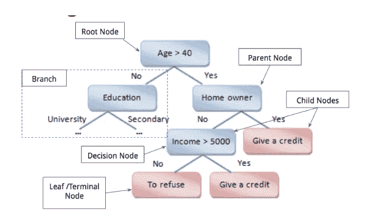
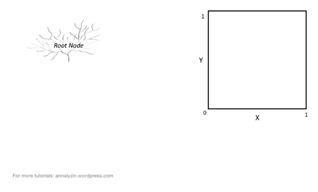
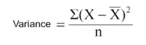
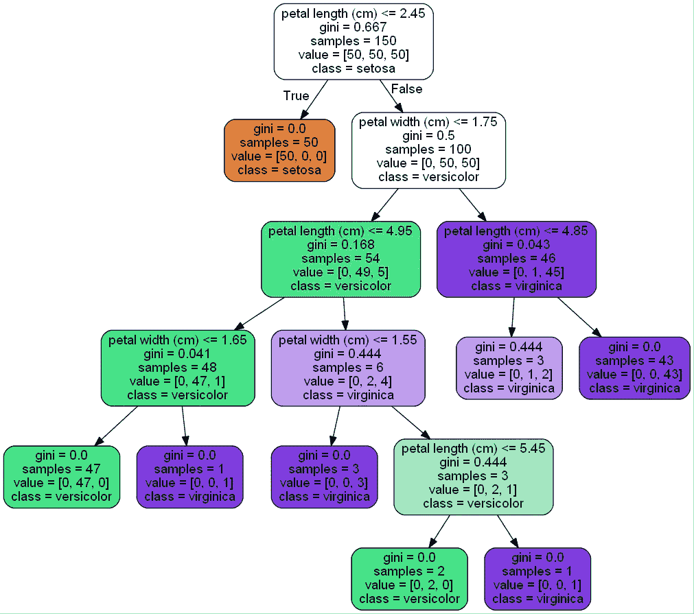
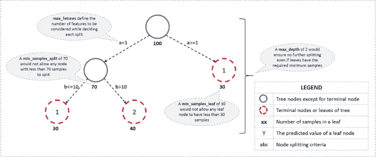

# 决策树——数据科学家解决哈姆莱特难题的灵丹妙药

> 原文：<https://towardsdatascience.com/decision-tree-data-scientists-magic-bullet-for-hamletian-dilemma-411e0121ba1e?source=collection_archive---------8----------------------->

source: my sketch book

决策树属于监督机器学习算法家族，被认为是所有数据科学问题的*万能药*。数据科学家经常会说一些诙谐的话，比如，“每当问题陈述让你陷入哈姆雷特式的困境，而你又想不出任何算法时(不管情况如何)，就使用决策树吧！”。

无论是在工业界还是在 kaggle 竞赛中，经常可以看到决策树或者至少是从它演化而来的算法( [*Bagging，Boosting ensemble*](https://analyticsindiamag.com/primer-ensemble-learning-bagging-boosting/) )被虔诚地实践着。

决策树是一种通用的机器学习方法，能够执行回归和分类任务。几乎所有现实世界的问题本质上都是非线性的，决策树可以帮助你消除数据中的非线性。这种算法非常直观，易于理解，可以直观地解释——这是每个企业首先想要的。

> 一个人还能从模特身上得到什么？简单神奇的✨

决策树是倒着画的，意思是根在上面，叶子在下面。决策树主要相信分而治之的规则。

# 基本术语

让我们看看决策树使用的基本术语:

1.  **根节点:**它代表整个群体或样本，并进一步分成两个或多个同类集合。
2.  **拆分:**是将一个节点分成两个或两个以上子节点的过程。
3.  **决策节点:**当一个子节点分裂成更多的子节点时，则称为决策节点。
4.  **叶/端节点:**不再分裂的节点称为叶或端节点。
5.  **剪枝:**当我们删除一个决策节点的子节点时，这个过程叫做剪枝。
6.  **分支/子树:**整个树的一个子部分称为分支或子树。
7.  **父节点和子节点:**被划分为子节点的节点称为子节点的父节点，子节点是父节点的子节点。

# 直觉

有两种类型决策树:

**答**。*分类决策树* & **B** 。*回归决策树*

*   分类树帮助您对数据进行分类，因此它们可以处理分类数据，例如贷款状态(批准/未批准)、垃圾邮件/非垃圾邮件等。
*   回归树旨在帮助您预测结果，结果可以是一个真实的数字，例如一个人的收入，房子的销售价格等。

source: algobeans.com — Classification Tree illustration

假设我们有两个特征 X 和 Y，在右边的面板中，您可以观察到有几个分散的数据点。绿叶和灰叶是因变量中的两类。所以决策树基本上做的是，在几次迭代中把整个数据集切割成切片。如图所示，在 X = 0.5 处有分裂 1，在 Y =0.5 处有分裂 2，在 X = 0.25 处有分裂 3。

拆分是精心安排的，以最大化每个拆分中特定类别的数量，这意味着决策树试图在每个节点上实现同质分布。从右图中，您可以注意到绿叶类和灰色叶类的分离最终在每个隔间中形成同质结构。

# 算法背后的数学

决策树采用多种方法来拆分节点。最常用的是基尼系数、熵、卡方等。

**我**。**基尼指数**

*   根据它，如果我们从一个群体中随机选择两个项目，那么它们必须是同一类，如果群体是纯的，概率是 1。
*   这是衡量杂质的标准。因此，基尼系数越低，同质性越高。
*   数学上表示为

> 基尼指数= 1-[(P) +(1-P) ]

其中 P 是该节点中阳性样本的比例。

*   基尼指数为“0”表示节点是纯的。因此，这意味着不需要进一步拆分。
*   涉及的步骤-

> 使用公式计算子节点的基尼系数。
> 
> 使用分裂每个节点的加权基尼系数来计算分裂的基尼系数

**二**。**卡方**

*   这有助于找出子节点和父节点之间差异的统计显著性。
*   我们通过目标变量的观察频率和预期频率之间的标准化差异的平方和来衡量它。
*   数学上表示为

> 卡方=((实际—预期)/预期)/2

*   这是纯度的衡量标准。因此，卡方值越高，子节点和父节点之间差异的统计显著性越高。
*   涉及的步骤-

> 通过计算成功和失败的偏差来计算单个节点的卡方
> 
> 使用拆分的每个节点的所有成功和失败卡方的总和计算拆分的卡方

**三**。**熵**

*   它是对正在处理的信息的随机性的一种度量。
*   熵值越大，就越难从这些信息中得出任何结论。
*   数学上表示为

> 熵= -p*log(p) - q*log(q)

*   这里 p 和 q 分别是该节点中成功和失败概率。
*   测井记录以“2”为基数。
*   涉及的步骤-

> 计算父节点的熵
> 
> 计算 split 中每个单独节点的熵，并计算 split 中所有可用子节点的加权平均值。

**四**。**方差减少**

*   上面提到的所有方法都属于分类决策树。对于目标变量连续的回归决策树，采用方差缩减法。
*   它使用标准的方差公式来选择最佳分割。选择具有较低方差的分裂作为分裂群体的标准。
*   数学上表示为

Where, X -> actual values, X −> mean and N -> number of observations

*   涉及的步骤-

> 计算每个节点的方差。
> 
> 将每个分割的方差计算为每个节点方差的加权平均值。

让我们举一个离散的例子，牢牢抓住这个主题

# 形象化

如前所述，决策树是可以解释和可视化的。Graphviz 库来拯救正在研究 python 的数据科学家。[这里的](https://inteligencia-analitica.com/wp-content/uploads/2017/08/Installing-Graphviz-and-pydotplus.pdf) 是下载 Graphviz **的指南。**

我已经尝试使用 [IRIS 数据集](https://archive.ics.uci.edu/ml/datasets/iris)来可视化决策树和下图。这是通过一段代码实现的，你甚至不需要在你的机器上下载 Graphviz。

Find Hands-On-Code for visualizing decision tree[**HERE**](http://nbviewer.jupyter.org/github/PBPatil/Decision_Trees/blob/master/visualizing_trees.ipynb)

# 有什么条件？

嗯，我们的灵丹妙药听起来的确像是生命的救星，但这太好了，令人难以置信，不是吗？！对决策树建模时最大的危险是它们的过度拟合倾向。如果在决策树上没有设置限制，它会给你 100%的训练集的准确性，因为在最坏的情况下，它会为每个观察结果建立 1 个终端节点。

因此，在对决策树进行建模时，防止过度拟合是至关重要的，这可以通过两种方式实现:

***A.*** *对树大小设置约束(*超参数调优*)&****b .***[*树修剪*](http://www.saedsayad.com/decision_tree_overfitting.htm)

Illustration of different Hyper-parameters used in Decision Tree

# 进一步阅读

请参考下面的链接，以便更深入地理解这个概念

1.  [分析 vidhya](https://www.analyticsvidhya.com/blog/2016/04/complete-tutorial-tree-based-modeling-scratch-in-python/)
2.  Scikit [文档](http://scikit-learn.org/stable/modules/tree.html)
3.  [堆栈溢出](https://stackoverflow.com/questions/1859554/what-is-entropy-and-information-gain)

*恭喜你！！*关于掌握机器学习中一个古老的算法:)

> ***其他发表的文章:***

如果你喜欢我的文章，那就花几分钟看看我的其他博客吧-

1.  [什么是探索性数据分析？](/exploratory-data-analysis-8fc1cb20fd15)
2.  [最后一分钟修改:第一部分——机器学习&统计](https://medium.com/@theprasadpatil/last-minute-revision-part-i-machine-learning-statistics-8de23a377987)
3.  [如何使用 Python 从 Excel 创建 PDF 报告](https://medium.com/@theprasadpatil/how-to-create-a-pdf-report-from-excel-using-python-b882c725fcf6?source=your_stories_page----------------------------------------)