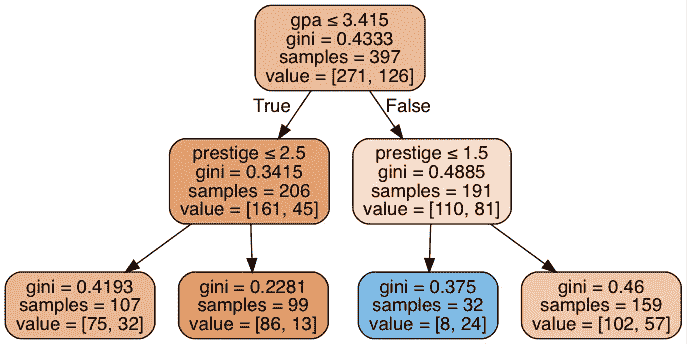
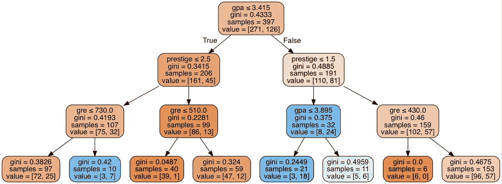
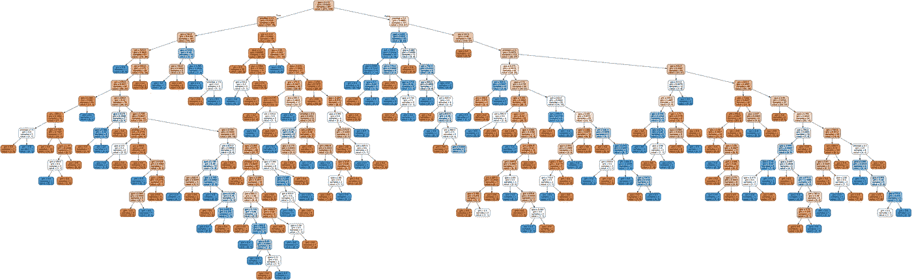

# 决策树拥抱

> 原文：<https://towardsdatascience.com/decision-tree-hugging-b8851f853486?source=collection_archive---------3----------------------->

昨天我了解了决策树以及如何在 python shell 中计算它们。决策树是一个非常酷和强大的决策支持工具，它本质上显示了一个算法。如上面的简单图表所示，我们看到决策树从一个根节点开始，然后分支到不同深度的内部节点。在每一步，您的数据都按照不同的属性进行分类，从而将数据引导到更深的内部节点，或者最终到达决策点，这也称为树叶。

为了应用我新学到的知识，我得到了一个关于大学录取的小数据集。数据集有 4 列:学生是否被录取，学生的 GRE 成绩，学生的 GPA(4.0 分)和学校的声望(4 分)。在通过移除空值来清理数据之后，我面临的任务是在最大深度 1、2、3 和无限深度上构建决策树，以查看我是否能够根据其他 3 个值准确预测某个学生是否被录取。首先，我计算了交叉验证分数，以确定每个深度的准确性，结果按深度顺序分别为 67.50%、70.77%、71.55%和 60.96%。现在得到这些数字是很棒的，然而有趣的部分开始于我制作如下所示的可视化决策树:

Max Depth 1

Max Depth 2

Max Depth 3

Max Depth None

这真的很酷，能够看到到底发生了什么，以获得上述准确性数字。正如我们所看到的，深度 2 和 3 是最准确的，但是我也想运行深度 4 和 5，看看我是否能得到更准确的结果。我们还可以看到，将最大深度设置为“无”会给我们一个很好的过度拟合的例子。

虽然决策树和其他工具一样都是令人惊奇的工具，但是它们有两个最大的缺点:

*   不稳定性:决策树严重依赖于提供给它们的数据，尽管一棵树可以变得非常精确，但是如果你给它提供额外的数据，整棵树就可能被抛弃。
*   复杂性:与其他决策模型相比，决策树易于使用，但是一个非常复杂的具有多个分支的决策树在准备和计算上都非常耗时。

所有的决策树都是很好的工具，比如随机森林，它使用一种集合方法(另一个话题)。我肯定会在未来的数据科学职业生涯中使用这些工具，并且很高兴能够更深入地研究其他机器学习应用程序！