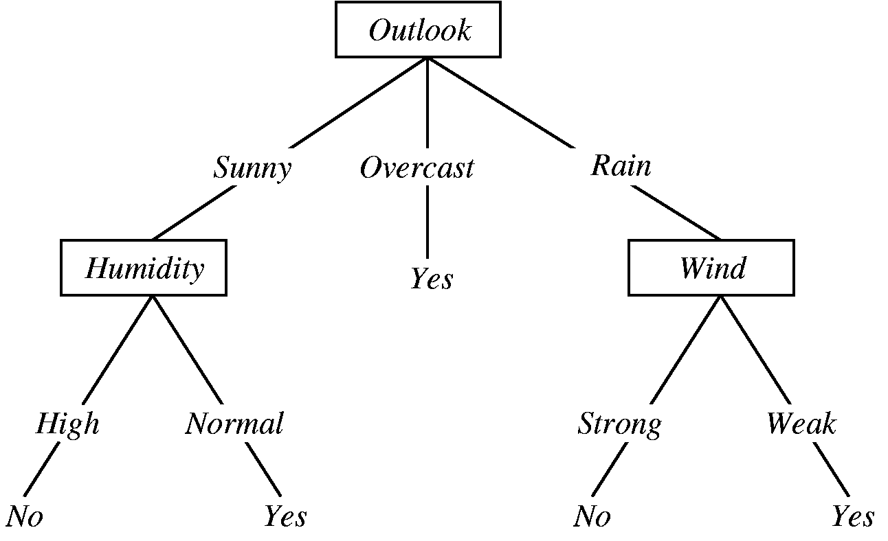
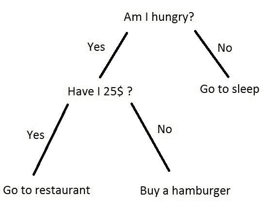

# 机器学习中的决策树

> 原文：<https://towardsdatascience.com/decision-tree-in-machine-learning-e380942a4c96?source=collection_archive---------2----------------------->


[Source](https://unsplash.com/search/photos/decision)

决策树是一种类似流程图的结构，其中每个内部节点代表一个特征上的`test`(例如，硬币是正面还是反面)，每个叶节点代表一个`class label`(计算所有特征后做出的决定)，分支代表导致这些类别标签的特征的结合。从根到叶的路径代表`classification rules`。下图说明了用标签(下雨(是)，不下雨(否))进行决策的决策树的基本流程。



Decision Tree for Rain Forecasting

决策树是`statistics`、`data mining`和`machine learning`中使用的预测建模方法之一。

决策树是通过一种算法方法构建的，这种算法方法可以根据不同的条件识别分割数据集的方法。这是监督学习中最广泛使用和最实用的方法之一。决策树是一种[非参数](https://machinelearningmastery.com/parametric-and-nonparametric-machine-learning-algorithms/) **监督学习**方法，用于**分类**和**回归**任务。

目标变量可以取一组离散值的树模型称为**分类树**。目标变量可以取连续值(通常是实数)的决策树被称为**回归树**。分类和回归树(CART)是这个的通称。

在这篇文章中，我将尝试用例子来解释。

## 数据格式

数据以表格记录的形式出现。

```
(x,Y)=(x1,x2,x3,....,xk,Y)
```

因变量 Y 是我们试图理解、分类或概括的目标变量。向量 x 由特征 x1、x2、x3 等组成。，用于该任务。

**示例**

```
training_data = [
                  ['Green', 3, 'Apple'],
                  ['Yellow', 3, 'Apple'],
                  ['Red', 1, 'Grape'],
                  ['Red', 1, 'Grape'],
                  ['Yellow', 3, 'Lemon'],
                  ]
 # Header = ["Color", "diameter", "Label"]
 # The last column is the label.
 # The first two columns are features.
```

# 决策树的生成方法

在做决策树的时候，在树的每个节点我们会问不同类型的问题。基于所提出的问题，我们将计算与之对应的信息增益。

## 信息增益

信息增益用于决定在构建树的每一步中分割哪个特征。简单是最好的，所以我们想保持我们的树小。要做到这一点，在每一步我们都应该选择产生最纯净子节点的分裂。一种常用的纯度测量方法叫做信息。对于树的每个节点，信息值**测量一个特征给我们多少关于类的信息。具有最高信息增益的分裂将被作为第一分裂，并且该过程将继续，直到所有子节点都是纯的，或者直到信息增益为 0。**

# 提问

```
class Question:
  """A Question is used to partition a dataset. This class just records a 'column number' (e.g., 0 for Color) and a
  'column value' (e.g., Green). The 'match' method is used to compare
  the feature value in an example to the feature value stored in the
  question. See the demo below.
  """ def __init__(self, column, value):
      self.column = column
      self.value = value def match(self, example):
      # Compare the feature value in an example to the
      # feature value in this question.
      val = example[self.column]
      if is_numeric(val):
          return val >= self.value
      else:
          return val == self.value def __repr__(self):
      # This is just a helper method to print
      # the question in a readable format.
      condition = "=="
      if is_numeric(self.value):
          condition = ">="
      return "Is %s %s %s?" % (
          header[self.column], condition, str(self.value))
```

让我们尝试查询问题及其输出。

```
Question(1, 3) ## Is diameter >= 3?
Question(0, "Green") ## Is color == Green?
```

现在，我们将尝试根据提问的问题对数据集进行分区。在每个步骤中，数据将被分为两类。

```
def partition(rows, question):
    """Partitions a dataset. For each row in the dataset, check if it matches the question. If
    so, add it to 'true rows', otherwise, add it to 'false rows'.
    """
    true_rows, false_rows = [], []
    for row in rows:
        if question.match(row):
            true_rows.append(row)
        else:
            false_rows.append(row)
    return true_rows, false_rows

   # Let's partition the training data based on whether rows are Red.
   true_rows, false_rows = partition(training_data, Question(0, 'Red'))
   # This will contain all the 'Red' rows.
   true_rows ## [['Red', 1, 'Grape'], ['Red', 1, 'Grape']]
   false_rows ## [['Green', 3, 'Apple'], ['Yellow', 3, 'Apple'], ['Yellow', 3, 'Lemon']]
```

构建决策树的算法通常是自上而下的，在`best`分割项目集的每一步选择一个变量。不同的算法使用不同的度量标准来测量`best`。

# 基尼杂质

首先让我们了解一下**纯**和**不纯**的含义。

## 纯的

纯意味着，在数据集的选定样本中，所有数据都属于同一类(纯)。

## 肮脏的

不纯意味着，数据是不同类的混合物。

## 基尼系数的定义

基尼系数是对随机变量新实例不正确分类的可能性的一种度量，前提是该新实例是根据数据集中类别标签的分布随机分类的。

如果我们的数据集是`Pure`，那么不正确分类的可能性是 0。如果我们的样本是不同类别的混合物，那么不正确分类的可能性将会很高。

**计算基尼杂质。**

```
def gini(rows):
    """Calculate the Gini Impurity for a list of rows.

    There are a few different ways to do this, I thought this one was
    the most concise. See:
    https://en.wikipedia.org/wiki/Decision_tree_learning#Gini_impurity
    """
    counts = class_counts(rows)
    impurity = 1
    for lbl in counts:
        prob_of_lbl = counts[lbl] / float(len(rows))
        impurity -= prob_of_lbl**2
    return impurity
```

**示例**

```
# Demo 1:
    # Let's look at some example to understand how Gini Impurity works.
    #
    # First, we'll look at a dataset with no mixing.
    no_mixing = [['Apple'],
                 ['Apple']]
    # this will return 0
    gini(no_mixing) ## output=0

   ## Demo 2:
   # Now, we'll look at dataset with a 50:50 apples:oranges ratio
    some_mixing = [['Apple'],
                   ['Orange']]
    # this will return 0.5 - meaning, there's a 50% chance of misclassifying
    # a random example we draw from the dataset.
    gini(some_mixing) ##output=0.5

    ## Demo 3:
    # Now, we'll look at a dataset with many different labels
    lots_of_mixing = [['Apple'],
                      ['Orange'],
                      ['Grape'],
                      ['Grapefruit'],
                      ['Blueberry']]
    # This will return 0.8
    gini(lots_of_mixing) ##output=0.8
    #######
```

# 制作决策树的步骤

*   获取行(数据集)的列表，这些行被考虑用于生成决策树(在每个节点递归)。
*   计算我们数据集的`uncertanity`或`Gini impurity`或我们的`data is mixed up`有多少等等。
*   生成需要在该节点询问所有问题的列表。
*   根据每个问题将行划分为`True rows`和`False rows`。
*   根据基尼系数和上一步数据划分计算信息增益。
*   根据每个问题更新最高信息增益。
*   基于信息增益(更高的信息增益)更新最佳问题。
*   在最佳问题上划分节点。从步骤 1 再次重复，直到我们得到纯节点(叶节点)。

**上述步骤的代码**

```
def find_best_split(rows):
    """Find the best question to ask by iterating over every feature / value
    and calculating the information gain."""
    best_gain = 0  # keep track of the best information gain
    best_question = None  # keep train of the feature / value that produced it
    current_uncertainty = gini(rows)
    n_features = len(rows[0]) - 1  # number of columns for col in range(n_features):  # for each feature values = set([row[col] for row in rows])  # unique values in the column for val in values:  # for each value question = Question(col, val) # try splitting the dataset
            true_rows, false_rows = partition(rows, question) # Skip this split if it doesn't divide the
            # dataset.
            if len(true_rows) == 0 or len(false_rows) == 0:
                continue # Calculate the information gain from this split
            gain = info_gain(true_rows, false_rows, current_uncertainty) # You actually can use '>' instead of '>=' here
            # but I wanted the tree to look a certain way for our
            # toy dataset.
            if gain >= best_gain:
                best_gain, best_question = gain, question return best_gain, best_question

    #######
    # Demo:
    # Find the best question to ask first for our toy dataset.
    best_gain, best_question = find_best_split(training_data)
    best_question
    ## output - Is diameter >= 3?
```

现在，根据上面讨论的步骤，在每个节点递归地构建决策树。

```
def build_tree(rows):
    """Builds the tree. Rules of recursion: 1) Believe that it works. 2) Start by checking
    for the base case (no further information gain). 3) Prepare for
    giant stack traces.
    """ # Try partitioning the dataset on each of the unique attribute,
    # calculate the information gain,
    # and return the question that produces the highest gain.
    gain, question = find_best_split(rows) # Base case: no further info gain
    # Since we can ask no further questions,
    # we'll return a leaf.
    if gain == 0:
        return Leaf(rows) # If we reach here, we have found a useful feature / value
    # to partition on.
    true_rows, false_rows = partition(rows, question) # Recursively build the true branch.
    true_branch = build_tree(true_rows) # Recursively build the false branch.
    false_branch = build_tree(false_rows) # Return a Question node.
    # This records the best feature / value to ask at this point,
    # as well as the branches to follow
    # dependingo on the answer.
    return Decision_Node(question, true_branch, false_branch)
```

## 构建决策树

让我们根据训练数据建立决策树。

```
training_data = [
                  ['Green', 3, 'Apple'],
                  ['Yellow', 3, 'Apple'],
                  ['Red', 1, 'Grape'],
                  ['Red', 1, 'Grape'],
                  ['Yellow', 3, 'Lemon'],
                  ]
  # Header = ["Color", "diameter", "Label"]
  # The last column is the label.
  # The first two columns are features.

  my_tree = build_tree(training_data)

  print_tree(my_tree)
```

**输出**

```
Is diameter >= 3?
  --> True:
    Is color == Yellow?
    --> True:
        Predict {'Lemon': 1, 'Apple': 1}
    --> False:
        Predict {'Apple': 1}
 --> False:
    Predict {'Grape': 2}
```

从上面的输出我们可以看到，在每一步，数据被分成`True`和`False`行。这个过程一直重复，直到我们到达信息增益为 0 的叶节点，并且由于节点是纯的，所以进一步的数据分割是不可能的。

**决策树的优势**

*   易于使用和理解。
*   可以处理分类数据和数字数据。
*   抵抗离群值，因此需要很少的数据预处理。

**决策树的缺点**

*   容易过度拟合。
*   需要对他们的表现进行某种衡量。
*   需要小心调整参数。
*   如果某些职业占优势，可能会创建有偏见的学习树。

## 如何避免决策树模型过拟合

过拟合是机器学习中每个模型的主要问题之一。如果模型过度拟合，它将很难推广到新的样本。为了避免决策树过度拟合**，我们移除了利用低重要性特征的分支。**这种方法被称为**修剪或后修剪。**这样，我们将降低树的复杂性，并因此通过减少过拟合来提高预测准确性。

修剪应该减少学习树的大小，而不会降低由[交叉验证](https://en.wikipedia.org/wiki/Cross-validation_(statistics))集测量的预测准确性。有两种主要的修剪技术。

*   *最小误差:*树被修剪回交叉验证误差最小的点。
*   *最小的树:*树被修剪得比最小误差稍远。从技术上讲，修剪创建了交叉验证误差在最小误差的 1 个标准误差内的决策树。

## **提前停止或预修剪**

防止过度拟合的另一种方法是，在生成样本非常少的叶子之前，尝试尽早停止树构建过程。这种试探法被称为*提前停止*，但有时也被称为预修剪决策树。

在分裂树的每个阶段，我们检查交叉验证错误。如果误差没有显著减小，那么我们停止。过早停止可能会因停止过早而不足。当前的拆分可能没什么好处，但在完成拆分后，后续的拆分会更显著地减少错误。

提前停止和修剪可以一起使用，单独使用，或者根本不使用。后期修剪决策树在数学上更加严格，找到一棵树至少和早期停止一样好。提前停止是一种快速解决的启发式方法。如果与修剪一起使用，尽早停止可以节省时间。毕竟，为什么建造一棵树只是为了再次修剪它？

## 现实生活中的决策树

*   **选择要旅行的航班**

假设您需要为下一次旅行选择航班。我们该如何着手呢？我们先查一下那天的航班是否有空。如果没有，我们会寻找其他日期，但是如果有，我们会寻找航班的持续时间。如果我们只想要直达航班，那么我们会查看该航班的价格是否在您预先定义的预算内。如果太贵的话，我们看看其他的航班，或者我们预订它！

*   **处理深夜的渴望**



Source: Google

决策树在现实生活中还有很多应用。更多决策树的应用可以查看[这个](https://medium.com/@ailabs/5-machine-learning-algorithms-and-their-proper-use-cases-a8cfd0cedb51)和[这个](http://what-when-how.com/artificial-intelligence/decision-tree-applications-for-data-modelling-artificial-intelligence/)。

从这篇文章中，我试图解释决策树的基础知识以及它是如何工作的。您可以在 [github](https://github.com/java-byte/ML-Decision-Tree/blob/master/Decision_tree.ipynb) 找到本文使用的源代码。

希望你喜欢这篇文章。如果有任何修改或建议，请直接在这篇文章或 LinkedIn 上给我发消息。快乐学习—干杯:)