# 决策树:完全介绍

> 原文：<https://towardsdatascience.com/decision-trees-60707f06e836?source=collection_archive---------9----------------------->

决策树是许多监督学习算法中的一种，任何人都可以基于一些历史数据对未来事件进行预测，尽管没有一种通用工具对所有问题都是最佳的，但决策树非常受欢迎，并在许多机器学习应用中证明非常有效。

为了理解决策树背后的直觉，考虑这样一个问题:设计一个算法来自动区分苹果和梨(*类* *标签*)，仅给出它们的宽度和高度测量值(*特征*)。

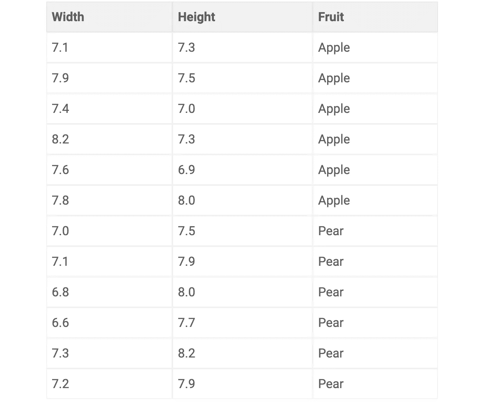

苹果往往又矮又胖，而梨通常又高又瘦。基于这些知识，我们可以问一系列的问题，这些问题最终会导致对神秘水果的真实类别的有根据的猜测。例如，为了对一个水果进行分类，我们可能会首先询问宽度是否小于 7.35 厘米，然后我们可以询问高度是否小于 7.4 厘米。如果这两个问题的答案都是*是*，那么我们就可以(非常有把握地)断定这个没有标签的商品是苹果。事实上，我们刚刚描述的过程正是决策树的过程。

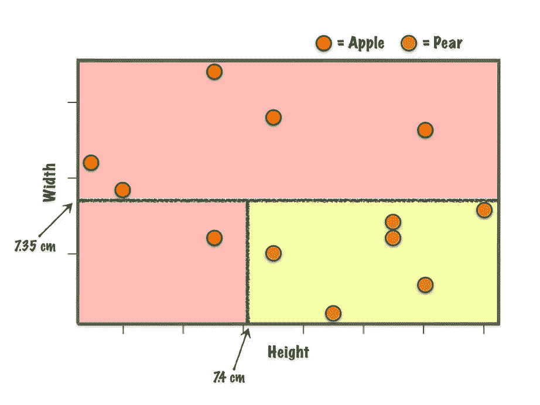

A visual representation of a decision tree and how this translates into 2D feature space

当我们看到我们所有的问题或*分裂*是如何源于一个根问题(*根节点*)并依次分支以最终到达某个终端决策(*叶节点*)时,(倒置)树的类比是有意义的。在树的旁边，我们可以确切地看到这是如何转换到二维特征空间的。分割将平面分成多个盒子，每个盒子对应一个观察分类(苹果/梨)。这个非常简单的概念在创建自动水果标签系统方面做得非常好，现代计算机可以很容易地采用这种方法来分类每秒成千上万的观察结果。

到目前为止，我们讨论的内容中还缺少一样东西:我们如何构建一个决策树？随着我们获得越来越复杂的数据，反复试验将成为一项相当艰巨的任务，即使我们采用这种方法，我们也有可能制作大量的树，我们如何设计一个最佳的树呢？下一节讨论从标记数据构建决策树的过程。

# 构建决策树

给定一组带标签的数据(*训练数据*)，我们希望构建一个决策树，该决策树将对训练数据和任何新的未观察到的数据做出准确的预测。根据所讨论的数据，决策树可能需要比前一个例子更多的分裂，但概念总是相同的:进行一系列良好的分裂，以正确地将观察分类为其真正的类标签。那么，我们如何定义什么是好的分割呢？

嗯，在每次分割时，我们希望找到一个特征，以这样一种方式分割标记的数据，使子节点比它们来自的父节点更加同质。换句话说，随着我们沿着树向下移动，我们希望节点变得更加纯净，我们希望选择我们的分裂来最大化节点纯净度的增加。

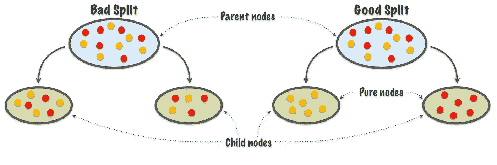

从数字上衡量节点纯度有两种流行的选择，但现在我们将关注熵(及其替代物，基尼杂质，稍后讨论)。更具体地说，对于观测值{x₁，x₂，…，xn} ∈ X 其中 P(xᵢ)是观测值的相对频率 *i* ，那么熵被定义为:

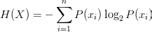

这个等式给出了较纯节点的低值，因此我们希望选择最小化熵的分裂。这似乎有道理，但有一个问题:这种设置可能会被父节点的某些分裂选择所滥用，例如一个大的子节点包含几乎所有的观察值，而第二个小的子节点是纯的。这给树增加了另一个分裂，并没有真正提高整体性能(因为它只占一个极值)，同时也给树增加了不必要的深度和复杂性，特别是如果这在同一个树中重复发生的话。

解决办法？信息增益。这是一种流行的信息论方法，该方法将分裂前父节点的熵与分裂后子节点的加权和的熵进行比较，其中权重与每个节点中的观察数量成比例。正如我们所要求的，这有效地惩罚了基于大小的小而纯的节点。更正式地，对于特征 F 和一组观察值 X，信息增益被定义为:

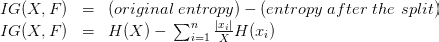

由于信息增益减去子节点的熵，我们选择的分裂将是最大化信息增益的分裂。通过研究上图中显示的示例，并比较我们从同一根节点上的两个不同的建议拆分中获得的信息增益值，这一切变得更加清楚。

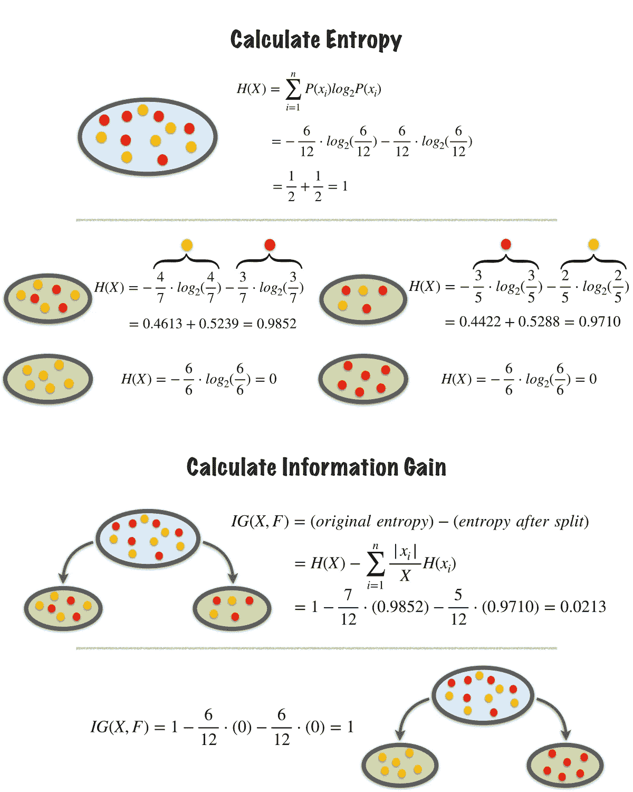

注意，第一个提出的分裂仅略微提高了节点纯度，信息增益仅为 0.0213。然而，第二次分裂将根节点分裂成两个完全纯的节点，这通过信息增益分数 1 来反映。显然，更好的分裂选择可以通过选择基于熵值最大化信息增益的分裂来衡量。

现在这个难题只剩下最后一块了，然后我们准备从头开始构建我们自己的决策树，那就是选择在哪里分割连续的特征。连续数据(如高度或宽度)可以拆分为无限个值，而分类数据(如水果颜色或血型)只能拆分有限个值并计算信息增益。考虑以下两个特征:

*   水果颜色(分类)-*{绿色，红色，黄色，其他}*
*   果高(连续)- *{5.65，5.78，6.34，6.84，6.86}*

对于水果颜色，我们可以很容易地检查所有可能的分裂，并选择一个最大化信息增益，如前所述。当我们尝试用这种方法计算水果高度时，有太多的值可能会被分割。我们可以使用 5.92、5.93 甚至 5.92534……应该使用哪个？显而易见的选择是取两个值之间的中点，在这种情况下，我们将有四个值进行分割，并检查信息增益。不过，这并不能很好地扩展。如果我们在数据集中有 1000 个不同的水果块，我们将有 999 个可能的分裂来检查，这可能会变得相当计算量大。解决方案是应用一种流行的聚类算法，例如 [k-means](https://en.wikipedia.org/wiki/K-means_clustering) ，将水果高度分成预定义数量的组，这样我们的数据可能如下所示:

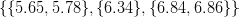

现在我们只需要检查更易管理的潜在分裂数量(那些是 6.06 和 6.59，你能看出为什么吗？).我们已经有效地将连续值转换为离散区间，并且在实践中，这通常能够获得最佳的信息增益，而不会浪费时间检查不必要的额外值。

差不多就是这样！这就是我们开始构建决策树所需要的所有理论。我们可以将所有这些放在一个决策树算法中，该算法大致基于最初的 [ID3 实现](https://en.wikipedia.org/wiki/ID3_algorithm)。在下面的伪代码中，`S`指的是一组数据(如苹果/梨数据)，`C`指的是类别标签(如苹果和梨)，`A`指的是特征(如高度或宽度)，而`v`指的是一个特征可能被分割成的值(如高度< 7.4 厘米)。

```
**ID3(S):** 
IF all examples in S belong to class C: 
    - return new leaf node and label with class C 
ELSE: 
    - select a feature A based on some feature selection criterion 
    - generate a new tree node with A as the test feature 
    - FOR EACH value v[i] of A: 
        - let S[i] ⊂ S contain all examples with A = v[i] 
        - build subtree by applying ID3(S[i])
```

下一节将继续探讨一些方法，我们可以通过防止一种常见的机器学习陷阱(称为过拟合)来提高实践中的性能。

# 过度拟合

我们前面提到过，我们的决策树(事实上，在所有的分类问题中)的一个可取的特征是良好的概括。这意味着，我们希望模型符合标记的训练数据，以做出与新的看不见的观察一样准确的预测。当这种情况没有发生时，通常是由于一种称为过度拟合的现象。在决策树中，当树中的拆分对于训练数据来说定义得过于具体时，就会出现这种情况。下面我们观察一个决策树，该决策树已经添加了三个连续的分裂以便对单个异常值进行分类，实际上这些额外的分裂不会提高新数据的性能，事实上可能会使其恶化。

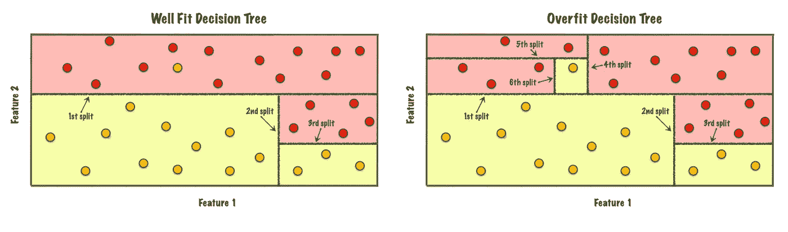

Adding three new splits to capture a single data point is probably overfitting

有三种方法可以防止决策树过度拟合:

*   早期停止-构建决策树，同时应用一些标准，在决策树过度适应训练数据之前停止决策树的增长。
*   修剪-构建决策树并允许它过度适应训练数据，然后将其修剪回去以移除导致过度适应的元素。
*   数据预处理—在构建树之前对初始数据进行一些更改

我们将在这里讨论前两种方法。

**提前停止**(或预修剪)是指在决策树过度适应训练数据之前，我们提前停止决策树的增长。这里的想法是在树产生过度的小生境分裂之前停止树的生长，这不能很好地概括，在实践中，这经常被使用。回想一下，在前面的部分中，根节点顺序地添加分裂，直到子节点是纯的，现在我们需要一个替代规则，告诉树在节点是纯的之前停止增长，并根据它们的多数类对新的终端节点进行分类。我们可以设想出大量的潜在停止规则，因此下面是一些流行选择的非穷尽列表:

*   最大树深度—只需预先定义一个任意的最大深度值(或最大分裂数)，一旦树达到该值，生长过程就会终止。
*   节点中的最小数量-定义出现在任何子节点中的最小观察数量，以使分割有效。
*   杂质的最小减少量——定义可接受的分流的最小可接受的杂质减少量。
*   最大特征-严格来说不是停止规则，而是仅考虑要分割的可用特征的子集，这可能会提高最终树的泛化能力。

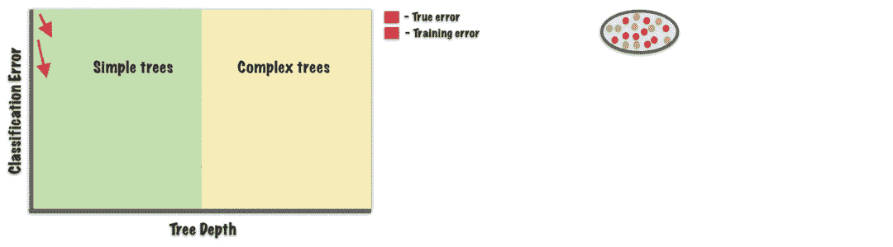

We wish to find a tree that will generalise well on the population

**另一方面，修剪**(或后修剪)采用已经过度拟合的树，并进行一些调整以减少/消除观察到的过度拟合。一个好的剪枝规则通常会通过使用独立的测试集来查明没有很好概括的分裂，并将它们从树中移除。同样，有许多不同的方法来实现修剪，但有三种流行的选择:

*   临界值修剪—根据在树构建阶段完成的计算，回顾性地估计每个节点的强度。没有达到某个临界值的节点将被删除，除非该分支上更远的节点达到了临界值。
*   错误复杂性修剪—生成一系列树，每个树通过对整个树进行不同程度的修剪来生成，并通过使用独立数据集评估其性能来选择其中一个树。
*   减少错误修剪—在整个树中运行独立的测试数据，并且对于每个非叶节点，比较来自该节点的子树被保留还是被移除时的错误数量。使用新的测试数据，被修剪的节点通常会比子树产生更少的错误。发现性能差异最大的节点被剪除，并且继续这个过程，直到进一步的剪除将增加误分类率。

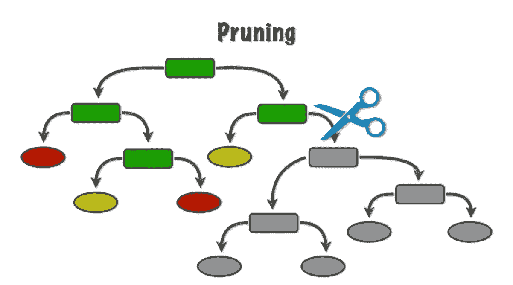

当谈到在实践中使用决策树时，对于过度拟合没有一个放之四海而皆准的解决方案。设计最佳决策树通常需要反复试验以及一些领域知识，因此，应该尝试许多上述方法。这是一个称为*超参数优化*的过程。

# 进一步的考虑

到目前为止所讨论的内容涵盖了决策树分类器背后的主要理论，这一部分(希望)回答我们可能有的任何剩余问题或考虑。

**处理不一致的数据** —在现实世界中，数据集并不总是像我们希望的那样整齐，不一致的数据就是一个例子。当两个相同的观察值具有不同的类别标签时，会出现不一致的数据，在我们的数据中，如果两个水果具有相同的高度和宽度测量值，但由于一个是梨，另一个是苹果而具有不同的标签，则可能会出现这种情况。显然，在这种情况下，最终的叶节点不可能是纯的，因为没有我们可以选择的特征来区分这两种水果。当这种情况发生时，通常的方法是将所讨论的不纯节点的类预测设置为该节点中多数类的预测。换句话说，如果这个节点包含五个苹果和一个梨，决策树将预测这个节点中的新观察结果被标记为苹果。然而，如果节点具有来自多数类的相等观察值，则可能必须随机选择标签。

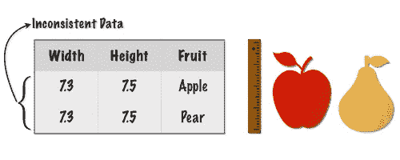

**处理缺失值** —当一个或多个观测特征由于某种原因没有包含在数据中时，就会出现缺失值。如果我们的数据包含一个苹果，宽度值为 7.5 厘米，但没有高度测量，那么这将被认为是一个缺失值。缺失值观察是有问题的，因为任何缺失的特征都不能被考虑用于分割，并且这扰乱了构建决策树的整个过程。在决策树的早期版本中，带有缺失值的观察值被简单地从构建过程中丢弃。然而，最近出现了复杂的方法，允许保留缺失值的信息。

R 的`rpart`包中使用了一种这样的方法，它确保任何具有因变量和至少一个自变量的值的观察值都将参与建模。使用这一程序，信息增益公式进行了微小的调整，以考虑到在选择分割时包含缺失值的观测值。一旦定义了分割，就引入了替代变量的概念来进行预测。这些可以被认为是在相关特征缺失的情况下使用的备份变量。创建一个备选替代变量的排序列表，如果它们产生的结果比盲目采用多数类更好，则保留它们。这种方法允许我们使用带有缺失值的观察值来构建决策树以及进行预测。

**斜分割** —到目前为止，我们只考虑了基于单个特征的分割，但值得注意的是，我们可以扩展这种方法，考虑使用特征的线性组合。在某些适当的情况下，这些非正交或倾斜分割可能更有效。下面是苹果和梨数据集的倾斜分割示例，其中使用高宽比有利于在一次分割中正确分类所有观察值。然而，使用倾斜分割的好处也伴随着一些缺点，这些缺点包括可解释性降低以及缺失值和异常值的影响增加。

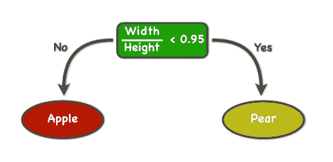

同样值得注意的是，上面的决策树也是所谓的*决策树桩*。决策树桩是一棵决策树，其根节点只有一个单独的分支，所有创建的节点都是终端节点。

**基尼系数** —基尼系数是对随机变量新实例不正确分类的可能性的测量，前提是该新实例是根据数据集中类别标签的分布随机分类的。它可以定义为:

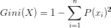

在实践中，除了由于使用对数函数而使熵的计算速度略有下降之外，基尼系数和熵的性能实际上没有差别。

**回归树**——从技术上讲，本博客中讨论的决策树是一种*分类树*。任务是从有限的可能性集合中识别一个观察值属于哪一类或哪一类(例如苹果或梨)。然而，有时我们的响应变量可以是数字而不是分类变量(例如水果价格)，在这种情况下，我们解决的是一个稍微不同的问题。请注意，这仅指响应变量(我们试图预测的)是数字的情况，而不是预测变量(我们用来进行预测的)，因为我们已经知道如何处理数字预测变量。在响应变量是数字的情况下，任务变成了回归问题，在这种情况下，我们正在制作所谓的*回归树*。

幸运的是，回归树和分类树没有太大的不同，我们需要做的唯一调整是如何测量杂质。我们现在希望选择使子节点中的误差平方和最小化的分裂，而不是测量节点的杂质。然后，在进行预测时，我们使用观察值所在的任何叶节点的平均值(来自训练数据)。更正式地，对于所有候选分裂，其中*叶*是由分裂创建的所有叶的集合，yᵢ是观察值 *i* 的数值响应值，并且

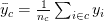

是给定叶片 *c* 的平均数值响应值，我们希望选择最小化以下表达式的分割:

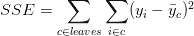

**R 实施**

做得好，一路走到了最后，[在 twitter 上关注我](https://twitter.com/Jeffaresalan)以了解未来的帖子。所有观想都是我自己的。