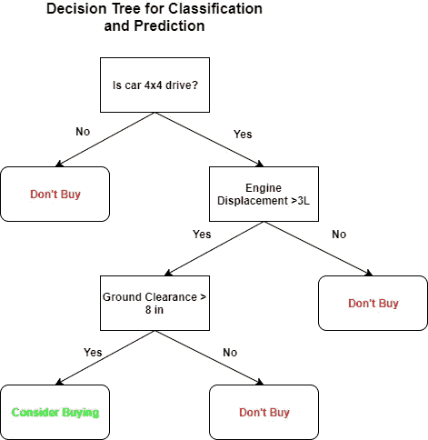
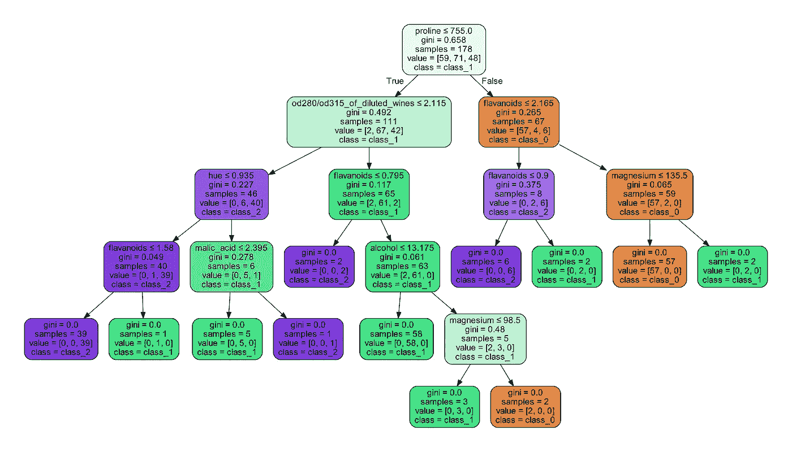

# 用于分类和回归的决策树和随机森林第 1 部分

> 原文：<https://towardsdatascience.com/decision-trees-and-random-forests-for-classification-and-regression-pt-1-dbb65a458df?source=collection_archive---------1----------------------->


A light through a random forest.

# **亮点:**

想要使用更具可解释性的东西，训练速度更快，表现与旧的逻辑回归甚至神经网络一样好的东西吗？你应该考虑用**决策树**进行分类和回归。[这里是关于随机森林的第二部分。](https://medium.com/@hhl60492/decision-trees-and-random-forests-for-classification-and-regression-pt-2-2b1fcd03e342)

*   **与简单的神经网络相比，训练**要快得多，以获得**可比的性能**(决策树的时间复杂度是[特征数、数据集中的行数]的函数，而对于神经网络，它是[特征数、数据集中的行数、隐藏层数、每个隐藏层中的节点数]的函数)
*   **易于解释的**，适用于变量选择
*   在较小的数据集上相当健壮
*   决策树和决策树学习很容易理解

链接到我的其他文章:

1.  [tensor flow 中的自定义损失函数](/custom-tensorflow-loss-functions-for-advanced-machine-learning-f13cdd1d188a)
2.  [Softmax 分类](/the-softmax-function-neural-net-outputs-as-probabilities-and-ensemble-classifiers-9bd94d75932)
3.  [气候分析](/analyzing-climate-patterns-with-self-organizing-maps-soms-8d4ef322705b)
4.  [曲棍球骚乱和极端值](https://medium.com/@hhl60492/black-swans-and-hockey-riots-extreme-value-analysis-and-generalized-extreme-value-distributions-d4b4b84cd374)

# **简介:**

决策树及其扩展随机森林是健壮的和易于解释的机器学习算法，用于分类和回归任务。决策树和决策树学习一起构成了一种简单快速的学习函数的方式，该函数将数据 **x** 映射到输出 **y** ，其中 **x** 可以是分类变量和数值变量的混合，而 **y** 可以是分类变量，也可以是回归变量。像支持向量机、逻辑回归和深度神经网络这样的方法几乎做同样的事情。然而，尽管它们能够处理更大和更复杂的数据集，但它们非常难以解释，并且神经网络在得到好的结果之前可能需要多次迭代和超参数调整。同样，使用决策树和随机森林的最大优势之一是，我们可以根据它们在树中的深度位置，轻松地看到哪些特征或变量对分类或回归有贡献，以及它们的相对重要性。

我们将在本文中查看决策树，并使用从接收方操作特征(ROC)中获得的信息与逻辑回归和简单的神经网络比较它们的分类性能。

# **决策树:**

决策树是一种树(和一种有向无环图),其中的节点代表决策(一个方形框)、随机转换(一个圆形框)或终端节点，而边或分支是二进制的(是/否，真/假),代表从一个节点到另一个节点的可能路径。用于机器学习的特定类型的决策树不包含随机转换。要使用决策树进行分类或回归，可以获取一行数据或一组特征，从根开始，然后通过每个后续决策节点到达终端节点。该过程非常直观且易于解释，这使得经过训练的决策树可用于变量选择，或者更一般地说，[特征工程](https://en.wikipedia.org/wiki/Feature_engineering)。为了说明这一点，假设你想买一辆新车，沿着一条随机的土路驶入一片随机的森林。您有一个包含三个特征的不同汽车的数据集:汽车行驶类型(分类)、排量(数字)和净空(数字)。下面是一个帮助您做出决策的学习型决策树示例:



I like to go off-roading when I’m not making machines learn.

树的根节点或最顶端节点(只有一个根节点)是使用变量或特征分割数据集的决策节点，该变量或特征导致为分割产生的数据集中的每个子集或类评估的最佳分割度量。决策树通过根据每个决策节点处的分裂度量从根开始递归地向前分裂数据集(以贪婪的、逐节点的方式)来学习。当分裂度量处于全局极值时，到达终端节点。流行的分割指标包括最小化[基尼系数杂质](https://en.wikipedia.org/wiki/Decision_tree_learning#Gini_impurity)(CART 使用)或最大化[信息增益](https://en.wikipedia.org/wiki/Decision_tree_learning#Information_gain)(ID3、C4.5 使用)。

# **举例:**

现在我们已经看到了决策树训练是如何工作的，让我们使用 [scikit-learn](http://scikit-learn.org/stable/index.html) 包(scikit-learn 包含许多漂亮的数据处理、降维、聚类和浅层机器学习工具)并在[葡萄酒数据集](https://archive.ics.uci.edu/ml/datasets/wine) (13 个特征/变量和 3 个类)上实现一个简单的分类决策树，然后用 [Graphviz](http://www.graphviz.org/) 可视化学习的树。



No need to waste money on wine tasting courses.

马上，从学习过的决策树中我们可以看到，特征*脯氨酸*(葡萄酒中的脯氨酸含量)是基尼杂质值最高的根节点，为 0.658，这意味着三种葡萄酒类别都以此为基础分离。这也意味着，原则上，如果我们在预测模型中仅使用一个特征，脯氨酸含量将允许我们在最多 1-0.658 = 0.342 = 34.2%的时间内正确预测，假设原始学习的决策树预测完美。然后，从根中我们看到，这些类进一步分裂，具有*od 280/od 315 _ of _ dilute _ wines*特性和 *flavinoid* 特性。我们还可以看到，大多数 *class_1* 葡萄酒(81.7%)的酒精含量≤ 13.175，黄素含量≤ 0.795。此外，回想一下，原始数据集中有 13 个特征，但是决策树只选择了 7 个特征的子集进行分类。

我们可以使用该信息来选择一般数据集中的哪些特征/变量对于更高级的模型(如深度神经网络)是重要的(在可能存在无用的、冗余的或有噪声的特征的情况下)。我们将在第 2 部分中看到如何用更健壮的随机森林来实现这一点。通过对一行输入数据进行简单的函数调用，学习到的决策树可用于[预测数据](http://scikit-learn.org/stable/modules/tree.html#classification)。从输入要素预测数值输出值的回归树也可以非常容易地创建:[查看这个 scikit-learn 教程](http://scikit-learn.org/stable/auto_examples/tree/plot_tree_regression.html)。

# **性能:**

[接收器操作特性(ROC)](https://en.wikipedia.org/wiki/Receiver_operating_characteristic) 是一个曲线图，可用于确定二元或多类分类器的性能和鲁棒性。x 轴是假阳性率(FPR)，y 轴是真阳性率(TPR)。ROC 图提供了关于真实阳性/阴性率和假阳性/阴性率的信息，以及分类器预测的每个类别的 C 统计量或 ROC 曲线下面积(AUROC)的信息(分类器预测的每个类别都有一个 ROC)。AUROC 定义为随机选择的阳性样本比随机选择的阴性样本具有更高预测值的概率。引用这篇关于这个主题的[文章:](http://matlabdatamining.blogspot.ca/2007/06/roc-curves-and-auc.html)

*“假设人们对真阳性率和假阳性率之间的特定权衡(即 ROC 曲线上的特定点)不感兴趣，AUC [AUROC]是有用的，因为它汇总了整个权衡范围内的表现。AUC 的解释很简单:AUC 越高越好，0.50 表示随机表现，1.00 表示完美表现。”*

不同分类器的 AUROCs 可以相互比较。该指标的替代方法包括使用 [scikit-learn 混淆矩阵](http://scikit-learn.org/stable/modules/generated/sklearn.metrics.confusion_matrix.html)计算器计算预测结果，并使用结果矩阵得出基本的正/负准确度、[F1-分数](https://en.wikipedia.org/wiki/F1_score)等。

```
{0: 0.98076923076923084, 1: 0.97499999999999998, 2: 1.0, 'micro': 0.97916666666666685}
```

上面的输出是决策树预测的每个类的 AUROC。相比之下，在 scikit-learn 中，我们在一个[逻辑回归](http://scikit-learn.org/stable/modules/generated/sklearn.linear_model.LogisticRegression.html#sklearn.linear_model.LogisticRegression)模型和一个浅层 [MLP 神经网络](http://scikit-learn.org/stable/modules/generated/sklearn.neural_network.MLPClassifier.html#sklearn.neural_network.MLPClassifier)模型上使用 20%的测试集重新运行相同的数据集。逻辑回归模型的性能(使用所有默认参数)如下:

```
{0: 0.96153846153846156, 1: 0.94999999999999996, 2: 1.0, 'micro': 0.95833333333333326}
```

对于浅层 MLP 网络:隐藏层= 2，每层节点= 25，优化器= adam，激活=逻辑，迭代= 50000:

```
{0: 1.0, 1: 1.0, 2: 1.0, 'micro': 1.0}
```

我们可以看到决策树**优于逻辑回归**，虽然神经网络打败了它，但它仍然**训练**快得多，并且具有**可解释性**的优势。

# **接下来是什么:**

决策树应该总是在熟练的数据科学家和机器学习工程师的工具箱中。有关如何在 scikit-learm 中使用决策树的更详细的用户指南/手册，请参考[http://sci kit-learn . org/stable/modules/tree . html # decision-trees](http://scikit-learn.org/stable/modules/tree.html#decision-trees)。

然而，尽管决策树易于使用并且具有明显的能力，但是它们对贪婪学习策略的依赖可能会导致树在每个节点上分割错误的特征，或者导致树过拟合。请继续关注，在下一篇文章中，我将展示集成决策树，或所谓的随机森林和引导聚合，当它们一起使用时，会大大提高对更大和更复杂数据集的预测能力和鲁棒性。我们还将看到如何使用随机森林进行健壮的变量选择。