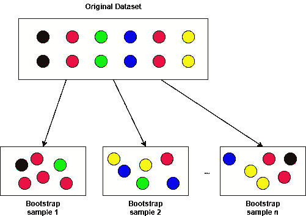
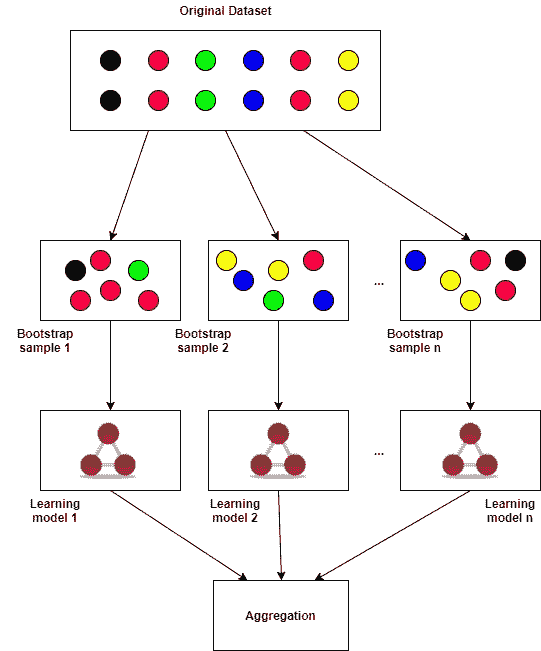

# 用于分类和回归的决策树和随机森林第二部分

> 原文：<https://towardsdatascience.com/decision-trees-and-random-forests-for-classification-and-regression-pt-2-2b1fcd03e342?source=collection_archive---------2----------------------->

Forest from the trees, mountains from the dust.

# **亮点:**

在本文中，我们将了解以下内容:

*   用于鲁棒学习的自举聚合
*   变量选择的随机森林
*   随机森林用于快速和稳健的回归、分类和特征选择分析

[点击这里链接到第一部分。](/decision-trees-and-random-forests-for-classification-and-regression-pt-1-dbb65a458df)

链接到 Neptune.ai 关于随机森林算法在哪里会失败的文章:[https://Neptune . ai/blog/Random-Forest-regression-when-do-it-fail-and-why](https://neptune.ai/blog/random-forest-regression-when-does-it-fail-and-why)

链接到我的其他文章:

1.  [tensor flow 中的自定义损失函数](/custom-tensorflow-loss-functions-for-advanced-machine-learning-f13cdd1d188a)
2.  [Softmax 分类](/the-softmax-function-neural-net-outputs-as-probabilities-and-ensemble-classifiers-9bd94d75932)
3.  [气候分析](/analyzing-climate-patterns-with-self-organizing-maps-soms-8d4ef322705b)
4.  [曲棍球骚乱和极端值](https://medium.com/@hhl60492/black-swans-and-hockey-riots-extreme-value-analysis-and-generalized-extreme-value-distributions-d4b4b84cd374)

# **简介:**

在我的上一篇文章中，我们讨论了决策树以及它们如何用于分类和回归。在这篇文章中，我们将继续我们停止的地方，并介绍集合决策树模型或所谓的**随机森林**。我们将看到决策树的优势与引导聚合的结合如何使随机森林成为**非常健壮而简单的**学习模型，与监督学习问题的单一决策树相比，不容易过度拟合。为了感受随机森林的威力，下面我们用它们从公开的飞行路线数据中识别美国政府驾驶的间谍飞机。

# 引导聚合:

Bootstrap Aggregation 或 bagging 是一种强大的技术，可以减少模型方差(过拟合)并改善有限样本(即少量观察值)或不稳定数据集的学习结果。Bagging 的工作原理是获取原始数据集并创建 *M* 个子集，每个子集有 *n* 个样本。从原始数据集中用替换对 *n 个*个体样本进行**均匀采样。下图说明了这一点。**

Subsetting for bootstrap aggregation.

在上图中，保留了对应于每个数据点的标签。换句话说，每个数据元组*(****x****，****y****)****ᵢ****被采样和子集化，其中每个***【xᵢ***是输入的向量， ***Yᵢ*** 是向量理论上，随着 bootstrap 样本数 *M* 接近无穷大，bagging 被证明收敛于某个非 bagged 函数估计量的均值，该估计量利用了来自原始数据集的所有可能样本(直观上，这是有意义的)。在随机梯度学习的情况下，例如在神经网络或逻辑回归中，以随机顺序从多个(重复的)数据样本中学习往往会提高学习性能，因为梯度估计往往更多地被“推来推去”,希望克服局部极值。同样，在 [Bühlmann 的文章](https://www.researchgate.net/publication/45130375_Bagging_Boosting_and_Ensemble_Methods)中显示的一个有趣的结果表明，bagging 倾向于*将* *偏差*添加到 bagged 估计量中，以减少方差为代价。在大多数实际应用中，与方差的减少相比，这种偏差的增加是很小的。一般来说，[偏差-方差权衡](https://en.wikipedia.org/wiki/Bias%E2%80%93variance_tradeoff)是统计学习的一个非常重要的方面，在挑选监督学习模型时，这是一个熟练的数据魔术师应该很清楚的事情。*

*接下来，为每个 *M* 引导样本创建 *k* 个个体学习模型(称为**集合**)。然后，以某种方式，如投票或简单平均法，对每个单独学习模型的输出进行汇总或平均。下图对此进行了说明。*

**

*Bootstrapping and learning ensembles.*

*一般来说，使用集成模型打包是一种稳健的方法，通过利用引导样本和聚合学习集成的输出(均值、中值、其他更复杂的方法)来减少学习模型的方差和过度拟合。Bagging 和集成是通用的，可以应用于任何监督模型，从神经网络到 SVM 到决策树，以及非监督聚类模型(将在另一篇文章中讨论)。在实践中， *M* 被选择为至少 50，而 *n* 是原始数据集大小的 80%。*

# *随机森林:*

*随机森林是一个由 *k* 个未训练的决策树(只有一个根节点的树)和 *M* 个引导样本( *k* 和 *M* 不必相同)组成的集合，这些样本使用[随机子空间方法](https://en.wikipedia.org/wiki/Random_subspace_method)或特征打包方法的变体进行训练。注意，训练随机森林的方法不像对一堆单独的决策树应用 bagging，然后简单地聚合输出那样简单。训练随机森林的过程如下:*

1.  *在当前节点*，*从可用特征 *D* 中随机选择 *p* 特征。特征数量 *p* 通常远小于特征总数 *D* 。*
2.  *使用指定的分裂度量(Gini 杂质、信息增益等)计算树 *k* 的最佳分裂点。)并将当前节点分割成子节点，并从此节点开始减少特征 *D* 的数量。*
3.  *重复步骤 1 到 2，直到达到最大树深度 *l* 或者分裂度量达到某个极值。*
4.  *对森林中的每棵树重复步骤 1 到 3。*
5.  *投票或合计森林中每棵树的产量。*

*与单决策树相比，随机森林通过在每个分裂点选择多个特征变量而不是单个特征变量来分裂。直观地说，决策树的变量选择特性可以通过使用这种特征打包过程得到极大的改善。**通常，树的数量 *k* 很大，对于具有许多特征的大型数据集，数量级为数百到数千。***

# *变量选择:*

*随机森林的变量选择非常简单。使用 [scikit-learn 的 RandomForestClassifier](http://scikit-learn.org/stable/modules/generated/sklearn.ensemble.RandomForestClassifier.html) ，让我们加载我们最喜欢的数据集(有高档葡萄酒的数据集)，看看我们的随机森林分类器认为葡萄酒分类最重要的特征是什么。滚动 Jupyter 笔记本以查看功能信息图和作为功能数量函数的 F1 平均分数(您可能应该[从我的 github](https://gist.github.com/hhl60492/9e01be15b291e8ceecb37d1c08f97521) 下载 Jupyter 笔记本文件/要点以更好地查看这些图)。*

*有趣的是，当 *n_trees* = 1000 时，*脯氨酸*含量仍然是最具信息量的特征。在我的 Core i7 笔记本电脑上用 1000 棵树进行训练需要几秒钟，这比大多数深度神经网络模型快得多。对于较小的树，*颜色强度*倾向于出现在顶部。当 *n_trees* = 1000 时，*颜色 _ 强度*仍能与*脯氨酸*含量相当接近。**一般来说，您应该扫描超参数 *n_trees* 并评估诊断图，以更好地了解数据集以及哪些特征是重要的。**一旦绘制了每个特征的相对信息/重要性图，高于某个阈值的特征可以用于另一个学习模型，如深度神经网络，低于阈值的特征可以忽略。跨越特征数量的 F1 分数应该在具有有限少数学习者的非常受限的集合模型上完成。笔记本中的 F1 扫描图显示了向模型添加要素或变量的效果，即添加更多输入要素对分类准确性的影响(注意 F1 得分和 AUROCs 仅针对分类问题定义，回归问题需要不同的误差测量，如均方差)。*

# *总而言之:*

*随机森林可用于稳健分类、回归和特征选择分析。希望你能看到，在你期望得到像样的结果之前，你还需要先运用一些技巧。*

*关于监督学习问题，对你的简单模型进行基准测试总是一个好主意，比如随机森林与复杂的深度神经网络或概率模型。如果你有任何关于运行代码的问题，或者关于一般生活的奥秘，请不要犹豫问我。*