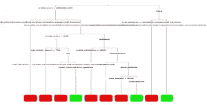
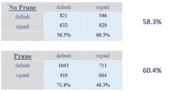

# 决策树—修剪

> 原文：<https://towardsdatascience.com/decision-trees-pruning-4241cc266fef?source=collection_archive---------7----------------------->


image by Sarah Dorweiler on [unsplash.com](http://unsplash.com/)

我的上一篇博客关注的是决策树的概念，它是随机森林机器学习算法的基础。因为这只是一篇很短的博客(4 分钟阅读)，我没有深究细节，但是嵌入了一些(希望)有用的链接。

在这篇文章中，我想更进一步，涵盖:

*   随机森林如何使用决策树
*   过度拟合的问题以及如何识别它
*   修剪决策树以限制过度拟合问题。

正如您将看到的，R 中的机器学习非常简单，通常只需要几行代码就可以让模型运行起来。尽管有用，算法使用的默认设置很少是理想的。

以下代码是准备分类树模型的示例。我使用了“rpart”包，但是“caret”是另一种选择。

Model = rpart(分类器~预测器，data = train_data，method = "class "，control = rpart.control(###))

“分类器”是模型预测的特征，“预测器”是数据集中的独立特征，用于确定分类器结果的概率。

method = "class "语句将确保为分类器(为因子类型变量)做出预测。例如，准备与贷款偿还数据集相关的脚本。分类器是申请人是否“偿还”或“违约”债务，有许多特征(列)可用于预测这一结果。随机森林算法使用许多决策树，这些决策树是使用训练数据的随机段准备的。然后，测试数据集中的每个观察值通过每个树运行，以独立地对分类器的结果进行预测。由最大数量的树预测的分类代表模型的预测。如果大多数树预测贷款将被偿还，那么这就是模型的预测。

测试数据$预测

Once a prediction vector was created, the overall accuracy of the models could be calculated and a confusion matrix produced showing which of the two outcomes (repaid and default) the model was best at predicting.

**准确度** =平均值(测试数据$预测==测试数据$实际结果)

**混淆矩阵** =表格(测试数据$预测，测试数据$实际 _ 结果)

在我在 Data Camp 完成的一个活动中，我比测试标准决策树和我修剪过的版本的准确性的要求更进一步。修剪的原因是由基本算法准备的树可能倾向于过度拟合，因为它们变得非常大和复杂。下面我展示了使用不带调整参数的基本算法生成的决策树。不要担心字体太小而无法阅读，我只是简单地强调了在没有添加控制参数的情况下树可以有多复杂。


当我修剪树的时候，我测试了 minsplit(在被‘修剪’之前出现在叶子中的观察数量)和 maxdepth(一个分支中的最大节点数量)的不同值。如果你喜欢快速更新的话，这个术语在我之前的博客中已经全部介绍过了！



我发现一个复杂度显著降低的树实际上提供了一点准确性的提高——我的目标是保持准确性稳定！原始模型在违约和已偿还住房贷款方面产生了类似的准确性水平，而新模型在预测违约贷款方面有了显著改善，其已偿还贷款预测的准确性下降较小。这将是值得探索的，但是复杂性的大幅降低仍然产生了很好的结果。



这是我为标准树和修剪树准备的代码。只有少量的代码，还有很大的改进空间！

```
# Trees prepared with no pruning
# prepare model
lm <- rpart(outcome ~ ., data = loans_train, method = “class”, control = rpart.control(cp = 0))# prepare predictionloans_test$PredLM <- predict(lm,loans_test, type = “class”)# calculate overall accuracymean(loans_test$PredLM == loans_test$outcome)# prepare confusion matrixtable(loans_test$PredLM,loans_test$outcome)# plot treerpart.plot(lm, type = 3, box.palette = c(“red”, “green”), fallen.leaves = TRUE)# Trees prepared with pruning# prepare modellmp <- rpart(outcome ~ ., data = loans_train, method = “class”, control = rpart.control(cp = 0, minsplit = 250, maxdepth = 6))# prepare predictionloans_test$PredLMP <- predict(lmp,loans_test, type = “class”)# calculate overall accuracymean(loans_test$PredLMP == loans_test$outcome)# prepare confusion matrixtable(loans_test$PredLMP,loans_test$outcome)# plot treerpart.plot(lmp, type = 3,cex = .7, box.palette = c(“red”, “green”), fallen.leaves = TRUE)
```