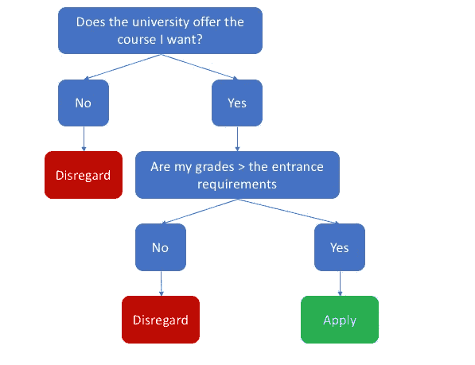
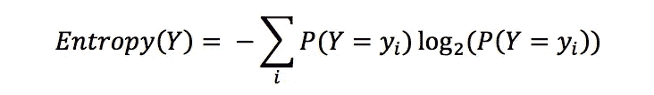
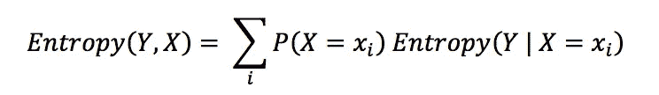
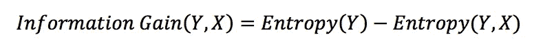
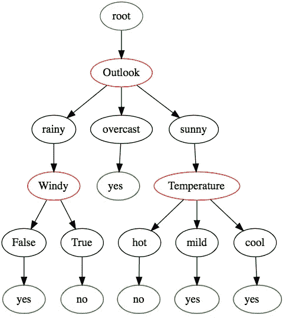

# 决策树——理解可解释的人工智能

> 原文：<https://towardsdatascience.com/decision-trees-understanding-explainable-ai-620fc37e598d?source=collection_archive---------5----------------------->


可解释的人工智能或 XAI 是人工智能的一个子类，与“黑盒”模型相反，模型做出的决定可以被人类解释。随着人工智能从纠正我们的拼写和定向广告转向驾驶我们的汽车和诊断病人，验证和证明得出的结论的需求开始得到优先考虑。

为了开始深入这个领域，让我们看一个简单的 XAI 模型:决策树。决策树很容易阅读，甚至可以通过将选择分成许多小的子选择来模仿人类的决策方法。一个简单的例子是当一个人离开高中时，如何评价当地的大学。假设学生心中有一门课程，一个简单的决策过程可以是:



如果第三方可以访问“模型”和所需的变量，学生如何得出他们的结论可以很容易地得到证明。

这种相同的结构可以应用于监督学习，目标是创建一个最好地描述训练数据的决策树。然后，该模型可用于理解变量之间的关系或用于预测应用。

# 该算法

决策树的构建是作为一个推理过程来完成的。

1.  估计哪个变量给出最大的*信息增益*。信息增益是自变量状态已知时因变量熵的*减少。
    那里有很多大词。
    本质上，这衡量了当我们根据因变量的值将自变量分成组时，自变量的组织程度。*
2.  选择在组织中提供最大增加的因变量，并根据该变量分割数据集。
3.  此时，三个条件之一必须为真:
    -因变量现在只取一个值。在这种情况下，树的这一分支是完整的，我们已经达到了我们的“决定”。
    -因变量取> 1 值。在这里，我们简单地回到第一步，并尝试进一步缩小范围。
    -因变量取值> 1，但我们没有更多的自变量来分割数据。在这里，我们简单地说一下决策可能采取的值，并根据每个选项的相对比例估计每个值的概率。

# 计算信息增益

首先，我们需要一个组织或熵的公式。为了计算因变量的熵，我们使用:



下图显示了 Y(其中 Y 有两种状态)的熵是如何随着每种状态的概率而变化的。当一个状态的概率为 0 时，熵也为 0，因为这是 Y 最有组织的时候，而当 Y 在两个状态之间平均分配时，熵最大。


扩展这一点以增加已知独立变量 X 对熵的影响:



信息增益现在被定义为我们知道 X 和不知道 X 时的熵之差。



# 把密码给我！

这里没有包括一些计算熵和创建图形的函数。

```
def decide(Y, X_dict, previous_node):
    #Calc info gain for each X
    max_IG = 0
    var_to_split = None#Calculate information gain to find out which variable to split on
    for x in X_dict.keys():
        IG = InfoGain(Y, X_dict[x])
        if IG > max_IG:
            max_IG = IG
            var_to_split = x#See if all variables have been used and none are left.
    if var_to_split == None:
        Y_options = list(set(Y))
        tot = float(len(Y))
        count = [0 for _ in range(len(Y_options))]for op in range(len(Y_options)):
            for i in range(len(Y)):
                if Y[i] == op:
                    count[op] += 1
        #Format Node label
        Prob = ""
        for op in range(len(Y_options) - 1):
            Prob += "P("
            Prob += str(Y_options[op]) + ")-> "
            P = float(count[op]) / tot
            Prob += "{0:.2f}".format(P)
        #Make a new node
        nodename = node(Prob, color = "orange")
        edge(previous_node, nodename)
    else:
        print("Splitting on {0}".format(var_to_split))
        X_options = list(set(X_dict[var_to_split]))
        #Make decision variable node
        Var_nodename = node(var_to_split, color = "red")
        edge(previous_node, Var_nodename)
        #Init new data for each new branch of the tree
        for X_option in X_options:
            X_nodename = node(str(X_option))
            edge(Var_nodename, X_nodename)
            New_X_dict = {}
            #get remaining variables
            for key in X_dict.keys():
                if key != var_to_split:
                    New_X_dict[key] = []
            New_Y = []
            #Populate
            for i in range(len(Y)):
                if X_dict[var_to_split][i] == X_option:
                    New_Y.append(Y[i])
                    for key in New_X_dict.keys():
                        New_X_dict[key].append(X_dict[key][i])#Check if this is a terminal node:
            if len(set(New_Y)) == 1:
                nodename = node(str(New_Y[0]), color = "green")
                edge(X_nodename, nodename)
            else:
                #No terminal node, so try again
                decide(New_Y, New_X_dict, X_nodename)Y, X_dict =  import_golf('golf.csv') #import data
root_node = node("root", color = "blue") #Create the first node
decide(Y, X_dict, root_node) #start the tree
```

对于[高尔夫数据集](https://gerardnico.com/data_mining/weather)，输出以下树，这是解释决策过程的简单方法。

