# 使用数据科学解码 BuzzFeed 标题

> 原文：<https://towardsdatascience.com/decoding-buzzfeed-headlines-using-data-science-25198eb25082?source=collection_archive---------6----------------------->

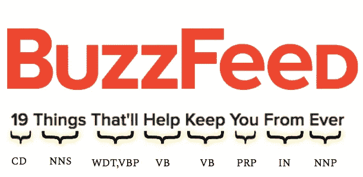

不管你喜欢它还是讨厌它(就我个人而言，对它着迷)，Buzzfeed 有其独特的方式来捕捉我们短暂的注意力，他们的魔力很大一部分在于他们如何创建他们的标题。我采用洞察驱动的方法，使用各种机器学习和 NLP 实践来分析 BuzzFeed 最常见的标题。

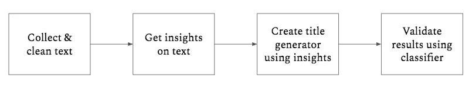

An overview of my analysis

# 1.数据收集和清理

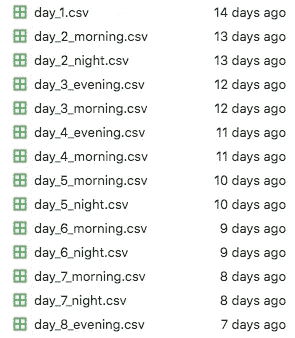

使用 newsapi.org 的 [BuzzFeed API](https://newsapi.org/s/buzzfeed-api) ，我可以一次从网站上查询多达 50 个头条新闻。我连续一周每天两次抓取 50 个标题，这给了我大约 700 个标题。
完成后，我通过删除非英语句子和无用的 Unicode 字符清理了文本数据。

# 2.数据告诉我们什么

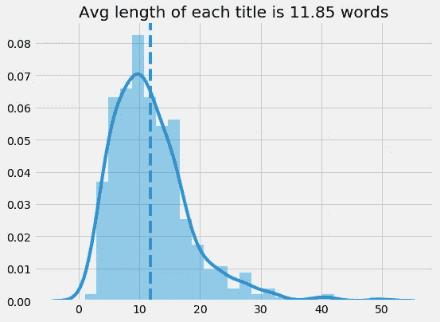

preliminary plotting of some descriptive stats

互联网上的普遍共识是，标题的理想长度在 50-70 个字符之间。BuzzFeed 标题的平均长度大致在这个范围内。由于这是一个寻找 BuzzFeed 最经常出现的标题结构的任务，我将搜索范围缩小到 11 个单词的标题，并继续进行词性标注，以发现最流行的单词序列。

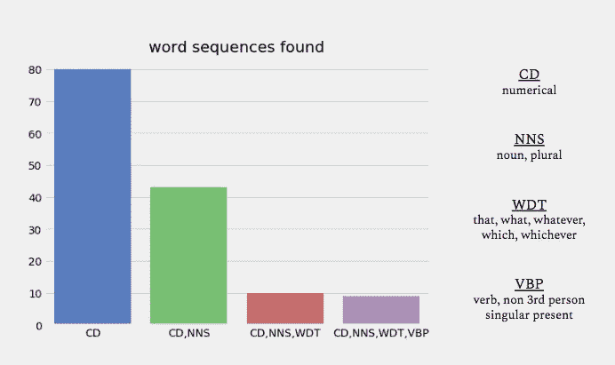

the most popular sequence followed a CD, NNS, WDT, VBP pattern

我们可以看到 BuzzFeed 喜欢用数字开始标题。以数字开头的标题几乎总是会引出一篇基于列表的文章，比如“30 样 10 美元以下的东西永远有用”。现在我不是列表心理学和它们为什么吸引我们的专家，但是对于任何感兴趣的人来说，有几个来源可以解决这个话题。

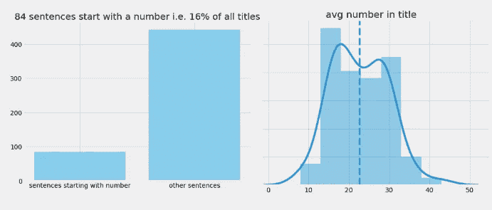

下一个词类:名词。很明显，这些标题后面都有名词(单数或复数)。

popular nouns used

这里没有什么太令人惊讶的。这些都是我们所有人在某种感官层面上都可以联系到的名词。显然是为了吸引大众。

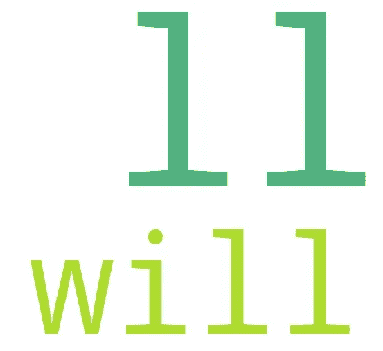

真正引起我注意的是序列中使用的第四个词——“威尔”。
举个例子:“如果你是健身房会员，你会明白的 14 件事”。很快，我们可以看到“will”这个词是如何产生预期效果的。不点击标题会有一种看不见但很明显的代价——没有发现的代价。

现在我们有了合适的结构，我们可以看看标题的其他特征，比如情绪:这些常见的标题通常是正面的、负面的还是都不是？

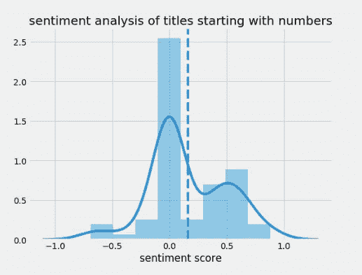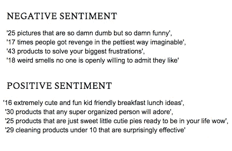

双峰分布确实表明有一些正面倾斜的标题，但总体而言，它们是中性的。然而，这种评估也有局限性。一，BuzzFeed 标题倾向于使用表情符号和相关标点符号(比如！！!')是我在数据收集过程中天真地清理掉的。我还使用了一个基本的情绪分析模型，这个模型可能漏掉了俚语、不寻常的比较和其他情绪信号。尽管有这些担心，当我查看模型归类为“中性”的句子时(如下所示)，似乎没有太多的错误分类。我自己不能手动将这些句子分为积极或消极:它们天生没有主见，这与我最初的期望相反。这又回到了我之前的观点，即 BuzzFeed 如何利用预期作为一种工具来激起读者的兴趣。这些中性的标题(占大多数)导致文章旨在传达一些你“需要”拥有的信息。

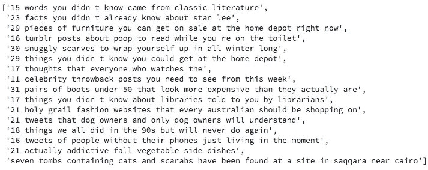

neutral headlines

# 3.创建简单的 BuzzFeed 标题生成器

在我继续本节之前，让我们总结一下目前为止我们对 BuzzFeed 标题的了解:

*   标题简洁，每个大约 7-14 个字。
*   最常用的标题结构是[CD、NNS、WDT、VBP……]，即一个数字后面跟着一个名词(大多是复数)，再后面跟着一个 Wh-word 和一个动词(大多是“will”)。
*   标题透露了文章内容的很多信息。他们不一定是“点击诱饵”:在我看来恰恰相反。它们确切地告诉你你将会得到什么——基于列表的文章揭示了你想要/需要知道的一些信息。
*   他们在情感上大多是中立的。我不认为“期待”属于“积极”或“消极”的范畴。这些标题的目的是尽可能高效地引发你的好奇心。在大多数情况下，他们不需要借助任何极端情绪来实现这一点。
*   注意:我不能强调这一点。以上分析仅适用于本文指定的标题的具体结构。BuzzFeed 利用了其他几个有趣且值得研究的标题结构。

好吧，让我们创建一个简单的算法来尝试复制这个结构:

structure I employ

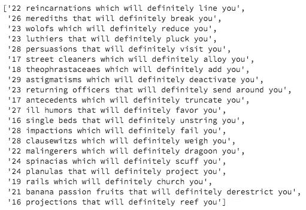

Output

我觉得产量不错。其中一些标题看起来很荒谬(虽然很搞笑)，但它们对我们的目的很有用。
为了更进一步，我想看看分类模型是否能够识别这种结构。为此，我需要一个不同来源的标题数据集。

# 4.测试

我决定从 ABC 新闻中查询大约 500 个标题。我将数据集与 BuzzFeed 数据集相结合，创建了一个训练和目标集，其中包含标题的矢量化版本，目标变量中的“1”表示它是 BuzzFeed 标题。然后，我将一个简单的支持向量分类器模型用于训练集。

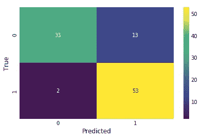

该模型在测试集上实现了 83.84 的准确度，具有许多假阳性(低精度、高召回)，即，有 13 种情况下，该模型认为 ABC 标题是 BuzzFeed 标题。使用我们的标题生成器生成的 1000 个标题，模型预测所有标题都是 BuzzFeed 的。因此，我们生成的标题的结构确实有点像 BuzzFeed。注意，我用来生成标题的随机名词和动词不是取自 BuzzFeed 语料库(我取自 WordNet 字典)。

# 结论和附加内容

我写这篇文章的目的不是为了最好地复制 BuzzFeed 标题，而是为了分析它的结构，并了解它们为什么有效。因此，我选择了他们最流行的标题格式，并试图根据提供给我的数据进行推断。你可以在这里访问我使用的[的所有代码和数据。](https://github.com/bassimeledath/Buzzfeed_headline_analysis)

我使用了一个[预训练的递归神经网络(RNN)](https://github.com/minimaxir/textgenrnn) 来根据 BuzzFeed 标题生成文本。下面是我得到的输出示例(4 个时期后):

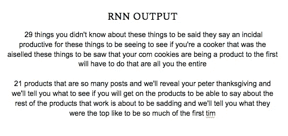

现在它们看起来并不完全像我们讨论过的标题，但是以某种不可思议的方式，它们确实展现了我们已经详细讨论过的性质。他们以一个数字开头，后面跟着一个复数名词，他们使用将来时来进一步引起你的注意。迷人的东西。