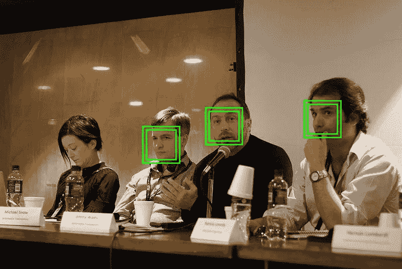
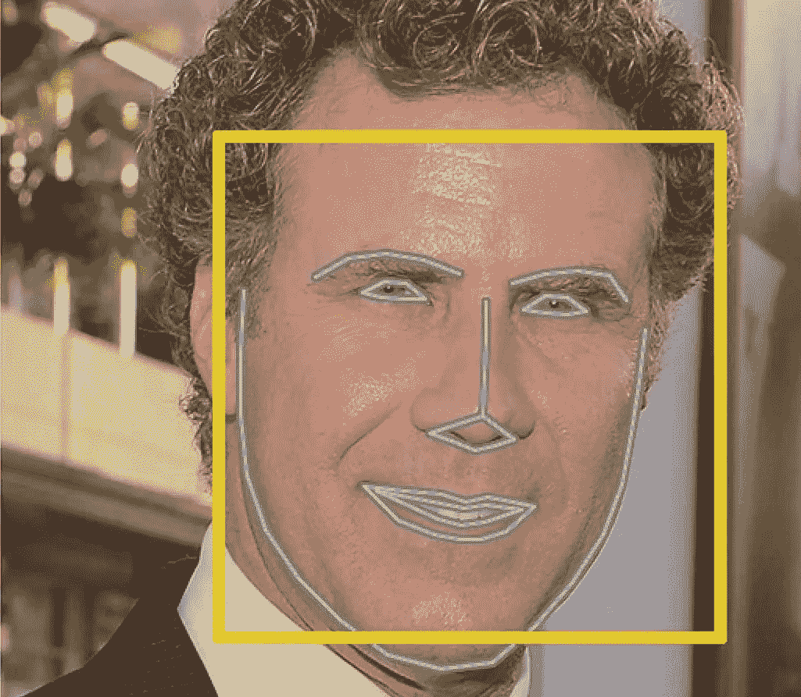
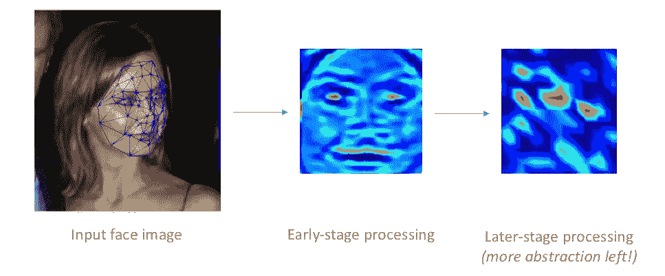
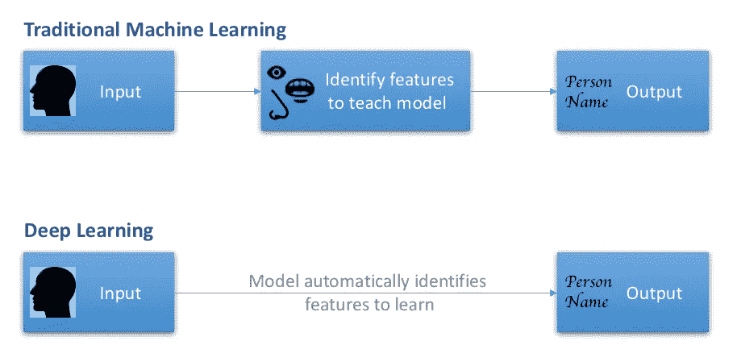

# 深度学习热潮背后的真正原因

> 原文：<https://towardsdatascience.com/decoding-deep-learning-a-big-lie-or-the-next-big-thing-b924298f26d4?source=collection_archive---------6----------------------->

Photo by [Ryoji Iwata](https://unsplash.com/photos/5siQcvSxCP8?utm_source=unsplash&utm_medium=referral&utm_content=creditCopyText) on [Unsplash](https://unsplash.com/?utm_source=unsplash&utm_medium=referral&utm_content=creditCopyText)

## 一个简单的英文解释，减去数学，统计和代码

*更新:这篇文章可以在* [*日文*](http://ainow.ai/2018/12/12/157625/) *阅读(感谢 Koki Yoshimoto)。*

深度学习创造了一个完美的二分法。

一方面，我们有数据科学从业者对此赞不绝口，每个人和他们的同事都投身于学习，并从这种被认为是改变游戏规则的*技术中发展出自己的事业。*

然后每个人都想知道这是怎么回事。随着众多分析技术被预测为解决商业问题的灵丹妙药，人们想知道这个额外的'*酷东西*到底是什么。

Photo by [Sandro Schuh](https://unsplash.com/photos/HgwY_YQ1m0w?utm_source=unsplash&utm_medium=referral&utm_content=creditCopyText) on [Unsplash](https://unsplash.com/?utm_source=unsplash&utm_medium=referral&utm_content=creditCopyText)

对于业务方面的人来说，没有简单的途径来获得简单直观的理解。谷歌搜索让人陷入神经网络的深层，或者被数学符号弄得晕头转向。关于这一主题的在线课程充斥着一大堆统计术语。

一个人最终会屈服，并最终接受所有的炒作。这里有一个尝试，用简单的英语和不到 5 分钟的时间，去神秘化和民主化对深度学习(DL)的理解。我保证不会向你们展示人类大脑的老套图片，或者蜘蛛网:-)

## 那么，什么是深度学习呢？

先说机器学习(ML)的基本前提。这种尝试是教机器如何在有一些输入的情况下得到想要的结果。比方说，当显示过去 6 个月的股票价格时，预测明天的价值。或者，当看到一张脸时，识别这个人。

机器学习*如何*做这样的事情，避免每次都需要费力的指令。

深度学习只是机器学习的*弟子*(或者说，学科)，但是智商更高。它做的事情和上面一样，但是以一种更聪明的方式。

## 还有，它和机器学习有什么不同？

让我用一个简单的人脸检测的例子来解释一下。

Pic: “Jimmy answering questions” by [Beatrice Murch](https://www.flickr.com/photos/41749772@N06) derivative work: Sylenius, licensed under [CC BY 2.0](https://creativecommons.org/licenses/by/2.0/)

使用机器学习的传统人脸识别包括首先手动识别人脸上的明显特征(例如眼睛、眉毛、下巴)。然后，一台机器被训练将每一张已知的脸与这些特定的特征关联起来。现在展示一张新面孔，机器提取这些预设的特征，做一个比较，得到最佳匹配。这个效果一般。

Pic: [Machine learning is fun..](https://medium.com/@ageitgey/machine-learning-is-fun-part-4-modern-face-recognition-with-deep-learning-c3cffc121d78) by Adam Geitgey

现在，深度学习如何解决同样的问题？过程几乎是一样的，但是记住这个学生更聪明。因此，代替填鸭式的标准面部特征，你让模特创造性地找出该注意什么。它可能决定了人类面部最显著的特征是左脸颊的弯曲，或者前额有多平。或者，也许是更微妙的东西。

Facial features identified by some of the interim layers of [DeepFace](https://www.cs.toronto.edu/~ranzato/publications/taigman_cvpr14.pdf) DL architecture

当看到大量这样的对时，它会默默地找出输入(脸)和输出(名字)之间的联系。然后，当出现一张新面孔时，瞧，它神奇地恢复了正常。与早期的识别技术相比，DL 在准确性和速度上都将球击出了公园。

Icons by [hunotika](https://thenounproject.com/term/laryngology/42647/), [MGalloway(WMF)](https://commons.wikimedia.org/wiki/User:MGalloway_(WMF)), [Google](https://github.com/android/platform_frameworks_base/blob/jb-mr2.0.0-release/data/fonts/AndroidEmoji.ttf) [[CC BY 3.0](https://creativecommons.org/licenses/by/3.0))] via Wikimedia Commons

## 但是，为什么他们总是展示人脑的图片？

公平地说，这里有*和*的联系。

让我们回顾一下孩子是如何学习第一课的。你展示带有大象图片的卡片，并大声朗读出来。几次这样的例子之后，当婴儿看到*任何类似大象的东西时，她马上就能认出来。不管姿势、颜色或背景如何。我们没有教她象鼻、长牙或耳朵的形状，但她完全学会了。而她*正好得到了*。*

Photos by [Picsea](https://unsplash.com/photos/EQlTyDZRx7U?utm_source=unsplash&utm_medium=referral&utm_content=creditCopyText), [Anita Jankovic](https://unsplash.com/photos/wvuwyygtV_s?utm_source=unsplash&utm_medium=referral&utm_content=creditCopyText), [Anna Stoffel](https://unsplash.com/photos/XaugKDKmlP8?utm_source=unsplash&utm_medium=referral&utm_content=creditCopyText), [Chris Rhoads](https://unsplash.com/photos/H9p1dvVvkqI?utm_source=unsplash&utm_medium=referral&utm_content=creditCopyText) on [Unsplash](https://unsplash.com/?utm_source=unsplash&utm_medium=referral&utm_content=creditCopyText)

正如我们不确定婴儿是如何学会识别大象的组成部分一样，我们也不知道深度学习背后的技术神经网络是如何解决这一问题的。这是人类大脑和神经连接的所有相似之处涌现的地方，但我将在这里停下来，为您省去这些麻烦。

只要知道深度学习在自动识别任何给定数据(面部)中最有区别的信号(特征)方面非常智能就足够了。换句话说，它在特征提取方面是个*高手*。当给定大量的输入-输出对时，它就能确定学习什么和如何学习。

> 深度学习在任何呈现的实体中找出最强的模式——一张脸、声音甚至一张数字表。

## 这对机器学习来说有这么重要吗？

是的，它很大。

尽管机器学习取得了巨大的进步，但这门学科面临的最大挑战是……你猜对了，特征提取。数据科学家度过不眠之夜，发现输入(*客户行为的一百个因素*)和输出(*客户流失*)之间的联系。然后机器就可以方便地从中学习。

因此，最高精度和较差结果之间的区别在于最佳特征的识别。现在，由于深度学习，如果机器也能自动完成这种繁重的工作，那岂不是很棒？

## 模式识别机对商业有什么用？

很多。

深度学习可以应用在任何有机器学习设备的地方。它可以轻松地研究结构化数据问题，这是传统算法占主导地位的领域。基于我们所看到的，它可以破坏学习周期，并将准确性推到令人眩晕的水平。

但对巴克来说，最大的冲击是在 ML 还没有快速起步的领域。以图像、视频、音频或普通旧文本中的深层含义为例。深度学习已经粉碎了这种需要机器识别、分类或预测的数据类型的问题。让我们来看几个。

*   **先进的** **人脸识别**技术正在[现实世界](https://www.washingtonpost.com/news/worldviews/wp/2018/04/13/china-crime-facial-recognition-cameras-catch-suspect-at-concert-with-60000-people/?noredirect=on&utm_term=.8c032ce72534)中看到早期应用，图像质量或曝光不再是制约因素。
*   它不仅使探测动物物种成为可能，还让我们能够给海洋中的每一条鲸鲨命名。向座头鲸威利问好！
*   自从 DL 接手以来，语音识别技术的进步将错误率降低了 30%。大约两年前，他们在这个领域打败了人类。
*   DL 赋予了机器**艺术能力**，并且使图像合成和[风格转换](https://steemit.com/artificial-intelligence/@krnel/caffe2go-style-transfer-ai-neural-network-feature-released-by-facebook)的[有趣应用成为可能。](https://www.youtube.com/watch?v=3AIpPlzM_qs&feature=youtu.be)
*   多亏了数字图书馆，才有可能从文本中提取更深层次的含义，并且有初步尝试[来解决假新闻的棘手问题。](https://www.fakerfact.org/)

Object detection using Deep learning on Tensor flow, by [Diego Cavalca](https://www.youtube.com/channel/UCNMcGkO7ylEMJvoa4ZK7qog)

## 这一切都太顺利了，不是有一个陷阱吗？

嗯，深度学习最大的优点真的是它的缺点。人类不需要识别显著特征的事实意味着机器定义了它认为重要的东西。我们人类是理性的动物，我们对任何不符合模式的东西都有困难。

当一个人试图解释机器识别的特征的意义，或者试图透明地解释为什么机器的决定必须被执行时，麻烦就在这个天堂酝酿了。毕竟，一个商业决策者在一个神秘但准确的推荐工具面前赌上数百万，或者更糟的是把人们的生活置于神坛之上，这种感觉有多舒服呢？这个工具是多年前发明的。

深度学习算法的可解释性和结果的可视化解释是一个快速发展的领域，[研究](https://distill.pub/2018/building-blocks/)正在快速赶上。是的，它需要大量的数据才能开始。因此，是的，在这个领域有一些小问题，但目前来看，恒星和稳定的结果显然大于缺点。

所以，这就是坚果壳里的深度学习。请在下面分享您的反馈。

*如果你觉得这很有趣，你会喜欢我写的这些相关文章:*

*   [*让你在数据科学生涯中不可或缺的 4 种超能力*](/4-superpowers-that-will-make-you-indispensable-in-a-data-science-career-6571e8e7d504)
*   [*为什么 AI 模型绝对需要人类来保持牛逼*](/why-ai-models-absolutely-need-humans-to-stay-awesome-8fce149a8bf)

*对数据科学充满热情？随时在*[*LinkedIn*](https://www.linkedin.com/in/gkesari/)*上加我，订阅我的* [*简讯*](https://gkesari.substack.com/) *。*

这是这篇文章的 5 分钟视频。