# 解码基因组变异分析

> 原文：<https://towardsdatascience.com/decoding-gene-set-variation-analysis-8193a0cfda3?source=collection_archive---------6----------------------->

## 从基因表达数据表征生物途径

基因组变异分析是一种从基因表达数据集中表征途径或特征摘要的技术。GSVA 建立在基因组富集分析的基础上，其中一组基因在样品中定义的两个条件组之间被表征。GSEA(基因集合富集分析)致力于研究两组定义的基因之间的不同表现。你需要了解 GSEA 才能继续吗？绝对不行。你唯一能从 GSEA 那里学到的是，它使用了一个非常基本的概念，叫做“运行总和”，我将在这里解释它。

# 我为什么需要 GSVA？

原因很简单，因为 GSEA 依赖于表型数据，而样本是以这样一种方式来看待的，即两组样本(它们的表型我已经知道了)必须进行比较。如果我想在不依赖于表型信息的情况下研究我的样品中某一途径的富集，该怎么办？如果我想问，这个途径或基因信号在这个样本中表现如何呢？基因变异分析可以帮我解决这个问题！

让我们开始吧，因为你(可能)更想知道它是如何工作的。我首先通过将 GSVA 应用于胰腺癌的实际数据集来解释它在表面上是如何工作的，然后我们通过查看它对极小的数据集做了什么来深入它。如果你已经对 GSVA 有了大致的了解，你可以跳到后者。

# GSVA 的脚步

## 将数据拟合到模型中

GSVA 的第一步是用模型估计 RNASeq 或微阵列数据。当你有实际的数据时，为什么还要使用模型呢？因为模型是干净的，没有四肢，容易操作。

RNAseq 数据是通过泊松分布建模的，虽然有些人会认为它实际上是负二项式的，他们没有错，但我们现在就认为它是泊松分布。简而言之，想一个实验，你试着从很远的地方往饼干上撒巧克力碎片——落在饼干上的巧克力碎片的数量可以是 0…任何可能的数字。如果你试图估计一块饼干上的巧克力片数量，它遵循泊松分布。以类似的方式，在一个 RNASeq 实验中，你试图得到所有读数中有多少读数属于一个基因的转录本。转录本是你的巧克力片，基因是你的饼干。这就是为什么一个基因的计数遵循泊松过程。

在微阵列数据的情况下，每个基因的强度被建模为高斯或正态分布。注意，在对数转换的 RNA 序列数据或任何其他连续计数的情况下，从高斯分布估计它是好的，并且当数据具有整数值(例如原始计数)时，泊松核应该用于估计它

使用来自上述分布的所有样本来估计每个基因的累积密度函数。简单地说，CDF 值被分配给每个样本中的每个基因。

这是我们的 RNA 表达数据的样子。我们在 183 个样本中有大约 15，000 个基因。

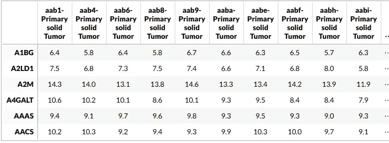

让我们看看一些基因的拟合分布的 CDF。

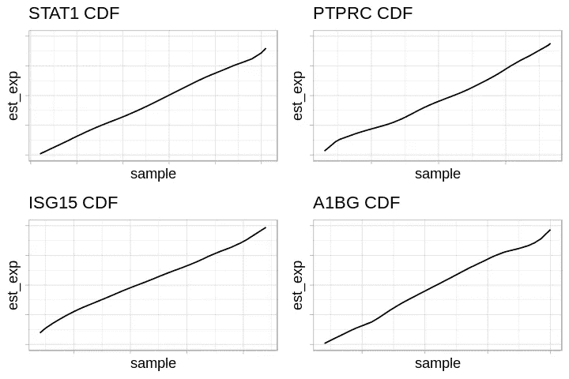

已经对每个基因的 CDF 进行了估计。下一步是对每个样本的每个基因进行排序。稍后将阐明我们为什么对每个样本中的每个基因进行排序。请注意，这些排名用于计算 GSVA 分数。

## 定义基因集合

毫不奇怪，我们需要一套基因来做 GSVA。这些基因组可能来自任何地方——你可能感兴趣的途径，你在实验中发现的基因签名，或者你从 10 年前写的论文中发现的签名。假设我们想研究两个签名:-

1.  1 型干扰素信号——该信号由 25 个基因组成。
2.  1 型干扰素刺激基因——这一特征由 125 个基因组成

## 计算 GSVA 分数——K-S 统计和经验分布

既然我们已经有了排序的基因和基因集合，下一步就是计算 GSVA 分数。这是使用 Klimigrov 随机游走统计来完成的。

K-S 统计是一种判断一个经验分布是否与另一个分布相似的方法。在我们的例子中，我们必须定义两种分布，一种是位于基因集中的基因的分布，另一种是不在基因集中的基因的分布。我们的问题很简单:*我们基因集中的基因相对于不在基因集中的基因有多大的变化？*

什么是经验 CDF？经验 CDF 只是一种从样本中估计总体真实 CDF 的方法，并且通过使用每个观察值的顺序统计或等级来找到经验 CDF。简而言之，对于从未知分布中抽取的观察值样本 x1，x2，x3…xn，在任意点 x 的经验累积分布函数是值小于或等于 x 的观察值的比例。不要将此与我们之前找到的 CDF 混淆。这个 CDF 是针对基因组合的，不同于先前使用全部数据估计的 CDF。

计算特定样品的基因集中的基因和不在基因集中的基因的分布，并且这两种分布的差异是 K-S 统计量。这一切是如何完成的将在后面的例子中展示。

## GSVA 为我们的样本评分

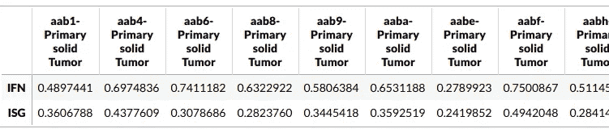

现在你有了每个样本的两个签名的 GSVA 分数。这个分数是什么，它是如何计算的，它能告诉我们什么？一个刺激的例子将更好地阐明这一点。

# 例子

为了我们的理智，让我们考虑一个有 3 个样本和 10 个基因的数据集。

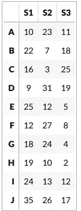

# 估计每个基因的 CDF 并找出等级

这里跳过这一步，我们假设已经计算了 CDF。这是因为从如此小的数据中计算 CDFs 会给出一个很差的估计，并且会破坏我们通过一个例子来理解 GSVA 的目的。因此，让我们假设我们已经使用高斯核估计了每个基因的分布，并对每个样本的基因进行了排序。这是队伍。

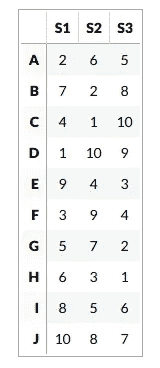

让我们定义由基因 B、E 和 H 组成的基因集合

让我们分别找出每个样本的 GSVA 分数。注意，样本的 GSVA 评分计算仍然依赖于每个样本，因为每个基因的 CDF 是使用所有样本估计的。

# 样本 1

在这种情况下，随机行走的思想是逐个迭代每个基因，并检查它是否在基因集中。这种迭代的顺序由样本的基因排序来定义。所以基因是从最积极表达的基因到最消极表达的基因重复的。让我们为样本 1 定义此订单:

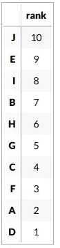

## 随机行走和跑步和

随机漫步是关于计算一个运行总和。这是通过迭代每个基因，并检查它是否位于基因集中来完成的。

我们在这里做了两次随机漫步。一个用于位于基因集中的基因，一个用于不在基因集中的基因。对于第一种情况，我们迭代每个基因并检查它是否在基因集中。

1.  如果是，将该基因的等级添加到运行总和中。
2.  如果没有，则不做任何事情，保持运行总和不变。

对于位于基因集合之外的基因，通过迭代每个基因来完成。

1.  如果基因不在基因集中，则在运行总和中加 1
2.  如果基因位于基因集中，则什么也不做，保持运行总和不变。

请注意，在计算不在基因集合中的基因的运行总和时，我们并不将它们的等级相加，而只是将运行总和加 1。这给了我们一种直觉，我们想要给基因集中的基因赋予权重，我们对此更关心。

## 基因集中基因的运行总和

这是基因集合中的基因随机行走的样子。

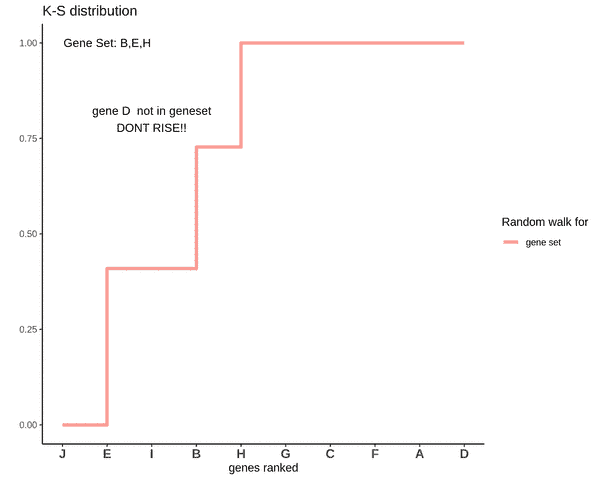

请注意，基因“E”的“上升”幅度更大，而不在基因集合中的基因(基因“B”和“H”)的上升幅度持续下降。这是因为基因‘E’的等级更高。换句话说，我们与一个基因的表达量成正比。

## 不在基因集中的基因的运行总和

在找到位于基因集中的基因的运行总和后，我们对不在基因集中的基因做类似的练习。注意每次“上升”的量是相等的。

这是不在基因集中的基因的随机漫步。

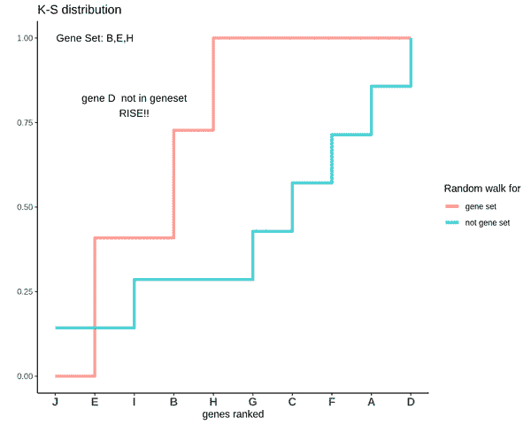

## 样品 1 的 GSVA 分数

在我找到这两个随机漫步之后，我需要量化它们有多大的不同。一种方法是取这两者之间的最大偏差。两者之间的偏差可以是正的，也可以是负的。我考虑两个方向上的最大偏差，并将它们的差值作为 GSVA 分数。

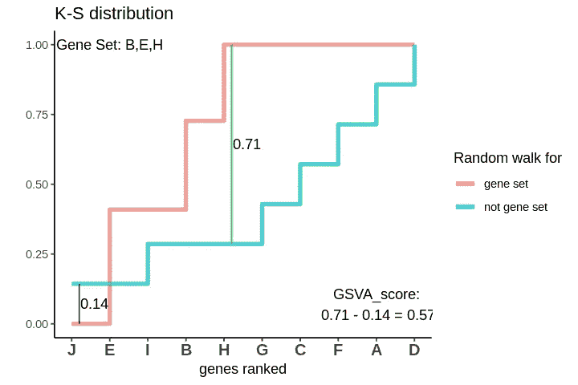

GSVA 得分为 0.57。这是高度阳性的，表明与不在基因组中的基因相比，基因中的基因是正向富集的。

# 样本 2

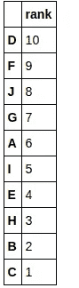

请注意，B、E 和 H 基因现在都是排名最低的基因

## 基因集中基因的运行总和

这是基因集中的基因的随机行走。

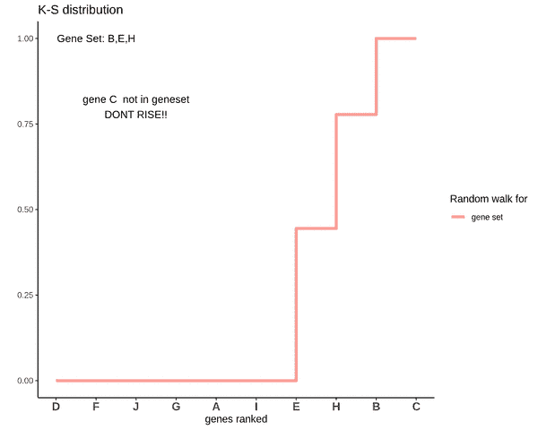

## 不在基因集中的基因的运行总和

这就是随机漫步寻找不在基因集中的基因分布的方式。

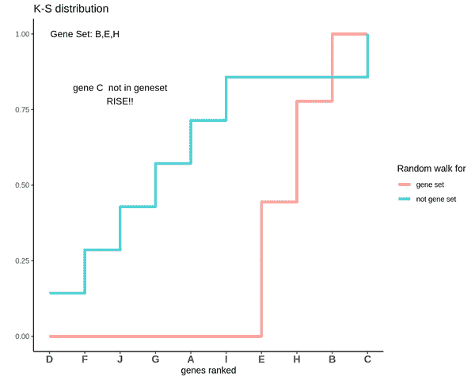

## 样品 2 的 GSVA 分数

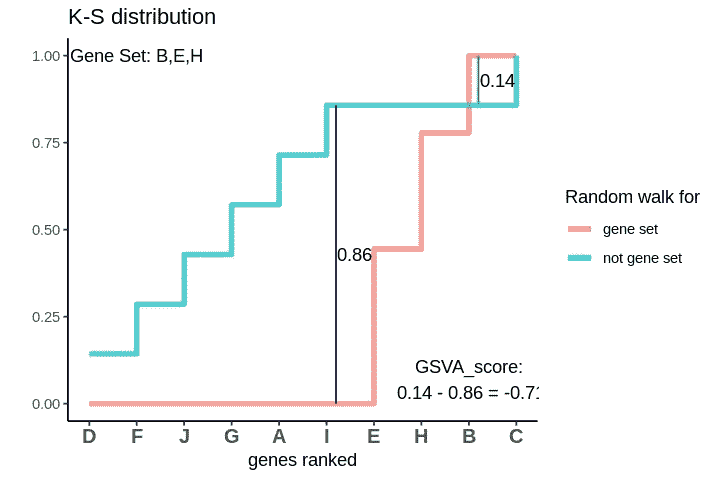

GSVA 的分数是-0.71。这是高度负的，表明与不在基因集中的基因相比，基因中的基因是负富集的。

# 样本 3

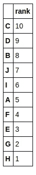

注意，B 是排序较高的基因之一，而 E 和 H 是排序较低的基因中的基因。你能猜到这种情况下 GSVA 分数会是多少吗？或许，会接近 0？让我们看看。

## 基因集中基因的运行总和

这是基因集中的基因的随机行走。

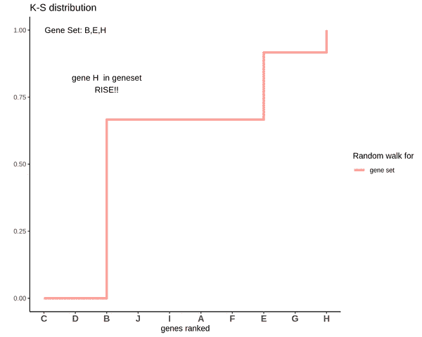

## 不在基因集中的基因的运行总和

这就是随机漫步寻找不在基因集中的基因分布的方式。

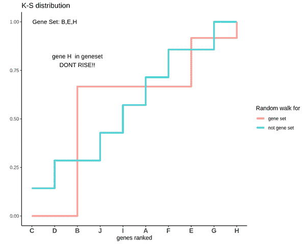

## 样品 3 的 GSVA 分数

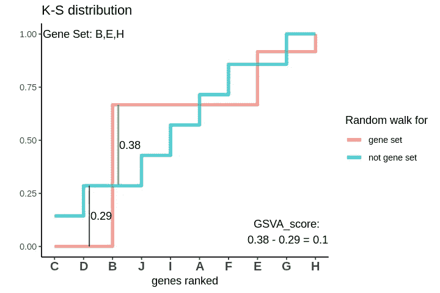

分布混合在一起。GSVA 得分为 0.1，非常接近于 0。这意味着与不在基因组中的基因相比，这些基因既没有正富集也没有负富集。因此，如果基因集合中的一些基因位于较高的等级，而一些基因位于较低的等级，则它们的影响被抵消，并且 GSVA 分数接近于 0。

# 结论

总之，GSVA 是在逐个样品的基础上量化途径和信号的富集的关键方法。它给出了一种非常聪明的方法，该方法基于简单的直觉，即当我们对所有基因进行排序并寻找基因集的基因在排序列表中的位置时，基因集在样本中的富集将取决于基因的位置。

# 参考

[GSVA 文学](https://bmcbioinformatics.biomedcentral.com/articles/10.1186/1471-2105-14-7)