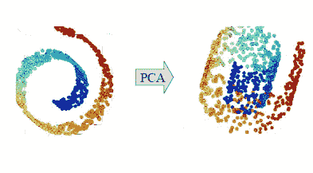
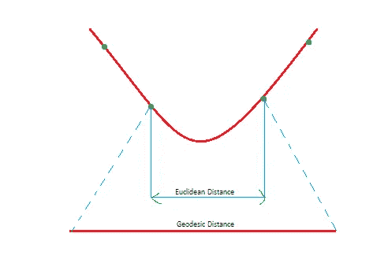
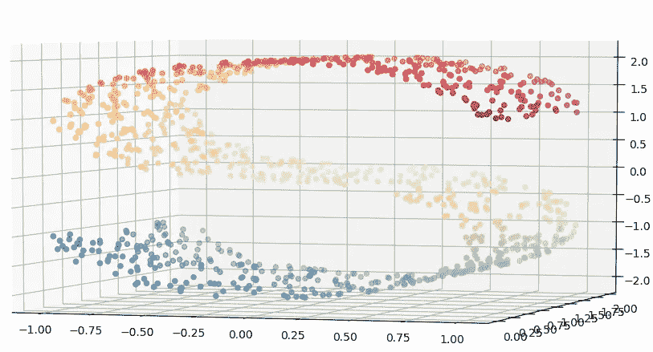
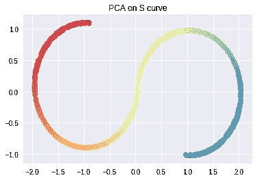
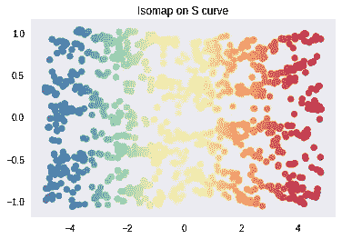

# 用 ISOMAP 分解非线性

> 原文：<https://towardsdatascience.com/decomposing-non-linearity-with-isomap-32cf1e95a483?source=collection_archive---------10----------------------->

数据科学的许多应用包括处理像图像这样的高维数据。面对如此大量的多元数据，一个潜在的问题就是如何将它们可视化。为此，我们通常将数据投影到更低的维度。传统的降维技术，如 PCA、LDA 等，由于大多是线性方法，不能给出正确的结果，不能解释数据的非线性结构。



nonlinear data after applying PCA.

线性方法基于**欧几里德距离**来降低维度，而 ISOMAP(等距映射)在多元数据点中使用**测地线距离**方法。



Isomap 按照以下步骤工作:

1.  它根据流形距离确定相邻点，并连接固定半径内的点。
2.  它计算在上述步骤中确定的点之间的测地线距离。
3.  最后，在距离图上应用多维缩放，并且保持几何形状，然后优化点的位置。

让我们举一个简单的例子来理解这一点。我们将在 sklearn 生成的非线性数据集上测试这些算法。

```
import matplotlib.pyplot as plt
from mpl_toolkits.mplot3d import Axes3D
from matplotlib.ticker import NullFormatter
from sklearn.manifold import Isomapfrom sklearn import datasetsn_points = 1000# S datasetX, color = datasets.samples_generator.make_s_curve(n_points, random_state=0)
n_neighbors = 10
n_components = 2X, color = datasets.samples_generator.make_s_curve(n_points, random_state=0)
n_neighbors = 10
n_components = 2
```

可视化我们生成的数据集。

```
%matplotlib inline
fig = plt.figure(figsize=(15, 8))plt.suptitle("S shape dataset"
             % (1000, n_neighbors), fontsize=14)
ax = fig.add_subplot(111, projection='3d')
ax.scatter(X[:, 0], X[:, 1], X[:, 2], c=color, cmap=plt.cm.Spectral)
ax.view_init(4, -72)
```



S shaped dataset

现在我们在上面的数据集上应用 PCA。

```
Y = PCA(n_components).fit_transform(X)ax = fig.add_subplot(111)
plt.scatter(Y[:, 0], Y[:, 1], c=color, cmap=plt.cm.Spectral)
plt.title("PCA on S curve")
ax.xaxis.set_major_formatter(NullFormatter())
ax.yaxis.set_major_formatter(NullFormatter())
plt.axis('tight')
plt.show()
```



在上面的图中，PCA 在二维上分解 3d 图的维度，但是在这样做的时候丢失了很多信息。

让我们检查流形上的 Isomap 的结果

```
Y = Isomap(n_neighbors, n_components).fit_transform(X)ax = fig.add_subplot(111)
plt.scatter(Y[:, 0], Y[:, 1], c=color, cmap=plt.cm.Spectral)
plt.title("Isomap on S curve")
ax.xaxis.set_major_formatter(NullFormatter())
ax.yaxis.set_major_formatter(NullFormatter())
plt.axis('tight')
plt.show()
```



这里，非线性数据被适当地投影在 2d 图上。Isomap 根据点之间的测地线距离分解数据。