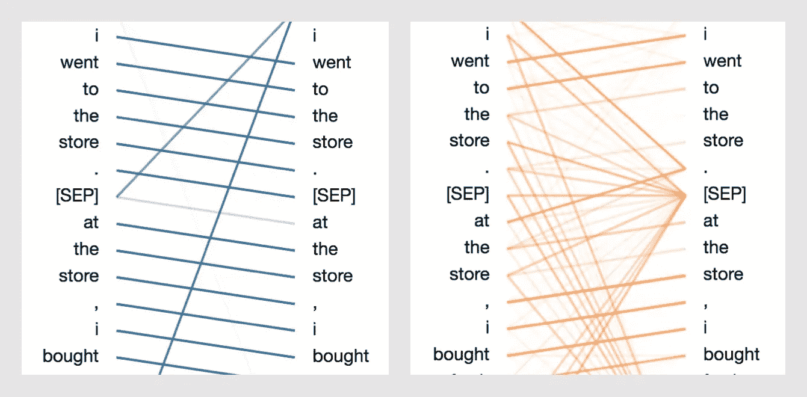
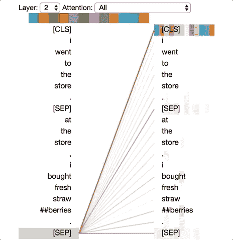
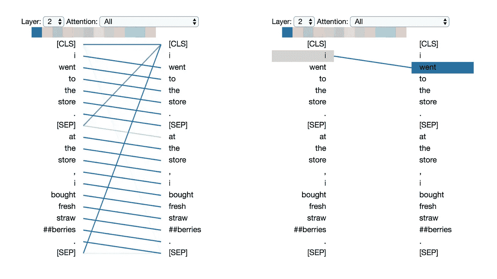
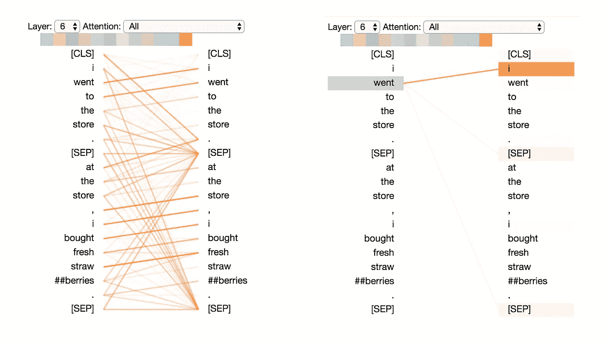
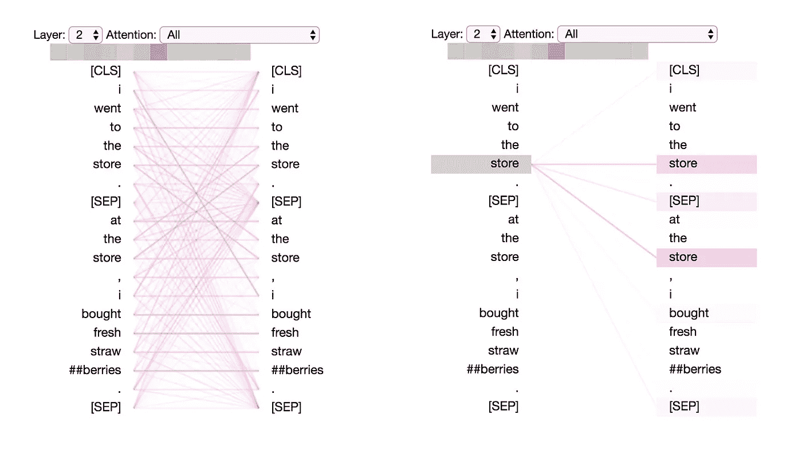
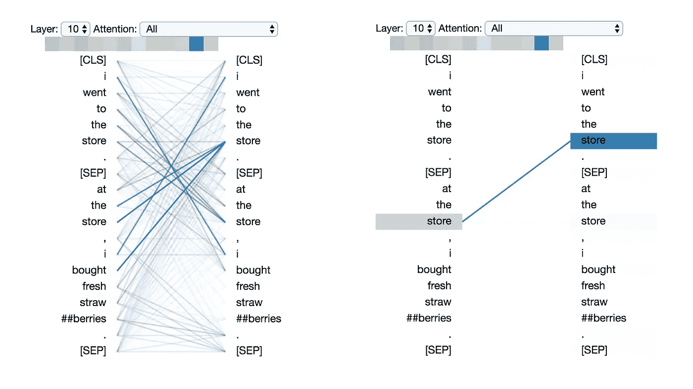
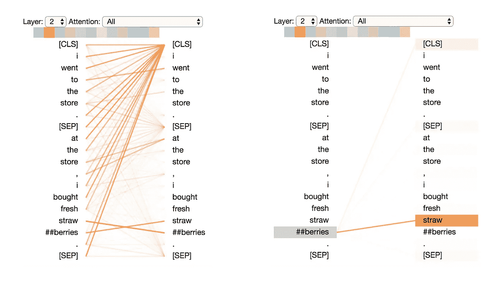
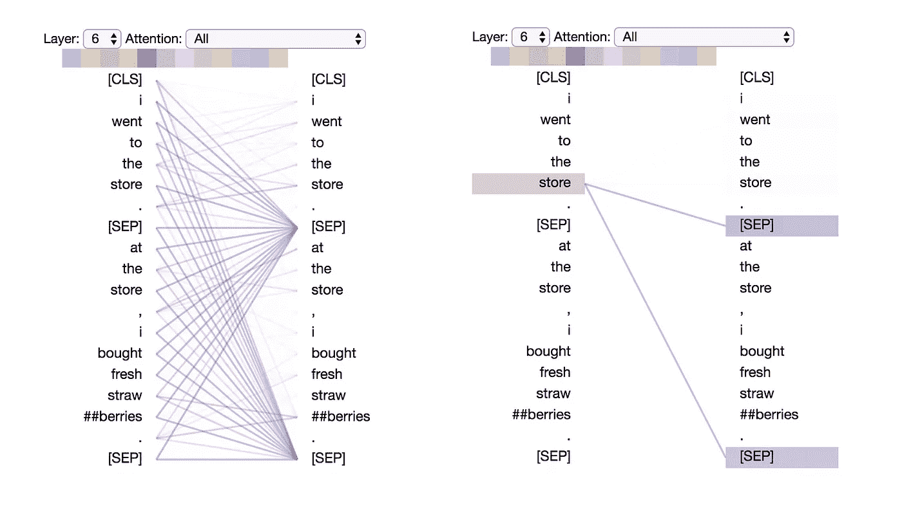

# 解构 BERT:从 1 亿个参数中提取 6 种模式

> 原文：<https://towardsdatascience.com/deconstructing-bert-distilling-6-patterns-from-100-million-parameters-b49113672f77?source=collection_archive---------4----------------------->

## 从伯特混乱的注意力网络中，一些直观的模式浮现出来

2018 年标志着自然语言处理领域的一个转折点，一系列深度学习模型在从问题回答到情感分类的 NLP 任务中取得了最先进的成果。最近，谷歌的 BERT 算法已经成为一种“统治所有人的一种模式”，这是基于它在各种各样的任务上的卓越性能。

> **试玩一个* ***互动演示*** *与* [***伯特维兹***](https://github.com/jessevig/bertviz) *。**

*BERT 建立在两个关键的理念之上，这两个理念是 NLP 最近许多进步的原因:(1)转换器架构和(2)无监督的预训练。[变形金刚](http://jalammar.github.io/illustrated-transformer/)是一个序列模型，它放弃了 RNN 的循环结构，采用了一种完全基于注意力的方法，正如即时经典[中所描述的那样](https://papers.nips.cc/paper/7181-attention-is-all-you-need.pdf)。伯特也是经过预先训练的；它的权重是通过两个无监督的任务提前学习的:[掩蔽语言建模](/a-i-plays-mad-libs-and-the-results-are-terrifying-78fa44e7f04e)(在给定左右上下文的情况下预测一个缺失的单词)和下一句预测(预测一句话是否跟随另一句话)。因此，伯特不需要为每个新任务从头开始训练；相反，它的权重是微调过的。关于伯特的更多细节，请查看插图伯特。*

## *伯特是一头(多头)野兽*

*伯特不像传统的注意力模型，在 RNN 的隐藏状态上使用扁平的注意力结构。相反，BERT 使用了多层注意力(12 层或 24 层，取决于模型)，并且还在每层(12 层或 16 层)中加入了多个注意力“头”。由于模型权重不在层之间共享，单个 BERT 模型实际上具有多达 24×16 = 384 种不同的注意机制。*

## *可视化伯特*

*由于 BERT 的复杂性，很难直观地理解其学习到的权重的含义。深度学习模型通常是出了名的不透明，各种[可视化](https://www.quora.com/What-are-the-best-visualizations-of-machine-learning-algorithms) [工具](https://www.facebook.com/nipsfoundation/videos/203530960558001/)已经被开发出来帮助理解它们。然而，我还没有找到一个可以解释伯特正在学习的注意力模式的方法。幸运的是， [Tensor2Tenso](https://github.com/tensorflow/tensor2tensor/tree/master/tensor2tensor/visualization) r 有一个很好的工具来可视化编码器-解码器变压器模型中的注意力，所以我修改了它来与 BERT 的架构一起工作，使用了 BERT 的 [PyTorch 实现](https://github.com/huggingface/pytorch-pretrained-BERT)。适配后的界面如下图，可以使用 [**Github**](https://github.com/jessevig/bertviz) **上的笔记本自己运行。***

**

*该工具将注意力可视化为连接被更新的位置(左)和被关注的位置(右)的线。颜色标识相应的注意力头部，而线条粗细反映注意力得分。在工具的顶部，用户可以选择模型层，以及一个或多个注意力头(通过单击顶部的色标，代表 12 个头)。*

# *伯特到底学到了什么？*

*我使用该工具探索了预训练 BERT 模型(基于 [BERT 的无案例版本](https://github.com/google-research/bert#pre-trained-models))各层/头部的注意力模式。我试验了不同的输入值，但出于演示目的，我只使用以下输入:*

> ***句子 A:** *我去了商店。**
> 
> *在商店，我买了新鲜的草莓。*

*BERT 使用词块标记化，插入特殊量词(*【CLS】*)和分隔符(*【SEP】*)标记，所以实际输入顺序是:***【CLS】我去商店。在商店，我买了新鲜的草莓。****

*我发现了一些相当独特和令人惊讶的直觉注意力模式。下面我确定了六个关键模式，对于每一个模式，我都展示了展示该模式的特定层/头的可视化。*

# *模式 1:注意下一个单词*

*在这种模式中，特定位置的大部分注意力都集中在序列中的下一个标记上。下面我们看到一个第 2 层，头 0 的例子。(所选的头部由顶部颜色栏中高亮显示的正方形表示。)左边的图显示了对所有标记的关注，而右边的图显示了对一个选定标记(“I”)的关注。在这个例子中，几乎所有的注意力都集中在序列中的下一个标记“got”上。*

**

*Pattern 1: Attention to next word. **Left:** attention weights for all tokens. **Right:** attention weights for selected token (“i”)*

*在左边，我们可以看到*【SEP】*记号扰乱了下一个记号的注意力模式，因为来自*【SEP】*的大部分注意力被导向*【CLS】*而不是下一个记号。因此，这种模式似乎主要在每个句子中起作用。*

*这种模式与向后 RNN 相关，在向后中，状态更新是从右到左顺序进行的。模式 1 出现在模型的多个层上，在某种意义上模拟了 RNN 的周期性更新。*

# *模式二:注意前一个单词*

*在这种模式中，大部分注意力都集中在句子中前面的*标记上。例如，在下图中,“去了”的大部分注意力都指向了前面的单词“我”。图案不像上一个那样清晰；一些注意力也被分散到其他令牌上，尤其是*【SEP】*令牌。与模式 1 一样，这与顺序 RNN 有着松散的联系，在本例中是前向 RNN。**

**

*Pattern 2: Attention to previous word. **Left:** attention weights for all tokens. **Right:** attention weights for selected token (“went”)*

# *模式 3:注意相同/相关的单词*

*在这种模式中，注意相同或相关的单词，包括源单词本身。在下面的例子中，第一次出现的“store”的大部分注意力都集中在它本身和第二次出现的“store”上。这种模式不像其他一些模式那样明显，注意力分散在许多不同的单词上。*

**

*Pattern 3: Attention to identical/related tokens. **Left:** attention weights for all tokens. **Right:** attention weights for selected token (“store”)*

# *模式 4:注意*其他*句子中的相同/相关单词*

*在这个模式中，注意另一个句子中相同或相关的单词*。*例如，第二句中“商店”的大部分注意力都指向第一句中的“商店”。人们可以想象这对于下一个句子预测任务(BERT 预训练的一部分)特别有帮助，因为它有助于识别句子之间的关系*。**

**

*Pattern 4: Attention to identical/related words in other sentence. **Left:** attention weights for all tokens. **Right:** attention weights for selected token (“store”)*

# *模式 5:注意单词的其他预测词*

*在这种模式中，注意力似乎被引向预测源单词的*其他*单词，而不包括源单词本身。在下面的例子中，来自“吸管”的大部分注意力被导向“#浆果”，来自“#浆果”的大部分注意力集中在“吸管”上。*

**

*Pattern 5: Attention to other words predictive of word. **Left:** attention weights for all tokens. **Right:** attention weights for selected token (“##berries”)*

*这种模式不像其他一些模式那样独特。例如，大部分注意力都集中在定界符标记上(*【CLS】*)，这是接下来讨论的模式 6 的定义特征。*

# *模式 6:注意分隔符标记*

*在这个模式中，大部分注意力都集中在定界符标记上，要么是*【CLS】*标记，要么是*【SEP】*标记。在下面的例子中，大部分注意力都集中在两个*【SEP】*标记上。正如本文中[所讨论的，这种模式充当一种“无操作”:当注意力头在输入句子中找不到任何有意义的东西来关注时，它会关注*【SEP】*标记。](https://arxiv.org/abs/1906.04341)*

**

*Pattern 6: Attention to delimiter tokens. **Left:** attention weights for all tokens. **Right:** attention weights for selected token (“store”)*

## *笔记*

*[有人说](https://www.facebook.com/nipsfoundation/videos/203530960558001/)数据可视化有点像罗夏测验:我们的解释可能被我们自己的信念和期望所影响。虽然上面的一些模式非常独特，但其他模式有些主观，因此这些解释只能作为初步观察。*

*此外，上述 6 种模式描述了 BERT 的粗略注意结构，并不试图描述注意可能捕获的语言模式。例如，有许多不同类型的“关联性”可以在模式 3 和模式 4 中表现出来，例如同义词、共指等。看看不同的注意力是否专注于不同类型的语义和句法关系会很有趣。*

# *试试吧！*

*可以在 [**Github**](https://github.com/jessevig/bertviz) 上查看可视化工具。请玩玩它，分享你的发现！*

# *为了进一步阅读*

*在 [**第二部分**](/deconstructing-bert-part-2-visualizing-the-inner-workings-of-attention-60a16d86b5c1) 中，我扩展了可视化工具来展示*伯特是如何形成其独特的注意力模式的。在我最近的文章 中，我探索了 OpenAI 的新文本生成器，GPT-2。**

***在这里* *了解更多我的可视化与可解释性工作* [*。你可以在 Twitter 上找到我@*](https://jessevig.com)[*Jesse _ vig*](https://twitter.com/jesse_vig)*。***

***大感谢*[*Llion Jones*](https://medium.com/@llionj)*独创 Tensor2Tensor* [*可视化工具*](https://github.com/tensorflow/tensor2tensor/tree/master/tensor2tensor/visualization) *！***