# 解构介质上的度量

> 原文：<https://towardsdatascience.com/deconstructing-metrics-on-medium-bf5b4863bf96?source=collection_archive---------9----------------------->

## 利用数据科学设计更好的媒体统计体验

# 入门指南

如果你以前曾经在 Medium 上发表过一个故事，那么你很有可能熟悉 [Medium Stats](https://help.medium.com/hc/en-us/articles/215108608-Your-stats) 和它的产品。Medium Stats 是一个工具，您可以在其中查看您在平台上发布的帖子的流量和访客统计数据。这也是一个严重缺乏的工具。

该功能让我们可以访问他们发布的每个故事的视图、阅读、阅读率和粉丝等指标。它还提供了过去 30 天内某些指标的累计总数。

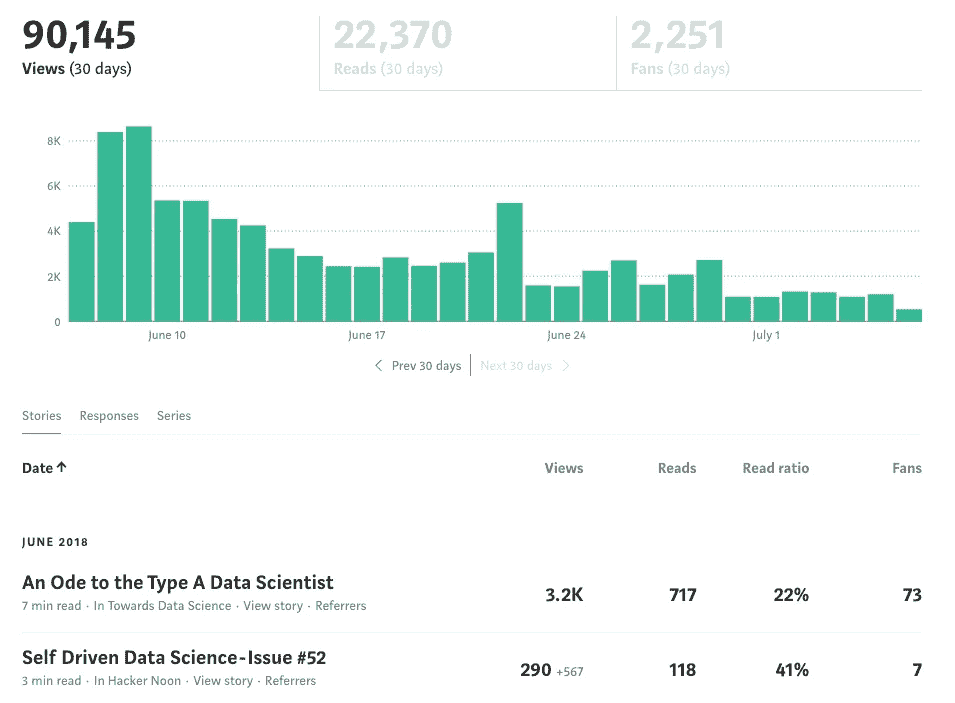

A look into Medium Stats

页面的设计一直备受争议，但事实是，除了视觉上的改进，还有更多工作要做。Medium 跟踪大量在页面的有限功能中不可用的信息。此外，*所做的*存在的任何功能都是以虚荣心为中心，难以传达全貌。

# 该项目

我们可能无法访问收集到的过多的指标，但是我们确实有中等的统计数据。也许真的有一些有意义的见解埋藏在那里的某个地方。也许，只是也许…

> 有没有什么方法可以利用这些数据获得比目前提供给我们的更有用的信息？

带着这个问题，我继续从我自己的媒体统计页面[收集数据](https://github.com/conordewey3/Medium-Stats-Analysis/blob/master/Medium%20Stats%20Data%20Collection.ipynb)，然后对我之前 30 多个故事中任何值得注意的关系和趋势进行一些[探索性数据分析](https://github.com/conordewey3/Medium-Stats-Analysis/blob/master/Medium%20Stats%20Data%20Analysis.ipynb)。

如果你有兴趣对自己的媒体数据进行类似的分析，请查看下面链接的回购协议。你会发现我的个人数据集可以开始使用，还有几个笔记本应该会有用。

自从我开始在数据中挖掘，我开始思考很多关于指标和它们在媒体上的意义。

**在这篇文章中，我将深入研究 Medium Stats 提供的每个指标，并探索可能的替代方案。我还将引用探索性数据分析对我以前的故事提出的见解和问题。**

 [## conordewey 3/Medium-Stats-分析

### Medium-Stats-Analysis -探索数据并分析特定于用户的 Medium Stats 的指标

github.com](https://github.com/conordewey3/Medium-Stats-Analysis) 

# 关于度量的几点注记

创建或选择新的度量标准当然不是一件容易的事情。出于这个原因，我们经常用一些更容易理解的简化问题来代替最初的问题。有很多有用的启发式方法，但是当考虑度量标准时，我经常会将事情分解为以下几点:

> **1。在这种背景下，成功是什么样的？**
> 
> **2。怎么才能量化呢？**

由于任务的主观性质，分析是什么使得某个指标'*'好'*'或'*'坏'*'往往更加困难。也就是说，有几个属性值得一提，它们通常与有效的指标相关联。下面是来自[计划兄弟](https://blog.planbrothers.io/en/what-makes-good-metric)的一个简短列表:

## 比较的

一个好的衡量标准必须能够与时间、其他同等群体和竞争对手相比较。

## 明白

创建易于理解的指标。如果人们不能记住细节或讨论它们，这意味着度量标准令人困惑。

## 基于比率

每个指标都应该基于一个明确的比率。想想开车吧。行驶距离是信息性的，但不是可操作的。另一方面，每小时的距离是你可以行动的。

## 行为改变

一个好的指标可以产生数据，为必要的调整提供信息，并推动行动。根据这些信息，我会做哪些不同的事情？

记住这些属性，让我们开始一些分析。关于度量的更多信息，我强烈推荐查看 [Julie Zhuo](https://medium.com/u/b8a4e5ae7490?source=post_page-----bf5b4863bf96--------------------------------) 和她关于[设置度量](https://medium.com/the-year-of-the-looking-glass/how-do-you-set-metrics-59f78fea7e44)的各种帖子。我们开始吧！

# 指标#1:视图

对于基于网络的内容来说，浏览量是一个主要因素。它们非常容易解释，而且非常有效地让我们自我感觉良好。就我个人而言，以下是我的五个点击率最高的帖子:

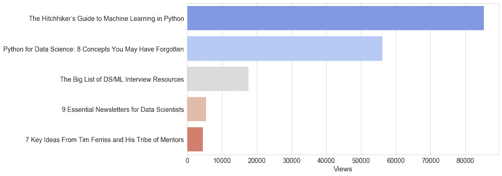

你可能会注意到，最上面的两个故事明显比其他的突出。经过进一步分析，我发现我一生中超过 70%的观点来自我在 Medium 上的 30 多个故事中的 2 个。这些帖子通过在 Python 中实现机器学习[和数据操作](https://medium.freecodecamp.org/the-hitchhikers-guide-to-machine-learning-algorithms-in-python-bfad66adb378)和[中的概念来重点讲解它们。我想这是作家之间的一个共同主题——不是每篇文章都会是全垒打。](/python-for-data-science-8-concepts-you-may-have-forgotten-i-did-825966908393)

这进一步说明了观点并不能说明全部。如果有的话，他们正在衡量一个职位的范围。它影响了多少人。某个故事吸引眼球的数量非常具有误导性，并且经常鼓励点击诱饵标题和充满流行词汇的描述。

## 替代度量:`Shares`

有人可能会说观点可以被完全抛弃。这种衡量标准往往弊大于利，导致作者更多地关注吸引注意力，而不是创作有见地的作品。

如果你*需要*一个计数指标来衡量作品的范围，我建议用股份来代替。我认为这是一个进步的原因有几个:

1.  **分享仍然衡量帖子的范围，但也考虑内容，因为读者不会分享他们不喜欢的帖子。**
2.  股票惩罚肤浅的、点击诱饵的投资者，而不是奖励他们。

使用分享的一个可能的不利之处是，一个知名影响者的转发会被赋予与关注者较少的人相同的权重。

这是好是坏有待讨论。在量化范围的背景下，份额最初不足，将取决于发生的连锁效应。例如，当一个拥有 100，000 名粉丝的人在 Twitter 上转发你的文章时，它最初被记录为+1 份额。特定的有影响力的分享的额外权重必须以暴露给更多读者的形式出现，这些读者也将有机会分享帖子，等等。

即使考虑到这一点，我仍然认为在提供有意义的反馈方面，分享是一种进步。即使这并不能取代那些始终如一的观点，因为作家们无疑仍然对有多少人看过他们的故事感兴趣。

在评估一个帖子的真实范围和传播力时，应该提供分享和观点。

# 指标#2:读取

Reads 在剔除肤浅的文章方面做得更好，因为读者可能会点击它们，但一旦他们意识到自己没有从中获得任何价值，他们可能就不会读完了。

您可能还记得，通常应该避免计算指标。向朋友提起它们或者用它们来增强我们的自尊心可能会很有趣，但当涉及到驾驶行动时，它们就不够了。

正如人们所料，阅读量和浏览量之间存在明显的相关性，这使得我们无法从这个指标中获得任何洞察力。请注意，为了更好地了解下面的关系，我已经删除了异常值:

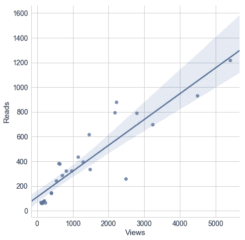

阅读和观点有一点不同。虽然 Views 希望衡量范围，但 Reads 关注的是参与度。人们对材料的实际参与程度如何？这很难用计数度量来回答。

为了真实地捕捉一个帖子有多吸引人，我们需要使用更多基于比率的东西。幸运的是，Medium 已经有了这个问题的答案。

## 替代度量:读取比率

我现在不会深入讨论读取率，因为我们稍后会更深入地讨论它，但是让我们来看看一些显著的改进:

1.  **读取率根据视图数量进行调整，消除了之前影响读取的偏差。**
2.  **阅读率在大多数类型的帖子中不相上下，无论是内容还是受欢迎程度。**

阅读率被证明是评估我的文章可读性的一个非常有用的指标。归根结底，如果你不能让读者参与进来，你就无法向他们传递价值。

# 指标#3:读取率

终于有了一个关于中等统计的可行指标！正如我们刚才提到的，读取率是对传统读取计数的更有意义的改变。此外，它仍然可以很容易地理解为逗留和[阅读帖子](https://www.quora.com/How-does-Medium-calculate-Reads-vs-Views)的观众的百分比。让我们通过阅读率来看看我在媒体上的热门帖子:

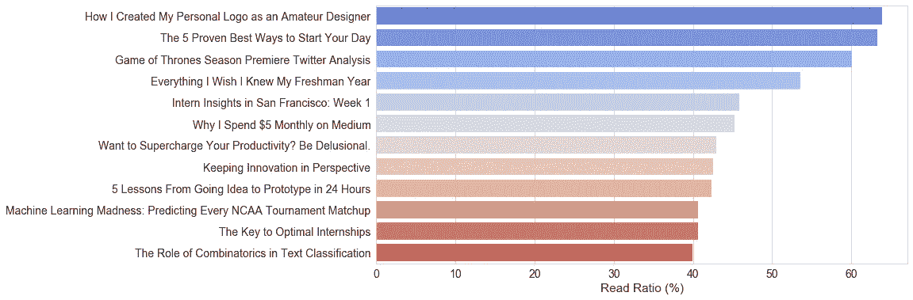

这对我来说非常有趣。看起来我的第一篇媒体文章拥有最高的阅读率。当我回去回顾上面的热门故事时，我注意到了一个主题。几乎所有的都有点短；阅读时间不到 6 分钟。他们也有大量的图片和标题，使读者很容易浏览。

这看起来很直观，但是让我们通过评估帖子的阅读率和它们各自的阅读时间来进一步观察这种直觉。

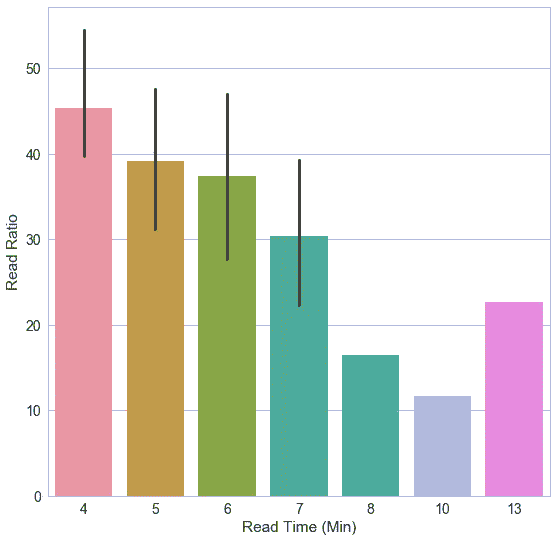

正如人们所料，有人通读帖子的可能性很大程度上取决于文章的[长度。这绝对阻碍了我们对 Read Ratio 的解读。所以让我们解决它。](https://medium.com/data-lab/the-optimal-post-is-7-minutes-74b9f41509b)

## 替代度量:调整后的读取比率

我们需要设计一种方法来告诉用户，相对于阅读时间相同的其他帖子，什么是好的，什么是坏的。为了做到这一点，我们可以[标准化](https://www.quora.com/What-is-the-meaning-of-min-max-normalization)每个读取时间组内的读取比率，并报告 0 和 1 之间的新分数。

这个指标可以更准确地评估一个职位的参与度，但它带来了可解释性的问题。在选择度量标准时经常会有取舍；我们想回答手头的问题，但我们需要一些容易理解的东西。

让我们找到一个折中的办法。注意，我在这里要作弊一点。这不一定是它自己的独立指标，而是一个微妙的信息设计调整。通过将相对性能添加到已经可以解释的读取率中，用户可以从中推断出更多信息。

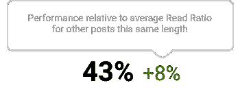

这并不惊天动地，但这个小小的变化却让世界变得不同。让我们回想一下强指标的四个特征:可比较、可理解、基于比率和行为改变。

最初，读比率是很好理解的，并且是基于比率的。然而，由于对阅读时间的偏见，它缺乏可比性和实质性的行为改变能力。

**有了这个新的设计，所有的四个底座都被覆盖了，作家可以很容易地解释他们的作品相对于它的长度有多吸引人。**

# 衡量标准 4:粉丝

在 Read Ratio 取得短暂成功后，我们又回到了虚荣指标上。注意 Fans 并没有告诉我们拍手的数量，只是简单的将每个拍手的用户注册为粉丝。不用说，这里可能有更多的内容。

对于粉丝，我们希望评估一些完全不同于我们之前的观点(范围)或阅读(参与度)。我们尤其希望量化影响。帖子的影响有多大？人们有多喜欢它？

为了改进这一指标，让我们保持简单，并采用基于比率的替代方法。对于每一个阅读这篇文章的人来说，有多少人受到了足够的影响而至少鼓掌一次？答案是粉丝比。

## 替代指标:调整后的风扇比率

一些中型用户已经谈到手工计算这一指标，所以我有点惊讶它没有被纳入中型统计产品。

通过使用 Fan Ratio 而不是 Fans，我们得到了使用 Ratio 而不是 count 的明显好处。最值得注意的是，它为我们提供了一个可比较的指标，并包含可操作的信息。以下是我关于粉丝比例的热门帖子:

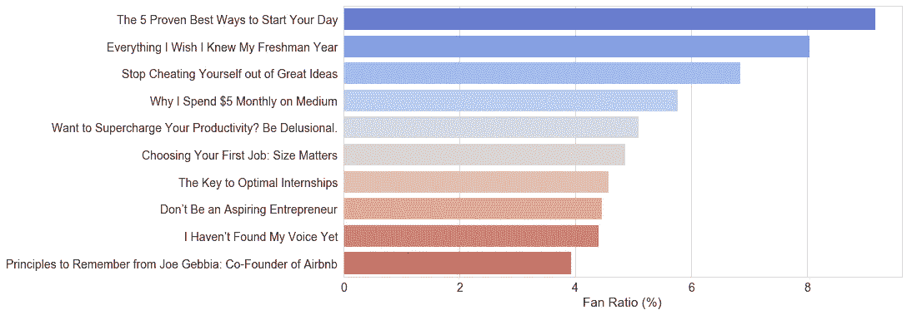

我在这里注意到的第一件事是，我关于自我提升的帖子比我的技术类帖子获得了明显更高的粉丝比率。

某些类型的故事比其他类型的故事有更好的粉丝比率吗？

幸运的是，我把所有的帖子都提交给了基于该主题的出版物。关于自我提升主题的帖子去了 [The Ascent](https://theascent.pub/) 和 [The Startup](https://medium.com/swlh) ，而更多的技术帖子去了[forward Data Science](https://towardsdatascience.com/)、 [freeCodeCamp](https://medium.freecodecamp.org/) 和 [Hackernoon](https://hackernoon.com/) 。最后，任何与设计相关的帖子通常都会提交给 [UX 星球](https://uxplanet.org/)。

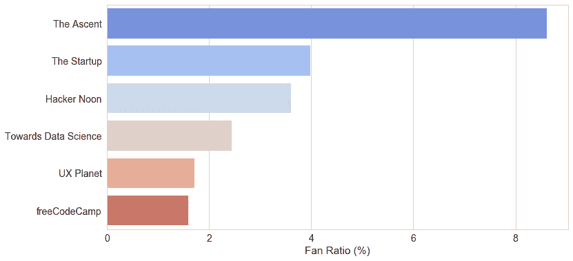

虽然基于 30 个故事的小样本，但这似乎证实了我们的猜测，即一些类型比其他类型表现得更好。然后，通过介绍出版物，可能只是一些出版物比其他出版物有更多的参与用户。在没有更多数据的情况下，很难明确回答这个问题，但是我的直觉告诉我选择第一个选项:流派。

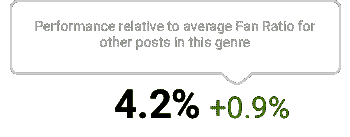

这在我看来很有道理。尤其是涉及到自我提升岗位的表现。从长远来看，他们似乎是媒体中最受欢迎的，经常吸引大量的粉丝。他们中的许多人可以在任何情况下针对任何人，因此更有可能对某人产生积极影响，并创造一个粉丝。

Medium 甚至可以更进一步，使用其他基于内容的功能将相似的帖子聚集在一起，从而创建一个分析系统。

与其将一个帖子的粉丝比率与其类别中的其他帖子进行比较，不如将它与该类别中的其他帖子进行比较，以更准确地反映其真实的相对优势。

# 更好的 KPI

经过大量的思考和分析，我发现一篇成功的媒体文章通常具有以下特征:

1.  **它吸引读者，让他们有足够的兴趣读完。**
2.  **它积极地影响读者，提供一些价值或享受。**

在这篇文章中，我们已经触及了许多不同的指标和见解，但是真的就这么简单。你把读者带进来，给他们提供价值。

正如我们前面提到的，我们可以用调整后的读取比率来衡量参与度，用调整后的风扇比率来衡量影响。幸运的是，这两个因素似乎与这个特定样本上的 0.54 [相关性](https://en.wikipedia.org/wiki/Pearson_correlation_coefficient)有很强的相关性。

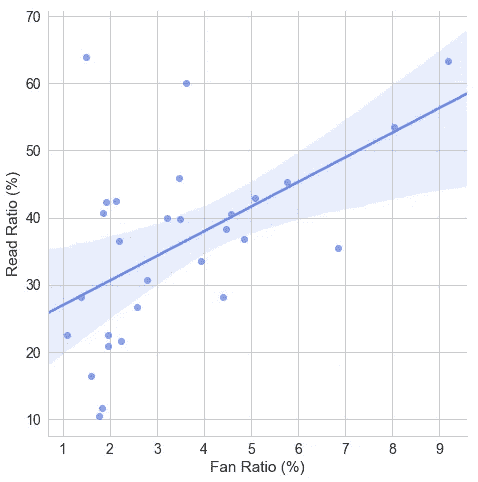

很高兴在这里看到某种程度上的线性关系，这意味着强势帖子通常在阅读率和粉丝率方面都表现良好。考虑到这一点，我考虑了归一化和加权平均值最终成为一个包罗万象的指标的几种可能性，但出于可解释性的考虑，我选择了不这样做。

> “当人类的判断和大数据相交时，会发生一些有趣的事情。”——内特·西尔弗

如果我有自己的方式，当你把鼠标放在一个特定的帖子上时，我会提供类似下面的可视化效果。正如我们前面所探讨的，这提供了一个给定职位有效性的更好的表示，同时保持了可解释性和可比较性。*参与和影响。*

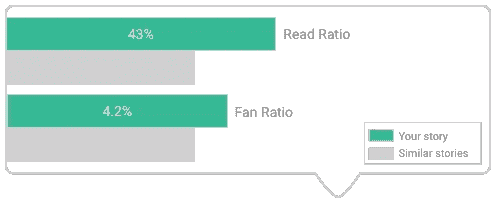

# 最后的话

恭喜你坚持了这么久！我从来没有预料到这个项目会从一个简短的探索性数据分析转变为一个 2600 字的度量标准的深度挖掘。然而，我还有最后一点要说。

我们知道数据的力量有多大。我们知道它对几乎任何环境都是有用的——是的，包括写作。据推测，公司每天都变得越来越受数据驱动。

那么，这场运动是什么时候冲击 Medium 的作家平台的呢？

这种类型的分析应该适用于所有的作者，而不仅仅是数据科学爱好者和从业者。我们需要让内容创作者的数据分析民主化。从 *one* Medium Stats 页面中抽取 30 篇文章的样本，这些见解就成为可能。想象一下我们拥有更多数据和信息的可能性。

**通过授权作家分析他们的内容并了解读者如何看待它，他们*将*创作出更有影响力的更好的作品。**

这不是一个小任务，但我相信这是可以做到的。你的移动，媒介。

感谢阅读！如果你想检查我的分析或者用你自己的媒体数据执行一个类似的项目，请访问我在 Github 上的回购:[媒体统计分析](https://github.com/conordewey3/Medium-Stats-Analysis)。

如果你对未来的更多帖子感兴趣，请确保[关注我](https://twitter.com/cdeweyx)并订阅下面的[我的简讯](https://www.conordewey.com/)以接收任何新内容。想了解更多关于我和我在做什么，请查看我的网站。