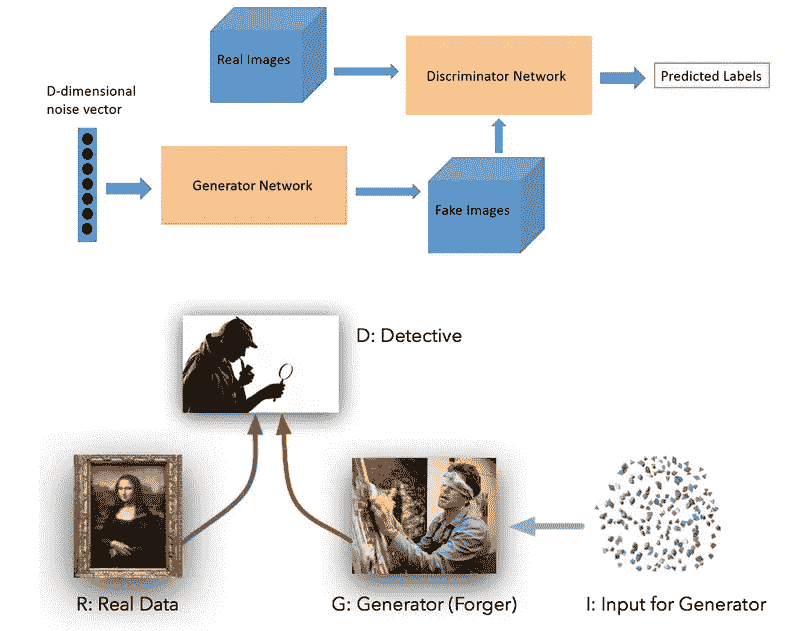
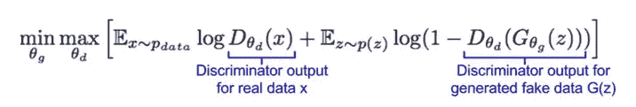

# 解密生成式人工智能和 GANs

> 原文：<https://towardsdatascience.com/decrypt-generative-artificial-intelligence-and-gans-16646dbb4426?source=collection_archive---------9----------------------->

大家好，

今天的话题是 AI 的一个非常令人兴奋的方面，叫做生成式人工智能。简言之，生成式人工智能指的是一种算法，它使机器能够使用文本、音频文件和图像等东西来**创建/生成**内容。在之前的[帖子](https://sergioskar.github.io/Autoencoder/)中，我谈到了变化的自动编码器以及它们如何用来生成新图像。我提到过它们是一个更大的模型集的一部分，称为生成模型，我将在下一篇文章中更多地讨论它们。所以我们在这里。

正如我在那篇文章中简要解释的，有两种模式。判别性和生成性。第一类是最常见的模型，如卷积或递归神经网络，用于区分/辨别数据中的模式，以便将它们归类。图像识别、皮肤癌诊断、以太坊预测等应用都属于判别模式的范畴。

后者能够在数据中生成**新模式**。因此，他们可以产生新的图像，新的文本，新的音乐。以严格的数学形式来说，判别模型试图估计后验概率 p(y|x)，这是给定输入样本(手写数字的图像)的输出样本(例如手写数字)**的概率。另一方面，生成模型估计联合概率 p(x，y)，这是输入样本和样本输出同时为真的概率。实际上，它试图计算一组类的分布，而不是它们之间的边界。**

你能想象可能性吗？嗯，你可以通过查看该领域的当前进展和一些现有的应用来了解它们。迄今为止，生成模型已经被用于从图像中产生文本，开发肿瘤学分子，发现新药，将梵高等艺术家的风格转化为新的图像。我敢肯定你听说过 Deepfakes，他们把名人的脸放在任何类型的视频上。如果你认为你能分辨真假，那就别想了。你不能。

如果你点击了上面的一些链接，你可能会注意到一些更有趣的东西。由于一种叫做 GANs 的东西，所有的应用都成为可能。GANs 或**生成性对抗网络**是大多数生成性应用背后的基础架构。当然，还有许多其他很酷的模型，如变分自动编码器、深度玻尔兹曼机器、马尔可夫链，但 GANs 是过去三年围绕生成式人工智能有如此多宣传的原因。

# 什么是生成性对抗网络？

2016 年，伊恩·古德菲勒(Ian Goodfellow)在过去十年最有前途的人工智能[论文](https://arxiv.org/pdf/1406.2661.pdf)中引入了生成性对抗网络。它们是一种无监督的学习技术，基于一个简单的前提:

你想生成新的数据。你是做什么的？你建造两个模型**。你训练第一个产生假数据，第二个辨别真假。你让他们互相竞争**。

嘣！这就是了。我希望事情就这么简单。它不是。但这是 GANs 背后的主要原则。

好的，让我们进入一些细节。第一个模型是神经网络，称为生成器。生成器的工作是产生虚假数据，输入时只有噪音。第二个模型，鉴别器，接收真实图像和伪造图像(由生成器产生)作为输入，并学习识别图像是否是伪造的。当你让他们互相竞争并同时训练他们时，奇迹就开始了:

生成器在图像生成方面变得越来越好，因为它的最终目标是欺骗鉴别器。鉴别器变得越来越擅长区分真假图像，因为它的目标是不被愚弄。结果是我们现在有了来自鉴别器的难以置信的真实的假数据。

上图是一个很好的类比，描述了 GAN 之间的功能。生成者可以被视为制造欺诈性文件的伪造者，而鉴别者可以被视为试图检测这些文件的侦探。他们参与了一场零和游戏，随着时间的推移，他们都变得越来越好。

到目前为止一切顺利。我们有模型，现在我们必须训练它们。这就是问题开始出现的地方，因为它不是我们用梯度下降和损失函数训练神经网络的标准方法。这里我们有两个相互竞争的模型。那么，我们该怎么办？

我们不确定。GAN 的优化是目前最活跃的研究领域之一，不断有新的论文出现。我将尝试解释这里的基础，我需要一些数学和一些博弈论。！！)来做到这一点。请不要离开。和我在一起，最后，一切都会变得有意义。

# 如何训练他们？

我们可以认为这里有一个[极小极大](https://en.wikipedia.org/wiki/Minimax)博弈。引用维基百科的话:“一个玩家的马希民值是在不知道其他玩家的行动的情况下，该玩家能够确定得到的最高值；等价地，这是当其他玩家知道该玩家的动作时，他们可以强迫该玩家接受的最低值”

换句话说，第一个玩家试图最大化他的奖励，同时最小化他的对手奖励。第二个玩家试图完成完全相同的目标。

在我们的例子中，**鉴别器试图最大化分配正确标签给真实数据和生成样本的概率。而生成器试图最小化鉴别器正确答案的概率**。

我们将损失表示为一个极大极小函数:

这是什么？

鉴别器试图使函数最大化；因此，我们可以对目标函数执行梯度上升。生成器试图最小化函数；因此，我们可以对函数进行梯度下降。通过在梯度上升和下降之间交替，可以训练模型。

当鉴别器不能最大化函数，生成器不能最小化函数时，训练停止。用博弈论的术语来说，他们达到纳什均衡。

我希望你还在。这是主要的想法，被称为对抗性训练。当然，有几个经常出现的陷阱，例如:

*   模型参数振荡并且从不收敛，
*   鉴别器太成功了，以至于发生器梯度消失
*   它对超参数高度敏感
*   生成器产生有限种类的样本

在过去的几年里，科学家们为解决这些问题做出了巨大的贡献，我们可以说已经取得了很大的进展。只要在 [arxiv-sanity](http://www.arxiv-sanity.com/) 上快速搜索一下。不过，现在还早。记住。甘的存在不到三年。

我将用一些关键事实来结束我的发言。如果你跳过整篇文章，没关系。但是不要忽略这些:

*   生成式人工智能用于从真实数据中生成新数据
*   GAI 最突出的模式是生成性对抗网络。
*   甘的是两个神经网络参与了一个游戏。第一个试图制造新的虚假数据，第二个试图将它们与真实数据区分开来。随着训练的进行，他们都越来越擅长自己的工作。
*   甘的训练还有很多工作要做
*   GAN 的实时应用是……(我该如何用一个词来形容呢？嗯嗯……)huuuuge。

菲尼托…

> ***如果您有任何想法、评论、问题或者您只想了解我的最新内容，请随时在***[**Linkedin**](https://www.linkedin.com/in/sergios-karagiannakos/)**，**[**Twitter**](https://twitter.com/KarSergios)**，**[**insta gram**](https://www.instagram.com/sergios_krg/)**，**[**Github**](https://github.com/SergiosKar)**或在我的**

*原载于 2018 年 9 月 13 日*[*sergioskar . github . io*](https://sergioskar.github.io/Generative_Artificial_Intelligence/)*。*