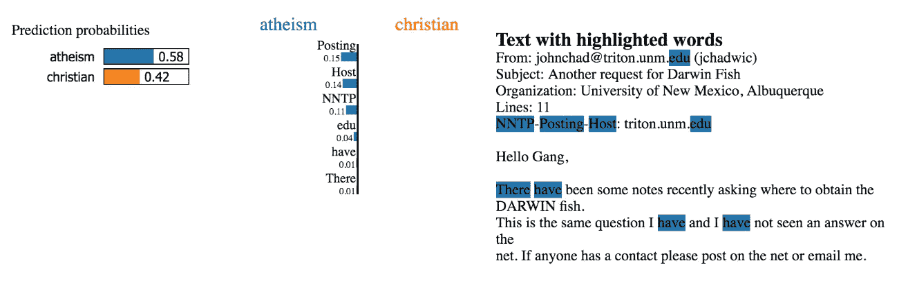
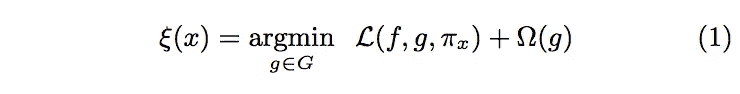
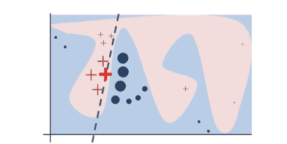
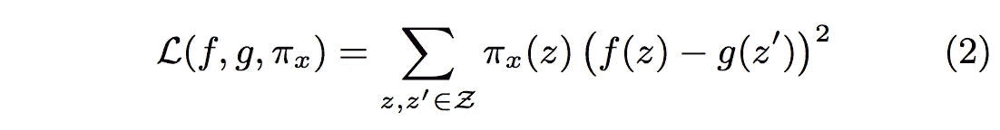
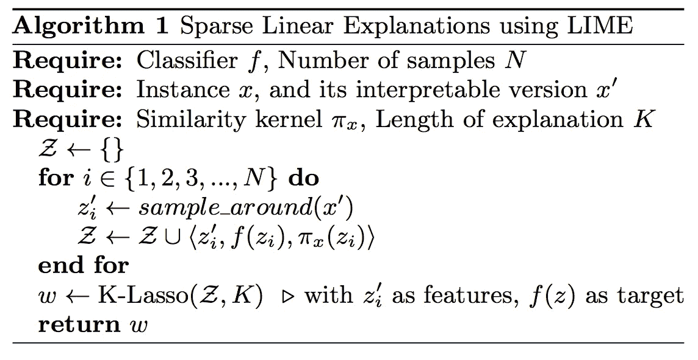
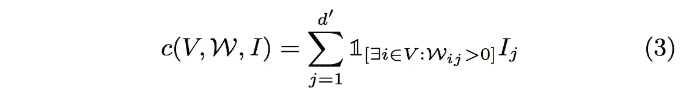
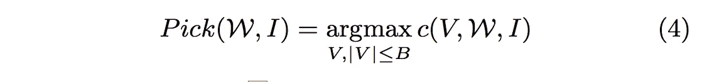
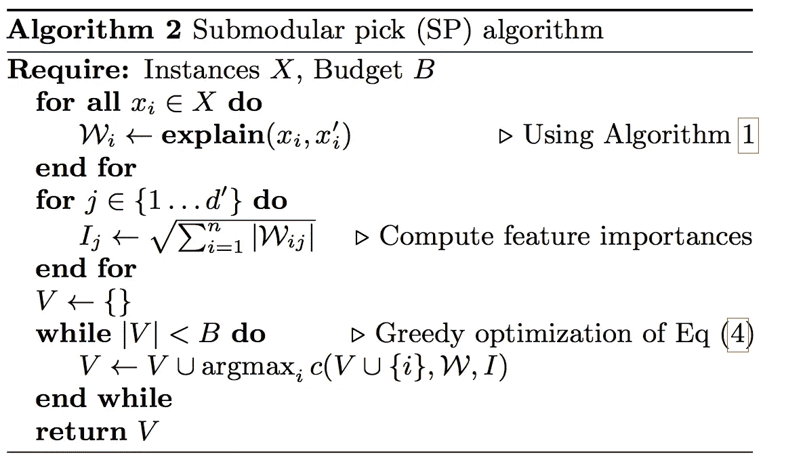
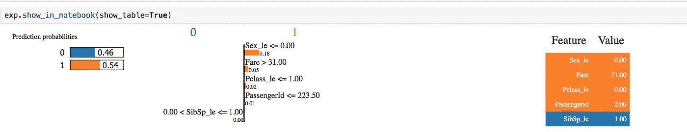
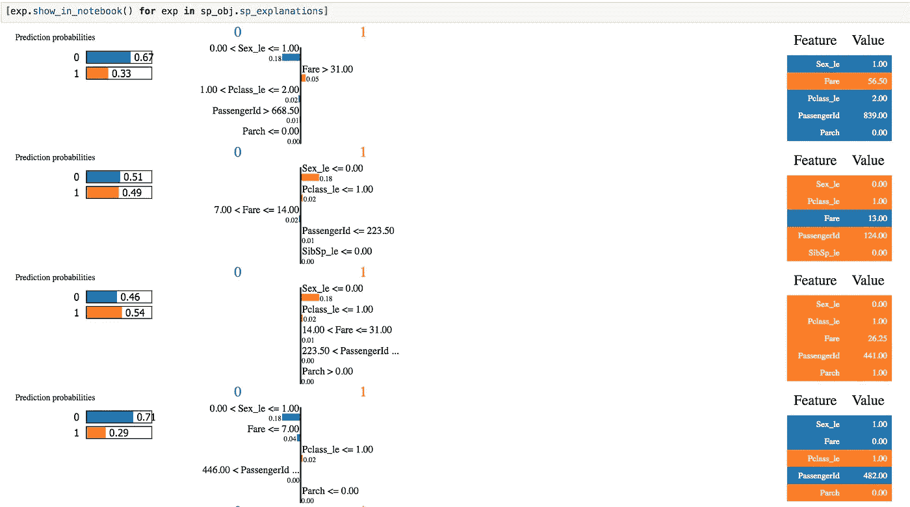

# 用石灰解密你的机器学习模型

> 原文：<https://towardsdatascience.com/decrypting-your-machine-learning-model-using-lime-5adc035109b5?source=collection_archive---------1----------------------->

## 你为什么要相信你的模型？

最近，人们开始重新关注模型的可解释性。ML 专家能够理解模型可解释性在随后的业务适应中的重要性。模型可解释性的问题在于，很难以人类可以理解的方式定义模型的决策边界。LIME 是一个 python 库，它试图通过产生局部忠实的解释来解决模型的可解释性。下面是一个解释文本分类问题的例子。

Example of an explanation by LIME for a binary classification model(atheism/Christian). The words (features) highlighted in blue support atheism.

*本帖将涵盖以下主题:*

1.  *信任你的模型的重要性*
2.  *什么是石灰？*
3.  什么使 LIME 成为一个好的模型解释者？
4.  【LIME 如何实现模型可解释性？
5.  *在分类问题上使用石灰的实例*

## **信任你的模型的重要性**

为了在模型中建立信任，我们运行多个交叉验证并执行拒绝集验证。这些模拟给出了未知数据上模型性能的汇总视图。这无助于理解为什么我们的一些预测是正确的，而另一些是错误的，我们也无法追踪我们的模型的决策路径。换句话说，我们无法理解它的学习或找出它的虚假结论。但是，如果我告诉你，有一种工具可以用人类可以理解的方式解释你的模型的决策边界，那会怎么样呢？这个魔法图书馆的名字叫莱姆。

## **什么是石灰？**

LIME(局部可解释模型不可知解释)是一种新颖的解释技术，它通过学习预测周围的局部可解释模型，以可解释和忠实的方式解释任何分类器的预测。

**LIME 在模型可解释性方面提供了什么？** 1。一致的模型不可知论解释者[ **LIME** ]。
2。一种选择具有解释[ **SP-LIME** ]的代表性集合的方法，以确保模型在复制人类逻辑时行为一致。这个代表性的集合将提供对模型的直观的全局理解。

LIME 解释了一个预测，因此即使是非专家也可以通过特征工程对一个不可信的模型进行比较和改进。一个理想的模型解释器应该包含以下理想的特性:

1.  **可解释的**
    它应该提供输入变量和响应之间的定性理解。应该很好理解。
2.  一个解释不可能完全忠实，除非它是模型本身的完整描述。已经说过，它应该至少是局部忠实的，即它必须在被预测的实例附近复制模型的行为。
3.  **模型不可知论者** 解释者应该能够解释任何模型，在提供解释的同时不应该对模型做任何假设。
4.  **全局视角**
    解释者应向用户解释一个代表性集合，以便用户对模型有一个全局直觉。

## 什么使莱姆成为一个好的模型解释者？

让我们看看石灰是如何衡量这些特征的:

**1。可解释的数据表示法** 使用人类理解的表示法，而不管模型使用的实际特征。这被称为可解释的表现。一个可解释的表示会随着我们正在处理的数据类型而变化，例如:
1。对于文本:它表示有/没有单词。
2。对于图像:它表示超像素(相似像素的连续块)的存在/不存在。
3。对于表格数据:它是列的加权组合。

*简而言之，LIME 的解释者即使是非专家也能理解。*

**2。保真度-可解释性权衡**

我们想要一个忠实的(本地复制我们模型的行为)和可解释的(第一点)解释器。为了达到这一时间，最大限度地减少以下内容:

Explanation model equation

*方程变量* ***f*** :原始预测值
**x** :原始特征
***g*** *:解释模型，可以是线性模型、决策树、 或者下降规则列出了* ***Pi****:z 的一个实例到 x 之间的邻近性度量，以定义 x 周围的局部性，它根据它们到 x 的距离来加权 z’(扰动的实例)* ***第一项****:g 在 Pi 定义的局部性中逼近 f 的不忠实性的度量。 这在原始论文* ***中被称为* ***位置感知损失*** *最后一项*** *:解释模型复杂度 g 的度量。例如，如果你的解释模型是决策树，它可以是树的深度，或者在线性解释模型的情况下，它可以是非零权重的数量*

*速记以备将来参考
1。****x’****(可解释表示)*:这个二进制向量是原始模型使用的实际特征的人类可理解版本。
2。**z’**(扰动样本):x’的非零元素的分数。
3。 **f(z)** :等级标签
4。 **g(z')** :这是 LIME 学习的模型(解释模型)。

为了确保可解释性和局部保真度 ***最小化位置感知损失*** ,同时保持第二项足够低以便人类能够解释。这将被引用为***ω(g)****用于后文* 的其余部分，同时优化位置感知损失时间以实现局部保真度。

**3。用于局部探测的采样** 只是重申 **g** 是要学习的模型，**z’**是训练数据的一个实例， **f (z)** 是 y。为了创建完整的训练集，我们从**x’执行随机均匀采样。**换句话说，我们从一行 **x** 中创建多个**z’**(原始训练示例)。
然后这些由 **Pi(x)** 加权，以更加关注更接近 x 的**z’**。
给定该数据集和标签，等式 1 被优化以学习解释模型。总而言之，LIME 提供的解释不依赖于原始模型的类型(模型不可知)。

*The black-box model’s complex decision function f (unknown to LIME) is represented by the blue/pink background, which cannot be approximated well by a linear model. The bold red cross is the instance being explained. LIME samples instances get predictions using f and weigh them by the proximity to the instance being explained (represented here by size). The dashed line is the learned explanation that is locally (but not globally) faithful.*

**4。稀疏线性解释
我们假设
1。 **g(z') = w . z'** (使解释模型线性)2 **。局部感知损耗** =平方损耗
3。 **Pi(z) :** exp(-D(x，z)(2)/sigma(2))(样本的近似加权)
4。 **D(x，z)** :距离函数**

Locally-aware square loss

## **了解石灰算法**

**K** 是解释时要考虑的变量数量的限制。例如，对于文本，K 是要考虑的字数，对于图像，是超像素的数量，对于表格数据，是列的数量。为了实现这一点，我们使 **Omega** 趋向于无穷大，如果 **size(w) > K.** 总而言之，使用线性解释器来近似原始模型的决策边界。

**第 2 部分:解释模型的子模型选择(SP-LIME)**

LIME 旨在将模型的预测归因于人类可以理解的特征。为了做到这一点，我们需要在一组不同但有代表性的实例上运行解释模型，以返回一个非冗余的解释集，它是模型的全局表示。在介绍算法之前，让我们先了解一下先决条件:
1。 **B** (预算):用户愿意检查的说明数量
2。**挑选步骤:**从所有实例中挑选 B 实例的任务
3 . ***W*** (解释矩阵): ***n*** (样本数)**** d’***(人类可理解的特征)矩阵
4 . ***I(j):*** 解释空间中分量 j 的全局重要性
5。 **V** :说明
6 所考虑的特征。***【V，W，I】***:*计算在集合 V 中的至少一个实例中出现的特征的总重要性。3)*

**

*Nonredundant coverage intuition*

**

*Maximizing the weighted coverage function*

**

****算法 2 步骤*** 1。对所有实例(所有 x)运行解释模型
2。计算单个组件的全局重要性
3。通过迭代地添加具有最高最大覆盖增益的实例来最大化覆盖函数。
4。Return V(代表性非冗余解释集)*

*由此，我们可以看到 LIME 拥有理想模型解释器的所有 4 个理想属性。*

## **在一个分类问题上使用石灰的实际例子**

*下面是运行泰坦尼克号经典分类案例的模型解释的代码。我用 LightGBM 来训练模型(点击了解 [LightGBM](https://medium.com/@abhisheksharma_57055/what-makes-lightgbm-lightning-fast-a27cf0d9785e) 库，这里了解其[优化](/algorithms-for-hyperparameter-optimisation-in-python-edda4bdb167))。*

*这是对训练数据中第 1 行的解释*

**

*orange colored features support class 1 and blue colored features support class 0*

*使用不同的数据实例运行最后两行，以获得不同的特征图。*

*这个解释有三个部分:*

1.  *最左边部分显示预测概率*
2.  *中间部分返回 5 个最重要的特性。对于二进制分类任务，它将是橙色/蓝色两种颜色。橙色的属性支持类别 1，蓝色的属性支持类别 0。Sex_le ≤0 支持 1 类。水平条上的浮点数代表这些特性的相对重要性。*
3.  *各部分的颜色编码是一致的。它包含前 5 个变量的实际值。*

*使用下面的代码运行 SP-LIME*

**

*Results of running SP-LIME*

*为了在我们的模型中建立信任，我们不仅需要向 ML 专家解释模型，还需要向领域专家解释，这需要人类可以理解的解释。这是通过创建一个模型不可知的本地忠实解释集来实现的，它甚至可以帮助非专家理解原始模型是如何做出决策的。通过创建代表性样本集，LIME 为用户提供了模型决策边界的全局视图。这个模型的可解释性对于人类与 ML 系统的有效交互是至关重要的。解释个人预测在评估信任度时很重要，称赞也支持模型选择中的集合验证。*

## ***参考文献***

1.  *原文链接:【https://arxiv.org/abs/1602.04938 *
2.  *Github 链接:[https://github.com/marcotcr/lime](https://github.com/marcotcr/lime)*
3.  *博客作者:论文作者:[https://homes.cs.washington.edu/~marcotcr/blog/lime/](https://homes.cs.washington.edu/~marcotcr/blog/lime/)*

*请在下面分享您的想法、反馈或建议。*