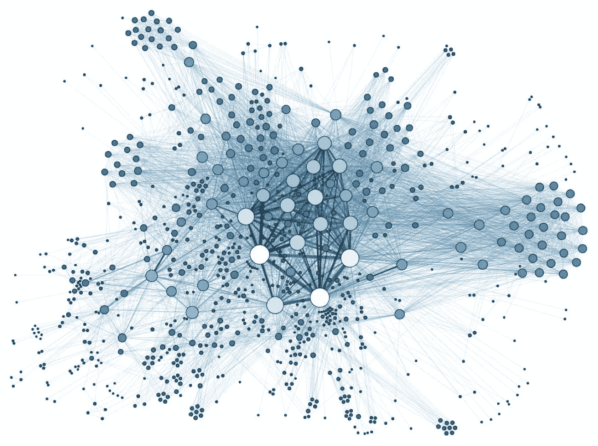
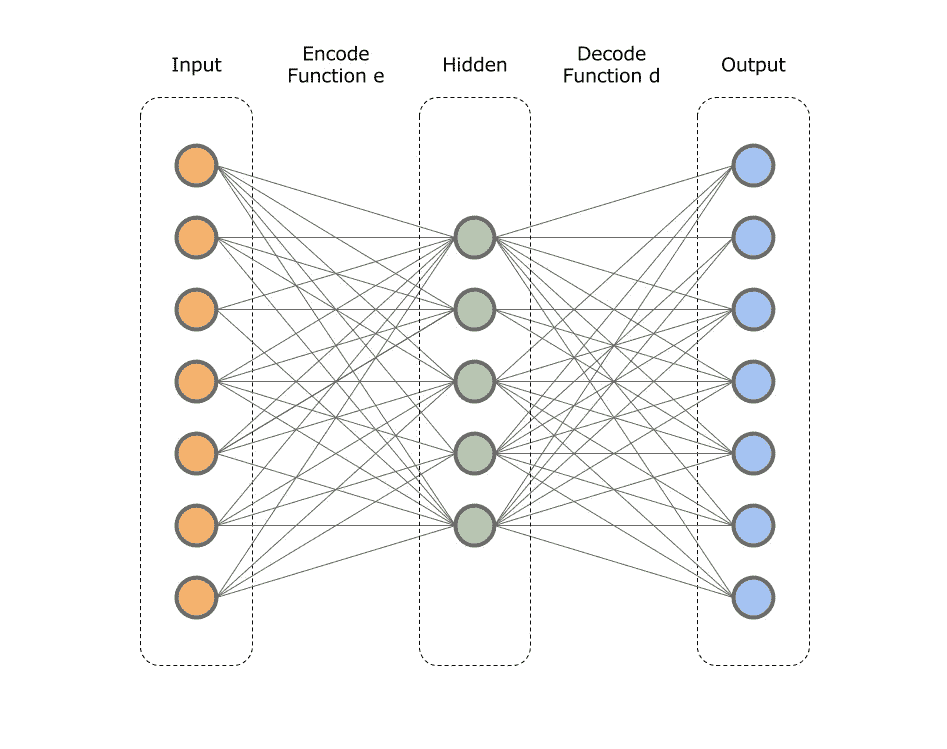
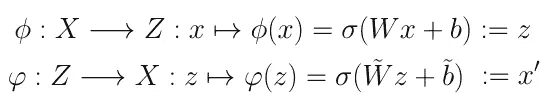
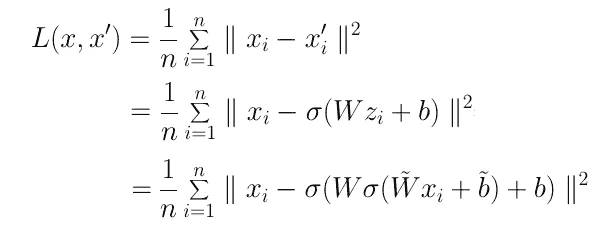
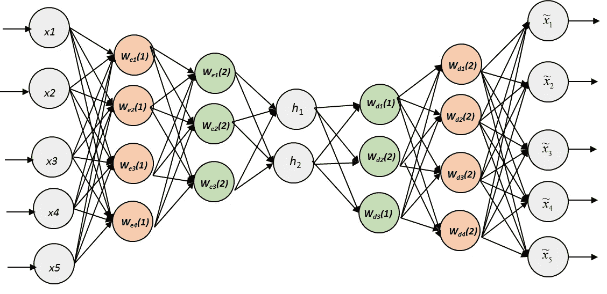
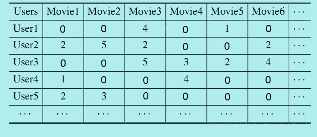

# 用于协同过滤的深度自动编码器

> 原文：<https://towardsdatascience.com/deep-autoencoders-for-collaborative-filtering-6cf8d25bbf1d?source=collection_archive---------0----------------------->

## 预测用户对电影的评价——实用教程

协同过滤是推荐系统使用的一种方法，通过从许多其他用户收集品味或偏好信息来预测特定用户的兴趣。协同过滤技术具有潜在的假设，即如果用户 A 与人 B 在一个问题上具有相同的品味或观点，则 A 更有可能在不同的问题上具有 B 的观点。

**在这篇文章中，你将学习如何根据一个用户的喜好以及观看并评价了同一部电影和其他电影的其他用户的喜好来预测这个用户对这部电影的评价。**



## 如果你喜欢这篇文章，想分享你的想法，问问题或保持联系，请随时通过 [LinkedIn](https://www.linkedin.com/in/artem-oppermann-929154199/?locale=en_US) 与我联系。

# 目录:

*   介绍
*   深度自动编码器
*   模型实现

# **1。简介**

自动编码器是一种深度学习神经网络架构，在协作过滤领域实现了最先进的性能。在文章的第一部分，我会给你一个简单自动编码器及其扩展深度自动编码器背后的理论概述和基础数学。在第二部分中，我们将深入实践，我将一步一步向你展示如何在 *TensorFlow* 中实现这一技术。在本文中，我将只包括和评论模型中最重要的部分。整个模型、输入管道和预处理可以在相应的 [GitHub 库](https://github.com/artem-oppermann/Deep-Autoencoders-For-Collaborative-Filtering)中查看。

# 2.深度自动编码器

## 自动编码器

在我们关注深度自动编码器之前，我们应该讨论它的简单版本。自动编码器是一种人工神经网络，用于学习一组输入数据的表示(编码)，通常是为了实现降维。

在架构上，自动编码器的形式是一个前馈神经网络，具有一个输入层、一个隐藏层和一个输出层(图 1)。输出层具有与输入层相同数量的神经元，用于重建其自身的输入。这使得自动编码器成为一种无监督学习的形式，这意味着不需要标记数据，只需要一组输入数据，而不是输入输出对。



Fig. 1\. Typical AutoEncoder architecture.

自动编码器的隐藏层比输入层小是很有用的。这种效果迫使模型通过学习数据中的相关性来创建隐藏层中数据的压缩表示。

从输入层到隐藏层的过渡被称为编码步骤，从隐藏层到输出层的过渡被称为解码步骤。我们也可以用数学方法将这些转换定义为映射:



通过将输入数据向量 ***x*** 乘以权重矩阵，添加偏置项，并对所得向量应用非线性运算 **σ** ，例如 sigmoid、tanh 或整流线性单元，来实现映射。

> **即将推出:** *面向软件开发人员、数据分析师、学者和业内人士的高级深度学习教育*
> 
> *更多详情请看:*[*www.deeplearning-academy.com*](https://www.deeplearning-academy.com/)


[www.deeplearning-academy.com](https://www.deeplearning-academy.com/)

## 自动编码器的训练

在训练时间期间，编码器获取输入数据样本 **x** 并将其映射到所谓的隐藏或潜在表示 **z.** ，然后解码器将 **z** 映射到输出矢量**x’，该矢量(在最佳情况下)是输入数据 **x** 的精确表示。请注意，通常不可能精确重建输入 **x** 。**

**具有输出**x’**训练包括应用随机梯度下降以最小化预定义损失，例如均方误差:**

****

## **深度自动编码器**

**简单自动编码器的扩展是深度自动编码器(图 2)。从图 2 中可以看出，它的简单配对部分的唯一区别是隐藏层的数量。**

****

**Fig. 2\. Deep Autoencoder architecture.**

**附加的隐藏层使自动编码器能够从数学上学习数据中更复杂的潜在模式。深度自动编码器的第一层可以学习原始输入中的一阶特征(例如图像中的边缘)。第二层可以学习与一阶特征的外观中的模式相对应的二阶特征(例如，在什么边缘倾向于一起出现方面——例如，形成轮廓或角检测器)。深度自动编码器的更深层倾向于学习甚至更高阶的特征。**

**总而言之:我们需要额外的层来处理更复杂的数据——比如我们在协同过滤中使用的数据。**

# **3.履行**

**如前所述，你将学会预测用户对电影的评价。为此，我们将使用著名的[*电影镜头*数据集。](https://grouplens.org/datasets/movielens/) *MovieLens* 是一个基于网络的推荐系统和在线社区，为用户推荐电影观看。**

**更具体地说，我们将使用 *ml-1m.zip* 数据集，该数据集包含 6，040 *MovieLens* 用户制作的约 3，900 部电影的 1，000，209 个匿名评级。我们需要的导入文件是 *ratings.dat.* 这个文件包含 1，000，209 行，都具有以下格式:user _ id::movie _ id::rating:time _ stamp。**

**例如 *ratings.dat 中的第一行:***

```
1::595::5::978824268 
```

**意味着用户号。1 给电影编号。595 a 五星评级。时间戳可以忽略，因为它不会被使用。**

**我们实现的深度学习模型需要特定的数据结构来进行训练和测试。这个数据结构是一个 *U* x *M* 矩阵，其中 *U* 是用户数量，而 *M* 是电影数量。每行 *i* ∈ *U* 是唯一的用户 id，每列 *j* ∈ *M* 是唯一的电影 id。这种矩阵的可视化可以在图 3 中看到**

****

**这个矩阵中的每个条目都是用户对一部特定电影的评价。条目 0 表示用户没有给这部电影任何评价。例如，用户 1 给电影 3 的评级是 4 星，而电影 1 根本没有评级。**

**由于本教程的重点是深度学习模型的实现，所以这里不介绍从 *ratings.dat* 文件中制作用户电影矩阵的步骤。关于这个主题的更多问题，我想把你重定向到我的 [GitHub 库](https://github.com/artem-oppermann/Deep-Autoencoders-For-Collaborative-Filtering)，在那里你可以检查相应的 python 脚本。**

## **训练和测试数据集**

**在模型可以被实现和训练之前，数据的另一个再处理步骤是必要的——将数据分成训练和测试数据集。这一步非常简单。到目前为止，我们有一个用户-电影矩阵，其中每一行都是评级列表。为了从该列表中获得训练集和测试集，我们必须从每一行中取出评级的子集，并且仅将它们用于训练，而将剩余的子集仅用于测试。**

**作为所述过程的一个例子，让我们考虑仅由 15 部电影组成的小得多的数据集。特定用户可能给了这些电影以下评级:**

```
Movie Nr. : 1 2 3 4 5 6 7 8 9 10 11 12 13 14 15Rating:     5 0 2 4 0 0 2 1 5  1  0  4  5  1  3
```

**请记住，0 表示电影未分级。现在，我们将由前 10 部电影组成的子集作为训练集，并假设其余的电影尚未分级:**

```
Movie Nr. : 1 2 3 4 5 6 7 8 9 10 11 12 13 14 15Rating:     5 0 2 4 0 0 2 1 5  0  0  0  0  0  0
```

**因此，原始数据的最后 5 个电影分级被用作测试数据，而电影 1-10 被屏蔽为未分级:**

```
Movie Nr. : 1 2 3 4 5 6 7 8 9 10 11 12 13 14 15Rating:     0 0 0 0 0 0 0 0 0  1  0  4  5  1  3
```

**这只是一个简单的演示如何获得不同的集合。在最初的 *MovieLens* 数据集中，我对每个用户只使用了 10 个电影评级进行测试，而其余的(绝大多数)用于模型的训练。**

## **TensorFlow 实现**

## **模型架构**

**深度自动编码器被实现为一个类，具有所有必要的操作，如推理、优化、丢失、准确性等。在课堂上。**

**在构造函数中，为权重和偏差设置了内核初始化器。在下一步中，网络中的所有权重和偏差都被初始化。权重呈正态分布，平均值为 0.0，方差为 0.02，而偏差在开始时都设置为 0.0。**

**在这个特定的例子中，网络有三个隐藏层，每个包含 128 个神经元。输入层(和输出层)的大小对应于数据集中所有当前电影的数量。**

## **培养**

**给定输入数据样本 **x** (用户电影矩阵的一行)，进行计算网络输出的正向传递。隐藏层使用 sigmoid 作为激活函数。请注意，最后一层既没有非线性也没有偏置项。**

**有了网络预测，我们可以计算这些预测和相应标签之间的损失(网络输入 **x** )。为了计算损失的平均值，我们还需要知道非零标签的数量，换句话说，就是用户在训练集中的总评分数。**

**网络的优化/训练步骤可能会显得有点棘手，让我们一步一步来讨论。给定一个输入 ***x*** 计算相应的输出。正如您可能已经注意到的，输入 ***x*** 中的大多数值都是零值，因为用户几乎肯定没有观看数据集中的所有 5953 部电影并对其进行评级。因此，建议不要直接使用网络的原始预测。相反，我们必须识别数据输入 ***x*** 中零值的索引，并将对应于这些索引的预测向量中的值也设置为零。这种对预测的操纵极大地减少了网络的训练时间，使网络有机会将其训练努力仅集中在用户实际做出的评级上。**

**在这个步骤之后，可以计算损失以及正则化损失(可选)。AdamOptimizer 将损失函数降至最低。请注意，该方法返回的是均方根误差(RMSE ),而不是均方误差(MSE ),测量精度更高。**

## **测试**

**在训练阶段的一些时期之后，神经网络已经多次看到每个用户的训练数据集中的所有评级。此时，模型应该已经学习了数据中的潜在隐藏模式以及用户的相应协作电影品味。给定用户评级训练样本 **x** ，模型预测输出**x’**。该向量由输入 **x** 的重建组成(如预期的那样)，但现在也包含输入 **x** 中先前零额定值的值。这意味着该模型对尚未分级的电影进行了分级。这种评级对应于用户的喜好——模型从数据中识别和学习到的喜好。**

**为了测量模型的准确性，需要训练和测试数据集。基于训练集进行预测。类似于训练阶段，我们仅考虑与测试集中非零值的索引相对应的输出值。**

**现在，我们可以计算预测和实际评级之间的均方根误差损失(RMSE)。RMSE 表示预测值和观察值之间差异的样本标准差。例如，0.5 的 RMSE 意味着平均而言，预测评级偏离实际评级 0.5 颗星。**

## **培训结果**

**最后一步是执行培训过程并检查模型的性能。在这一点上，我不会进入构建数据输入管道、图形、会话等的细节。因为这些步骤是众所周知的。对这个话题感兴趣的读者可以在我的 [GitHub 资源库](https://github.com/artem-oppermann/Deep-Autoencoders-For-Collaborative-Filtering/blob/master/train.py)中查看这些步骤。**

**在这里，您可以观察前 50 个时期的训练和测试性能。在 50 个时期之后，我们在测试集上得到预测和实际评级之间的 0.929 星偏差。**

```
epoch_nr: 0,  train_loss: 1.169, test_loss: 1.020
epoch_nr: 10, train_loss: 0.936, test_loss: 0.959
epoch_nr: 20, train_loss: 0.889, test_loss: 0.931
epoch_nr: 30, train_loss: 0.873, test_loss: 0.923
epoch_nr: 40, train_loss: 0.859, test_loss: 0.925
epoch_nr: 50, train_loss: 0.844, test_loss: 0.929
```

## **如果你喜欢这篇文章，想分享你的想法，问问题或保持联系，请随时通过 LinkedIn 与我联系。**

## **参考**

**[](https://github.com/artem-oppermann/Deep-Autoencoders-For-Collaborative-Filtering) [## artem-opper Mann/Deep-auto encoders-For-Collaborative-Filtering

### 深度自动编码器-用于协同过滤-使用深度自动编码器预测电影分级。

github.com](https://github.com/artem-oppermann/Deep-Autoencoders-For-Collaborative-Filtering) 

[http://proceedings.mlr.press/v27/baldi12a/baldi12a.pdf](http://proceedings.mlr.press/v27/baldi12a/baldi12a.pdf)

http://deeplearning.net/tutorial/SdA.html**