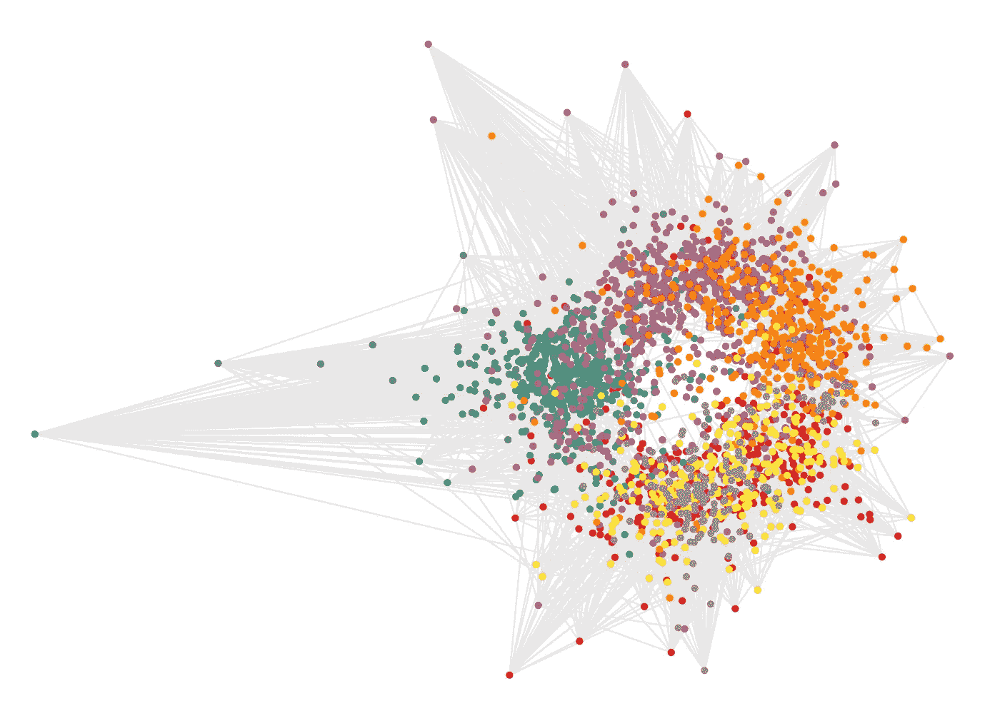
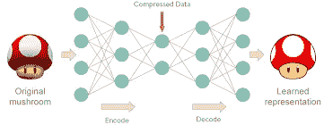
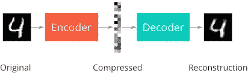
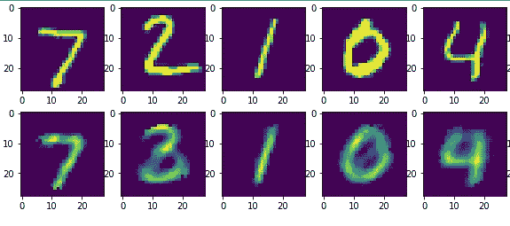

# 使用 Tensorflow 的深度自动编码器

> 原文：<https://towardsdatascience.com/deep-autoencoders-using-tensorflow-c68f075fd1a3?source=collection_archive---------3----------------------->

在本教程中，我们将探索一种称为自动编码器的无监督学习神经网络。

因此，**自动编码器**是用于在输出层再现输入的深度神经网络，即输出层中神经元的数量与输入层中神经元的数量完全相同。考虑下图

此图显示了典型深度自动编码器的结构。自动编码器架构的目标是在输出层创建输入的表示，使得两者尽可能接近(相似)。但是，自动编码器的实际用途是确定输入数据的压缩版本，同时具有最低的数据丢失量。我这么说的意思是:你在开发机器学习项目的时候一定听说过一个术语，叫做主成分分析。PCA 的概念是在数据集具有大量参数的情况下，为模型的训练找到最佳和相关的参数。

自动编码器以类似的方式工作。该架构的编码器部分将输入数据分解为压缩版本，确保重要数据不会丢失，但数据的总体大小会显著减小。这个概念叫做**降维。**

这个概念的缺点是，压缩数据是一个黑盒，也就是说，我们不能确定数据在压缩版本中的结构。请记住，假设我们有一个包含 5 个参数的数据集，我们在这个数据上训练一个自动编码器。为了更好地表示，编码器没有省略一些参数，而是将参数融合在一起以创建具有更少参数的压缩版本(将参数数量从 5 个减少到 3 个)。

因此，自动编码器有两部分，即编码器和解码器。

编码器压缩输入数据，解码器反过来产生数据的未压缩版本，以尽可能精确地重建输入。

我们将使用 Tensorflow 创建一个自动编码器神经网络，并在 **mnist 数据集**上测试它。那么，让我们开始吧！！

首先，我们导入相关的库并读入 mnist 数据集。如果数据集存在于您的本地机器上，那很好，否则它将通过运行以下命令自动下载

接下来，为了方便起见，我们创建了一些常数，并预先声明了我们的激活函数。mnist 数据集中的图像大小为 28x28 像素，即 784 像素，我们将把它压缩为 196 像素。你可以一直深入下去，进一步减小像素尺寸。但是，过度压缩可能会导致自动编码器丢失信息。

现在，我们为每一层的权重和偏差创建变量。然后，我们也使用之前声明的激活函数来创建层

通常不使用`tf.variance_scaling_initializer()`。但是，我们在这里使用它是因为我们要处理不断变化的输入大小。因此，占位符张量形状(占位符用于输入批次)会根据输入大小的形状进行自我调整，从而防止我们陷入任何维度错误。隐藏层是通过简单地将前一个隐藏层作为具有相关权重和偏差的输入馈送到激活函数(ReLu)中来创建的。

我们将为这个神经网络使用 MSE 损失函数，并将其通过 Adam 优化器。你可以随时玩这些有趣的结果。

现在，我们定义时期数和批量大小，并运行进程。我们使用来自 mnist 的效用函数来获得每个新批次:`mnist.train.next_batch()`。此外，我们将在每个时期后输出训练损失，以监控其训练。

最后，我们将编写一个小的绘图函数来绘制原始图像和重建图像，看看我们的模型效果如何。

Final output

在这里，我们可以看到重建并不完美，但非常接近原始图像。请注意，2 的重建看起来像 3，这是由于压缩时的信息丢失。

我们可以通过超参数调整以及在 GPU 加速器上训练来改进自动编码器模型。

好了，这是一个在 Tensorflow 上从头开始构建的深度(或堆叠)自动编码器模型。完整的代码点击下面的横幅。

下次见！！

