# 深入研究监督学习

> 原文：<https://towardsdatascience.com/deep-dive-into-supervised-learning-e7952c0692e9?source=collection_archive---------11----------------------->

当你在学校的时候，你被要求练习很多加减法题。最初，你必须检查你得出的答案是对还是错，但过了一段时间，你对自己的答案变得有信心，认为它是正确的。这基本上就是**监督学习**。

在监督学习中，算法由示例输入和期望输出提供。算法的工作是建立输入和输出之间的映射。在足够数量的输入之后，该算法能够以一定的精度预测输出。

下面是展示 **Alvin 的视频，它是人工智能系统**通过观察人的驾驶来学习。正如我所说，第一步是训练一个网络/算法来驾驶。在训练人类驾驶员时，转向角度被提供给 Alvin。阿尔文的工作是学习“如何驾驶”。

在上面的视频中，有一个图像如下所示。它表示实时算法的输入和输出。

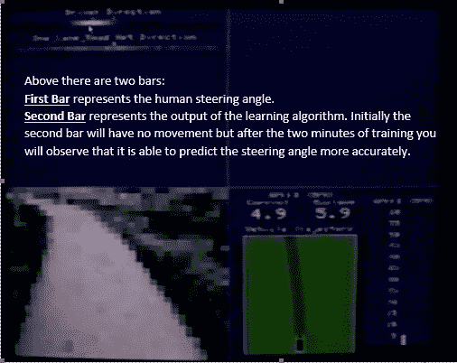

让我们从监督学习开始，但在此之前，您应该熟悉一些符号:

*   m:训练实例的数量
*   x:输入变量/特征
*   y:输出变量/目标变量
*   (x，y):训练示例
*   n:输入变量或特征的数量
*   θ:参数或权重。算法的工作是选择合适的权重

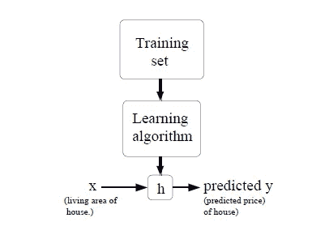

总之，我们提供学习算法的训练样本。它为我们提供了一个假设(h)。假设在提供一些输入时会给我们预期的输出。假设由下式给出

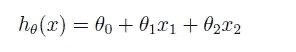

当我们想要训练“m”个样本时，上述等式可以表示为:

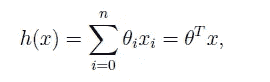

现在，θ表示为假设预测值的平方和减去“m”个训练样本的实际值。

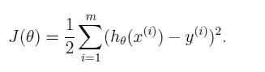

为了最小化 J(θ)，我们使用了被称为**梯度下降**的算法。它可以解释如下:想象你站在一个山顶上，你想向最陡的下坡方向迈出一小步，这可以让你尽快下山。梯度下降也是如此。你从一个点开始应用梯度下降，在一个新的点结束，重复同样的动作，直到你到达最小点。

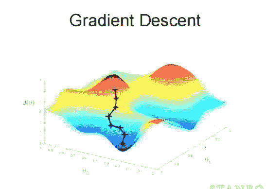

假设只有一个训练样本，我们将进行梯度下降的推导

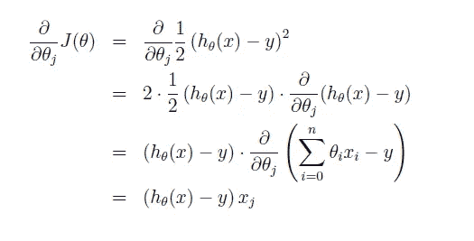

现在θ由下式给出

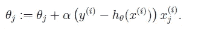

注:上式中的α是学习率。这就像下山时你想走多大的步。如果你步子迈得太小，下山会花很长时间。如果你的步长太大，你可能会超过局部最小值。如果有“m”个训练样本，则广义方程由下式给出

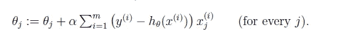

我会给你一个图像，让你看到梯度下降是行动。

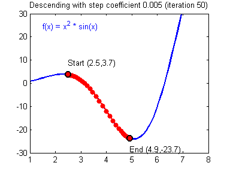

上述梯度下降也被称为**批量梯度下降**。这意味着每次该算法将针对所有训练示例运行。梯度下降还有一种变化，称为**随机梯度下降**或**递增下降**。如下所示:

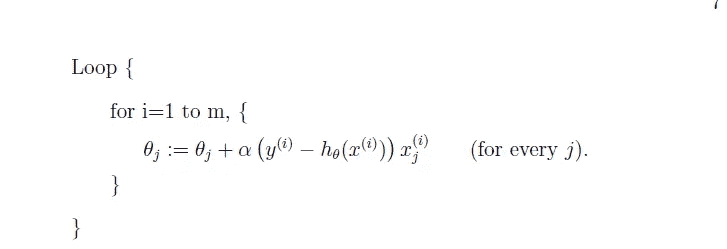

**随机梯度下降法的优点**是根据误差相对于单个训练样本的梯度来更新参数。已经观察到，对于大数据集，随机梯度下降更快。

如果你发现我的帖子有不一致的地方，欢迎在评论中指出。感谢阅读。